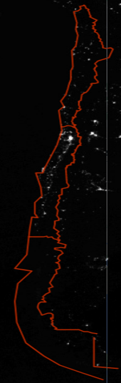
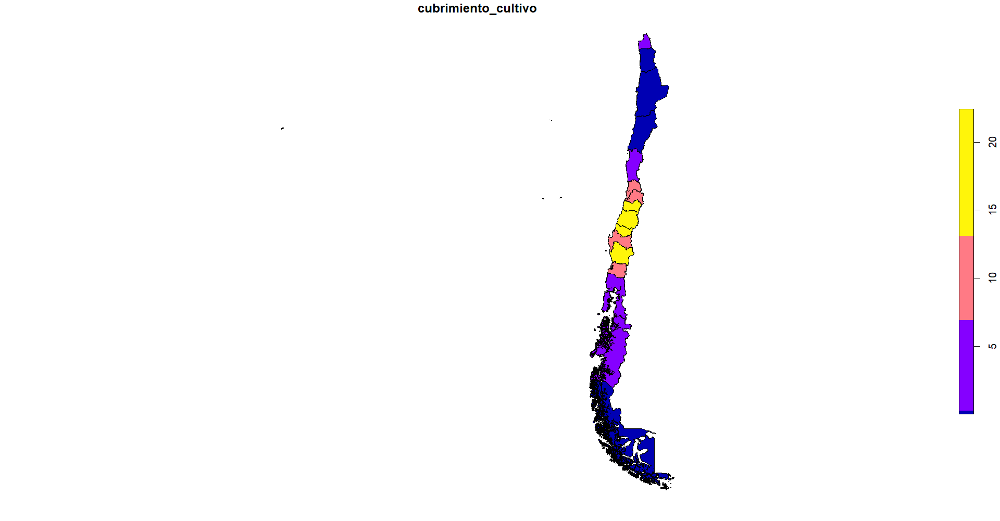
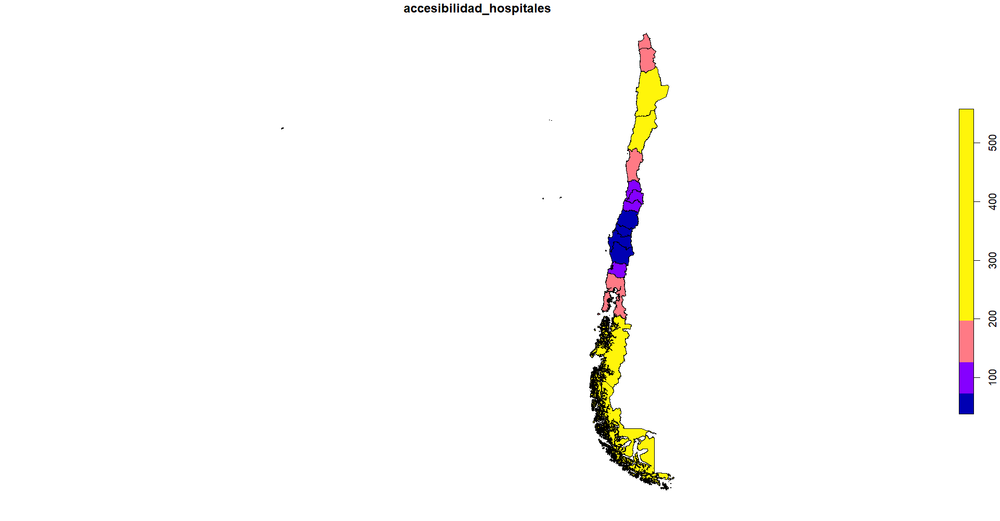

# Día 1 - Sesión 2- Censo e información satelital


## Uso de imágenes satelitales y SAE

Uno de los artículo pioneros de estimación de áreas pequeñas fue el artículo de Singh, R, et. al. (2002) el cual abordó la estimación del rendimiento de cultivos para los tehsil (unidad subadministrativa)  del distriyo Rohtak district en Haryana (India). 


Las imágenes raster representan el mundo mediante un conjunto de celdas contiguas igualmente espaciadas conocidas como pixeles, estas imágenes tienen información como un sistema de información geográfico, Un sistema de referencia de coordenadas. Las imágenes almacenan un identificador, un valor en cada pixel (o un vector con diferentes valores) y cada celda tiene asociada una escala de colores.

Las imágenes pueden obtenerse crudas y procesadas, estas primeras contienen solamente las capas de colores, las segundas contienen también valores que han sido procesados en cada celda (índices de vegetación, intensidad lumínica, tipo de vegetación). 

La información cruda puede utilizarse para entrenar características que se desean entrenar (carreteras, tipo de cultivo, bosque / no bosque), afortunadamente en Google Earth Engine encontramos muchos indicadores  procesadas asociadas a un pixel. Estos indicadores pueden agregarse a nivel de un área geográfica.


### Fuentes de datos de imágenes satelitales

Algunas de las principales fuentes de imágenes satelitales son: 

  * http://earthexplorer.usgs.gov/

  * https://lpdaacsvc.cr.usgs.gov/appeears/

  * https://search.earthdata.nasa.gov/search

  * https://scihub.coGTMnicus.eu/

  * https://aws.amazon.com/public-data-sets/landsat/

Sin embargo la mayor parte de estas fuentes están centralizadas en **Google Earth Engine** que permite buscar fuentes de datos provenientes de imágenes satelitales. GEE se puede manejar por medio de APIS en diferentes lenguajes de programación: Javascript (por defecto), Python y R (paquete rgee).


## Google Earth Eninge


Crear una cuenta en [link](https://earthengine.google.com/), una vez que se ingrese a la cuenta puede buscarse los conjuntos de datos de interés:


* Una vez se busque el conjunto de datos se puede abrir un editor de código brindado por google en  Javascript. 

*  Copiar y pegar la sintaxis que brinda el buscador de conjunto de datos para visualizar la imagen raster y disponer de sentencias que GTMmitan la obtención  del conjunto de datos de interés posteriormente en R


## Instalación de rgee

*  Descargar e instalar anaconda o conda. (<https://www.anaconda.com/products/individual>)

*  Abrir Anaconda prompt y configurar ambiente de trabajo (ambiente python rgee_py) con las siguientes sentencias:


```python
conda create -n rgee_py python=3.9
activate rgee_py
pip install google-api-python-client
pip install earthengine-api
pip install numpy
```

*  Listar los ambientes de Python disponibles en anaconda prompt


```python
conda env list
```


*   Una vez identificado la ruta del ambiente ambiente rgee_py definirla en R (**no se debe olvidar cambiar \\ por /**). 
*   Instalar `reticulate` y `rgee`, cargar paquetes para procesamiento espacial y configurar el ambiente de trabajo como sigue:


```r
library(reticulate) # Conexión con Python
library(rgee) # Conexión con Google Earth Engine
library(sf) # Paquete para manejar datos geográficos
library(dplyr) # Paquete para procesamiento de datos

rgee_environment_dir = "C://Users//sguerrero//Anaconda3//envs//rgee_py//python.exe"

# Configurar python (Algunas veces no es detectado y se debe reiniciar R)
reticulate::use_python(rgee_environment_dir, required=T)

rgee::ee_install_set_pyenv(py_path = rgee_environment_dir, py_env = "rgee_py")

Sys.setenv(RETICULATE_PYTHON = rgee_environment_dir)
Sys.setenv(EARTHENGINE_PYTHON = rgee_environment_dir)
```

*  Una vez configurado el ambiente puede iniciarlizarse una sesión de Google Earth Engine como sigue:


```r
rgee::ee_Initialize(drive = T)
```


**Notas:** 

-   Se debe inicializar cada sesión con el comando `rgee::ee_Initialize(drive = T)`. 

-   Los comandos de javascript que invoquen métodos con "." se sustituyen por signo peso ($), por ejemplo:


```r
ee.ImageCollection().filterDate()  # Javascript
ee$ImageCollection()$filterDate()  # R
```

### Descargar información satelital

*   **Paso 1**: disponer de los shapefile 


```r
# shape <- read_sf("Recursos/Día1/Sesion2/Shape/CHL_dam2.shp")
shape <- read_sf("Recursos/Día1/Sesion2/Shape/CHL_dam.shp")
plot(shape["geometry"])
```


*   **Paso 2**: Seleccionar el archivo de imágenes  que desea procesar, para nuestro ejemplo **luces nocturnas**.  


```r
luces <- ee$ImageCollection("NOAA/DMSP-OLS/NIGHTTIME_LIGHTS") %>%
  ee$ImageCollection$filterDate("2013-01-01", "2014-01-01") %>%
  ee$ImageCollection$map(function(x) x$select("stable_lights")) %>%
  ee$ImageCollection$toBands()
```

* **Paso 3**: Descargar la información


```r
## Tiempo 10 minutos 
shape_luces <- map(unique(shape$dam),
                 ~tryCatch(ee_extract(
                   x = luces,
                   y = shape["dam"] %>% filter(dam == .x),
                   ee$Reducer$mean(),
                   sf = FALSE
                 ) %>% mutate(dam = .x),
                 error = function(e)data.frame(dam = .x)))

shape_luces %<>% bind_rows()

tba(shape_luces, cap = "Promedio de luces nocturnasa")
```

<table class="table table-striped lightable-classic" style="margin-left: auto; margin-right: auto; font-family: Arial Narrow; margin-left: auto; margin-right: auto;">
<caption>(\#tab:unnamed-chunk-13)Promedio de luces nocturnasa</caption>
 <thead>
  <tr>
   <th style="text-align:left;"> dam </th>
   <th style="text-align:right;"> luces_nocturnas </th>
  </tr>
 </thead>
<tbody>
  <tr>
   <td style="text-align:left;"> 05 </td>
   <td style="text-align:right;"> 0.2383 </td>
  </tr>
  <tr>
   <td style="text-align:left;"> 12 </td>
   <td style="text-align:right;"> 0.0731 </td>
  </tr>
  <tr>
   <td style="text-align:left;"> 11 </td>
   <td style="text-align:right;"> 0.0348 </td>
  </tr>
  <tr>
   <td style="text-align:left;"> 10 </td>
   <td style="text-align:right;"> 0.6748 </td>
  </tr>
  <tr>
   <td style="text-align:left;"> 15 </td>
   <td style="text-align:right;"> 0.4691 </td>
  </tr>
  <tr>
   <td style="text-align:left;"> 01 </td>
   <td style="text-align:right;"> 0.5006 </td>
  </tr>
  <tr>
   <td style="text-align:left;"> 02 </td>
   <td style="text-align:right;"> 0.6402 </td>
  </tr>
  <tr>
   <td style="text-align:left;"> 03 </td>
   <td style="text-align:right;"> 0.4240 </td>
  </tr>
  <tr>
   <td style="text-align:left;"> 04 </td>
   <td style="text-align:right;"> 1.2168 </td>
  </tr>
  <tr>
   <td style="text-align:left;"> 13 </td>
   <td style="text-align:right;"> 10.6203 </td>
  </tr>
  <tr>
   <td style="text-align:left;"> 14 </td>
   <td style="text-align:right;"> 0.9825 </td>
  </tr>
  <tr>
   <td style="text-align:left;"> 09 </td>
   <td style="text-align:right;"> 1.4667 </td>
  </tr>
  <tr>
   <td style="text-align:left;"> 08 </td>
   <td style="text-align:right;"> 2.6897 </td>
  </tr>
  <tr>
   <td style="text-align:left;"> 16 </td>
   <td style="text-align:right;"> 1.9556 </td>
  </tr>
  <tr>
   <td style="text-align:left;"> 07 </td>
   <td style="text-align:right;"> 1.8539 </td>
  </tr>
  <tr>
   <td style="text-align:left;"> 06 </td>
   <td style="text-align:right;"> 3.5849 </td>
  </tr>
</tbody>
</table>

Repetir la rutina para: 

-   Tipo de suelo: **crops-coverfraction** (Porcentaje de cubrimiento cultivos) y **urban-coverfraction** (Porcentaje de cobertura urbana) disponibles en <https://develoGTMs.google.com/earth-engine/datasets/catalog/COGTMNICUS_Landcover_100m_Proba-V-C3_Global#description> 


- Tiempo de viaje al hospital o clínica más cercana (**accessibility**) y tiempo de viaje al hospital o clínica más cercana utilizando transporte no motorizado (**accessibility_walking_only**) información disponible en <https://develoGTMs.google.com/earth-engine/datasets/catalog/Oxford_MAP_accessibility_to_healthcare_2019> 

- Modificación humana, donde se consideran los asentamiento humano, la agricultura, el transporte, la minería y producción de energía e infraestructura eléctrica. En el siguiente link encuentra la información satelital  <https://develoGTMs.google.com/earth-engine/datasets/catalog/CSP_HM_GlobalHumanModification#description>


* **Paso 4**  consolidar la información. 

<table class="table table-striped lightable-classic" style="margin-left: auto; margin-right: auto; font-family: Arial Narrow; margin-left: auto; margin-right: auto;">
 <thead>
  <tr>
   <th style="text-align:left;"> dam </th>
   <th style="text-align:right;"> luces_nocturnas </th>
   <th style="text-align:right;"> cubrimiento_cultivo </th>
   <th style="text-align:right;"> cubrimiento_urbano </th>
   <th style="text-align:right;"> modificacion_humana </th>
   <th style="text-align:right;"> accesibilidad_hospitales </th>
   <th style="text-align:right;"> accesibilidad_hosp_caminado </th>
  </tr>
 </thead>
<tbody>
  <tr>
   <td style="text-align:left;"> 05 </td>
   <td style="text-align:right;"> 0.2383 </td>
   <td style="text-align:right;"> 7.5529 </td>
   <td style="text-align:right;"> 2.1488 </td>
   <td style="text-align:right;"> 0.3131 </td>
   <td style="text-align:right;"> 101.1488 </td>
   <td style="text-align:right;"> 481.0220 </td>
  </tr>
  <tr>
   <td style="text-align:left;"> 12 </td>
   <td style="text-align:right;"> 0.0731 </td>
   <td style="text-align:right;"> 0.0014 </td>
   <td style="text-align:right;"> 0.0486 </td>
   <td style="text-align:right;"> 0.0419 </td>
   <td style="text-align:right;"> 557.4796 </td>
   <td style="text-align:right;"> 2410.1264 </td>
  </tr>
  <tr>
   <td style="text-align:left;"> 11 </td>
   <td style="text-align:right;"> 0.0348 </td>
   <td style="text-align:right;"> 0.4897 </td>
   <td style="text-align:right;"> 0.0455 </td>
   <td style="text-align:right;"> 0.0446 </td>
   <td style="text-align:right;"> 472.6701 </td>
   <td style="text-align:right;"> 1706.0858 </td>
  </tr>
  <tr>
   <td style="text-align:left;"> 10 </td>
   <td style="text-align:right;"> 0.6748 </td>
   <td style="text-align:right;"> 6.2825 </td>
   <td style="text-align:right;"> 0.4273 </td>
   <td style="text-align:right;"> 0.1569 </td>
   <td style="text-align:right;"> 182.5853 </td>
   <td style="text-align:right;"> 530.2074 </td>
  </tr>
  <tr>
   <td style="text-align:left;"> 15 </td>
   <td style="text-align:right;"> 0.4691 </td>
   <td style="text-align:right;"> 0.3049 </td>
   <td style="text-align:right;"> 0.3165 </td>
   <td style="text-align:right;"> 0.0790 </td>
   <td style="text-align:right;"> 129.5948 </td>
   <td style="text-align:right;"> 634.6007 </td>
  </tr>
  <tr>
   <td style="text-align:left;"> 01 </td>
   <td style="text-align:right;"> 0.5006 </td>
   <td style="text-align:right;"> 0.0630 </td>
   <td style="text-align:right;"> 0.1962 </td>
   <td style="text-align:right;"> 0.0576 </td>
   <td style="text-align:right;"> 149.3803 </td>
   <td style="text-align:right;"> 706.6626 </td>
  </tr>
  <tr>
   <td style="text-align:left;"> 02 </td>
   <td style="text-align:right;"> 0.6402 </td>
   <td style="text-align:right;"> 0.0106 </td>
   <td style="text-align:right;"> 0.1421 </td>
   <td style="text-align:right;"> 0.0655 </td>
   <td style="text-align:right;"> 239.0077 </td>
   <td style="text-align:right;"> 993.2293 </td>
  </tr>
  <tr>
   <td style="text-align:left;"> 03 </td>
   <td style="text-align:right;"> 0.4240 </td>
   <td style="text-align:right;"> 0.0887 </td>
   <td style="text-align:right;"> 0.2277 </td>
   <td style="text-align:right;"> 0.0702 </td>
   <td style="text-align:right;"> 261.4221 </td>
   <td style="text-align:right;"> 1033.4120 </td>
  </tr>
  <tr>
   <td style="text-align:left;"> 04 </td>
   <td style="text-align:right;"> 1.2168 </td>
   <td style="text-align:right;"> 1.2978 </td>
   <td style="text-align:right;"> 0.4280 </td>
   <td style="text-align:right;"> 0.1556 </td>
   <td style="text-align:right;"> 157.2359 </td>
   <td style="text-align:right;"> 558.3460 </td>
  </tr>
  <tr>
   <td style="text-align:left;"> 13 </td>
   <td style="text-align:right;"> 10.6203 </td>
   <td style="text-align:right;"> 11.2553 </td>
   <td style="text-align:right;"> 5.3412 </td>
   <td style="text-align:right;"> 0.3404 </td>
   <td style="text-align:right;"> 108.0762 </td>
   <td style="text-align:right;"> 288.9854 </td>
  </tr>
</tbody>
</table>

Los resultados se muestran en los siguientes mapas


### Luces nocturnas 




### Cubrimiento cultivos 




### Cubrimiento urbanos


### Modificación humana 


### Tiempo promedio al hospital 




### Tiempo promedio al hospital en vehiculo no motorizado


## Censos de población y vivienda

Es necesario definir las variables del país con los que se desea trabajar. De acuerdo a esto, como primer paso se debe tener acceso al censo del país, para ello puede acceder desde el siguiente enlace <https://redatam.org/en/microdata> en el cual dispondrá de un archivo *.zip* con los microdatos del país. Ahora bien, para leer el conjunto de datos, es necesario emplear la función redatam.open de la librería `redatam`, la cual depende directamente del diccionario censal del software REDATAM, este es un archivo con extensión dicx y que debe encontrarse en la carpeta sobre los datos que se están leyendo. Así, es como se crea un objeto dentro de `R` que hace la respectiva unión del diccionario con los microdatos de la base de datos censal. La siguiente sintaxis muestra la lectura del diccionario en `R` y los cálculos iniciales

 


```r
library(redatam)
chile <- redatam.open("CHL/2017/1.Ingreso/Data/cpv2017chl-cde.dicx")

CONTEOS <- redatam.query(
  CHL,
  "freq REGION.IDREGION
  by AREAUR.URBRUR
  by PERSONA.P09
  by PERSONA.ANEST
  by PERSONA.P08
  by PERSONA.PBLOPER",
  tot.omit = FALSE
)
# Eliminando totales de la tabla
CONTEOS2 <-
  CONTEOS %>% filter_at(vars(matches("_label")), all_vars(. !=  "__tot__"))
```

Después de realizar algunas validaciones se estandarizan las variables como muestra el siguiente código.


```r
censo_mrp <- CONTEOS2 %>% transmute(
    dam = str_pad(
      string = IDREGION1_value,
      width = 2,
      pad = "0"
    ),
    area = case_when(URBRUR2_value == 1 ~ "1", # 1 = Urbana
                     TRUE ~ "0"), # 0 = Rural

    sexo = as.character(P085_value),
    edad = case_when(
      P093_value %in% 0:14 ~ "1",       # 5 a 14
      P093_value %in% 15:29 ~ "2",      # 15 a 29
      P093_value %in% 30:44 ~ "3",      # 30 a 44
      P093_value %in% 45:64 ~ "4",      # 45 a 64
      TRUE ~ "5"
    ),     # 65 o mas

    anoest = case_when(
      P093_value < 6~ "98", #No aplica 
      ANEST4_value == 99 ~ "99", #NS/NR
      ANEST4_value == 0  ~ "1", # Sin educacion
      ANEST4_value %in% c(1:6) ~ "2",       # 1 - 6
      ANEST4_value %in% c(7:12) ~ "3",      # 7 - 12
      ANEST4_value > 12 ~ "4",      # mas de 12
      TRUE ~ "Error"  ),

    etnia = case_when(
      PBLOPER6_value == 1 ~ "1", # Indigenas
      PBLOPER6_value == 2 ~ "2", # Afro
      TRUE ~ "3" # Otro
    ),
    value
  ) %>% group_by(dam, area, etnia, sexo, edad, anoest) %>%
  summarise(n = sum(value))
```

A partir de la base estandarizada es posible construir algunas covariables para el departamento. 


```r
censo_mrp <- readRDS("Recursos/Día1/Sesion2/Data/censo_mrp_dam.rds")
tasa_censo <- model.matrix(dam ~ -1 +.,
                           data = censo_mrp %>% select(-n)) %>% 
  data.frame() %>%
  mutate(dam = censo_mrp$dam, 
         n = censo_mrp$n) %>% 
  group_by(dam) %>%
  summarise_all(~weighted.mean(x = .,w = n)) %>%
  mutate(etnia1 = 1-etnia3-etnia2 ) %>% 
  select(-area0, -anoest98,-etnia3,-n) 
tba(tasa_censo)
```

<table class="table table-striped lightable-classic" style="margin-left: auto; margin-right: auto; font-family: Arial Narrow; margin-left: auto; margin-right: auto;">
 <thead>
  <tr>
   <th style="text-align:left;"> dam </th>
   <th style="text-align:right;"> area1 </th>
   <th style="text-align:right;"> etnia2 </th>
   <th style="text-align:right;"> sexo2 </th>
   <th style="text-align:right;"> edad2 </th>
   <th style="text-align:right;"> edad3 </th>
   <th style="text-align:right;"> edad4 </th>
   <th style="text-align:right;"> edad5 </th>
   <th style="text-align:right;"> anoest2 </th>
   <th style="text-align:right;"> anoest3 </th>
   <th style="text-align:right;"> anoest4 </th>
   <th style="text-align:right;"> anoest99 </th>
   <th style="text-align:right;"> etnia1 </th>
  </tr>
 </thead>
<tbody>
  <tr>
   <td style="text-align:left;"> 01 </td>
   <td style="text-align:right;"> 0.9380 </td>
   <td style="text-align:right;"> 0.0014 </td>
   <td style="text-align:right;"> 0.4924 </td>
   <td style="text-align:right;"> 0.2482 </td>
   <td style="text-align:right;"> 0.2309 </td>
   <td style="text-align:right;"> 0.2118 </td>
   <td style="text-align:right;"> 0.0755 </td>
   <td style="text-align:right;"> 0.1555 </td>
   <td style="text-align:right;"> 0.4839 </td>
   <td style="text-align:right;"> 0.2053 </td>
   <td style="text-align:right;"> 0.0294 </td>
   <td style="text-align:right;"> 0.2409 </td>
  </tr>
  <tr>
   <td style="text-align:left;"> 02 </td>
   <td style="text-align:right;"> 0.9411 </td>
   <td style="text-align:right;"> 0.0009 </td>
   <td style="text-align:right;"> 0.4815 </td>
   <td style="text-align:right;"> 0.2504 </td>
   <td style="text-align:right;"> 0.2418 </td>
   <td style="text-align:right;"> 0.2226 </td>
   <td style="text-align:right;"> 0.0748 </td>
   <td style="text-align:right;"> 0.1379 </td>
   <td style="text-align:right;"> 0.4793 </td>
   <td style="text-align:right;"> 0.2336 </td>
   <td style="text-align:right;"> 0.0364 </td>
   <td style="text-align:right;"> 0.1348 </td>
  </tr>
  <tr>
   <td style="text-align:left;"> 03 </td>
   <td style="text-align:right;"> 0.9104 </td>
   <td style="text-align:right;"> 0.0005 </td>
   <td style="text-align:right;"> 0.4953 </td>
   <td style="text-align:right;"> 0.2289 </td>
   <td style="text-align:right;"> 0.2075 </td>
   <td style="text-align:right;"> 0.2361 </td>
   <td style="text-align:right;"> 0.0982 </td>
   <td style="text-align:right;"> 0.1710 </td>
   <td style="text-align:right;"> 0.4933 </td>
   <td style="text-align:right;"> 0.1879 </td>
   <td style="text-align:right;"> 0.0183 </td>
   <td style="text-align:right;"> 0.1932 </td>
  </tr>
  <tr>
   <td style="text-align:left;"> 04 </td>
   <td style="text-align:right;"> 0.8119 </td>
   <td style="text-align:right;"> 0.0003 </td>
   <td style="text-align:right;"> 0.5132 </td>
   <td style="text-align:right;"> 0.2274 </td>
   <td style="text-align:right;"> 0.2003 </td>
   <td style="text-align:right;"> 0.2372 </td>
   <td style="text-align:right;"> 0.1182 </td>
   <td style="text-align:right;"> 0.1834 </td>
   <td style="text-align:right;"> 0.4781 </td>
   <td style="text-align:right;"> 0.1850 </td>
   <td style="text-align:right;"> 0.0279 </td>
   <td style="text-align:right;"> 0.0855 </td>
  </tr>
  <tr>
   <td style="text-align:left;"> 05 </td>
   <td style="text-align:right;"> 0.9101 </td>
   <td style="text-align:right;"> 0.0002 </td>
   <td style="text-align:right;"> 0.5153 </td>
   <td style="text-align:right;"> 0.2313 </td>
   <td style="text-align:right;"> 0.1970 </td>
   <td style="text-align:right;"> 0.2450 </td>
   <td style="text-align:right;"> 0.1361 </td>
   <td style="text-align:right;"> 0.1599 </td>
   <td style="text-align:right;"> 0.4705 </td>
   <td style="text-align:right;"> 0.2342 </td>
   <td style="text-align:right;"> 0.0293 </td>
   <td style="text-align:right;"> 0.0657 </td>
  </tr>
  <tr>
   <td style="text-align:left;"> 06 </td>
   <td style="text-align:right;"> 0.7439 </td>
   <td style="text-align:right;"> 0.0001 </td>
   <td style="text-align:right;"> 0.5039 </td>
   <td style="text-align:right;"> 0.2104 </td>
   <td style="text-align:right;"> 0.2083 </td>
   <td style="text-align:right;"> 0.2547 </td>
   <td style="text-align:right;"> 0.1191 </td>
   <td style="text-align:right;"> 0.2114 </td>
   <td style="text-align:right;"> 0.4856 </td>
   <td style="text-align:right;"> 0.1611 </td>
   <td style="text-align:right;"> 0.0235 </td>
   <td style="text-align:right;"> 0.0626 </td>
  </tr>
  <tr>
   <td style="text-align:left;"> 07 </td>
   <td style="text-align:right;"> 0.7322 </td>
   <td style="text-align:right;"> 0.0001 </td>
   <td style="text-align:right;"> 0.5104 </td>
   <td style="text-align:right;"> 0.2178 </td>
   <td style="text-align:right;"> 0.2012 </td>
   <td style="text-align:right;"> 0.2539 </td>
   <td style="text-align:right;"> 0.1230 </td>
   <td style="text-align:right;"> 0.2184 </td>
   <td style="text-align:right;"> 0.4842 </td>
   <td style="text-align:right;"> 0.1501 </td>
   <td style="text-align:right;"> 0.0246 </td>
   <td style="text-align:right;"> 0.0468 </td>
  </tr>
  <tr>
   <td style="text-align:left;"> 08 </td>
   <td style="text-align:right;"> 0.8858 </td>
   <td style="text-align:right;"> 0.0001 </td>
   <td style="text-align:right;"> 0.5178 </td>
   <td style="text-align:right;"> 0.2326 </td>
   <td style="text-align:right;"> 0.1978 </td>
   <td style="text-align:right;"> 0.2493 </td>
   <td style="text-align:right;"> 0.1176 </td>
   <td style="text-align:right;"> 0.1869 </td>
   <td style="text-align:right;"> 0.4591 </td>
   <td style="text-align:right;"> 0.2174 </td>
   <td style="text-align:right;"> 0.0210 </td>
   <td style="text-align:right;"> 0.1074 </td>
  </tr>
  <tr>
   <td style="text-align:left;"> 09 </td>
   <td style="text-align:right;"> 0.7089 </td>
   <td style="text-align:right;"> 0.0001 </td>
   <td style="text-align:right;"> 0.5141 </td>
   <td style="text-align:right;"> 0.2254 </td>
   <td style="text-align:right;"> 0.1973 </td>
   <td style="text-align:right;"> 0.2427 </td>
   <td style="text-align:right;"> 0.1258 </td>
   <td style="text-align:right;"> 0.2158 </td>
   <td style="text-align:right;"> 0.4653 </td>
   <td style="text-align:right;"> 0.1678 </td>
   <td style="text-align:right;"> 0.0282 </td>
   <td style="text-align:right;"> 0.3356 </td>
  </tr>
  <tr>
   <td style="text-align:left;"> 10 </td>
   <td style="text-align:right;"> 0.7361 </td>
   <td style="text-align:right;"> 0.0001 </td>
   <td style="text-align:right;"> 0.5060 </td>
   <td style="text-align:right;"> 0.2202 </td>
   <td style="text-align:right;"> 0.2145 </td>
   <td style="text-align:right;"> 0.2454 </td>
   <td style="text-align:right;"> 0.1121 </td>
   <td style="text-align:right;"> 0.2228 </td>
   <td style="text-align:right;"> 0.4724 </td>
   <td style="text-align:right;"> 0.1651 </td>
   <td style="text-align:right;"> 0.0263 </td>
   <td style="text-align:right;"> 0.2760 </td>
  </tr>
  <tr>
   <td style="text-align:left;"> 11 </td>
   <td style="text-align:right;"> 0.7958 </td>
   <td style="text-align:right;"> 0.0001 </td>
   <td style="text-align:right;"> 0.4800 </td>
   <td style="text-align:right;"> 0.2131 </td>
   <td style="text-align:right;"> 0.2336 </td>
   <td style="text-align:right;"> 0.2383 </td>
   <td style="text-align:right;"> 0.0901 </td>
   <td style="text-align:right;"> 0.1990 </td>
   <td style="text-align:right;"> 0.4715 </td>
   <td style="text-align:right;"> 0.1820 </td>
   <td style="text-align:right;"> 0.0208 </td>
   <td style="text-align:right;"> 0.2817 </td>
  </tr>
  <tr>
   <td style="text-align:left;"> 12 </td>
   <td style="text-align:right;"> 0.9190 </td>
   <td style="text-align:right;"> 0.0001 </td>
   <td style="text-align:right;"> 0.4881 </td>
   <td style="text-align:right;"> 0.2217 </td>
   <td style="text-align:right;"> 0.2277 </td>
   <td style="text-align:right;"> 0.2485 </td>
   <td style="text-align:right;"> 0.1164 </td>
   <td style="text-align:right;"> 0.1578 </td>
   <td style="text-align:right;"> 0.4841 </td>
   <td style="text-align:right;"> 0.2409 </td>
   <td style="text-align:right;"> 0.0201 </td>
   <td style="text-align:right;"> 0.2268 </td>
  </tr>
  <tr>
   <td style="text-align:left;"> 13 </td>
   <td style="text-align:right;"> 0.9630 </td>
   <td style="text-align:right;"> 0.0004 </td>
   <td style="text-align:right;"> 0.5132 </td>
   <td style="text-align:right;"> 0.2434 </td>
   <td style="text-align:right;"> 0.2186 </td>
   <td style="text-align:right;"> 0.2364 </td>
   <td style="text-align:right;"> 0.1079 </td>
   <td style="text-align:right;"> 0.1480 </td>
   <td style="text-align:right;"> 0.4468 </td>
   <td style="text-align:right;"> 0.2692 </td>
   <td style="text-align:right;"> 0.0281 </td>
   <td style="text-align:right;"> 0.0973 </td>
  </tr>
  <tr>
   <td style="text-align:left;"> 14 </td>
   <td style="text-align:right;"> 0.7166 </td>
   <td style="text-align:right;"> 0.0001 </td>
   <td style="text-align:right;"> 0.5093 </td>
   <td style="text-align:right;"> 0.2297 </td>
   <td style="text-align:right;"> 0.1934 </td>
   <td style="text-align:right;"> 0.2508 </td>
   <td style="text-align:right;"> 0.1258 </td>
   <td style="text-align:right;"> 0.2068 </td>
   <td style="text-align:right;"> 0.4695 </td>
   <td style="text-align:right;"> 0.1756 </td>
   <td style="text-align:right;"> 0.0319 </td>
   <td style="text-align:right;"> 0.2502 </td>
  </tr>
  <tr>
   <td style="text-align:left;"> 15 </td>
   <td style="text-align:right;"> 0.9167 </td>
   <td style="text-align:right;"> 0.0205 </td>
   <td style="text-align:right;"> 0.5020 </td>
   <td style="text-align:right;"> 0.2425 </td>
   <td style="text-align:right;"> 0.2098 </td>
   <td style="text-align:right;"> 0.2213 </td>
   <td style="text-align:right;"> 0.1087 </td>
   <td style="text-align:right;"> 0.1555 </td>
   <td style="text-align:right;"> 0.4840 </td>
   <td style="text-align:right;"> 0.2088 </td>
   <td style="text-align:right;"> 0.0323 </td>
   <td style="text-align:right;"> 0.3284 </td>
  </tr>
  <tr>
   <td style="text-align:left;"> 16 </td>
   <td style="text-align:right;"> 0.6943 </td>
   <td style="text-align:right;"> 0.0001 </td>
   <td style="text-align:right;"> 0.5161 </td>
   <td style="text-align:right;"> 0.2096 </td>
   <td style="text-align:right;"> 0.1947 </td>
   <td style="text-align:right;"> 0.2648 </td>
   <td style="text-align:right;"> 0.1355 </td>
   <td style="text-align:right;"> 0.2267 </td>
   <td style="text-align:right;"> 0.4748 </td>
   <td style="text-align:right;"> 0.1603 </td>
   <td style="text-align:right;"> 0.0236 </td>
   <td style="text-align:right;"> 0.0464 </td>
  </tr>
</tbody>
</table>

El indicador es posible definirlo a partir de una variable del censo, haciendo que el proceso seá hace más corto, para este caso es empleada la variable `VIVIENDA.P03C`, agregada por dam 

En el primer bloque que código usando la función `redatam.query()` se realiza el conteo de viviendas por el material del piso. Seguido de esto, eliminamos los registros que no son de interés, por ejemplo, el total en el dam o total nacional, los cuales se identifican dentro de la base con la etiqueta `__tot__`. 

El siguiente paso es contar el número de viviendas por dam que tienen los *pisos de tierra*  en el censo (`Pobx`) y el total de viviendas que respondieron a la pregunta (`PobT`), para finalmente realizar el cociente de estas dos preguntas.  


```r
CONTEOS <- redatam.query(chile,
                         "freq REGION.IDREGION
                            by VIVIENDA.P03C",
                         tot.omit = FALSE)

PISO <- CONTEOS %>% 
  filter_at(vars(matches("_label")),
            all_vars(!. %in%  c("__tot__","__mv__") ))

tasa_piso <- PISO %>%
  mutate(Pobx = ifelse(P03C2_value %in% c(5), value, 0),
         PobT = value) %>%
  group_by(
    depto = IDREGION1_value
  ) %>%
  summarise(PobT = sum(PobT),
            Pobx = sum(Pobx)) %>% 
  transmute(depto,
            piso_tierra = Pobx/PobT) 
```
La tabla resultante se muestra a continuación. 
<table class="table table-striped lightable-classic" style="margin-left: auto; margin-right: auto; font-family: Arial Narrow; margin-left: auto; margin-right: auto;">
 <thead>
  <tr>
   <th style="text-align:left;"> dam </th>
   <th style="text-align:right;"> piso_tierra </th>
  </tr>
 </thead>
<tbody>
  <tr>
   <td style="text-align:left;"> 05 </td>
   <td style="text-align:right;"> 0.0016 </td>
  </tr>
  <tr>
   <td style="text-align:left;"> 12 </td>
   <td style="text-align:right;"> 0.0005 </td>
  </tr>
  <tr>
   <td style="text-align:left;"> 11 </td>
   <td style="text-align:right;"> 0.0012 </td>
  </tr>
  <tr>
   <td style="text-align:left;"> 10 </td>
   <td style="text-align:right;"> 0.0005 </td>
  </tr>
  <tr>
   <td style="text-align:left;"> 15 </td>
   <td style="text-align:right;"> 0.0222 </td>
  </tr>
  <tr>
   <td style="text-align:left;"> 01 </td>
   <td style="text-align:right;"> 0.0179 </td>
  </tr>
  <tr>
   <td style="text-align:left;"> 02 </td>
   <td style="text-align:right;"> 0.0092 </td>
  </tr>
  <tr>
   <td style="text-align:left;"> 03 </td>
   <td style="text-align:right;"> 0.0132 </td>
  </tr>
  <tr>
   <td style="text-align:left;"> 04 </td>
   <td style="text-align:right;"> 0.0110 </td>
  </tr>
  <tr>
   <td style="text-align:left;"> 13 </td>
   <td style="text-align:right;"> 0.0009 </td>
  </tr>
  <tr>
   <td style="text-align:left;"> 14 </td>
   <td style="text-align:right;"> 0.0006 </td>
  </tr>
  <tr>
   <td style="text-align:left;"> 09 </td>
   <td style="text-align:right;"> 0.0029 </td>
  </tr>
  <tr>
   <td style="text-align:left;"> 08 </td>
   <td style="text-align:right;"> 0.0018 </td>
  </tr>
  <tr>
   <td style="text-align:left;"> 16 </td>
   <td style="text-align:right;"> 0.0047 </td>
  </tr>
  <tr>
   <td style="text-align:left;"> 07 </td>
   <td style="text-align:right;"> 0.0061 </td>
  </tr>
  <tr>
   <td style="text-align:left;"> 06 </td>
   <td style="text-align:right;"> 0.0038 </td>
  </tr>
</tbody>
</table>


El proceso se repite con otras preguntas del censo hasta consolidar la tabla siguiente. 


```r
predictors_censo_dam <- readRDS("Recursos/Día1/Sesion2/Data/predictors_censo_dam.rds")
tba(predictors_censo_dam)
```

<table class="table table-striped lightable-classic" style="margin-left: auto; margin-right: auto; font-family: Arial Narrow; margin-left: auto; margin-right: auto;">
 <thead>
  <tr>
   <th style="text-align:left;"> dam </th>
   <th style="text-align:right;"> area1 </th>
   <th style="text-align:right;"> etnia2 </th>
   <th style="text-align:right;"> sexo2 </th>
   <th style="text-align:right;"> edad2 </th>
   <th style="text-align:right;"> edad3 </th>
   <th style="text-align:right;"> edad4 </th>
   <th style="text-align:right;"> edad5 </th>
   <th style="text-align:right;"> anoest2 </th>
   <th style="text-align:right;"> anoest3 </th>
   <th style="text-align:right;"> anoest4 </th>
   <th style="text-align:right;"> anoest99 </th>
   <th style="text-align:right;"> etnia1 </th>
   <th style="text-align:right;"> piso_tierra </th>
   <th style="text-align:right;"> material_paredes </th>
   <th style="text-align:right;"> material_techo </th>
   <th style="text-align:right;"> rezago_escolar </th>
   <th style="text-align:right;"> alfabeta </th>
   <th style="text-align:right;"> tasa_desocupacion </th>
  </tr>
 </thead>
<tbody>
  <tr>
   <td style="text-align:left;"> 05 </td>
   <td style="text-align:right;"> 0.9101 </td>
   <td style="text-align:right;"> 0.0002 </td>
   <td style="text-align:right;"> 0.5153 </td>
   <td style="text-align:right;"> 0.2313 </td>
   <td style="text-align:right;"> 0.1970 </td>
   <td style="text-align:right;"> 0.2450 </td>
   <td style="text-align:right;"> 0.1361 </td>
   <td style="text-align:right;"> 0.1599 </td>
   <td style="text-align:right;"> 0.4705 </td>
   <td style="text-align:right;"> 0.2342 </td>
   <td style="text-align:right;"> 0.0293 </td>
   <td style="text-align:right;"> 0.0657 </td>
   <td style="text-align:right;"> 0.0016 </td>
   <td style="text-align:right;"> 0.3236 </td>
   <td style="text-align:right;"> 0.7653 </td>
   <td style="text-align:right;"> 0.3365 </td>
   <td style="text-align:right;"> 0.0479 </td>
   <td style="text-align:right;"> 0.0683 </td>
  </tr>
  <tr>
   <td style="text-align:left;"> 12 </td>
   <td style="text-align:right;"> 0.9190 </td>
   <td style="text-align:right;"> 0.0001 </td>
   <td style="text-align:right;"> 0.4881 </td>
   <td style="text-align:right;"> 0.2217 </td>
   <td style="text-align:right;"> 0.2277 </td>
   <td style="text-align:right;"> 0.2485 </td>
   <td style="text-align:right;"> 0.1164 </td>
   <td style="text-align:right;"> 0.1578 </td>
   <td style="text-align:right;"> 0.4841 </td>
   <td style="text-align:right;"> 0.2409 </td>
   <td style="text-align:right;"> 0.0201 </td>
   <td style="text-align:right;"> 0.2268 </td>
   <td style="text-align:right;"> 0.0005 </td>
   <td style="text-align:right;"> 0.2649 </td>
   <td style="text-align:right;"> 0.8785 </td>
   <td style="text-align:right;"> 0.3382 </td>
   <td style="text-align:right;"> 0.0431 </td>
   <td style="text-align:right;"> 0.0402 </td>
  </tr>
  <tr>
   <td style="text-align:left;"> 11 </td>
   <td style="text-align:right;"> 0.7958 </td>
   <td style="text-align:right;"> 0.0001 </td>
   <td style="text-align:right;"> 0.4800 </td>
   <td style="text-align:right;"> 0.2131 </td>
   <td style="text-align:right;"> 0.2336 </td>
   <td style="text-align:right;"> 0.2383 </td>
   <td style="text-align:right;"> 0.0901 </td>
   <td style="text-align:right;"> 0.1990 </td>
   <td style="text-align:right;"> 0.4715 </td>
   <td style="text-align:right;"> 0.1820 </td>
   <td style="text-align:right;"> 0.0208 </td>
   <td style="text-align:right;"> 0.2817 </td>
   <td style="text-align:right;"> 0.0012 </td>
   <td style="text-align:right;"> 0.3167 </td>
   <td style="text-align:right;"> 0.9398 </td>
   <td style="text-align:right;"> 0.2793 </td>
   <td style="text-align:right;"> 0.0795 </td>
   <td style="text-align:right;"> 0.0445 </td>
  </tr>
  <tr>
   <td style="text-align:left;"> 10 </td>
   <td style="text-align:right;"> 0.7361 </td>
   <td style="text-align:right;"> 0.0001 </td>
   <td style="text-align:right;"> 0.5060 </td>
   <td style="text-align:right;"> 0.2202 </td>
   <td style="text-align:right;"> 0.2145 </td>
   <td style="text-align:right;"> 0.2454 </td>
   <td style="text-align:right;"> 0.1121 </td>
   <td style="text-align:right;"> 0.2228 </td>
   <td style="text-align:right;"> 0.4724 </td>
   <td style="text-align:right;"> 0.1651 </td>
   <td style="text-align:right;"> 0.0263 </td>
   <td style="text-align:right;"> 0.2760 </td>
   <td style="text-align:right;"> 0.0005 </td>
   <td style="text-align:right;"> 0.3166 </td>
   <td style="text-align:right;"> 0.9082 </td>
   <td style="text-align:right;"> 0.2491 </td>
   <td style="text-align:right;"> 0.0823 </td>
   <td style="text-align:right;"> 0.0612 </td>
  </tr>
  <tr>
   <td style="text-align:left;"> 15 </td>
   <td style="text-align:right;"> 0.9167 </td>
   <td style="text-align:right;"> 0.0205 </td>
   <td style="text-align:right;"> 0.5020 </td>
   <td style="text-align:right;"> 0.2425 </td>
   <td style="text-align:right;"> 0.2098 </td>
   <td style="text-align:right;"> 0.2213 </td>
   <td style="text-align:right;"> 0.1087 </td>
   <td style="text-align:right;"> 0.1555 </td>
   <td style="text-align:right;"> 0.4840 </td>
   <td style="text-align:right;"> 0.2088 </td>
   <td style="text-align:right;"> 0.0323 </td>
   <td style="text-align:right;"> 0.3284 </td>
   <td style="text-align:right;"> 0.0222 </td>
   <td style="text-align:right;"> 0.2416 </td>
   <td style="text-align:right;"> 0.5142 </td>
   <td style="text-align:right;"> 0.3194 </td>
   <td style="text-align:right;"> 0.0485 </td>
   <td style="text-align:right;"> 0.0743 </td>
  </tr>
  <tr>
   <td style="text-align:left;"> 01 </td>
   <td style="text-align:right;"> 0.9380 </td>
   <td style="text-align:right;"> 0.0014 </td>
   <td style="text-align:right;"> 0.4924 </td>
   <td style="text-align:right;"> 0.2482 </td>
   <td style="text-align:right;"> 0.2309 </td>
   <td style="text-align:right;"> 0.2118 </td>
   <td style="text-align:right;"> 0.0755 </td>
   <td style="text-align:right;"> 0.1555 </td>
   <td style="text-align:right;"> 0.4839 </td>
   <td style="text-align:right;"> 0.2053 </td>
   <td style="text-align:right;"> 0.0294 </td>
   <td style="text-align:right;"> 0.2409 </td>
   <td style="text-align:right;"> 0.0179 </td>
   <td style="text-align:right;"> 0.2913 </td>
   <td style="text-align:right;"> 0.5745 </td>
   <td style="text-align:right;"> 0.3199 </td>
   <td style="text-align:right;"> 0.0394 </td>
   <td style="text-align:right;"> 0.0728 </td>
  </tr>
  <tr>
   <td style="text-align:left;"> 02 </td>
   <td style="text-align:right;"> 0.9411 </td>
   <td style="text-align:right;"> 0.0009 </td>
   <td style="text-align:right;"> 0.4815 </td>
   <td style="text-align:right;"> 0.2504 </td>
   <td style="text-align:right;"> 0.2418 </td>
   <td style="text-align:right;"> 0.2226 </td>
   <td style="text-align:right;"> 0.0748 </td>
   <td style="text-align:right;"> 0.1379 </td>
   <td style="text-align:right;"> 0.4793 </td>
   <td style="text-align:right;"> 0.2336 </td>
   <td style="text-align:right;"> 0.0364 </td>
   <td style="text-align:right;"> 0.1348 </td>
   <td style="text-align:right;"> 0.0092 </td>
   <td style="text-align:right;"> 0.2216 </td>
   <td style="text-align:right;"> 0.5673 </td>
   <td style="text-align:right;"> 0.3545 </td>
   <td style="text-align:right;"> 0.0342 </td>
   <td style="text-align:right;"> 0.0776 </td>
  </tr>
  <tr>
   <td style="text-align:left;"> 03 </td>
   <td style="text-align:right;"> 0.9104 </td>
   <td style="text-align:right;"> 0.0005 </td>
   <td style="text-align:right;"> 0.4953 </td>
   <td style="text-align:right;"> 0.2289 </td>
   <td style="text-align:right;"> 0.2075 </td>
   <td style="text-align:right;"> 0.2361 </td>
   <td style="text-align:right;"> 0.0982 </td>
   <td style="text-align:right;"> 0.1710 </td>
   <td style="text-align:right;"> 0.4933 </td>
   <td style="text-align:right;"> 0.1879 </td>
   <td style="text-align:right;"> 0.0183 </td>
   <td style="text-align:right;"> 0.1932 </td>
   <td style="text-align:right;"> 0.0132 </td>
   <td style="text-align:right;"> 0.3880 </td>
   <td style="text-align:right;"> 0.8275 </td>
   <td style="text-align:right;"> 0.2802 </td>
   <td style="text-align:right;"> 0.0561 </td>
   <td style="text-align:right;"> 0.0957 </td>
  </tr>
  <tr>
   <td style="text-align:left;"> 04 </td>
   <td style="text-align:right;"> 0.8119 </td>
   <td style="text-align:right;"> 0.0003 </td>
   <td style="text-align:right;"> 0.5132 </td>
   <td style="text-align:right;"> 0.2274 </td>
   <td style="text-align:right;"> 0.2003 </td>
   <td style="text-align:right;"> 0.2372 </td>
   <td style="text-align:right;"> 0.1182 </td>
   <td style="text-align:right;"> 0.1834 </td>
   <td style="text-align:right;"> 0.4781 </td>
   <td style="text-align:right;"> 0.1850 </td>
   <td style="text-align:right;"> 0.0279 </td>
   <td style="text-align:right;"> 0.0855 </td>
   <td style="text-align:right;"> 0.0110 </td>
   <td style="text-align:right;"> 0.3256 </td>
   <td style="text-align:right;"> 0.7896 </td>
   <td style="text-align:right;"> 0.2796 </td>
   <td style="text-align:right;"> 0.0624 </td>
   <td style="text-align:right;"> 0.0848 </td>
  </tr>
  <tr>
   <td style="text-align:left;"> 13 </td>
   <td style="text-align:right;"> 0.9630 </td>
   <td style="text-align:right;"> 0.0004 </td>
   <td style="text-align:right;"> 0.5132 </td>
   <td style="text-align:right;"> 0.2434 </td>
   <td style="text-align:right;"> 0.2186 </td>
   <td style="text-align:right;"> 0.2364 </td>
   <td style="text-align:right;"> 0.1079 </td>
   <td style="text-align:right;"> 0.1480 </td>
   <td style="text-align:right;"> 0.4468 </td>
   <td style="text-align:right;"> 0.2692 </td>
   <td style="text-align:right;"> 0.0281 </td>
   <td style="text-align:right;"> 0.0973 </td>
   <td style="text-align:right;"> 0.0009 </td>
   <td style="text-align:right;"> 0.1369 </td>
   <td style="text-align:right;"> 0.5678 </td>
   <td style="text-align:right;"> 0.3851 </td>
   <td style="text-align:right;"> 0.0429 </td>
   <td style="text-align:right;"> 0.0661 </td>
  </tr>
  <tr>
   <td style="text-align:left;"> 14 </td>
   <td style="text-align:right;"> 0.7166 </td>
   <td style="text-align:right;"> 0.0001 </td>
   <td style="text-align:right;"> 0.5093 </td>
   <td style="text-align:right;"> 0.2297 </td>
   <td style="text-align:right;"> 0.1934 </td>
   <td style="text-align:right;"> 0.2508 </td>
   <td style="text-align:right;"> 0.1258 </td>
   <td style="text-align:right;"> 0.2068 </td>
   <td style="text-align:right;"> 0.4695 </td>
   <td style="text-align:right;"> 0.1756 </td>
   <td style="text-align:right;"> 0.0319 </td>
   <td style="text-align:right;"> 0.2502 </td>
   <td style="text-align:right;"> 0.0006 </td>
   <td style="text-align:right;"> 0.3159 </td>
   <td style="text-align:right;"> 0.9292 </td>
   <td style="text-align:right;"> 0.2643 </td>
   <td style="text-align:right;"> 0.0866 </td>
   <td style="text-align:right;"> 0.0688 </td>
  </tr>
  <tr>
   <td style="text-align:left;"> 09 </td>
   <td style="text-align:right;"> 0.7089 </td>
   <td style="text-align:right;"> 0.0001 </td>
   <td style="text-align:right;"> 0.5141 </td>
   <td style="text-align:right;"> 0.2254 </td>
   <td style="text-align:right;"> 0.1973 </td>
   <td style="text-align:right;"> 0.2427 </td>
   <td style="text-align:right;"> 0.1258 </td>
   <td style="text-align:right;"> 0.2158 </td>
   <td style="text-align:right;"> 0.4653 </td>
   <td style="text-align:right;"> 0.1678 </td>
   <td style="text-align:right;"> 0.0282 </td>
   <td style="text-align:right;"> 0.3356 </td>
   <td style="text-align:right;"> 0.0029 </td>
   <td style="text-align:right;"> 0.3044 </td>
   <td style="text-align:right;"> 0.9193 </td>
   <td style="text-align:right;"> 0.2526 </td>
   <td style="text-align:right;"> 0.0896 </td>
   <td style="text-align:right;"> 0.0740 </td>
  </tr>
  <tr>
   <td style="text-align:left;"> 08 </td>
   <td style="text-align:right;"> 0.8858 </td>
   <td style="text-align:right;"> 0.0001 </td>
   <td style="text-align:right;"> 0.5178 </td>
   <td style="text-align:right;"> 0.2326 </td>
   <td style="text-align:right;"> 0.1978 </td>
   <td style="text-align:right;"> 0.2493 </td>
   <td style="text-align:right;"> 0.1176 </td>
   <td style="text-align:right;"> 0.1869 </td>
   <td style="text-align:right;"> 0.4591 </td>
   <td style="text-align:right;"> 0.2174 </td>
   <td style="text-align:right;"> 0.0210 </td>
   <td style="text-align:right;"> 0.1074 </td>
   <td style="text-align:right;"> 0.0018 </td>
   <td style="text-align:right;"> 0.2106 </td>
   <td style="text-align:right;"> 0.8356 </td>
   <td style="text-align:right;"> 0.3099 </td>
   <td style="text-align:right;"> 0.0689 </td>
   <td style="text-align:right;"> 0.0857 </td>
  </tr>
  <tr>
   <td style="text-align:left;"> 16 </td>
   <td style="text-align:right;"> 0.6943 </td>
   <td style="text-align:right;"> 0.0001 </td>
   <td style="text-align:right;"> 0.5161 </td>
   <td style="text-align:right;"> 0.2096 </td>
   <td style="text-align:right;"> 0.1947 </td>
   <td style="text-align:right;"> 0.2648 </td>
   <td style="text-align:right;"> 0.1355 </td>
   <td style="text-align:right;"> 0.2267 </td>
   <td style="text-align:right;"> 0.4748 </td>
   <td style="text-align:right;"> 0.1603 </td>
   <td style="text-align:right;"> 0.0236 </td>
   <td style="text-align:right;"> 0.0464 </td>
   <td style="text-align:right;"> 0.0047 </td>
   <td style="text-align:right;"> 0.2727 </td>
   <td style="text-align:right;"> 0.8988 </td>
   <td style="text-align:right;"> 0.2332 </td>
   <td style="text-align:right;"> 0.0936 </td>
   <td style="text-align:right;"> 0.0829 </td>
  </tr>
  <tr>
   <td style="text-align:left;"> 07 </td>
   <td style="text-align:right;"> 0.7322 </td>
   <td style="text-align:right;"> 0.0001 </td>
   <td style="text-align:right;"> 0.5104 </td>
   <td style="text-align:right;"> 0.2178 </td>
   <td style="text-align:right;"> 0.2012 </td>
   <td style="text-align:right;"> 0.2539 </td>
   <td style="text-align:right;"> 0.1230 </td>
   <td style="text-align:right;"> 0.2184 </td>
   <td style="text-align:right;"> 0.4842 </td>
   <td style="text-align:right;"> 0.1501 </td>
   <td style="text-align:right;"> 0.0246 </td>
   <td style="text-align:right;"> 0.0468 </td>
   <td style="text-align:right;"> 0.0061 </td>
   <td style="text-align:right;"> 0.2498 </td>
   <td style="text-align:right;"> 0.8574 </td>
   <td style="text-align:right;"> 0.2235 </td>
   <td style="text-align:right;"> 0.0917 </td>
   <td style="text-align:right;"> 0.0680 </td>
  </tr>
  <tr>
   <td style="text-align:left;"> 06 </td>
   <td style="text-align:right;"> 0.7439 </td>
   <td style="text-align:right;"> 0.0001 </td>
   <td style="text-align:right;"> 0.5039 </td>
   <td style="text-align:right;"> 0.2104 </td>
   <td style="text-align:right;"> 0.2083 </td>
   <td style="text-align:right;"> 0.2547 </td>
   <td style="text-align:right;"> 0.1191 </td>
   <td style="text-align:right;"> 0.2114 </td>
   <td style="text-align:right;"> 0.4856 </td>
   <td style="text-align:right;"> 0.1611 </td>
   <td style="text-align:right;"> 0.0235 </td>
   <td style="text-align:right;"> 0.0626 </td>
   <td style="text-align:right;"> 0.0038 </td>
   <td style="text-align:right;"> 0.2575 </td>
   <td style="text-align:right;"> 0.8052 </td>
   <td style="text-align:right;"> 0.2401 </td>
   <td style="text-align:right;"> 0.0763 </td>
   <td style="text-align:right;"> 0.0670 </td>
  </tr>
</tbody>
</table>


### Mapas de las variables con información censal. 


```r
temp2 <- predictors_censo_dam %>% select(-dam) %>% names()
temp2 <- paste0("Recursos/Día1/Sesion2/0Recursos/", temp2, " .png")
knitr::include_graphics(temp2)
```


