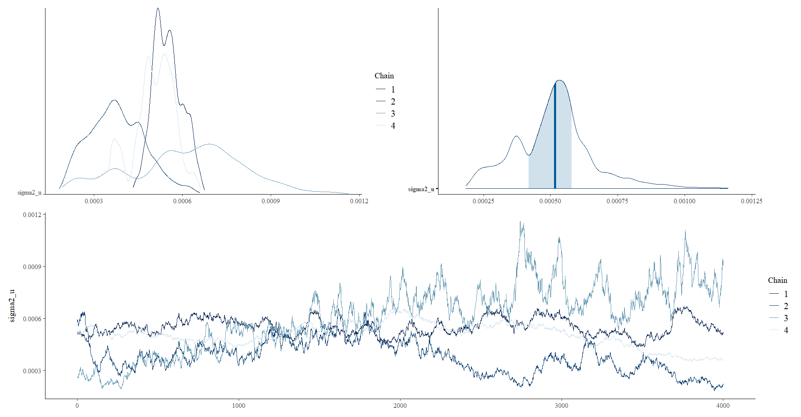
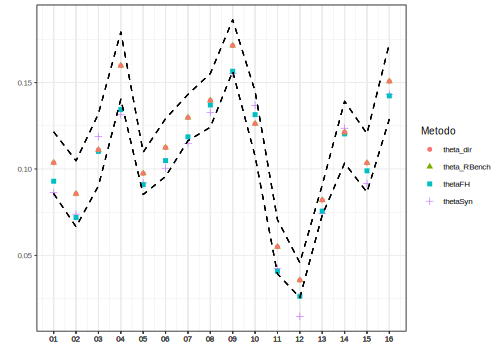
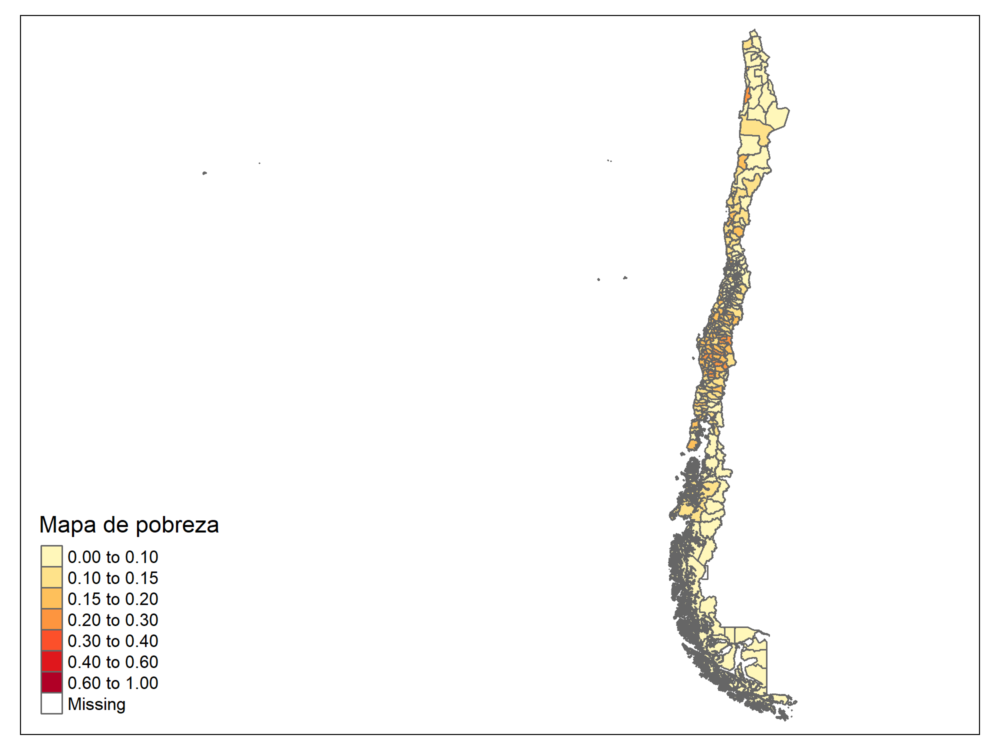

# Día 2 - Sesión 2- Modelo de Fay Herriot - Estimación de la pobreza (_usando todas la covariables censo y satelitales_) 


El modelo de Fay Herriot, propuesto por Fay y Herriot (1979), es un modelo estadístico de área y es el más comúnmente utilizado, cabe tener en cuenta, que dentro de la metodología de estimación en áreas pequeñas, los modelos de área son los de mayor aplicación, ya que lo más factible es no contar con la información a nivel de individuo, pero si encontrar no solo los datos a nivel de área, sino también información auxiliar asociada a estos datos. Este modelo lineal mixto, fue el primero en incluir efectos aleatorios a nivel de área, lo que implica que la mayoría de la información que se introduce al modelo corresponde a agregaciaciones usualmente, departamentos, regiones, provincias, municipios entre otros, donde las estimaciones que se logran con el modelo se obtienen sobre estas agregaciones o subpoblaciones.


Ahora, el modelo  Fay Herriot es un modelo que relaciona los indicadores de las áreas $\theta_d$, donde $d$ varía de 1 a $D$, asumiendo que varían con respecto a un vector de $p$ covariables $\boldsymbol{x}_d$. El modelo se define mediante la ecuación $\theta_d = \boldsymbol{x}^{T}_{d}\boldsymbol{\beta} + u_d$, donde $u_d$ es el término de error o efecto aleatorio, diferente para cada área y se distribuye como $u_{d} \stackrel{ind}{\sim}\left(0,\sigma_{u}^{2}\right)$.

Sin embargo, los verdaderos valores de los indicadores $\theta_d$ no son observables. Entonces, se utiliza el estimador directo $\hat{\theta}^{DIR}_d$ para estimarlos, lo que conduce a un error de muestreo. Este estimador todavía se considera insesgado bajo el diseño muestral, es decir, 
$$
\hat{\theta}_d^{DIR} = \theta + e_d  
$$


El modelo se ajusta entonces utilizando el término de error debido al muestreo $e_d$, donde $e_{d} \stackrel{ind}{\sim} \left(0,\sigma^2_{e_d}\right)$ y las varianzas $\sigma^2_{e_d}$ se estiman utilizando los microdatos de la encuesta. El modelo FH se reescribe como

$$
\hat{\theta}^{DIR}_{d} = \boldsymbol{x}^{T}_{d}\boldsymbol{\beta} + u_d + e_d
$$.

El mejor predictor lineal insesgado (BLUP) bajo el modelo FH viene dado por 

$$
\tilde{\theta}_{d}^{FH} = \boldsymbol{x}^{T}{d}\tilde{\boldsymbol{\beta}}+\tilde{u}_{d}
$$,

donde $\tilde{u}_d = \gamma_d\left(\hat{\theta}^{DIR}_{d} - \boldsymbol{x}^{T}_{d}\tilde{\boldsymbol{\beta}} \right)$ y $\gamma_d=\frac{\sigma^2_u}{\sigma^2_u + \sigma^2_{e_d}}$.


### Modelo de área para la estimación de la pobreza {-}

Sea $P_d$ la probabilidad de encontrar una persona en condición de pobreza en el $d-$ésimo dominio de la población. Entonces, el estimador directo de $P_d$ se puede escribir como:  

$$
\hat{P}^{DIR}_{d} = P_d + e_d
$$

Ahora bien, $P_d$ se puede modelar de la siguiente manera,  

$$
P_d = \boldsymbol{x}^{T}_{d}\boldsymbol{\beta} + u_d
$$
Luego, reescribiendo $\hat{P}^{DIR}_{d}$ en términos de las dos ecuaciones anteriores tenemos:  

$$
\hat{P}^{DIR}_{d} = \boldsymbol{x}^{T}_{d}\boldsymbol{\beta} + u_d + e_d
$$

Ahora, es posible suponer que $\hat{P}^{DIR}_d \sim N(\boldsymbol{x}^{T}_{d}\boldsymbol \beta, \sigma_u^2 +\sigma_{e_d}^2)$, $\hat{P}^{DIR}_d \mid u_d \sim N(\boldsymbol{x}^{T}_{d}\boldsymbol \beta + u_d,\sigma_{e_d}^2)$ y $u_d \sim N(0, \sigma^2_u)$

Luego, se asumen distribuciones previas para $\boldsymbol{\beta}$ y $\sigma^2_u$

$$
\begin{eqnarray*}
\beta_p & \sim   & N(0, 10000)\\
\sigma^2_u &\sim & IG(0.0001, 0.0001)
\end{eqnarray*}
$$

por tanto, el estimador bayesiano para $P_d$ esta dado como $\tilde{P}_d = E\left(P_d\mid\hat{P}_d^{DIR}\right)$


#### Predictor óptimo de $P_d$ {-}

El predictor óptimo de $P_d$ es 

$$E(P_d | \hat{P}^{DIR}_d) = \gamma_d\hat{P}^{DIR}_d + (1-\gamma_d)\boldsymbol{x}^{T}_{d}\boldsymbol \beta$$
con $\gamma_d = \frac{\sigma_u^2}{\sigma_u^2 +\sigma_{e_d}^2}$.

sabemos que $\hat{P}^{DIR}_d \sim N(\boldsymbol{x}^{T}_{d}\boldsymbol \beta, \sigma_u^2 +\sigma_{e_d}^2)$, $\hat{P}^{DIR}_d \mid u_d \sim N(\boldsymbol{x}^{T}_{d}\boldsymbol \beta + u_d,\sigma_{e_d}^2)$ y $u_d \sim N(0, \sigma^2_u)$

Por tanto

$$
\begin{align*}
f(u_d| \hat{P}^{DIR}_d) \propto f(\hat{P}^{DIR}_d | u_d)f(u_d) & = \frac{1}{\sigma^2_{e_d}\sqrt{2\pi}}\exp\left\{-\frac{1}{2\sigma^2_{e_d}(\hat{P}^{DIR}_d-\boldsymbol{x}^{T}_{d}\boldsymbol \beta - u_d)^2}\right\} \frac{1}{\sigma^2_u\sqrt{2\pi}}\exp\left\{- \frac{1}{2\sigma^2_u}u_d^2\right\}\\
& \propto \exp\left\{-\frac{u_d^2 - 2u_d(\hat{P}^{DIR}_d-\boldsymbol{x}^{T}_{d}\boldsymbol \beta)}{2\sigma^2_{e_d}} - \frac{u_d^2}{2\sigma^2_u}\right\} \\
& = \exp\left\{-\frac{1}{2}\left[(\frac{1}{\sigma^2_{e_d}} + \frac{1}{\sigma^2_u})u_d^2 - 2\frac{\hat{P}^{DIR}_d-\boldsymbol{x}^{T}_{d}\boldsymbol \beta}{\sigma_{e_d}^2}u_d\right] \right\} \\
& = \exp \left\{ -\frac{1}{2\frac{\sigma_u^2\sigma_{e_d}^2}{\sigma_u^2 +\sigma_{e_d}^2}}\left[u_d^2 - 2\frac{\sigma_u^2}{\sigma_u^2 +\sigma_{e_d}^2}(\hat{P}^{DIR}_d-\boldsymbol{x}^{T}_{d}\boldsymbol \beta)u_d \right] \right\} \\
& \propto \exp \left\{ -\frac{1}{2\frac{\sigma_u^2\sigma_{e_d}^2}{\sigma_u^2 +\sigma_{e_d}^2}}\left[u_d -  \frac{\sigma_u^2}{\sigma_u^2 +\sigma_{e_d}^2}(\hat{P}^{DIR}_d-\boldsymbol{x}^{T}_{d}\boldsymbol \beta)\right]^2 \right\} \\
& \propto N(E(u_d|\hat{P}^{DIR}_d), \text{Var}(u_d|P^{DIR}))
\end{align*}
$$

con $E(u_d|\hat{P}^{DIR}_d) = \frac{\sigma_u^2}{\sigma_u^2 +\sigma_{e_d}^2}(\hat{P}^{DIR}_d-\boldsymbol{x}^{T}_{d}\boldsymbol \beta)$ y $\text{Var}(u_d|P^{DIR}) = \frac{\sigma_u^2\sigma_{e_d}^2}{\sigma_u^2 +\sigma_{e_d}^2}$. Por lo tanto se tiene,

$$
\begin{align*}
E(P_d | \hat{P}^{DIR}_d) = \boldsymbol{x}^{T}_{d}\boldsymbol \beta + E(u_d|\hat{P}^{DIR}_d) & =  \boldsymbol{x}^{T}_{d}\boldsymbol \beta + \frac{\sigma_u^2}{\sigma_u^2 +\sigma_{e_d}^2}(\hat{P}^{DIR}_d-\boldsymbol{x}^{T}_{d}\boldsymbol \beta) \\
& = \frac{\sigma_{e_d}^2}{\sigma_u^2 +\sigma_{e_d}^2}\hat{P}^{DIR}_d + \frac{\sigma_u^2}{\sigma_u^2 +\sigma_{e_d}^2}\boldsymbol{x}^{T}_{d}\boldsymbol \beta \\
& = \gamma_d\hat{P}^{DIR}_d + (1-\gamma_d)\boldsymbol{x}^{T}_{d}\boldsymbol \beta
\end{align*}
$$


## Procedimiento de estimación

Este código utiliza las librerías `tidyverse` y `magrittr` para procesamiento y analizar datos.

La función `readRDS()` es utilizada para cargar un archivo de datos en formato RDS, que contiene las estimaciones directas y la varianza suvizada para la proporción de personas en condición de pobreza correspondientes al año 2018. Luego, se utiliza el operador `%>%` de la librería `magrittr` para encadenar la selección de las columnas de interés, que corresponden a los nombres `dam2`, `nd`, `pobreza`, `vardir` y `hat_var`.


```r
library(tidyverse)
library(magrittr)

base_FH <- readRDS("Recursos/Día2/Sesion2/Data/base_FH_2017.rds") %>% 
  select(dam2, nd,  pobreza, vardir, hat_var)
```

Lectura de las covariables, las cuales son obtenidas previamente. Dado la diferencia entre las escalas de las variables  es necesario hacer un ajuste a estas. 


```r
statelevel_predictors_df <- readRDS("Recursos/Día2/Sesion2/Data/statelevel_predictors_df_dam2.rds") %>% 
    mutate_at(.vars = c("luces_nocturnas",
                      "cubrimiento_cultivo",
                      "cubrimiento_urbano",
                      "modificacion_humana",
                      "accesibilidad_hospitales",
                      "accesibilidad_hosp_caminado"),
            function(x) as.numeric(scale(x)))
```

Ahora, se realiza una unión completa (`full_join`) entre el conjunto de datos `base_FH` y los predictores `statelevel_predictors_df` utilizando la variable `dam2` como clave de unión.

Se utiliza la función `tba()` para imprimir las primeras 10 filas y 8 columnas del conjunto de datos resultante de la unión anterior.

La unión completa (`full_join`) combina los datos de ambos conjuntos, manteniendo todas las filas de ambos, y llenando con valores faltantes (NA) en caso de no encontrar coincidencias en la variable de unión (dam2 en este caso).

La función `tba()` imprime una tabla en formato HTML en la consola de R que muestra las primeras 10 filas y 8 columnas del conjunto de datos resultante de la unión.


```r
base_FH <- full_join(base_FH, statelevel_predictors_df, by = "dam2" )
tba(base_FH[1:10,1:8])
```

<table class="table table-striped lightable-classic" style="width: auto !important; margin-left: auto; margin-right: auto; font-family: Arial Narrow; width: auto !important; margin-left: auto; margin-right: auto;">
 <thead>
  <tr>
   <th style="text-align:left;"> dam2 </th>
   <th style="text-align:right;"> nd </th>
   <th style="text-align:right;"> pobreza </th>
   <th style="text-align:right;"> vardir </th>
   <th style="text-align:right;"> hat_var </th>
   <th style="text-align:right;"> area0 </th>
   <th style="text-align:right;"> area1 </th>
   <th style="text-align:right;"> etnia2 </th>
  </tr>
 </thead>
<tbody>
  <tr>
   <td style="text-align:left;"> 01101 </td>
   <td style="text-align:right;"> 6447 </td>
   <td style="text-align:right;"> 0.0764 </td>
   <td style="text-align:right;"> 0.0001 </td>
   <td style="text-align:right;"> 0.0001 </td>
   <td style="text-align:right;"> 0.0126 </td>
   <td style="text-align:right;"> 0.9874 </td>
   <td style="text-align:right;"> 0.0016 </td>
  </tr>
  <tr>
   <td style="text-align:left;"> 01107 </td>
   <td style="text-align:right;"> 3015 </td>
   <td style="text-align:right;"> 0.1624 </td>
   <td style="text-align:right;"> 0.0004 </td>
   <td style="text-align:right;"> 0.0009 </td>
   <td style="text-align:right;"> 0.0230 </td>
   <td style="text-align:right;"> 0.9770 </td>
   <td style="text-align:right;"> 0.0011 </td>
  </tr>
  <tr>
   <td style="text-align:left;"> 02101 </td>
   <td style="text-align:right;"> 5473 </td>
   <td style="text-align:right;"> 0.0905 </td>
   <td style="text-align:right;"> 0.0001 </td>
   <td style="text-align:right;"> 0.0002 </td>
   <td style="text-align:right;"> 0.0215 </td>
   <td style="text-align:right;"> 0.9785 </td>
   <td style="text-align:right;"> 0.0010 </td>
  </tr>
  <tr>
   <td style="text-align:left;"> 02201 </td>
   <td style="text-align:right;"> 1759 </td>
   <td style="text-align:right;"> 0.0772 </td>
   <td style="text-align:right;"> 0.0005 </td>
   <td style="text-align:right;"> 0.0005 </td>
   <td style="text-align:right;"> 0.0437 </td>
   <td style="text-align:right;"> 0.9563 </td>
   <td style="text-align:right;"> 0.0004 </td>
  </tr>
  <tr>
   <td style="text-align:left;"> 03101 </td>
   <td style="text-align:right;"> 3757 </td>
   <td style="text-align:right;"> 0.1011 </td>
   <td style="text-align:right;"> 0.0003 </td>
   <td style="text-align:right;"> 0.0004 </td>
   <td style="text-align:right;"> 0.0193 </td>
   <td style="text-align:right;"> 0.9807 </td>
   <td style="text-align:right;"> 0.0006 </td>
  </tr>
  <tr>
   <td style="text-align:left;"> 03301 </td>
   <td style="text-align:right;"> 1221 </td>
   <td style="text-align:right;"> 0.1106 </td>
   <td style="text-align:right;"> 0.0001 </td>
   <td style="text-align:right;"> 0.0008 </td>
   <td style="text-align:right;"> 0.1136 </td>
   <td style="text-align:right;"> 0.8864 </td>
   <td style="text-align:right;"> 0.0004 </td>
  </tr>
  <tr>
   <td style="text-align:left;"> 04101 </td>
   <td style="text-align:right;"> 2719 </td>
   <td style="text-align:right;"> 0.1710 </td>
   <td style="text-align:right;"> 0.0002 </td>
   <td style="text-align:right;"> 0.0011 </td>
   <td style="text-align:right;"> 0.0923 </td>
   <td style="text-align:right;"> 0.9077 </td>
   <td style="text-align:right;"> 0.0004 </td>
  </tr>
  <tr>
   <td style="text-align:left;"> 04102 </td>
   <td style="text-align:right;"> 2498 </td>
   <td style="text-align:right;"> 0.1930 </td>
   <td style="text-align:right;"> 0.0005 </td>
   <td style="text-align:right;"> 0.0012 </td>
   <td style="text-align:right;"> 0.0579 </td>
   <td style="text-align:right;"> 0.9421 </td>
   <td style="text-align:right;"> 0.0003 </td>
  </tr>
  <tr>
   <td style="text-align:left;"> 04203 </td>
   <td style="text-align:right;"> 482 </td>
   <td style="text-align:right;"> 0.1004 </td>
   <td style="text-align:right;"> 0.0011 </td>
   <td style="text-align:right;"> 0.0008 </td>
   <td style="text-align:right;"> 0.2005 </td>
   <td style="text-align:right;"> 0.7995 </td>
   <td style="text-align:right;"> 0.0003 </td>
  </tr>
  <tr>
   <td style="text-align:left;"> 04301 </td>
   <td style="text-align:right;"> 1323 </td>
   <td style="text-align:right;"> 0.0902 </td>
   <td style="text-align:right;"> 0.0005 </td>
   <td style="text-align:right;"> 0.0006 </td>
   <td style="text-align:right;"> 0.2133 </td>
   <td style="text-align:right;"> 0.7867 </td>
   <td style="text-align:right;"> 0.0001 </td>
  </tr>
</tbody>
</table>

```r
# View(base_FH)
```

## Preparando los insumos para `STAN`

  1.    Dividir la base de datos en dominios observados y no observados.
    
  Dominios observados.
    

```r
data_dir <- base_FH %>% filter(!is.na(pobreza))
```

  Dominios NO observados.
    

```r
data_syn <-
  base_FH %>% anti_join(data_dir %>% select(dam2))
tba(data_syn[1:10,1:8])
```

<table class="table table-striped lightable-classic" style="width: auto !important; margin-left: auto; margin-right: auto; font-family: Arial Narrow; width: auto !important; margin-left: auto; margin-right: auto;">
 <thead>
  <tr>
   <th style="text-align:left;"> dam2 </th>
   <th style="text-align:right;"> nd </th>
   <th style="text-align:right;"> pobreza </th>
   <th style="text-align:right;"> vardir </th>
   <th style="text-align:right;"> hat_var </th>
   <th style="text-align:right;"> area0 </th>
   <th style="text-align:right;"> area1 </th>
   <th style="text-align:right;"> etnia2 </th>
  </tr>
 </thead>
<tbody>
  <tr>
   <td style="text-align:left;"> 01401 </td>
   <td style="text-align:right;"> NA </td>
   <td style="text-align:right;"> NA </td>
   <td style="text-align:right;"> NA </td>
   <td style="text-align:right;"> NA </td>
   <td style="text-align:right;"> 0.3575 </td>
   <td style="text-align:right;"> 0.6425 </td>
   <td style="text-align:right;"> 0.0004 </td>
  </tr>
  <tr>
   <td style="text-align:left;"> 01402 </td>
   <td style="text-align:right;"> NA </td>
   <td style="text-align:right;"> NA </td>
   <td style="text-align:right;"> NA </td>
   <td style="text-align:right;"> NA </td>
   <td style="text-align:right;"> 1.0000 </td>
   <td style="text-align:right;"> 0.0000 </td>
   <td style="text-align:right;"> 0.0000 </td>
  </tr>
  <tr>
   <td style="text-align:left;"> 01403 </td>
   <td style="text-align:right;"> NA </td>
   <td style="text-align:right;"> NA </td>
   <td style="text-align:right;"> NA </td>
   <td style="text-align:right;"> NA </td>
   <td style="text-align:right;"> 1.0000 </td>
   <td style="text-align:right;"> 0.0000 </td>
   <td style="text-align:right;"> 0.0006 </td>
  </tr>
  <tr>
   <td style="text-align:left;"> 01404 </td>
   <td style="text-align:right;"> NA </td>
   <td style="text-align:right;"> NA </td>
   <td style="text-align:right;"> NA </td>
   <td style="text-align:right;"> NA </td>
   <td style="text-align:right;"> 0.5938 </td>
   <td style="text-align:right;"> 0.4062 </td>
   <td style="text-align:right;"> 0.0011 </td>
  </tr>
  <tr>
   <td style="text-align:left;"> 01405 </td>
   <td style="text-align:right;"> NA </td>
   <td style="text-align:right;"> NA </td>
   <td style="text-align:right;"> NA </td>
   <td style="text-align:right;"> NA </td>
   <td style="text-align:right;"> 0.5792 </td>
   <td style="text-align:right;"> 0.4208 </td>
   <td style="text-align:right;"> 0.0016 </td>
  </tr>
  <tr>
   <td style="text-align:left;"> 02102 </td>
   <td style="text-align:right;"> NA </td>
   <td style="text-align:right;"> NA </td>
   <td style="text-align:right;"> NA </td>
   <td style="text-align:right;"> NA </td>
   <td style="text-align:right;"> 0.0381 </td>
   <td style="text-align:right;"> 0.9619 </td>
   <td style="text-align:right;"> 0.0008 </td>
  </tr>
  <tr>
   <td style="text-align:left;"> 02103 </td>
   <td style="text-align:right;"> NA </td>
   <td style="text-align:right;"> NA </td>
   <td style="text-align:right;"> NA </td>
   <td style="text-align:right;"> NA </td>
   <td style="text-align:right;"> 1.0000 </td>
   <td style="text-align:right;"> 0.0000 </td>
   <td style="text-align:right;"> 0.0014 </td>
  </tr>
  <tr>
   <td style="text-align:left;"> 02104 </td>
   <td style="text-align:right;"> NA </td>
   <td style="text-align:right;"> NA </td>
   <td style="text-align:right;"> NA </td>
   <td style="text-align:right;"> NA </td>
   <td style="text-align:right;"> 0.1648 </td>
   <td style="text-align:right;"> 0.8352 </td>
   <td style="text-align:right;"> 0.0002 </td>
  </tr>
  <tr>
   <td style="text-align:left;"> 02202 </td>
   <td style="text-align:right;"> NA </td>
   <td style="text-align:right;"> NA </td>
   <td style="text-align:right;"> NA </td>
   <td style="text-align:right;"> NA </td>
   <td style="text-align:right;"> 1.0000 </td>
   <td style="text-align:right;"> 0.0000 </td>
   <td style="text-align:right;"> 0.0000 </td>
  </tr>
  <tr>
   <td style="text-align:left;"> 02203 </td>
   <td style="text-align:right;"> NA </td>
   <td style="text-align:right;"> NA </td>
   <td style="text-align:right;"> NA </td>
   <td style="text-align:right;"> NA </td>
   <td style="text-align:right;"> 0.4976 </td>
   <td style="text-align:right;"> 0.5024 </td>
   <td style="text-align:right;"> 0.0010 </td>
  </tr>
</tbody>
</table>

  2.    Definir matriz de efectos fijos.
  
  Define un modelo lineal utilizando la función `formula()`, que incluye varias variables predictoras, como la edad, la etnia, la tasa de desocupación, entre otras.

  Utiliza la función `model.matrix()` para generar matrices de diseño (`Xdat` y `Xs`) a partir de los datos observados (`data_dir`) y no observados (`data_syn`) para utilizar en la construcción de modelos de regresión. La función `model.matrix()` convierte las variables categóricas en variables binarias (dummy), de manera que puedan ser utilizadas. 
  

```r
names_cov <- names(statelevel_predictors_df)[-1]
formula_mod  <- as.formula(paste0("~", paste0(names_cov,collapse = " + ")))
## Dominios observados
Xdat <- model.matrix(formula_mod, data = data_dir)

## Dominios no observados
Xs <- model.matrix(formula_mod, data = data_syn)
```

Ahora, se utiliza la función `setdiff()` para identificar las columnas de `Xdat` que no están presentes en $X_s$, es decir, las variables que no se encuentran en los datos no observados. A continuación, se crea una matriz temporal (`temp`) con ceros para las columnas faltantes de $X_s$, y se agregan estas columnas a $X_s$ utilizando `cbind()`. El resultado final es una matriz `Xs` con las mismas variables que `Xdat`, lo que asegura que se puedan realizar comparaciones adecuadas entre los datos observados y no observados en la construcción de modelos de regresión. En general, este código es útil para preparar los datos para su posterior análisis y asegurar que los modelos de regresión sean adecuados para su uso.


```r
temp <- setdiff(colnames(Xdat),colnames(Xs))

temp <- matrix(
  0,
  nrow = nrow(Xs),
  ncol = length(temp),
  dimnames = list(1:nrow(Xs), temp)
)

Xs <- cbind(Xs,temp)[,colnames(Xdat)]
```


  3.    Creando lista de parámetros para `STAN`


```r
sample_data <- list(
  N1 = nrow(Xdat),   # Observados.
  N2 = nrow(Xs),   # NO Observados.
  p  = ncol(Xdat),       # Número de regresores.
  X  = as.matrix(Xdat),  # Covariables Observados.
  Xs = as.matrix(Xs),    # Covariables NO Observados
  y  = as.numeric(data_dir$pobreza), # Estimación directa
  sigma_e = sqrt(data_dir$hat_var)   # Error de estimación
)
```

Rutina implementada en `STAN`


```r
data {
  int<lower=0> N1;   // number of data items
  int<lower=0> N2;   // number of data items for prediction
  int<lower=0> p;   // number of predictors
  matrix[N1, p] X;   // predictor matrix
  matrix[N2, p] Xs;   // predictor matrix
  vector[N1] y;      // predictor matrix 
  vector[N1] sigma_e; // known variances
}

parameters {
  vector[p] beta;       // coefficients for predictors
  real<lower=0> sigma2_u;
  vector[N1] u;
}

transformed parameters{
  vector[N1] theta;
  vector[N1] thetaSyn;
  vector[N1] thetaFH;
  vector[N1] gammaj;
  real<lower=0> sigma_u;
  thetaSyn = X * beta;
  theta = thetaSyn + u;
  sigma_u = sqrt(sigma2_u);
  gammaj =  to_vector(sigma_u ./ (sigma_u + sigma_e));
  thetaFH = (gammaj) .* y + (1-gammaj).*thetaSyn; 
}

model {
  // likelihood
  y ~ normal(theta, sigma_e); 
  // priors
  beta ~ normal(0, 100);
  u ~ normal(0, sigma_u);
  sigma2_u ~ inv_gamma(0.0001, 0.0001);
}

generated quantities{
  vector[N2] y_pred;
  for(j in 1:N2) {
    y_pred[j] = normal_rng(Xs[j] * beta, sigma_u);
  }
}
```

 4. Compilando el modelo en `STAN`.
A continuación mostramos la forma de compilar el código de `STAN` desde R.  

En este código se utiliza la librería `rstan` para ajustar un modelo bayesiano utilizando el archivo `17FH_normal.stan` que contiene el modelo escrito en el lenguaje de modelado probabilístico Stan.

En primer lugar, se utiliza la función `stan()` para ajustar el modelo a los datos de `sample_data`. Los argumentos que se pasan a `stan()` incluyen el archivo que contiene el modelo (`fit_FH_normal`), los datos (`sample_data`), y los argumentos para controlar el proceso de ajuste del modelo, como el número de iteraciones para el período de calentamiento (`warmup`) y el período de muestreo (`iter`), y el número de núcleos de la CPU para utilizar en el proceso de ajuste (`cores`).

Además, se utiliza la función `parallel::detectCores()` para detectar automáticamente el número de núcleos disponibles en la CPU, y se establece la opción `mc.cores` para aprovechar el número máximo de núcleos disponibles para el ajuste del modelo.

El resultado del ajuste del modelo es almacenado en `model_FH_normal`, que contiene una muestra de la distribución posterior del modelo, la cual puede ser utilizada para realizar inferencias sobre los parámetros del modelo y las predicciones. En general, este código es útil para ajustar modelos bayesianos utilizando Stan y realizar inferencias posteriores.


```r
library(rstan)
fit_FH_normal <- "Recursos/Día2/Sesion2/Data/modelosStan/17FH_normal.stan"
options(mc.cores = parallel::detectCores())
model_FH_normal <- stan(
  file = fit_FH_normal,  
  data = sample_data,   
  verbose = FALSE,
  warmup = 11000,         
  iter = 15000,            
  cores = 4              
)
saveRDS(object = model_FH_normal,
        file = "Recursos/Día2/Sesion2/Data/model_FH_normal_con_todas2.rds")
```

Leer el modelo 

```r
model_FH_normal<- readRDS("Recursos/Día2/Sesion2/Data/model_FH_normal_con_todas.rds")
```

### Resultados del modelo para los dominios observados. 

En este código, se cargan las librerías `bayesplot`, `posterior` y `patchwork`, que se utilizan para realizar gráficos y visualizaciones de los resultados del modelo.

A continuación, se utiliza la función `as.array()` y `as_draws_matrix()` para extraer las muestras de la distribución posterior del parámetro `theta` del modelo, y se seleccionan aleatoriamente 100 filas de estas muestras utilizando la función `sample()`, lo que resulta en la matriz `y_pred2.`

Finalmente, se utiliza la función `ppc_dens_overlay()` de `bayesplot` para graficar una comparación entre la distribución empírica de la variable observada pobreza en los datos (`data_dir$pobreza`) y las distribuciones predictivas posteriores simuladas para la misma variable (`y_pred2`). La función `ppc_dens_overlay()` produce un gráfico de densidad para ambas distribuciones, lo que permite visualizar cómo se comparan.


```r
library(bayesplot)
library(posterior)
library(patchwork)
y_pred_B <- as.array(model_FH_normal, pars = "theta") %>% 
  as_draws_matrix()
rowsrandom <- sample(nrow(y_pred_B), 100)
y_pred2 <- y_pred_B[rowsrandom, ]
ppc_dens_overlay(y = as.numeric(data_dir$pobreza), y_pred2)
```


Análisis gráfico de la convergencia de las cadenas de $\sigma^2_V$. 


```r
posterior_sigma2_u <- as.array(model_FH_normal, pars = "sigma2_u")
(mcmc_dens_chains(posterior_sigma2_u) +
    mcmc_areas(posterior_sigma2_u) ) / 
  mcmc_trace(posterior_sigma2_u)
```




Como método de validación se comparan las diferentes elementos de la estimación del modelo de FH obtenidos en `STAN`


```r
theta <-   summary(model_FH_normal,pars =  "theta")$summary %>%
  data.frame()
thetaSyn <-   summary(model_FH_normal,pars =  "thetaSyn")$summary %>%
  data.frame()
theta_FH <-   summary(model_FH_normal,pars =  "thetaFH")$summary %>%
  data.frame()

data_dir %<>% mutate(
            thetadir = pobreza,
            theta_pred = theta$mean,
            thetaSyn = thetaSyn$mean,
            thetaFH = theta_FH$mean,
            theta_pred_EE = theta$sd,
            Cv_theta_pred = theta_pred_EE/theta_pred
            ) 
# Estimación predicción del modelo vs ecuación ponderada de FH 
p11 <- ggplot(data_dir, aes(x = theta_pred, y = thetaFH)) +
  geom_point() + 
  geom_abline(slope = 1,intercept = 0, colour = "red") +
  theme_bw(10) 

# Estimación con la ecuación ponderada de FH Vs estimación sintética
p12 <- ggplot(data_dir, aes(x = thetaSyn, y = thetaFH)) +
  geom_point() + 
  geom_abline(slope = 1,intercept = 0, colour = "red") +
  theme_bw(10) 

# Estimación con la ecuación ponderada de FH Vs estimación directa

p21 <- ggplot(data_dir, aes(x = thetadir, y = thetaFH)) +
  geom_point() + 
  geom_abline(slope = 1,intercept = 0, colour = "red") +
  theme_bw(10) 

# Estimación directa Vs estimación sintética

p22 <- ggplot(data_dir, aes(x = thetadir, y = thetaSyn)) +
  geom_point() + 
  geom_abline(slope = 1,intercept = 0, colour = "red") +
  theme_bw(10) 

(p11+p12)/(p21+p22)
```


Estimación del FH de la pobreza en los dominios NO observados. 


```r
theta_syn_pred <- summary(model_FH_normal,pars =  "y_pred")$summary %>%
  data.frame()

data_syn <- data_syn %>% 
  mutate(
    theta_pred = theta_syn_pred$mean,
    thetaSyn = theta_pred,
    thetaFH = theta_pred,
    theta_pred_EE = theta_syn_pred$sd,
    Cv_theta_pred = theta_pred_EE/theta_pred)

tba(data_syn %>% slice(1:10) %>%
      select(dam2:hat_var,theta_pred:Cv_theta_pred))
```

<table class="table table-striped lightable-classic" style="width: auto !important; margin-left: auto; margin-right: auto; font-family: Arial Narrow; width: auto !important; margin-left: auto; margin-right: auto;">
 <thead>
  <tr>
   <th style="text-align:left;"> dam2 </th>
   <th style="text-align:right;"> nd </th>
   <th style="text-align:right;"> pobreza </th>
   <th style="text-align:right;"> vardir </th>
   <th style="text-align:right;"> hat_var </th>
   <th style="text-align:right;"> theta_pred </th>
   <th style="text-align:right;"> thetaSyn </th>
   <th style="text-align:right;"> thetaFH </th>
   <th style="text-align:right;"> theta_pred_EE </th>
   <th style="text-align:right;"> Cv_theta_pred </th>
  </tr>
 </thead>
<tbody>
  <tr>
   <td style="text-align:left;"> 01401 </td>
   <td style="text-align:right;"> NA </td>
   <td style="text-align:right;"> NA </td>
   <td style="text-align:right;"> NA </td>
   <td style="text-align:right;"> NA </td>
   <td style="text-align:right;"> 0.0586 </td>
   <td style="text-align:right;"> 0.0586 </td>
   <td style="text-align:right;"> 0.0586 </td>
   <td style="text-align:right;"> 0.0566 </td>
   <td style="text-align:right;"> 0.9668 </td>
  </tr>
  <tr>
   <td style="text-align:left;"> 01402 </td>
   <td style="text-align:right;"> NA </td>
   <td style="text-align:right;"> NA </td>
   <td style="text-align:right;"> NA </td>
   <td style="text-align:right;"> NA </td>
   <td style="text-align:right;"> -0.0330 </td>
   <td style="text-align:right;"> -0.0330 </td>
   <td style="text-align:right;"> -0.0330 </td>
   <td style="text-align:right;"> 0.0670 </td>
   <td style="text-align:right;"> -2.0309 </td>
  </tr>
  <tr>
   <td style="text-align:left;"> 01403 </td>
   <td style="text-align:right;"> NA </td>
   <td style="text-align:right;"> NA </td>
   <td style="text-align:right;"> NA </td>
   <td style="text-align:right;"> NA </td>
   <td style="text-align:right;"> -0.0263 </td>
   <td style="text-align:right;"> -0.0263 </td>
   <td style="text-align:right;"> -0.0263 </td>
   <td style="text-align:right;"> 0.1054 </td>
   <td style="text-align:right;"> -4.0155 </td>
  </tr>
  <tr>
   <td style="text-align:left;"> 01404 </td>
   <td style="text-align:right;"> NA </td>
   <td style="text-align:right;"> NA </td>
   <td style="text-align:right;"> NA </td>
   <td style="text-align:right;"> NA </td>
   <td style="text-align:right;"> 0.0781 </td>
   <td style="text-align:right;"> 0.0781 </td>
   <td style="text-align:right;"> 0.0781 </td>
   <td style="text-align:right;"> 0.0500 </td>
   <td style="text-align:right;"> 0.6404 </td>
  </tr>
  <tr>
   <td style="text-align:left;"> 01405 </td>
   <td style="text-align:right;"> NA </td>
   <td style="text-align:right;"> NA </td>
   <td style="text-align:right;"> NA </td>
   <td style="text-align:right;"> NA </td>
   <td style="text-align:right;"> -0.2124 </td>
   <td style="text-align:right;"> -0.2124 </td>
   <td style="text-align:right;"> -0.2124 </td>
   <td style="text-align:right;"> 0.1065 </td>
   <td style="text-align:right;"> -0.5012 </td>
  </tr>
  <tr>
   <td style="text-align:left;"> 02102 </td>
   <td style="text-align:right;"> NA </td>
   <td style="text-align:right;"> NA </td>
   <td style="text-align:right;"> NA </td>
   <td style="text-align:right;"> NA </td>
   <td style="text-align:right;"> 0.0117 </td>
   <td style="text-align:right;"> 0.0117 </td>
   <td style="text-align:right;"> 0.0117 </td>
   <td style="text-align:right;"> 0.0592 </td>
   <td style="text-align:right;"> 5.0820 </td>
  </tr>
  <tr>
   <td style="text-align:left;"> 02103 </td>
   <td style="text-align:right;"> NA </td>
   <td style="text-align:right;"> NA </td>
   <td style="text-align:right;"> NA </td>
   <td style="text-align:right;"> NA </td>
   <td style="text-align:right;"> -0.5042 </td>
   <td style="text-align:right;"> -0.5042 </td>
   <td style="text-align:right;"> -0.5042 </td>
   <td style="text-align:right;"> 0.1740 </td>
   <td style="text-align:right;"> -0.3450 </td>
  </tr>
  <tr>
   <td style="text-align:left;"> 02104 </td>
   <td style="text-align:right;"> NA </td>
   <td style="text-align:right;"> NA </td>
   <td style="text-align:right;"> NA </td>
   <td style="text-align:right;"> NA </td>
   <td style="text-align:right;"> 0.0169 </td>
   <td style="text-align:right;"> 0.0169 </td>
   <td style="text-align:right;"> 0.0169 </td>
   <td style="text-align:right;"> 0.0476 </td>
   <td style="text-align:right;"> 2.8079 </td>
  </tr>
  <tr>
   <td style="text-align:left;"> 02202 </td>
   <td style="text-align:right;"> NA </td>
   <td style="text-align:right;"> NA </td>
   <td style="text-align:right;"> NA </td>
   <td style="text-align:right;"> NA </td>
   <td style="text-align:right;"> -0.1386 </td>
   <td style="text-align:right;"> -0.1386 </td>
   <td style="text-align:right;"> -0.1386 </td>
   <td style="text-align:right;"> 0.0767 </td>
   <td style="text-align:right;"> -0.5538 </td>
  </tr>
  <tr>
   <td style="text-align:left;"> 02203 </td>
   <td style="text-align:right;"> NA </td>
   <td style="text-align:right;"> NA </td>
   <td style="text-align:right;"> NA </td>
   <td style="text-align:right;"> NA </td>
   <td style="text-align:right;"> -0.1174 </td>
   <td style="text-align:right;"> -0.1174 </td>
   <td style="text-align:right;"> -0.1174 </td>
   <td style="text-align:right;"> 0.0632 </td>
   <td style="text-align:right;"> -0.5386 </td>
  </tr>
</tbody>
</table>


consolidando las bases de estimaciones para dominios observados y NO observados. 


```r
estimacionesPre <- bind_rows(data_dir, data_syn) %>% 
  select(dam2, theta_pred) %>% 
  mutate(dam = substr(dam2,1,2))
```


## Proceso de Benchmark 

1. Del censo extraer el total de personas por DAM2 


```r
total_pp <- readRDS(file = "Recursos/Día2/Sesion2/Data/total_personas_dam2.rds")

N_dam_pp <- total_pp %>%   group_by(dam) %>%  
            mutate(dam_pp = sum(total_pp) ) 

tba(N_dam_pp %>% data.frame() %>% slice(1:20))
```

<table class="table table-striped lightable-classic" style="width: auto !important; margin-left: auto; margin-right: auto; font-family: Arial Narrow; width: auto !important; margin-left: auto; margin-right: auto;">
 <thead>
  <tr>
   <th style="text-align:left;"> dam </th>
   <th style="text-align:left;"> dam2 </th>
   <th style="text-align:right;"> total_pp </th>
   <th style="text-align:right;"> dam_pp </th>
  </tr>
 </thead>
<tbody>
  <tr>
   <td style="text-align:left;"> 01 </td>
   <td style="text-align:left;"> 01101 </td>
   <td style="text-align:right;"> 191468 </td>
   <td style="text-align:right;"> 330558 </td>
  </tr>
  <tr>
   <td style="text-align:left;"> 01 </td>
   <td style="text-align:left;"> 01107 </td>
   <td style="text-align:right;"> 108375 </td>
   <td style="text-align:right;"> 330558 </td>
  </tr>
  <tr>
   <td style="text-align:left;"> 01 </td>
   <td style="text-align:left;"> 01401 </td>
   <td style="text-align:right;"> 15711 </td>
   <td style="text-align:right;"> 330558 </td>
  </tr>
  <tr>
   <td style="text-align:left;"> 01 </td>
   <td style="text-align:left;"> 01402 </td>
   <td style="text-align:right;"> 1250 </td>
   <td style="text-align:right;"> 330558 </td>
  </tr>
  <tr>
   <td style="text-align:left;"> 01 </td>
   <td style="text-align:left;"> 01403 </td>
   <td style="text-align:right;"> 1728 </td>
   <td style="text-align:right;"> 330558 </td>
  </tr>
  <tr>
   <td style="text-align:left;"> 01 </td>
   <td style="text-align:left;"> 01404 </td>
   <td style="text-align:right;"> 2730 </td>
   <td style="text-align:right;"> 330558 </td>
  </tr>
  <tr>
   <td style="text-align:left;"> 01 </td>
   <td style="text-align:left;"> 01405 </td>
   <td style="text-align:right;"> 9296 </td>
   <td style="text-align:right;"> 330558 </td>
  </tr>
  <tr>
   <td style="text-align:left;"> 02 </td>
   <td style="text-align:left;"> 02101 </td>
   <td style="text-align:right;"> 361873 </td>
   <td style="text-align:right;"> 607534 </td>
  </tr>
  <tr>
   <td style="text-align:left;"> 02 </td>
   <td style="text-align:left;"> 02102 </td>
   <td style="text-align:right;"> 13467 </td>
   <td style="text-align:right;"> 607534 </td>
  </tr>
  <tr>
   <td style="text-align:left;"> 02 </td>
   <td style="text-align:left;"> 02103 </td>
   <td style="text-align:right;"> 10186 </td>
   <td style="text-align:right;"> 607534 </td>
  </tr>
  <tr>
   <td style="text-align:left;"> 02 </td>
   <td style="text-align:left;"> 02104 </td>
   <td style="text-align:right;"> 13317 </td>
   <td style="text-align:right;"> 607534 </td>
  </tr>
  <tr>
   <td style="text-align:left;"> 02 </td>
   <td style="text-align:left;"> 02201 </td>
   <td style="text-align:right;"> 165731 </td>
   <td style="text-align:right;"> 607534 </td>
  </tr>
  <tr>
   <td style="text-align:left;"> 02 </td>
   <td style="text-align:left;"> 02202 </td>
   <td style="text-align:right;"> 321 </td>
   <td style="text-align:right;"> 607534 </td>
  </tr>
  <tr>
   <td style="text-align:left;"> 02 </td>
   <td style="text-align:left;"> 02203 </td>
   <td style="text-align:right;"> 10996 </td>
   <td style="text-align:right;"> 607534 </td>
  </tr>
  <tr>
   <td style="text-align:left;"> 02 </td>
   <td style="text-align:left;"> 02301 </td>
   <td style="text-align:right;"> 25186 </td>
   <td style="text-align:right;"> 607534 </td>
  </tr>
  <tr>
   <td style="text-align:left;"> 02 </td>
   <td style="text-align:left;"> 02302 </td>
   <td style="text-align:right;"> 6457 </td>
   <td style="text-align:right;"> 607534 </td>
  </tr>
  <tr>
   <td style="text-align:left;"> 03 </td>
   <td style="text-align:left;"> 03101 </td>
   <td style="text-align:right;"> 153937 </td>
   <td style="text-align:right;"> 286168 </td>
  </tr>
  <tr>
   <td style="text-align:left;"> 03 </td>
   <td style="text-align:left;"> 03102 </td>
   <td style="text-align:right;"> 17662 </td>
   <td style="text-align:right;"> 286168 </td>
  </tr>
  <tr>
   <td style="text-align:left;"> 03 </td>
   <td style="text-align:left;"> 03103 </td>
   <td style="text-align:right;"> 14019 </td>
   <td style="text-align:right;"> 286168 </td>
  </tr>
  <tr>
   <td style="text-align:left;"> 03 </td>
   <td style="text-align:left;"> 03201 </td>
   <td style="text-align:right;"> 12219 </td>
   <td style="text-align:right;"> 286168 </td>
  </tr>
</tbody>
</table>

2. Obtener las estimaciones directa por DAM o el nivel de agregación en el cual la encuesta es representativa. 

En este código, se lee un archivo RDS de una encuesta (`encuesta2017CHL.rds`) y se utilizan las funciones `transmute()` para seleccionar y transformar las variables de interés.

En primer lugar, se crea una variable `dam` que corresponde al identificador de la división administrativa mayor de la encuesta. A continuación, se utiliza la columna `dam_ee` para crear una variable `dam`, se selecciona la variable `dam2` que corresponde al identificador de la división administrativa menor de segundo nivel  de la encuesta.

Luego, se crea una variable `wkx` que corresponde al peso de la observación en la encuesta, y una variable `upm` que corresponde al identificador de la Unidad Prrimaria de Muestreo.

Finalmente, se crea una variable `pobreza` que toma el valor 1 si el ingreso de la vivienda es menor que un umbral lp, y 0 en caso contrario.


```r
encuesta <- readRDS("Recursos/Día2/Sesion2/Data/encuesta2017CHL.Rds")%>% 
  transmute(
    dam =  haven::as_factor(dam_ee ,levels = "values"),
    dam2 =  haven::as_factor(comuna,levels = "values"),
    dam = str_pad(dam, width = 2, pad = "0"),
    dam2 = str_pad(dam2, width = 5, pad = "0"),
    wkx = `_fep`, 
    upm = `_upm`,
    estrato = `_estrato`,
    pobreza = ifelse(ingcorte < lp, 1 , 0))
```

El código está realizando un análisis de datos de encuestas utilizando el paquete `survey` de R. Primero, se crea un objeto `diseno` de diseño de encuestas usando la función `as_survey_design()` del paquete `srvyr`, que incluye los identificadores de la unidad primaria de muestreo (`upm`), los pesos (`wkx`), las estratos (`estrato`) y los datos de la encuesta (encuesta). Posteriormente, se agrupa el objeto `diseno` por la variable "Agregado" y se calcula la media de la variable pobreza con un intervalo de confianza para toda la población utilizando la función `survey_mean()`. El resultado se guarda en el objeto `directoDam` y se muestra en una tabla.


```r
library(survey)
library(srvyr)
options(survey.lonely.psu = "adjust")

diseno <-
  as_survey_design(
    ids = upm,
    weights = wkx,
    strata = estrato,
    nest = TRUE,
    .data = encuesta
  )

directoDam <- diseno %>% 
    group_by(dam) %>% 
  summarise(
    theta_dir = survey_mean(pobreza, vartype = c("ci"))
    )
tba(directoDam)
```

<table class="table table-striped lightable-classic" style="width: auto !important; margin-left: auto; margin-right: auto; font-family: Arial Narrow; width: auto !important; margin-left: auto; margin-right: auto;">
 <thead>
  <tr>
   <th style="text-align:left;"> dam </th>
   <th style="text-align:right;"> theta_dir </th>
   <th style="text-align:right;"> theta_dir_low </th>
   <th style="text-align:right;"> theta_dir_upp </th>
  </tr>
 </thead>
<tbody>
  <tr>
   <td style="text-align:left;"> 01 </td>
   <td style="text-align:right;"> 0.1036 </td>
   <td style="text-align:right;"> 0.0858 </td>
   <td style="text-align:right;"> 0.1215 </td>
  </tr>
  <tr>
   <td style="text-align:left;"> 02 </td>
   <td style="text-align:right;"> 0.0856 </td>
   <td style="text-align:right;"> 0.0665 </td>
   <td style="text-align:right;"> 0.1047 </td>
  </tr>
  <tr>
   <td style="text-align:left;"> 03 </td>
   <td style="text-align:right;"> 0.1111 </td>
   <td style="text-align:right;"> 0.0902 </td>
   <td style="text-align:right;"> 0.1320 </td>
  </tr>
  <tr>
   <td style="text-align:left;"> 04 </td>
   <td style="text-align:right;"> 0.1598 </td>
   <td style="text-align:right;"> 0.1404 </td>
   <td style="text-align:right;"> 0.1792 </td>
  </tr>
  <tr>
   <td style="text-align:left;"> 05 </td>
   <td style="text-align:right;"> 0.0975 </td>
   <td style="text-align:right;"> 0.0852 </td>
   <td style="text-align:right;"> 0.1097 </td>
  </tr>
  <tr>
   <td style="text-align:left;"> 06 </td>
   <td style="text-align:right;"> 0.1124 </td>
   <td style="text-align:right;"> 0.0957 </td>
   <td style="text-align:right;"> 0.1291 </td>
  </tr>
  <tr>
   <td style="text-align:left;"> 07 </td>
   <td style="text-align:right;"> 0.1297 </td>
   <td style="text-align:right;"> 0.1164 </td>
   <td style="text-align:right;"> 0.1431 </td>
  </tr>
  <tr>
   <td style="text-align:left;"> 08 </td>
   <td style="text-align:right;"> 0.1397 </td>
   <td style="text-align:right;"> 0.1242 </td>
   <td style="text-align:right;"> 0.1552 </td>
  </tr>
  <tr>
   <td style="text-align:left;"> 09 </td>
   <td style="text-align:right;"> 0.1714 </td>
   <td style="text-align:right;"> 0.1565 </td>
   <td style="text-align:right;"> 0.1863 </td>
  </tr>
  <tr>
   <td style="text-align:left;"> 10 </td>
   <td style="text-align:right;"> 0.1262 </td>
   <td style="text-align:right;"> 0.1074 </td>
   <td style="text-align:right;"> 0.1450 </td>
  </tr>
  <tr>
   <td style="text-align:left;"> 11 </td>
   <td style="text-align:right;"> 0.0550 </td>
   <td style="text-align:right;"> 0.0393 </td>
   <td style="text-align:right;"> 0.0706 </td>
  </tr>
  <tr>
   <td style="text-align:left;"> 12 </td>
   <td style="text-align:right;"> 0.0357 </td>
   <td style="text-align:right;"> 0.0256 </td>
   <td style="text-align:right;"> 0.0458 </td>
  </tr>
  <tr>
   <td style="text-align:left;"> 13 </td>
   <td style="text-align:right;"> 0.0820 </td>
   <td style="text-align:right;"> 0.0733 </td>
   <td style="text-align:right;"> 0.0907 </td>
  </tr>
  <tr>
   <td style="text-align:left;"> 14 </td>
   <td style="text-align:right;"> 0.1213 </td>
   <td style="text-align:right;"> 0.1034 </td>
   <td style="text-align:right;"> 0.1392 </td>
  </tr>
  <tr>
   <td style="text-align:left;"> 15 </td>
   <td style="text-align:right;"> 0.1035 </td>
   <td style="text-align:right;"> 0.0865 </td>
   <td style="text-align:right;"> 0.1204 </td>
  </tr>
  <tr>
   <td style="text-align:left;"> 16 </td>
   <td style="text-align:right;"> 0.1507 </td>
   <td style="text-align:right;"> 0.1289 </td>
   <td style="text-align:right;"> 0.1725 </td>
  </tr>
</tbody>
</table>


3. Realizar el consolidando información obtenida en *1* y *2*.  


```r
temp <- estimacionesPre %>%
  inner_join(N_dam_pp ) %>% 
  inner_join(directoDam )

tba(temp %>% slice(1:10))
```

<table class="table table-striped lightable-classic" style="width: auto !important; margin-left: auto; margin-right: auto; font-family: Arial Narrow; width: auto !important; margin-left: auto; margin-right: auto;">
 <thead>
  <tr>
   <th style="text-align:left;"> dam2 </th>
   <th style="text-align:right;"> theta_pred </th>
   <th style="text-align:left;"> dam </th>
   <th style="text-align:right;"> total_pp </th>
   <th style="text-align:right;"> dam_pp </th>
   <th style="text-align:right;"> theta_dir </th>
   <th style="text-align:right;"> theta_dir_low </th>
   <th style="text-align:right;"> theta_dir_upp </th>
  </tr>
 </thead>
<tbody>
  <tr>
   <td style="text-align:left;"> 01101 </td>
   <td style="text-align:right;"> 0.0750 </td>
   <td style="text-align:left;"> 01 </td>
   <td style="text-align:right;"> 191468 </td>
   <td style="text-align:right;"> 330558 </td>
   <td style="text-align:right;"> 0.1036 </td>
   <td style="text-align:right;"> 0.0858 </td>
   <td style="text-align:right;"> 0.1215 </td>
  </tr>
  <tr>
   <td style="text-align:left;"> 01107 </td>
   <td style="text-align:right;"> 0.1594 </td>
   <td style="text-align:left;"> 01 </td>
   <td style="text-align:right;"> 108375 </td>
   <td style="text-align:right;"> 330558 </td>
   <td style="text-align:right;"> 0.1036 </td>
   <td style="text-align:right;"> 0.0858 </td>
   <td style="text-align:right;"> 0.1215 </td>
  </tr>
  <tr>
   <td style="text-align:left;"> 02101 </td>
   <td style="text-align:right;"> 0.0901 </td>
   <td style="text-align:left;"> 02 </td>
   <td style="text-align:right;"> 361873 </td>
   <td style="text-align:right;"> 607534 </td>
   <td style="text-align:right;"> 0.0856 </td>
   <td style="text-align:right;"> 0.0665 </td>
   <td style="text-align:right;"> 0.1047 </td>
  </tr>
  <tr>
   <td style="text-align:left;"> 02201 </td>
   <td style="text-align:right;"> 0.0786 </td>
   <td style="text-align:left;"> 02 </td>
   <td style="text-align:right;"> 165731 </td>
   <td style="text-align:right;"> 607534 </td>
   <td style="text-align:right;"> 0.0856 </td>
   <td style="text-align:right;"> 0.0665 </td>
   <td style="text-align:right;"> 0.1047 </td>
  </tr>
  <tr>
   <td style="text-align:left;"> 03101 </td>
   <td style="text-align:right;"> 0.0964 </td>
   <td style="text-align:left;"> 03 </td>
   <td style="text-align:right;"> 153937 </td>
   <td style="text-align:right;"> 286168 </td>
   <td style="text-align:right;"> 0.1111 </td>
   <td style="text-align:right;"> 0.0902 </td>
   <td style="text-align:right;"> 0.1320 </td>
  </tr>
  <tr>
   <td style="text-align:left;"> 03301 </td>
   <td style="text-align:right;"> 0.1444 </td>
   <td style="text-align:left;"> 03 </td>
   <td style="text-align:right;"> 51917 </td>
   <td style="text-align:right;"> 286168 </td>
   <td style="text-align:right;"> 0.1111 </td>
   <td style="text-align:right;"> 0.0902 </td>
   <td style="text-align:right;"> 0.1320 </td>
  </tr>
  <tr>
   <td style="text-align:left;"> 04101 </td>
   <td style="text-align:right;"> 0.1444 </td>
   <td style="text-align:left;"> 04 </td>
   <td style="text-align:right;"> 221054 </td>
   <td style="text-align:right;"> 757586 </td>
   <td style="text-align:right;"> 0.1598 </td>
   <td style="text-align:right;"> 0.1404 </td>
   <td style="text-align:right;"> 0.1792 </td>
  </tr>
  <tr>
   <td style="text-align:left;"> 04102 </td>
   <td style="text-align:right;"> 0.1591 </td>
   <td style="text-align:left;"> 04 </td>
   <td style="text-align:right;"> 227730 </td>
   <td style="text-align:right;"> 757586 </td>
   <td style="text-align:right;"> 0.1598 </td>
   <td style="text-align:right;"> 0.1404 </td>
   <td style="text-align:right;"> 0.1792 </td>
  </tr>
  <tr>
   <td style="text-align:left;"> 04203 </td>
   <td style="text-align:right;"> 0.1260 </td>
   <td style="text-align:left;"> 04 </td>
   <td style="text-align:right;"> 21382 </td>
   <td style="text-align:right;"> 757586 </td>
   <td style="text-align:right;"> 0.1598 </td>
   <td style="text-align:right;"> 0.1404 </td>
   <td style="text-align:right;"> 0.1792 </td>
  </tr>
  <tr>
   <td style="text-align:left;"> 04301 </td>
   <td style="text-align:right;"> 0.0984 </td>
   <td style="text-align:left;"> 04 </td>
   <td style="text-align:right;"> 111272 </td>
   <td style="text-align:right;"> 757586 </td>
   <td style="text-align:right;"> 0.1598 </td>
   <td style="text-align:right;"> 0.1404 </td>
   <td style="text-align:right;"> 0.1792 </td>
  </tr>
</tbody>
</table>

4. Con la información organizada realizar el calculo de los pesos para el Benchmark


```r
R_dam2 <- temp %>% group_by(dam) %>% 
  summarise(
  R_dam_RB = unique(theta_dir) / sum((total_pp  / dam_pp) * theta_pred)
) %>%
  left_join(directoDam, by = "dam")

tba(R_dam2 %>% arrange(desc(R_dam_RB)))
```

<table class="table table-striped lightable-classic" style="width: auto !important; margin-left: auto; margin-right: auto; font-family: Arial Narrow; width: auto !important; margin-left: auto; margin-right: auto;">
 <thead>
  <tr>
   <th style="text-align:left;"> dam </th>
   <th style="text-align:right;"> R_dam_RB </th>
   <th style="text-align:right;"> theta_dir </th>
   <th style="text-align:right;"> theta_dir_low </th>
   <th style="text-align:right;"> theta_dir_upp </th>
  </tr>
 </thead>
<tbody>
  <tr>
   <td style="text-align:left;"> 12 </td>
   <td style="text-align:right;"> 1.3532 </td>
   <td style="text-align:right;"> 0.0357 </td>
   <td style="text-align:right;"> 0.0256 </td>
   <td style="text-align:right;"> 0.0458 </td>
  </tr>
  <tr>
   <td style="text-align:left;"> 11 </td>
   <td style="text-align:right;"> 1.3471 </td>
   <td style="text-align:right;"> 0.0550 </td>
   <td style="text-align:right;"> 0.0393 </td>
   <td style="text-align:right;"> 0.0706 </td>
  </tr>
  <tr>
   <td style="text-align:left;"> 02 </td>
   <td style="text-align:right;"> 1.1906 </td>
   <td style="text-align:right;"> 0.0856 </td>
   <td style="text-align:right;"> 0.0665 </td>
   <td style="text-align:right;"> 0.1047 </td>
  </tr>
  <tr>
   <td style="text-align:left;"> 04 </td>
   <td style="text-align:right;"> 1.1895 </td>
   <td style="text-align:right;"> 0.1598 </td>
   <td style="text-align:right;"> 0.1404 </td>
   <td style="text-align:right;"> 0.1792 </td>
  </tr>
  <tr>
   <td style="text-align:left;"> 01 </td>
   <td style="text-align:right;"> 1.1153 </td>
   <td style="text-align:right;"> 0.1036 </td>
   <td style="text-align:right;"> 0.0858 </td>
   <td style="text-align:right;"> 0.1215 </td>
  </tr>
  <tr>
   <td style="text-align:left;"> 09 </td>
   <td style="text-align:right;"> 1.0949 </td>
   <td style="text-align:right;"> 0.1714 </td>
   <td style="text-align:right;"> 0.1565 </td>
   <td style="text-align:right;"> 0.1863 </td>
  </tr>
  <tr>
   <td style="text-align:left;"> 07 </td>
   <td style="text-align:right;"> 1.0940 </td>
   <td style="text-align:right;"> 0.1297 </td>
   <td style="text-align:right;"> 0.1164 </td>
   <td style="text-align:right;"> 0.1431 </td>
  </tr>
  <tr>
   <td style="text-align:left;"> 13 </td>
   <td style="text-align:right;"> 1.0841 </td>
   <td style="text-align:right;"> 0.0820 </td>
   <td style="text-align:right;"> 0.0733 </td>
   <td style="text-align:right;"> 0.0907 </td>
  </tr>
  <tr>
   <td style="text-align:left;"> 05 </td>
   <td style="text-align:right;"> 1.0720 </td>
   <td style="text-align:right;"> 0.0975 </td>
   <td style="text-align:right;"> 0.0852 </td>
   <td style="text-align:right;"> 0.1097 </td>
  </tr>
  <tr>
   <td style="text-align:left;"> 06 </td>
   <td style="text-align:right;"> 1.0719 </td>
   <td style="text-align:right;"> 0.1124 </td>
   <td style="text-align:right;"> 0.0957 </td>
   <td style="text-align:right;"> 0.1291 </td>
  </tr>
  <tr>
   <td style="text-align:left;"> 16 </td>
   <td style="text-align:right;"> 1.0591 </td>
   <td style="text-align:right;"> 0.1507 </td>
   <td style="text-align:right;"> 0.1289 </td>
   <td style="text-align:right;"> 0.1725 </td>
  </tr>
  <tr>
   <td style="text-align:left;"> 15 </td>
   <td style="text-align:right;"> 1.0458 </td>
   <td style="text-align:right;"> 0.1035 </td>
   <td style="text-align:right;"> 0.0865 </td>
   <td style="text-align:right;"> 0.1204 </td>
  </tr>
  <tr>
   <td style="text-align:left;"> 08 </td>
   <td style="text-align:right;"> 1.0195 </td>
   <td style="text-align:right;"> 0.1397 </td>
   <td style="text-align:right;"> 0.1242 </td>
   <td style="text-align:right;"> 0.1552 </td>
  </tr>
  <tr>
   <td style="text-align:left;"> 14 </td>
   <td style="text-align:right;"> 1.0082 </td>
   <td style="text-align:right;"> 0.1213 </td>
   <td style="text-align:right;"> 0.1034 </td>
   <td style="text-align:right;"> 0.1392 </td>
  </tr>
  <tr>
   <td style="text-align:left;"> 03 </td>
   <td style="text-align:right;"> 1.0081 </td>
   <td style="text-align:right;"> 0.1111 </td>
   <td style="text-align:right;"> 0.0902 </td>
   <td style="text-align:right;"> 0.1320 </td>
  </tr>
  <tr>
   <td style="text-align:left;"> 10 </td>
   <td style="text-align:right;"> 0.9602 </td>
   <td style="text-align:right;"> 0.1262 </td>
   <td style="text-align:right;"> 0.1074 </td>
   <td style="text-align:right;"> 0.1450 </td>
  </tr>
</tbody>
</table>
calculando los pesos para cada dominio.


```r
pesos <- temp %>% 
  mutate(W_i = total_pp / dam_pp) %>% 
  select(dam2, W_i)
tba(pesos %>% slice(1:10))
```

<table class="table table-striped lightable-classic" style="width: auto !important; margin-left: auto; margin-right: auto; font-family: Arial Narrow; width: auto !important; margin-left: auto; margin-right: auto;">
 <thead>
  <tr>
   <th style="text-align:left;"> dam2 </th>
   <th style="text-align:right;"> W_i </th>
  </tr>
 </thead>
<tbody>
  <tr>
   <td style="text-align:left;"> 01101 </td>
   <td style="text-align:right;"> 0.5792 </td>
  </tr>
  <tr>
   <td style="text-align:left;"> 01107 </td>
   <td style="text-align:right;"> 0.3279 </td>
  </tr>
  <tr>
   <td style="text-align:left;"> 02101 </td>
   <td style="text-align:right;"> 0.5956 </td>
  </tr>
  <tr>
   <td style="text-align:left;"> 02201 </td>
   <td style="text-align:right;"> 0.2728 </td>
  </tr>
  <tr>
   <td style="text-align:left;"> 03101 </td>
   <td style="text-align:right;"> 0.5379 </td>
  </tr>
  <tr>
   <td style="text-align:left;"> 03301 </td>
   <td style="text-align:right;"> 0.1814 </td>
  </tr>
  <tr>
   <td style="text-align:left;"> 04101 </td>
   <td style="text-align:right;"> 0.2918 </td>
  </tr>
  <tr>
   <td style="text-align:left;"> 04102 </td>
   <td style="text-align:right;"> 0.3006 </td>
  </tr>
  <tr>
   <td style="text-align:left;"> 04203 </td>
   <td style="text-align:right;"> 0.0282 </td>
  </tr>
  <tr>
   <td style="text-align:left;"> 04301 </td>
   <td style="text-align:right;"> 0.1469 </td>
  </tr>
</tbody>
</table>


5. Realizar la estimación FH  Benchmark 

En este proceso, se realiza la adición de una nueva columna denominada `R_dam_RB`, que es obtenida a partir de un objeto denominado `R_dam2`. Posteriormente, se agrega una nueva columna denominada `theta_pred_RBench`, la cual es igual a la multiplicación de `R_dam_RB` y `theta_pred.` Finalmente, se hace un `left_join` con el dataframe pesos, y se seleccionan únicamente las columnas `dam`, `dam2`, `W_i`, `theta_pred` y `theta_pred_RBench` para ser presentadas en una tabla (tba) que muestra únicamente las primeras 10 filas.


```r
estimacionesBench <- estimacionesPre %>%
  left_join(R_dam2, by = c("dam")) %>%
  mutate(theta_pred_RBench = R_dam_RB * theta_pred) %>%
  left_join(pesos) %>% 
  select(dam, dam2, W_i, theta_pred, theta_pred_RBench)  

  tba(estimacionesBench %>% slice(1:10))
```

<table class="table table-striped lightable-classic" style="width: auto !important; margin-left: auto; margin-right: auto; font-family: Arial Narrow; width: auto !important; margin-left: auto; margin-right: auto;">
 <thead>
  <tr>
   <th style="text-align:left;"> dam </th>
   <th style="text-align:left;"> dam2 </th>
   <th style="text-align:right;"> W_i </th>
   <th style="text-align:right;"> theta_pred </th>
   <th style="text-align:right;"> theta_pred_RBench </th>
  </tr>
 </thead>
<tbody>
  <tr>
   <td style="text-align:left;"> 01 </td>
   <td style="text-align:left;"> 01101 </td>
   <td style="text-align:right;"> 0.5792 </td>
   <td style="text-align:right;"> 0.0750 </td>
   <td style="text-align:right;"> 0.0837 </td>
  </tr>
  <tr>
   <td style="text-align:left;"> 01 </td>
   <td style="text-align:left;"> 01107 </td>
   <td style="text-align:right;"> 0.3279 </td>
   <td style="text-align:right;"> 0.1594 </td>
   <td style="text-align:right;"> 0.1778 </td>
  </tr>
  <tr>
   <td style="text-align:left;"> 02 </td>
   <td style="text-align:left;"> 02101 </td>
   <td style="text-align:right;"> 0.5956 </td>
   <td style="text-align:right;"> 0.0901 </td>
   <td style="text-align:right;"> 0.1073 </td>
  </tr>
  <tr>
   <td style="text-align:left;"> 02 </td>
   <td style="text-align:left;"> 02201 </td>
   <td style="text-align:right;"> 0.2728 </td>
   <td style="text-align:right;"> 0.0786 </td>
   <td style="text-align:right;"> 0.0936 </td>
  </tr>
  <tr>
   <td style="text-align:left;"> 03 </td>
   <td style="text-align:left;"> 03101 </td>
   <td style="text-align:right;"> 0.5379 </td>
   <td style="text-align:right;"> 0.0964 </td>
   <td style="text-align:right;"> 0.0972 </td>
  </tr>
  <tr>
   <td style="text-align:left;"> 03 </td>
   <td style="text-align:left;"> 03301 </td>
   <td style="text-align:right;"> 0.1814 </td>
   <td style="text-align:right;"> 0.1444 </td>
   <td style="text-align:right;"> 0.1456 </td>
  </tr>
  <tr>
   <td style="text-align:left;"> 04 </td>
   <td style="text-align:left;"> 04101 </td>
   <td style="text-align:right;"> 0.2918 </td>
   <td style="text-align:right;"> 0.1444 </td>
   <td style="text-align:right;"> 0.1717 </td>
  </tr>
  <tr>
   <td style="text-align:left;"> 04 </td>
   <td style="text-align:left;"> 04102 </td>
   <td style="text-align:right;"> 0.3006 </td>
   <td style="text-align:right;"> 0.1591 </td>
   <td style="text-align:right;"> 0.1892 </td>
  </tr>
  <tr>
   <td style="text-align:left;"> 04 </td>
   <td style="text-align:left;"> 04203 </td>
   <td style="text-align:right;"> 0.0282 </td>
   <td style="text-align:right;"> 0.1260 </td>
   <td style="text-align:right;"> 0.1498 </td>
  </tr>
  <tr>
   <td style="text-align:left;"> 04 </td>
   <td style="text-align:left;"> 04301 </td>
   <td style="text-align:right;"> 0.1469 </td>
   <td style="text-align:right;"> 0.0984 </td>
   <td style="text-align:right;"> 0.1170 </td>
  </tr>
</tbody>
</table>

6. Validación: Estimación FH con Benchmark


```r
estimacionesBench %>% group_by(dam) %>%
  summarise(theta_reg_RB = sum(W_i * theta_pred_RBench)) %>%
  left_join(directoDam, by = "dam") %>% 
  tba()
```

<table class="table table-striped lightable-classic" style="width: auto !important; margin-left: auto; margin-right: auto; font-family: Arial Narrow; width: auto !important; margin-left: auto; margin-right: auto;">
 <thead>
  <tr>
   <th style="text-align:left;"> dam </th>
   <th style="text-align:right;"> theta_reg_RB </th>
   <th style="text-align:right;"> theta_dir </th>
   <th style="text-align:right;"> theta_dir_low </th>
   <th style="text-align:right;"> theta_dir_upp </th>
  </tr>
 </thead>
<tbody>
  <tr>
   <td style="text-align:left;"> 01 </td>
   <td style="text-align:right;"> 0.1036 </td>
   <td style="text-align:right;"> 0.1036 </td>
   <td style="text-align:right;"> 0.0858 </td>
   <td style="text-align:right;"> 0.1215 </td>
  </tr>
  <tr>
   <td style="text-align:left;"> 02 </td>
   <td style="text-align:right;"> 0.0856 </td>
   <td style="text-align:right;"> 0.0856 </td>
   <td style="text-align:right;"> 0.0665 </td>
   <td style="text-align:right;"> 0.1047 </td>
  </tr>
  <tr>
   <td style="text-align:left;"> 03 </td>
   <td style="text-align:right;"> 0.1111 </td>
   <td style="text-align:right;"> 0.1111 </td>
   <td style="text-align:right;"> 0.0902 </td>
   <td style="text-align:right;"> 0.1320 </td>
  </tr>
  <tr>
   <td style="text-align:left;"> 04 </td>
   <td style="text-align:right;"> 0.1598 </td>
   <td style="text-align:right;"> 0.1598 </td>
   <td style="text-align:right;"> 0.1404 </td>
   <td style="text-align:right;"> 0.1792 </td>
  </tr>
  <tr>
   <td style="text-align:left;"> 05 </td>
   <td style="text-align:right;"> 0.0975 </td>
   <td style="text-align:right;"> 0.0975 </td>
   <td style="text-align:right;"> 0.0852 </td>
   <td style="text-align:right;"> 0.1097 </td>
  </tr>
  <tr>
   <td style="text-align:left;"> 06 </td>
   <td style="text-align:right;"> 0.1124 </td>
   <td style="text-align:right;"> 0.1124 </td>
   <td style="text-align:right;"> 0.0957 </td>
   <td style="text-align:right;"> 0.1291 </td>
  </tr>
  <tr>
   <td style="text-align:left;"> 07 </td>
   <td style="text-align:right;"> 0.1297 </td>
   <td style="text-align:right;"> 0.1297 </td>
   <td style="text-align:right;"> 0.1164 </td>
   <td style="text-align:right;"> 0.1431 </td>
  </tr>
  <tr>
   <td style="text-align:left;"> 08 </td>
   <td style="text-align:right;"> 0.1397 </td>
   <td style="text-align:right;"> 0.1397 </td>
   <td style="text-align:right;"> 0.1242 </td>
   <td style="text-align:right;"> 0.1552 </td>
  </tr>
  <tr>
   <td style="text-align:left;"> 09 </td>
   <td style="text-align:right;"> 0.1714 </td>
   <td style="text-align:right;"> 0.1714 </td>
   <td style="text-align:right;"> 0.1565 </td>
   <td style="text-align:right;"> 0.1863 </td>
  </tr>
  <tr>
   <td style="text-align:left;"> 10 </td>
   <td style="text-align:right;"> 0.1262 </td>
   <td style="text-align:right;"> 0.1262 </td>
   <td style="text-align:right;"> 0.1074 </td>
   <td style="text-align:right;"> 0.1450 </td>
  </tr>
  <tr>
   <td style="text-align:left;"> 11 </td>
   <td style="text-align:right;"> 0.0550 </td>
   <td style="text-align:right;"> 0.0550 </td>
   <td style="text-align:right;"> 0.0393 </td>
   <td style="text-align:right;"> 0.0706 </td>
  </tr>
  <tr>
   <td style="text-align:left;"> 12 </td>
   <td style="text-align:right;"> 0.0357 </td>
   <td style="text-align:right;"> 0.0357 </td>
   <td style="text-align:right;"> 0.0256 </td>
   <td style="text-align:right;"> 0.0458 </td>
  </tr>
  <tr>
   <td style="text-align:left;"> 13 </td>
   <td style="text-align:right;"> 0.0820 </td>
   <td style="text-align:right;"> 0.0820 </td>
   <td style="text-align:right;"> 0.0733 </td>
   <td style="text-align:right;"> 0.0907 </td>
  </tr>
  <tr>
   <td style="text-align:left;"> 14 </td>
   <td style="text-align:right;"> 0.1213 </td>
   <td style="text-align:right;"> 0.1213 </td>
   <td style="text-align:right;"> 0.1034 </td>
   <td style="text-align:right;"> 0.1392 </td>
  </tr>
  <tr>
   <td style="text-align:left;"> 15 </td>
   <td style="text-align:right;"> 0.1035 </td>
   <td style="text-align:right;"> 0.1035 </td>
   <td style="text-align:right;"> 0.0865 </td>
   <td style="text-align:right;"> 0.1204 </td>
  </tr>
  <tr>
   <td style="text-align:left;"> 16 </td>
   <td style="text-align:right;"> 0.1507 </td>
   <td style="text-align:right;"> 0.1507 </td>
   <td style="text-align:right;"> 0.1289 </td>
   <td style="text-align:right;"> 0.1725 </td>
  </tr>
</tbody>
</table>

## Validación de los resultados. 

Este código realiza un análisis de datos y visualización mediante el uso de la librería `ggplot2`. En particular, el código une dos `data frames` mediante la función `left_join()`, agrupa los datos por la variable `dam` y realiza algunas operaciones para transformar las variables `thetaSyn"`, `thetaFH` y `theta_pred_RBench`. Luego, utiliza la función `gather()` para organizar los datos en formato largo y los visualiza mediante `ggplot()`.

La visualización resultante muestra puntos de diferentes formas y colores para representar los diferentes métodos de estimación, y dos líneas punteadas que representan los intervalos de confianza superior e inferior para los valores observados en la variable `theta_dir`.


```r
temp <- estimacionesBench %>% left_join(
bind_rows(
data_dir %>% select(dam2, thetaSyn, thetaFH),
data_syn %>% select(dam2, thetaSyn, thetaFH))) %>% 
group_by(dam) %>% 
summarise(thetaSyn = sum(W_i * thetaSyn),
          thetaFH = sum(W_i * theta_pred),
          theta_RBench = sum(W_i * theta_pred_RBench)
          ) %>%   
left_join(directoDam, by = "dam")  %>% 
mutate(id = 1:n())

temp %<>% gather(key = "Metodo",value = "Estimacion",
                -id, -dam, -theta_dir_upp, -theta_dir_low)

ggplot(data = temp, aes(x = id, y = Estimacion, shape = Metodo)) +
  geom_point(aes(color = Metodo), size = 2) +
  geom_line(aes(y = theta_dir_low), linetype  = 2) +
  geom_line(aes(y = theta_dir_upp),  linetype  = 2) +
  theme_bw(10) + 
  scale_x_continuous(breaks = temp$id,
    labels =  temp$dam) +
  labs(y = "", x = "")
```



## Mapa de pobreza

Este es un bloque de código se cargan varios paquetes (`sp`, `sf`, `tmap`) y realiza algunas operaciones. Primero, realiza una unión (`left_join`) entre las estimaciones de ajustadas por el Benchmarking (`estimacionesBench`) y las estimaciones del modelo  (`data_dir`,  `data_syn`), utilizando la variable `dam2` como clave para la unión. Luego, lee un archivo `Shapefile` que contiene información geoespacial del país. A continuación, crea un mapa temático (`tmap`) utilizando la función `tm_shape()` y agregando capas con la función `tm_polygons()`. El mapa representa una variable `theta_pred_RBench` utilizando una paleta de colores llamada "YlOrRd" y establece los cortes de los intervalos de la variable con la variable `brks_lp.` Finalmente, la función `tm_layout()` establece algunos parámetros de diseño del mapa, como la relación de aspecto (asp).


```r
library(sp)
library(sf)
library(tmap)

estimacionesBench %<>% left_join(
bind_rows(
data_dir %>% select(dam2, theta_pred_EE , Cv_theta_pred),
data_syn %>% select(dam2, theta_pred_EE , Cv_theta_pred)))

## Leer Shapefile del país
ShapeSAE <- read_sf("Recursos/Día2/Sesion2/Shape/CHL_dam2.shp")


mapa <- tm_shape(ShapeSAE %>%
                   left_join(estimacionesBench,  by = "dam2"))

brks_lp <- c(0,0.1,0.15, 0.2, 0.3, 0.4, 0.6, 1)
tmap_options(check.and.fix = TRUE)
Mapa_lp <-
  mapa + tm_polygons(
    c("theta_pred_RBench"),
    breaks = brks_lp,
    title = "Mapa de pobreza",
    palette = "YlOrRd",
    colorNA = "white"
  ) + tm_layout(asp = 1.5)

Mapa_lp
```





