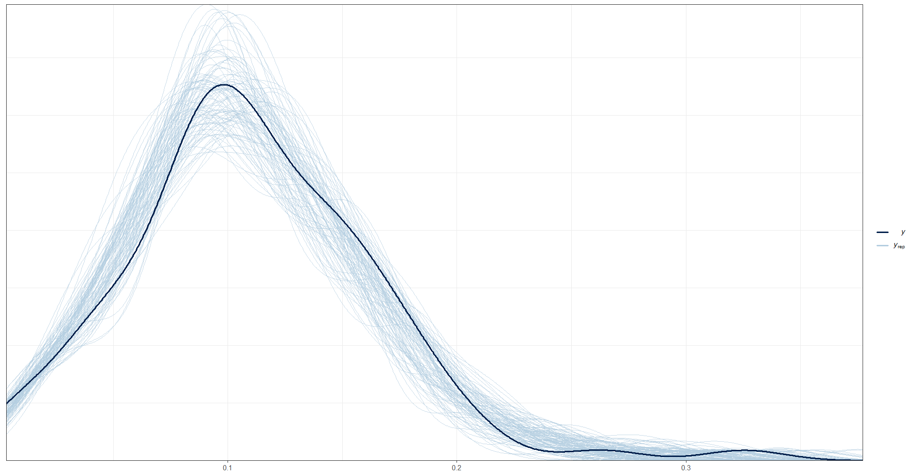
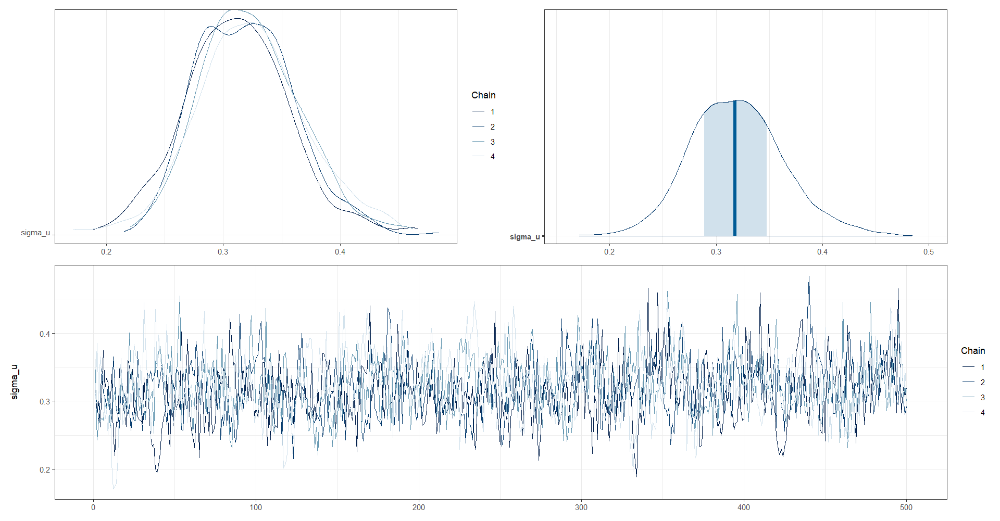
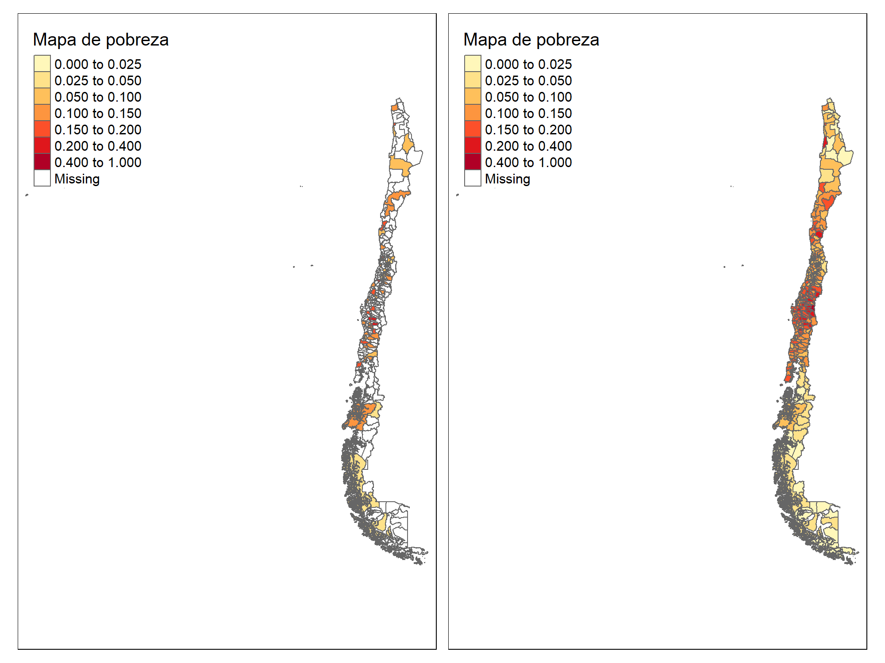

## Modelos de área con variable respuesta Binomial. 


El modelo lineal de Fay-Herriot puede ser reemplazado por un modelo mixto lineal generalizado (GLMM). Esto se puede hacer cuando los datos observados $Y_d$ son inherentemente discretos, como cuando son recuentos (no ponderados) de personas u hogares muestreados con ciertas características. Uno de estos modelos supone una distribución binomial para $Y_d$ con probabilidad de éxito $\theta_d$, y una logística modelo de regresión para $\theta_d$ con errores normales en la escala logit. El modelo resultante es


$$
\begin{eqnarray*}
Y_{d}\mid \theta_{d},n_{d} & \sim & Bin\left(n_{d},\theta_{d}\right)
\end{eqnarray*}
$$
para $d=1,\dots,D$ y 

$$
\begin{eqnarray*}
logit\left(\theta_{d}\right)=\log\left(\frac{\theta_{d}}{1-\theta_{d}}\right) & = & \boldsymbol{x}_{d}^{T}\boldsymbol{\beta}+u_{d}
\end{eqnarray*}
$$
donde $u_{d}\sim N\left(0,\sigma_{u}^{2}\right)$ y $n_{d}$ es el
tamaño de la muestra para el área $d$.

El modelo anterior se puede aplicar fácilmente a recuentos de muestras no ponderadas $Y_d$, pero esto ignora cualquier aspecto complejo del diseño de la encuesta. En muestras complejas donde las $Y_d$ son estimaciones ponderadas, surgen dos problemas. En primer lugar, los posibles valores de
el $Y_d$ no serán los números enteros $0, 1, \dots , n_d$ para cualquier definición directa de tamaño de muestra $n_d$. En su lugar, $Y_d$ tomará un valor de un conjunto finito de números desigualmente espaciados determinados por las ponderaciones de la encuesta que se aplican a los casos de muestra en el dominio  $d$. En segundo lugar, la varianza muestral de $Y_d$
implícito en la distribución Binomial, es decir,  $n_d \times \theta_d (1-\theta_d)$, será incorrecto. Abordamos estos dos problemas al definir un **tamaño de muestra efectivo** $\tilde{n}_d$, y un **número de muestra efectivo de éxitos** $\tilde{Y_d}$ determinó mantener: (i) la estimación directa  $\hat{\theta}_i$, de la pobreza y (ii) una estimación de la varianza de muestreo correspondiente,$\widehat{Var}(\hat{\theta}_d)$. 


Es posible suponer que 
$$
\begin{eqnarray*}
\tilde{n}_{d} & \sim & \frac{\check{\theta}_{d}\left(1-\check{\theta}_{d}\right)}{\widehat{Var}\left(\hat{\theta}_{d}\right)}
\end{eqnarray*}
$$
donde $\check{\theta}_{d}$ es una preliminar predicción basada en el modelo para la proporción poblacional $\theta_d$ y $\widehat{Var}\left(\hat{\theta}_{d}\right)$ depende de$\check{\theta}_{d}$ a través de una función de varianza generalizada ajustada (FGV). Note que $\tilde{Y}_{d}=\tilde{n}_{d}\times\hat{\theta}_{d}$. 

Suponga de las distribuciones previas para 
$\boldsymbol{\beta}$ y $\sigma_{u}^{2}$ son dadas por 
$$
\begin{eqnarray*}
\boldsymbol{\beta}	\sim	N\left(0,10000\right)\\
\sigma_{u}^{2}	\sim	IG\left(0.0001,0.0001\right)
\end{eqnarray*}
$$

### Procedimiento de estimación

Lectura de la base de datos que resultó en el paso anterior y selección de las columnas de interés

```r
library(tidyverse)
library(magrittr)

base_FH <- readRDS("Recursos/Día2/Sesion4/Data/base_FH_2017.rds") %>% 
  select(dam2, pobreza, n_eff_FGV)
```

Lectura de las covariables, las cuales son obtenidas previamente. Dado la diferencia entre las escalas de las variables  es necesario hacer un ajuste a estas. 


```r
statelevel_predictors_df <- readRDS("Recursos/Día2/Sesion4/Data/statelevel_predictors_df_dam2.rds") %>% 
    mutate_at(.vars = c("luces_nocturnas",
                      "cubrimiento_cultivo",
                      "cubrimiento_urbano",
                      "modificacion_humana",
                      "accesibilidad_hospitales",
                      "accesibilidad_hosp_caminado"),
            function(x) as.numeric(scale(x)))
```

Uniendo las dos bases de datos. 


```r
base_FH <- full_join(base_FH,statelevel_predictors_df, by = "dam2" )
tba(base_FH[,1:8] %>% head(10))
```

<table class="table table-striped lightable-classic" style="width: auto !important; margin-left: auto; margin-right: auto; font-family: Arial Narrow; width: auto !important; margin-left: auto; margin-right: auto;">
 <thead>
  <tr>
   <th style="text-align:left;"> dam2 </th>
   <th style="text-align:right;"> pobreza </th>
   <th style="text-align:right;"> n_eff_FGV </th>
   <th style="text-align:right;"> area0 </th>
   <th style="text-align:right;"> area1 </th>
   <th style="text-align:right;"> etnia2 </th>
   <th style="text-align:right;"> sexo2 </th>
   <th style="text-align:right;"> edad2 </th>
  </tr>
 </thead>
<tbody>
  <tr>
   <td style="text-align:left;"> 01101 </td>
   <td style="text-align:right;"> 0.0764 </td>
   <td style="text-align:right;"> 1579.7310 </td>
   <td style="text-align:right;"> 0.0126 </td>
   <td style="text-align:right;"> 0.9874 </td>
   <td style="text-align:right;"> 0.0016 </td>
   <td style="text-align:right;"> 0.5044 </td>
   <td style="text-align:right;"> 0.2374 </td>
  </tr>
  <tr>
   <td style="text-align:left;"> 01107 </td>
   <td style="text-align:right;"> 0.1624 </td>
   <td style="text-align:right;"> 698.9342 </td>
   <td style="text-align:right;"> 0.0230 </td>
   <td style="text-align:right;"> 0.9770 </td>
   <td style="text-align:right;"> 0.0011 </td>
   <td style="text-align:right;"> 0.4998 </td>
   <td style="text-align:right;"> 0.2723 </td>
  </tr>
  <tr>
   <td style="text-align:left;"> 02101 </td>
   <td style="text-align:right;"> 0.0905 </td>
   <td style="text-align:right;"> 597.6173 </td>
   <td style="text-align:right;"> 0.0215 </td>
   <td style="text-align:right;"> 0.9785 </td>
   <td style="text-align:right;"> 0.0010 </td>
   <td style="text-align:right;"> 0.4975 </td>
   <td style="text-align:right;"> 0.2610 </td>
  </tr>
  <tr>
   <td style="text-align:left;"> 02201 </td>
   <td style="text-align:right;"> 0.0772 </td>
   <td style="text-align:right;"> 153.6090 </td>
   <td style="text-align:right;"> 0.0437 </td>
   <td style="text-align:right;"> 0.9563 </td>
   <td style="text-align:right;"> 0.0004 </td>
   <td style="text-align:right;"> 0.4808 </td>
   <td style="text-align:right;"> 0.2399 </td>
  </tr>
  <tr>
   <td style="text-align:left;"> 03101 </td>
   <td style="text-align:right;"> 0.1011 </td>
   <td style="text-align:right;"> 617.7543 </td>
   <td style="text-align:right;"> 0.0193 </td>
   <td style="text-align:right;"> 0.9807 </td>
   <td style="text-align:right;"> 0.0006 </td>
   <td style="text-align:right;"> 0.5022 </td>
   <td style="text-align:right;"> 0.2449 </td>
  </tr>
  <tr>
   <td style="text-align:left;"> 03301 </td>
   <td style="text-align:right;"> 0.1106 </td>
   <td style="text-align:right;"> 213.9843 </td>
   <td style="text-align:right;"> 0.1136 </td>
   <td style="text-align:right;"> 0.8864 </td>
   <td style="text-align:right;"> 0.0004 </td>
   <td style="text-align:right;"> 0.5103 </td>
   <td style="text-align:right;"> 0.2077 </td>
  </tr>
  <tr>
   <td style="text-align:left;"> 04101 </td>
   <td style="text-align:right;"> 0.1710 </td>
   <td style="text-align:right;"> 304.0418 </td>
   <td style="text-align:right;"> 0.0923 </td>
   <td style="text-align:right;"> 0.9077 </td>
   <td style="text-align:right;"> 0.0004 </td>
   <td style="text-align:right;"> 0.5212 </td>
   <td style="text-align:right;"> 0.2507 </td>
  </tr>
  <tr>
   <td style="text-align:left;"> 04102 </td>
   <td style="text-align:right;"> 0.1930 </td>
   <td style="text-align:right;"> 251.5640 </td>
   <td style="text-align:right;"> 0.0579 </td>
   <td style="text-align:right;"> 0.9421 </td>
   <td style="text-align:right;"> 0.0003 </td>
   <td style="text-align:right;"> 0.5175 </td>
   <td style="text-align:right;"> 0.2369 </td>
  </tr>
  <tr>
   <td style="text-align:left;"> 04203 </td>
   <td style="text-align:right;"> 0.1004 </td>
   <td style="text-align:right;"> 170.9489 </td>
   <td style="text-align:right;"> 0.2005 </td>
   <td style="text-align:right;"> 0.7995 </td>
   <td style="text-align:right;"> 0.0003 </td>
   <td style="text-align:right;"> 0.4827 </td>
   <td style="text-align:right;"> 0.2003 </td>
  </tr>
  <tr>
   <td style="text-align:left;"> 04301 </td>
   <td style="text-align:right;"> 0.0902 </td>
   <td style="text-align:right;"> 129.4378 </td>
   <td style="text-align:right;"> 0.2133 </td>
   <td style="text-align:right;"> 0.7867 </td>
   <td style="text-align:right;"> 0.0001 </td>
   <td style="text-align:right;"> 0.5181 </td>
   <td style="text-align:right;"> 0.2199 </td>
  </tr>
</tbody>
</table>

Seleccionando las covariables para el modelo. 


```r
names_cov <- c(
  "sexo2" ,
  "anoest2" ,
  "anoest3",
  "anoest4",
  "edad2" ,
  "edad3" ,
  "edad4" ,
  "edad5" ,
  "etnia1",
  "etnia2" ,
  "tasa_desocupacion" ,
  "luces_nocturnas" ,
  "cubrimiento_cultivo" ,
  "alfabeta",
  "pollution_CO",
  "vegetation_NDVI",
  "Elevation",
  "precipitation",
  "population_density"
)
```

### Preparando los insumos para `STAN`

  1.    Dividir la base de datos en dominios observados y no observados

Dominios observados.

```r
data_dir <- base_FH %>% filter(!is.na(pobreza))
```

Dominios NO observados.

```r
data_syn <-
  base_FH %>% anti_join(data_dir %>% select(dam2))
tba(data_syn[1:10,1:8])
```

<table class="table table-striped lightable-classic" style="width: auto !important; margin-left: auto; margin-right: auto; font-family: Arial Narrow; width: auto !important; margin-left: auto; margin-right: auto;">
 <thead>
  <tr>
   <th style="text-align:left;"> dam2 </th>
   <th style="text-align:right;"> pobreza </th>
   <th style="text-align:right;"> n_eff_FGV </th>
   <th style="text-align:right;"> area0 </th>
   <th style="text-align:right;"> area1 </th>
   <th style="text-align:right;"> etnia2 </th>
   <th style="text-align:right;"> sexo2 </th>
   <th style="text-align:right;"> edad2 </th>
  </tr>
 </thead>
<tbody>
  <tr>
   <td style="text-align:left;"> 01401 </td>
   <td style="text-align:right;"> NA </td>
   <td style="text-align:right;"> NA </td>
   <td style="text-align:right;"> 0.3575 </td>
   <td style="text-align:right;"> 0.6425 </td>
   <td style="text-align:right;"> 0.0004 </td>
   <td style="text-align:right;"> 0.4280 </td>
   <td style="text-align:right;"> 0.2539 </td>
  </tr>
  <tr>
   <td style="text-align:left;"> 01402 </td>
   <td style="text-align:right;"> NA </td>
   <td style="text-align:right;"> NA </td>
   <td style="text-align:right;"> 1.0000 </td>
   <td style="text-align:right;"> 0.0000 </td>
   <td style="text-align:right;"> 0.0000 </td>
   <td style="text-align:right;"> 0.4744 </td>
   <td style="text-align:right;"> 0.2064 </td>
  </tr>
  <tr>
   <td style="text-align:left;"> 01403 </td>
   <td style="text-align:right;"> NA </td>
   <td style="text-align:right;"> NA </td>
   <td style="text-align:right;"> 1.0000 </td>
   <td style="text-align:right;"> 0.0000 </td>
   <td style="text-align:right;"> 0.0006 </td>
   <td style="text-align:right;"> 0.4242 </td>
   <td style="text-align:right;"> 0.2685 </td>
  </tr>
  <tr>
   <td style="text-align:left;"> 01404 </td>
   <td style="text-align:right;"> NA </td>
   <td style="text-align:right;"> NA </td>
   <td style="text-align:right;"> 0.5938 </td>
   <td style="text-align:right;"> 0.4062 </td>
   <td style="text-align:right;"> 0.0011 </td>
   <td style="text-align:right;"> 0.4502 </td>
   <td style="text-align:right;"> 0.1967 </td>
  </tr>
  <tr>
   <td style="text-align:left;"> 01405 </td>
   <td style="text-align:right;"> NA </td>
   <td style="text-align:right;"> NA </td>
   <td style="text-align:right;"> 0.5792 </td>
   <td style="text-align:right;"> 0.4208 </td>
   <td style="text-align:right;"> 0.0016 </td>
   <td style="text-align:right;"> 0.2954 </td>
   <td style="text-align:right;"> 0.1962 </td>
  </tr>
  <tr>
   <td style="text-align:left;"> 02102 </td>
   <td style="text-align:right;"> NA </td>
   <td style="text-align:right;"> NA </td>
   <td style="text-align:right;"> 0.0381 </td>
   <td style="text-align:right;"> 0.9619 </td>
   <td style="text-align:right;"> 0.0008 </td>
   <td style="text-align:right;"> 0.4034 </td>
   <td style="text-align:right;"> 0.2467 </td>
  </tr>
  <tr>
   <td style="text-align:left;"> 02103 </td>
   <td style="text-align:right;"> NA </td>
   <td style="text-align:right;"> NA </td>
   <td style="text-align:right;"> 1.0000 </td>
   <td style="text-align:right;"> 0.0000 </td>
   <td style="text-align:right;"> 0.0014 </td>
   <td style="text-align:right;"> 0.1496 </td>
   <td style="text-align:right;"> 0.2073 </td>
  </tr>
  <tr>
   <td style="text-align:left;"> 02104 </td>
   <td style="text-align:right;"> NA </td>
   <td style="text-align:right;"> NA </td>
   <td style="text-align:right;"> 0.1648 </td>
   <td style="text-align:right;"> 0.8352 </td>
   <td style="text-align:right;"> 0.0002 </td>
   <td style="text-align:right;"> 0.4382 </td>
   <td style="text-align:right;"> 0.2078 </td>
  </tr>
  <tr>
   <td style="text-align:left;"> 02202 </td>
   <td style="text-align:right;"> NA </td>
   <td style="text-align:right;"> NA </td>
   <td style="text-align:right;"> 1.0000 </td>
   <td style="text-align:right;"> 0.0000 </td>
   <td style="text-align:right;"> 0.0000 </td>
   <td style="text-align:right;"> 0.3551 </td>
   <td style="text-align:right;"> 0.2118 </td>
  </tr>
  <tr>
   <td style="text-align:left;"> 02203 </td>
   <td style="text-align:right;"> NA </td>
   <td style="text-align:right;"> NA </td>
   <td style="text-align:right;"> 0.4976 </td>
   <td style="text-align:right;"> 0.5024 </td>
   <td style="text-align:right;"> 0.0010 </td>
   <td style="text-align:right;"> 0.4397 </td>
   <td style="text-align:right;"> 0.2510 </td>
  </tr>
</tbody>
</table>

  2.    Definir matriz de efectos fijos.


```r
## Dominios observados
Xdat <- data_dir[,names_cov]

## Dominios no observados
Xs <- data_syn[,names_cov]
```

  3.    Obteniendo el tamaño de muestra efectivo  $\tilde{n}_d$, y el número de muestra efectivo de éxitos $\tilde{Y_d}$


```r
n_effec = round(data_dir$n_eff_FGV)
y_effect  = round((data_dir$pobreza)*n_effec)
```

  4.    Creando lista de parámetros para `STAN`


```r
sample_data <- list(
  N1 = nrow(Xdat),   # Observados.
  N2 = nrow(Xs),   # NO Observados.
  p  = ncol(Xdat),       # Número de regresores.
  X  = as.matrix(Xdat),  # Covariables Observados.
  Xs = as.matrix(Xs),    # Covariables NO Observados
  n_effec = n_effec,
  y_effect  = y_effect          # Estimación directa. 
)
```

  5.    Compilando el modelo en `STAN`

```r
library(rstan)
fit_FH_binomial <- "Recursos/Día2/Sesion4/Data/modelosStan/14FH_binomial.stan"
rstan::rstan_options(auto_write = TRUE) # speed up running time 
options(mc.cores = parallel::detectCores())
model_FH_Binomial <- stan(
  file = fit_FH_binomial,  
  data = sample_data,   
  verbose = FALSE,
  warmup = 500,         
  iter = 1000,            
  cores = 4              
)
saveRDS(model_FH_Binomial, file = "Recursos/Día2/Sesion4/Data/model_FH_Binomial.rds")
```

Leer el modelo


```r
model_FH_Binomial <- readRDS("Recursos/Día2/Sesion4/Data/model_FH_Binomial.rds")
```

#### Resultados del modelo para los dominios observados. 

En este código, se cargan las librerías `bayesplot`, `posterior` y `patchwork`, que se utilizan para realizar gráficos y visualizaciones de los resultados del modelo.

A continuación, se utiliza la función `as.array()` y `as_draws_matrix()` para extraer las muestras de la distribución posterior del parámetro `theta` del modelo, y se seleccionan aleatoriamente 100 filas de estas muestras utilizando la función `sample()`, lo que resulta en la matriz `y_pred2.`

Finalmente, se utiliza la función `ppc_dens_overlay()` de `bayesplot` para graficar una comparación entre la distribución empírica de la variable observada pobreza en los datos (`data_dir$pobreza`) y las distribuciones predictivas posteriores simuladas para la misma variable (`y_pred2`). La función `ppc_dens_overlay()` produce un gráfico de densidad para ambas distribuciones, lo que permite visualizar cómo se comparan.

```r
library(bayesplot)
library(patchwork)
library(posterior)

y_pred_B <- as.array(model_FH_Binomial, pars = "theta") %>% 
  as_draws_matrix()
rowsrandom <- sample(nrow(y_pred_B), 100)
y_pred2 <- y_pred_B[rowsrandom, ]
ppc_dens_overlay(y = as.numeric(data_dir$pobreza), y_pred2)
```





Análisis gráfico de la convergencia de las cadenas de $\sigma_u$. 


```r
posterior_sigma_u <- as.array(model_FH_Binomial, pars = "sigma_u")
(mcmc_dens_chains(posterior_sigma_u) +
    mcmc_areas(posterior_sigma_u) ) / 
  mcmc_trace(posterior_sigma_u)
```




Estimación del FH de la pobreza en los dominios observados. 


```r
theta_FH <- summary(model_FH_Binomial,pars =  "theta")$summary %>%
  data.frame()
data_dir %<>% mutate(pred_binomial = theta_FH$mean, 
                     pred_binomial_EE = theta_FH$sd,
                     Cv_pred = pred_binomial_EE/pred_binomial)
```

Estimación del FH de la pobreza en los dominios NO observados. 


```r
theta_FH_pred <- summary(model_FH_Binomial,pars =  "thetaLP")$summary %>%
  data.frame()
data_syn <- data_syn %>% 
  mutate(pred_binomial = theta_FH_pred$mean,
         pred_binomial_EE = theta_FH_pred$sd,
         Cv_pred = pred_binomial_EE/pred_binomial)
```

#### Mapa de pobreza

El mapa muestra el nivel de pobreza en diferentes áreas de Colombia, basado en dos variables, `pobreza` y `pred_binomial`.

Primero, se cargan los paquetes necesarios `sp`, `sf` y `tmap.` Luego, se lee la información de los datos en R y se combinan utilizando la función `rbind()`.


```r
library(sp)
library(sf)
library(tmap)

data_map <- rbind(data_dir, data_syn) %>% 
  select(dam2, pobreza, pred_binomial, pred_binomial_EE,Cv_pred ) 


## Leer Shapefile del país
ShapeSAE <- read_sf("Recursos/Día2/Sesion4/Shape/CHL_dam2.shp") 

mapa <- tm_shape(ShapeSAE %>%
                   left_join(data_map,  by = "dam2"))

brks_lp <- c(0,0.025,0.05, 0.1, 0.15, 0.2,0.4, 1)
tmap_options(check.and.fix = TRUE)
Mapa_lp <-
  mapa + tm_polygons(
    c("pobreza", "pred_binomial"),
    breaks = brks_lp,
    title = "Mapa de pobreza",
    palette = "YlOrRd",
    colorNA = "white"
  ) + tm_layout(asp = 1.5)

Mapa_lp
```



#### Mapa del coeficiente de variación.

Ahora, se crea un segundo mapa temático (tmap) llamado Mapa_cv. Utiliza la misma estructura del primer mapa (mapa) creado anteriormente y agrega una capa utilizando la función tm_polygons(). El mapa representa la variable Cv_pred, utilizando una paleta de colores llamada “YlOrRd” y establece el título del mapa con el parámetro title. La función tm_layout() establece algunos parámetros de diseño del mapa, como la relación de aspecto (asp). Finalmente, el mapa Mapa_cv se muestra en la consola de R.


```r
Mapa_cv <-
  mapa + tm_polygons(
    c("Cv_pred"),
     title = "Mapa de pobreza(cv)",
    palette = "YlOrRd",
    colorNA = "white"
  ) + tm_layout(asp = 2.5)

Mapa_cv
```

**NOTA:** Dado que la estimación del modelo y  el error de estimación son pequeño, entonces, el coeficiente de variación no es una buena medida de la calidad de la estimación.  


