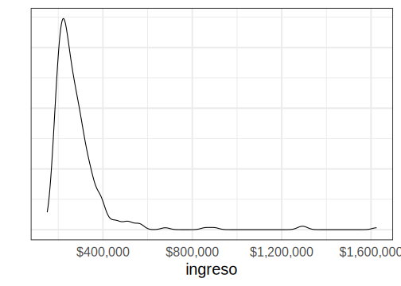
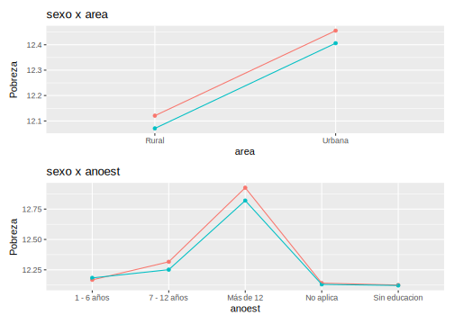
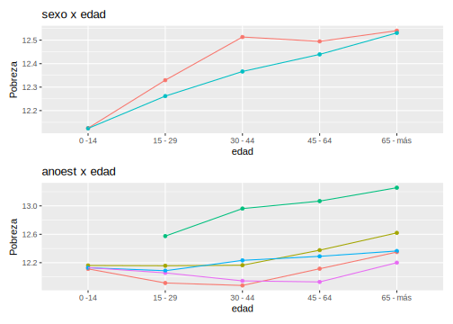

# Día 3 - Sesión 1- Modelo de unidad para la estimación del ingreso medio


Uno de los primeros problemas a los que debemos enfrentarnos es la estimación del ingreso medio, la cual en una variable no simétrica que toma valores en los positivos. Sin embargo, empleando los métodos Bayesiano es posible obtener estimaciones de esta sin realizar una transformación 

<div class="figure">

<p class="caption">(\#fig:unnamed-chunk-1)Distribución del ingreso medio por dam2</p>
</div>


#### Obejtivo {-}

Estimar el ingreso medio de las personas, es decir, 
$$
\bar{Y}_d = \frac{\sum_{U_d}y_{di}}{N_d}
$$
donde $y_{di}$ es el ingreso de cada personas

Note que, 

$$
\begin{equation*}
\bar{Y}_d =  \frac{\sum_{s_d}y_{di} + \sum_{s^c_d}y_{di}}{N_d} 
\end{equation*}
$$

Ahora, el estimador de $\bar{Y}$ esta dado por: 

$$
\hat{\bar{Y}}_d = \frac{\sum_{s_d}y_{di} + \sum_{s^c_d}\hat{y}_{di}}{N_d}
$$

donde

$$\hat{y}_{di}=E_{\mathscr{M}}\left(y_{di}\mid\boldsymbol{x}_{d},\boldsymbol{\beta}\right)$$,

donde $\mathscr{M}$ hace referencia a la medida de probabilidad inducida por el modelamiento. 
De esta forma se tiene que, 

$$
\hat{\bar{Y}}_d = \frac{\sum_{U_{d}}\hat{y}_{di}}{N_d}
$$


## Modelo bayesiano.

Para realizar la predicción del ingreso medio en dam2 no observadas se asume que: 

$$
\begin{eqnarray*}
Y_{di} &\sim & N\left(\mu_{di},\sigma_e^{2}\right)\\
\mu_{di}&=&\boldsymbol{x}_{di}^{T}\boldsymbol{\beta}+u_{d}+e_{di} 
\end{eqnarray*}
$$


Donde $Y_{di}$ representa el ingreso medio de la $i-ésima$ persona en el $d-ésimo$ domino, $\boldsymbol{X}$ es la información disponible para la $i-ésima$ persona del $d-ésimo$ domino, $\boldsymbol{\beta}$ es el vector de parámetros $u_d$ es el efecto introducido por el $d-ésimo$ dominio y $e_{di}$ es el error de estimación para la $i-ésima$ personas del $d-ésimo$ dominio.

Note, que $u_{d}\sim N\left(0,\sigma^2_{u}\right)$ y $e_{di}\sim N\left(0,\sigma_{e}^{2}\right)$.

Para este caso se asumen las distribuciones previas

$$
\begin{eqnarray*}
\beta_k & \sim   & N(0, 1000)\\
\sigma^2_y &\sim & IG(0.0001,0.0001)
\end{eqnarray*}
$$ las cuales se toman no informativas.

A continuación se muestra el proceso realizado para la obtención de la predicción del ingreso medio en dominios no observados.

## Proceso de estimación en `R`

Para desarrollar la metodología se hace uso de las siguientes librerías.


```r
# Interprete de STAN en R
library(rstan)
library(rstanarm)
# Manejo de bases de datos.
library(tidyverse)
# Gráficas de los modelos. 
library(bayesplot)
library(patchwork)
# Organizar la presentación de las tablas
library(kableExtra)
library(printr)
```

Un conjunto de funciones desarrolladas para realizar de forma simplificada los procesos están consignadas en la siguiente rutina.


```r
source("Recursos/Día3/Sesion1/0Recursos/funciones_mrp.R")
```

Entre las funciones incluidas en el archivo encuentra

-   *plot_interaction*: Esta crea un diagrama de lineas donde se estudia la interacción entre las variables, en el caso de presentar un traslape de las lineas se recomienda incluir el interacción en el modelo.

-   *Plot_Compare* Puesto que es necesario realizar una homologar la información del censo y la encuesta es conveniente llevar a cabo una validación de las variables que han sido homologadas, por tanto, se espera que las proporciones resultantes del censo y la encuesta estén cercanas entre sí.

-   *Aux_Agregado*: Esta es función permite obtener estimaciones a diferentes niveles de agregación, toma mucha relevancia cuando se realiza un proceso repetitivo.

**Las funciones están diseñada específicamente  para este  proceso**

### Encuesta de hogares

Los datos empleados en esta ocasión corresponden a la ultima encuesta de hogares, la cual ha sido estandarizada por *CEPAL* y se encuentra disponible en *BADEHOG*


```r
encuesta <- readRDS("Recursos/Día3/Sesion1/Data/encuesta2017CHL.Rds")

encuesta_mrp <- encuesta %>% 
  transmute(
    dam =  haven::as_factor(dam_ee ,levels = "values"),
    dam2 =  haven::as_factor(comuna,levels = "values"),
    dam = str_pad(dam, width = 2, pad = "0"),
    dam2 = str_pad(dam2, width = 5, pad = "0"), 
    upm = `_upm`,
    estrato = `_estrato`,
  ingreso = ingcorte,lp,li,
    logingreso = log(ingcorte + 1),
  area = case_when(area_ee == 1 ~ "1", TRUE ~ "0"),
  sexo = as.character(sexo),

  anoest = case_when(
    edad < 6 | is.na(anoest)   ~ "98"  , #No aplica
    anoest == 99 ~ "99", #NS/NR
    anoest == 0  ~ "1", # Sin educacion
    anoest %in% c(1:6) ~ "2",       # 1 - 6
    anoest %in% c(7:12) ~ "3",      # 7 - 12
    anoest > 12 ~ "4",      # mas de 12
    TRUE ~ "Error"  ),

  edad = case_when(
    edad < 15 ~ "1",
    edad < 30 ~ "2",
    edad < 45 ~ "3",
    edad < 65 ~ "4",
    TRUE ~ "5"),

  etnia = case_when(
    etnia_ee == 1 ~ "1", # Indigena
    etnia_ee == 2 ~ "2",
     TRUE ~ "3"), # Otro
 fep = `_feh`
) 

tba(encuesta_mrp %>% head(10)) 
```

<table class="table table-striped lightable-classic" style="width: auto !important; margin-left: auto; margin-right: auto; font-family: Arial Narrow; width: auto !important; margin-left: auto; margin-right: auto;">
 <thead>
  <tr>
   <th style="text-align:left;"> dam </th>
   <th style="text-align:left;"> dam2 </th>
   <th style="text-align:right;"> upm </th>
   <th style="text-align:right;"> estrato </th>
   <th style="text-align:right;"> ingreso </th>
   <th style="text-align:right;"> lp </th>
   <th style="text-align:right;"> li </th>
   <th style="text-align:right;"> logingreso </th>
   <th style="text-align:left;"> area </th>
   <th style="text-align:left;"> sexo </th>
   <th style="text-align:left;"> anoest </th>
   <th style="text-align:left;"> edad </th>
   <th style="text-align:left;"> etnia </th>
   <th style="text-align:right;"> fep </th>
  </tr>
 </thead>
<tbody>
  <tr>
   <td style="text-align:left;"> 01 </td>
   <td style="text-align:left;"> 01101 </td>
   <td style="text-align:right;"> 1100100001 </td>
   <td style="text-align:right;"> 11001 </td>
   <td style="text-align:right;"> 250000.0 </td>
   <td style="text-align:right;"> 113958 </td>
   <td style="text-align:right;"> 51309 </td>
   <td style="text-align:right;"> 12.4292 </td>
   <td style="text-align:left;"> 1 </td>
   <td style="text-align:left;"> 2 </td>
   <td style="text-align:left;"> 3 </td>
   <td style="text-align:left;"> 4 </td>
   <td style="text-align:left;"> 1 </td>
   <td style="text-align:right;"> 39 </td>
  </tr>
  <tr>
   <td style="text-align:left;"> 01 </td>
   <td style="text-align:left;"> 01101 </td>
   <td style="text-align:right;"> 1100100001 </td>
   <td style="text-align:right;"> 11001 </td>
   <td style="text-align:right;"> 211091.0 </td>
   <td style="text-align:right;"> 113958 </td>
   <td style="text-align:right;"> 51309 </td>
   <td style="text-align:right;"> 12.2600 </td>
   <td style="text-align:left;"> 1 </td>
   <td style="text-align:left;"> 2 </td>
   <td style="text-align:left;"> 3 </td>
   <td style="text-align:left;"> 2 </td>
   <td style="text-align:left;"> 3 </td>
   <td style="text-align:right;"> 39 </td>
  </tr>
  <tr>
   <td style="text-align:left;"> 01 </td>
   <td style="text-align:left;"> 01101 </td>
   <td style="text-align:right;"> 1100100001 </td>
   <td style="text-align:right;"> 11001 </td>
   <td style="text-align:right;"> 296750.0 </td>
   <td style="text-align:right;"> 113958 </td>
   <td style="text-align:right;"> 51309 </td>
   <td style="text-align:right;"> 12.6006 </td>
   <td style="text-align:left;"> 1 </td>
   <td style="text-align:left;"> 1 </td>
   <td style="text-align:left;"> 3 </td>
   <td style="text-align:left;"> 2 </td>
   <td style="text-align:left;"> 3 </td>
   <td style="text-align:right;"> 39 </td>
  </tr>
  <tr>
   <td style="text-align:left;"> 01 </td>
   <td style="text-align:left;"> 01101 </td>
   <td style="text-align:right;"> 1100100001 </td>
   <td style="text-align:right;"> 11001 </td>
   <td style="text-align:right;"> 296750.0 </td>
   <td style="text-align:right;"> 113958 </td>
   <td style="text-align:right;"> 51309 </td>
   <td style="text-align:right;"> 12.6006 </td>
   <td style="text-align:left;"> 1 </td>
   <td style="text-align:left;"> 1 </td>
   <td style="text-align:left;"> 3 </td>
   <td style="text-align:left;"> 2 </td>
   <td style="text-align:left;"> 3 </td>
   <td style="text-align:right;"> 39 </td>
  </tr>
  <tr>
   <td style="text-align:left;"> 01 </td>
   <td style="text-align:left;"> 01101 </td>
   <td style="text-align:right;"> 1100100001 </td>
   <td style="text-align:right;"> 11001 </td>
   <td style="text-align:right;"> 113889.0 </td>
   <td style="text-align:right;"> 113958 </td>
   <td style="text-align:right;"> 51309 </td>
   <td style="text-align:right;"> 11.6430 </td>
   <td style="text-align:left;"> 1 </td>
   <td style="text-align:left;"> 1 </td>
   <td style="text-align:left;"> 4 </td>
   <td style="text-align:left;"> 2 </td>
   <td style="text-align:left;"> 3 </td>
   <td style="text-align:right;"> 39 </td>
  </tr>
  <tr>
   <td style="text-align:left;"> 01 </td>
   <td style="text-align:left;"> 01101 </td>
   <td style="text-align:right;"> 1100100001 </td>
   <td style="text-align:right;"> 11001 </td>
   <td style="text-align:right;"> 113889.0 </td>
   <td style="text-align:right;"> 113958 </td>
   <td style="text-align:right;"> 51309 </td>
   <td style="text-align:right;"> 11.6430 </td>
   <td style="text-align:left;"> 1 </td>
   <td style="text-align:left;"> 2 </td>
   <td style="text-align:left;"> 4 </td>
   <td style="text-align:left;"> 2 </td>
   <td style="text-align:left;"> 3 </td>
   <td style="text-align:right;"> 39 </td>
  </tr>
  <tr>
   <td style="text-align:left;"> 01 </td>
   <td style="text-align:left;"> 01101 </td>
   <td style="text-align:right;"> 1100100001 </td>
   <td style="text-align:right;"> 11001 </td>
   <td style="text-align:right;"> 113889.0 </td>
   <td style="text-align:right;"> 113958 </td>
   <td style="text-align:right;"> 51309 </td>
   <td style="text-align:right;"> 11.6430 </td>
   <td style="text-align:left;"> 1 </td>
   <td style="text-align:left;"> 2 </td>
   <td style="text-align:left;"> 98 </td>
   <td style="text-align:left;"> 1 </td>
   <td style="text-align:left;"> 3 </td>
   <td style="text-align:right;"> 39 </td>
  </tr>
  <tr>
   <td style="text-align:left;"> 01 </td>
   <td style="text-align:left;"> 01101 </td>
   <td style="text-align:right;"> 1100100001 </td>
   <td style="text-align:right;"> 11001 </td>
   <td style="text-align:right;"> 231666.5 </td>
   <td style="text-align:right;"> 113958 </td>
   <td style="text-align:right;"> 51309 </td>
   <td style="text-align:right;"> 12.3531 </td>
   <td style="text-align:left;"> 1 </td>
   <td style="text-align:left;"> 2 </td>
   <td style="text-align:left;"> 3 </td>
   <td style="text-align:left;"> 4 </td>
   <td style="text-align:left;"> 3 </td>
   <td style="text-align:right;"> 39 </td>
  </tr>
  <tr>
   <td style="text-align:left;"> 01 </td>
   <td style="text-align:left;"> 01101 </td>
   <td style="text-align:right;"> 1100100001 </td>
   <td style="text-align:right;"> 11001 </td>
   <td style="text-align:right;"> 231666.5 </td>
   <td style="text-align:right;"> 113958 </td>
   <td style="text-align:right;"> 51309 </td>
   <td style="text-align:right;"> 12.3531 </td>
   <td style="text-align:left;"> 1 </td>
   <td style="text-align:left;"> 2 </td>
   <td style="text-align:left;"> 3 </td>
   <td style="text-align:left;"> 3 </td>
   <td style="text-align:left;"> 3 </td>
   <td style="text-align:right;"> 39 </td>
  </tr>
  <tr>
   <td style="text-align:left;"> 01 </td>
   <td style="text-align:left;"> 01101 </td>
   <td style="text-align:right;"> 1100100001 </td>
   <td style="text-align:right;"> 11001 </td>
   <td style="text-align:right;"> 418750.0 </td>
   <td style="text-align:right;"> 113958 </td>
   <td style="text-align:right;"> 51309 </td>
   <td style="text-align:right;"> 12.9450 </td>
   <td style="text-align:left;"> 1 </td>
   <td style="text-align:left;"> 2 </td>
   <td style="text-align:left;"> 3 </td>
   <td style="text-align:left;"> 4 </td>
   <td style="text-align:left;"> 3 </td>
   <td style="text-align:right;"> 39 </td>
  </tr>
</tbody>
</table>

La base de datos de la encuesta tiene la siguientes columnas: 

-   *dam*: Corresponde al código asignado a la división administrativa mayor del país.

-   *dam2*: Corresponde al código asignado a la segunda división administrativa del país.

-   *lp* y *li* lineas de pobreza y pobreza extrema definidas por CEPAL. 

-   *área* división geográfica (Urbano y Rural). 

-   *sexo* Hombre y Mujer. 

-   *etnia* En estas variable se definen tres grupos:  afrodescendientes, indígenas y Otros. 

-   *anoest* Años de escolaridad  

-   *edad* Rangos de edad 

-   *fep* Factor de expansión por persona


## Validación de encuesta frente al censo.


```r
library(survey)
library(srvyr)
library(patchwork)
censo_dam2 <- readRDS("Recursos/Día3/Sesion1/Data/censo_dam2.rds")

p1_dam <- Plot_Compare(dat_encuesta = encuesta_mrp,
             dat_censo = censo_dam2,
             by = "dam")
p1_anotes <- Plot_Compare(dat_encuesta = encuesta_mrp,
             dat_censo = censo_dam2,
             by = "anoest")
p1_edad <- Plot_Compare(dat_encuesta = encuesta_mrp,
             dat_censo = censo_dam2,
             by = "edad")
p1 <- (p1_dam)/(p1_anotes + p1_edad)

# ggsave(plot = p1,
#        filename = "Recursos/Día3/Sesion1/0Recursos/Bernoulli/plot_comp.png",
#        scale = 2)
```


Evaluando interacciones en la encuesta 


```r
encuesta_mrp$pobreza <- encuesta_mrp$logingreso
(plot_interaction(dat_encuesta = encuesta_mrp, by = "sexo",by2 = "area")/
plot_interaction(dat_encuesta = encuesta_mrp, by = "sexo",by2 = "anoest"))
```




```r
(plot_interaction(dat_encuesta = encuesta_mrp, by = "sexo",by2 = "edad")/
plot_interaction(dat_encuesta = encuesta_mrp, by = "anoest",by2 = "edad")
)
```




Ahora, inspeccionamos el comportamiento de la variable de interés: 


```r
media <- mean(encuesta_mrp$logingreso)
Sd <- sd(encuesta_mrp$logingreso)

ggplot(data = encuesta_mrp, aes(x = logingreso)) +
  geom_density(size =2, color = "blue") + labs(y = "") +
  stat_function(fun = dnorm, 
                args = list(mean = media, sd = Sd),
                size =2) +
  theme_bw(base_size = 20) +
  theme(axis.text.y = element_blank(),
        axis.ticks = element_blank())
```

<div class="figure">

<p class="caption">(\#fig:unnamed-chunk-9)Distribuición del ingreso de las personas encuestadas</p>
</div>


La información auxiliar disponible ha sido extraída del censo  e imágenes satelitales


```r
statelevel_predictors_df <-
  readRDS("Recursos/Día3/Sesion1/Data/statelevel_predictors_df_dam2.rds") %>% 
    mutate_at(.vars = c("luces_nocturnas",
                      "cubrimiento_cultivo",
                      "cubrimiento_urbano",
                      "modificacion_humana",
                      "accesibilidad_hospitales",
                      "accesibilidad_hosp_caminado"),
            function(x) as.numeric(scale(x)))
tba(statelevel_predictors_df  %>%  head(10))
```

<table class="table table-striped lightable-classic" style="width: auto !important; margin-left: auto; margin-right: auto; font-family: Arial Narrow; width: auto !important; margin-left: auto; margin-right: auto;">
 <thead>
  <tr>
   <th style="text-align:left;"> dam2 </th>
   <th style="text-align:right;"> area0 </th>
   <th style="text-align:right;"> area1 </th>
   <th style="text-align:right;"> etnia2 </th>
   <th style="text-align:right;"> sexo2 </th>
   <th style="text-align:right;"> edad2 </th>
   <th style="text-align:right;"> edad3 </th>
   <th style="text-align:right;"> edad4 </th>
   <th style="text-align:right;"> edad5 </th>
   <th style="text-align:right;"> anoest2 </th>
   <th style="text-align:right;"> anoest3 </th>
   <th style="text-align:right;"> anoest4 </th>
   <th style="text-align:right;"> anoest99 </th>
   <th style="text-align:right;"> etnia1 </th>
   <th style="text-align:right;"> piso_tierra </th>
   <th style="text-align:right;"> material_paredes </th>
   <th style="text-align:right;"> material_techo </th>
   <th style="text-align:right;"> rezago_escolar </th>
   <th style="text-align:right;"> alfabeta </th>
   <th style="text-align:right;"> tasa_desocupacion </th>
   <th style="text-align:right;"> pollution_CO </th>
   <th style="text-align:right;"> vegetation_NDVI </th>
   <th style="text-align:right;"> Elevation </th>
   <th style="text-align:right;"> temperature_ECMWF </th>
   <th style="text-align:right;"> temperature_2metros </th>
   <th style="text-align:right;"> total_precipitation </th>
   <th style="text-align:right;"> precipitation </th>
   <th style="text-align:right;"> population_density </th>
   <th style="text-align:right;"> luces_nocturnas </th>
   <th style="text-align:right;"> cubrimiento_cultivo </th>
   <th style="text-align:right;"> cubrimiento_urbano </th>
   <th style="text-align:right;"> modificacion_humana </th>
   <th style="text-align:right;"> accesibilidad_hospitales </th>
   <th style="text-align:right;"> accesibilidad_hosp_caminado </th>
  </tr>
 </thead>
<tbody>
  <tr>
   <td style="text-align:left;"> 01101 </td>
   <td style="text-align:right;"> 0.0126 </td>
   <td style="text-align:right;"> 0.9874 </td>
   <td style="text-align:right;"> 0.0016 </td>
   <td style="text-align:right;"> 0.5044 </td>
   <td style="text-align:right;"> 0.2374 </td>
   <td style="text-align:right;"> 0.2338 </td>
   <td style="text-align:right;"> 0.2242 </td>
   <td style="text-align:right;"> 0.0926 </td>
   <td style="text-align:right;"> 0.1360 </td>
   <td style="text-align:right;"> 0.4547 </td>
   <td style="text-align:right;"> 0.2711 </td>
   <td style="text-align:right;"> 0.0245 </td>
   <td style="text-align:right;"> 0.1709 </td>
   <td style="text-align:right;"> 0.0051 </td>
   <td style="text-align:right;"> 0.2133 </td>
   <td style="text-align:right;"> 0.5059 </td>
   <td style="text-align:right;"> 0.3940 </td>
   <td style="text-align:right;"> 0.0285 </td>
   <td style="text-align:right;"> 0.0703 </td>
   <td style="text-align:right;"> 0.0229 </td>
   <td style="text-align:right;"> -1.7713 </td>
   <td style="text-align:right;"> -0.0492 </td>
   <td style="text-align:right;"> 2.0871 </td>
   <td style="text-align:right;"> 1.3892 </td>
   <td style="text-align:right;"> 0e+00 </td>
   <td style="text-align:right;"> 0.0057 </td>
   <td style="text-align:right;"> -0.3101 </td>
   <td style="text-align:right;"> -0.4713 </td>
   <td style="text-align:right;"> -0.9633 </td>
   <td style="text-align:right;"> -0.3591 </td>
   <td style="text-align:right;"> -0.6911 </td>
   <td style="text-align:right;"> 0.0238 </td>
   <td style="text-align:right;"> 0.0469 </td>
  </tr>
  <tr>
   <td style="text-align:left;"> 01107 </td>
   <td style="text-align:right;"> 0.0230 </td>
   <td style="text-align:right;"> 0.9770 </td>
   <td style="text-align:right;"> 0.0011 </td>
   <td style="text-align:right;"> 0.4998 </td>
   <td style="text-align:right;"> 0.2723 </td>
   <td style="text-align:right;"> 0.2157 </td>
   <td style="text-align:right;"> 0.1863 </td>
   <td style="text-align:right;"> 0.0426 </td>
   <td style="text-align:right;"> 0.1856 </td>
   <td style="text-align:right;"> 0.5305 </td>
   <td style="text-align:right;"> 0.0978 </td>
   <td style="text-align:right;"> 0.0358 </td>
   <td style="text-align:right;"> 0.2949 </td>
   <td style="text-align:right;"> 0.0372 </td>
   <td style="text-align:right;"> 0.2447 </td>
   <td style="text-align:right;"> 0.5403 </td>
   <td style="text-align:right;"> 0.1832 </td>
   <td style="text-align:right;"> 0.0528 </td>
   <td style="text-align:right;"> 0.0851 </td>
   <td style="text-align:right;"> 0.0229 </td>
   <td style="text-align:right;"> -1.7300 </td>
   <td style="text-align:right;"> 0.2182 </td>
   <td style="text-align:right;"> 2.3984 </td>
   <td style="text-align:right;"> 1.6136 </td>
   <td style="text-align:right;"> 0e+00 </td>
   <td style="text-align:right;"> 0.0078 </td>
   <td style="text-align:right;"> -0.2644 </td>
   <td style="text-align:right;"> -0.1883 </td>
   <td style="text-align:right;"> -0.9633 </td>
   <td style="text-align:right;"> -0.3157 </td>
   <td style="text-align:right;"> -0.4150 </td>
   <td style="text-align:right;"> -0.2180 </td>
   <td style="text-align:right;"> -0.0922 </td>
  </tr>
  <tr>
   <td style="text-align:left;"> 01401 </td>
   <td style="text-align:right;"> 0.3575 </td>
   <td style="text-align:right;"> 0.6425 </td>
   <td style="text-align:right;"> 0.0004 </td>
   <td style="text-align:right;"> 0.4280 </td>
   <td style="text-align:right;"> 0.2539 </td>
   <td style="text-align:right;"> 0.2415 </td>
   <td style="text-align:right;"> 0.2023 </td>
   <td style="text-align:right;"> 0.0719 </td>
   <td style="text-align:right;"> 0.1781 </td>
   <td style="text-align:right;"> 0.5285 </td>
   <td style="text-align:right;"> 0.1377 </td>
   <td style="text-align:right;"> 0.0280 </td>
   <td style="text-align:right;"> 0.4207 </td>
   <td style="text-align:right;"> 0.0193 </td>
   <td style="text-align:right;"> 0.6109 </td>
   <td style="text-align:right;"> 0.8826 </td>
   <td style="text-align:right;"> 0.2323 </td>
   <td style="text-align:right;"> 0.0513 </td>
   <td style="text-align:right;"> 0.0762 </td>
   <td style="text-align:right;"> 0.0209 </td>
   <td style="text-align:right;"> -1.7393 </td>
   <td style="text-align:right;"> 0.9481 </td>
   <td style="text-align:right;"> 1.8649 </td>
   <td style="text-align:right;"> 1.5590 </td>
   <td style="text-align:right;"> 0e+00 </td>
   <td style="text-align:right;"> 0.0068 </td>
   <td style="text-align:right;"> -0.3569 </td>
   <td style="text-align:right;"> -0.5357 </td>
   <td style="text-align:right;"> -0.9607 </td>
   <td style="text-align:right;"> -0.3883 </td>
   <td style="text-align:right;"> -1.3414 </td>
   <td style="text-align:right;"> 0.4371 </td>
   <td style="text-align:right;"> 0.1599 </td>
  </tr>
  <tr>
   <td style="text-align:left;"> 01402 </td>
   <td style="text-align:right;"> 1.0000 </td>
   <td style="text-align:right;"> 0.0000 </td>
   <td style="text-align:right;"> 0.0000 </td>
   <td style="text-align:right;"> 0.4744 </td>
   <td style="text-align:right;"> 0.2064 </td>
   <td style="text-align:right;"> 0.1792 </td>
   <td style="text-align:right;"> 0.2376 </td>
   <td style="text-align:right;"> 0.1568 </td>
   <td style="text-align:right;"> 0.2536 </td>
   <td style="text-align:right;"> 0.4256 </td>
   <td style="text-align:right;"> 0.0752 </td>
   <td style="text-align:right;"> 0.0720 </td>
   <td style="text-align:right;"> 0.8568 </td>
   <td style="text-align:right;"> 0.0194 </td>
   <td style="text-align:right;"> 0.6728 </td>
   <td style="text-align:right;"> 0.9187 </td>
   <td style="text-align:right;"> 0.1814 </td>
   <td style="text-align:right;"> 0.1854 </td>
   <td style="text-align:right;"> 0.0380 </td>
   <td style="text-align:right;"> 0.0190 </td>
   <td style="text-align:right;"> -1.7546 </td>
   <td style="text-align:right;"> 2.2707 </td>
   <td style="text-align:right;"> 1.1709 </td>
   <td style="text-align:right;"> 0.6441 </td>
   <td style="text-align:right;"> 0e+00 </td>
   <td style="text-align:right;"> 0.0093 </td>
   <td style="text-align:right;"> -0.3582 </td>
   <td style="text-align:right;"> -0.5581 </td>
   <td style="text-align:right;"> -0.9618 </td>
   <td style="text-align:right;"> -0.3905 </td>
   <td style="text-align:right;"> -1.4837 </td>
   <td style="text-align:right;"> 0.9270 </td>
   <td style="text-align:right;"> 0.2968 </td>
  </tr>
  <tr>
   <td style="text-align:left;"> 01403 </td>
   <td style="text-align:right;"> 1.0000 </td>
   <td style="text-align:right;"> 0.0000 </td>
   <td style="text-align:right;"> 0.0006 </td>
   <td style="text-align:right;"> 0.4242 </td>
   <td style="text-align:right;"> 0.2685 </td>
   <td style="text-align:right;"> 0.2378 </td>
   <td style="text-align:right;"> 0.2269 </td>
   <td style="text-align:right;"> 0.1209 </td>
   <td style="text-align:right;"> 0.2529 </td>
   <td style="text-align:right;"> 0.3686 </td>
   <td style="text-align:right;"> 0.1539 </td>
   <td style="text-align:right;"> 0.0799 </td>
   <td style="text-align:right;"> 0.8113 </td>
   <td style="text-align:right;"> 0.0864 </td>
   <td style="text-align:right;"> 0.9684 </td>
   <td style="text-align:right;"> 0.9782 </td>
   <td style="text-align:right;"> 0.2796 </td>
   <td style="text-align:right;"> 0.1937 </td>
   <td style="text-align:right;"> 0.0494 </td>
   <td style="text-align:right;"> 0.0153 </td>
   <td style="text-align:right;"> -1.5885 </td>
   <td style="text-align:right;"> 4.3891 </td>
   <td style="text-align:right;"> -1.1246 </td>
   <td style="text-align:right;"> -2.0702 </td>
   <td style="text-align:right;"> 1e-04 </td>
   <td style="text-align:right;"> 0.0228 </td>
   <td style="text-align:right;"> -0.3581 </td>
   <td style="text-align:right;"> -0.5595 </td>
   <td style="text-align:right;"> -0.9362 </td>
   <td style="text-align:right;"> -0.3875 </td>
   <td style="text-align:right;"> -1.4958 </td>
   <td style="text-align:right;"> 0.1454 </td>
   <td style="text-align:right;"> -0.0117 </td>
  </tr>
  <tr>
   <td style="text-align:left;"> 01404 </td>
   <td style="text-align:right;"> 0.5938 </td>
   <td style="text-align:right;"> 0.4062 </td>
   <td style="text-align:right;"> 0.0011 </td>
   <td style="text-align:right;"> 0.4502 </td>
   <td style="text-align:right;"> 0.1967 </td>
   <td style="text-align:right;"> 0.1894 </td>
   <td style="text-align:right;"> 0.2447 </td>
   <td style="text-align:right;"> 0.1418 </td>
   <td style="text-align:right;"> 0.2733 </td>
   <td style="text-align:right;"> 0.4425 </td>
   <td style="text-align:right;"> 0.0883 </td>
   <td style="text-align:right;"> 0.0542 </td>
   <td style="text-align:right;"> 0.6029 </td>
   <td style="text-align:right;"> 0.0422 </td>
   <td style="text-align:right;"> 0.7778 </td>
   <td style="text-align:right;"> 0.9239 </td>
   <td style="text-align:right;"> 0.1838 </td>
   <td style="text-align:right;"> 0.1314 </td>
   <td style="text-align:right;"> 0.0529 </td>
   <td style="text-align:right;"> 0.0204 </td>
   <td style="text-align:right;"> -1.7537 </td>
   <td style="text-align:right;"> 1.5028 </td>
   <td style="text-align:right;"> 1.5619 </td>
   <td style="text-align:right;"> 1.0517 </td>
   <td style="text-align:right;"> 0e+00 </td>
   <td style="text-align:right;"> 0.0104 </td>
   <td style="text-align:right;"> -0.3581 </td>
   <td style="text-align:right;"> -0.5604 </td>
   <td style="text-align:right;"> -0.9623 </td>
   <td style="text-align:right;"> -0.3884 </td>
   <td style="text-align:right;"> -1.5003 </td>
   <td style="text-align:right;"> 0.4858 </td>
   <td style="text-align:right;"> 0.1803 </td>
  </tr>
  <tr>
   <td style="text-align:left;"> 01405 </td>
   <td style="text-align:right;"> 0.5792 </td>
   <td style="text-align:right;"> 0.4208 </td>
   <td style="text-align:right;"> 0.0016 </td>
   <td style="text-align:right;"> 0.2954 </td>
   <td style="text-align:right;"> 0.1962 </td>
   <td style="text-align:right;"> 0.3483 </td>
   <td style="text-align:right;"> 0.2547 </td>
   <td style="text-align:right;"> 0.0756 </td>
   <td style="text-align:right;"> 0.1046 </td>
   <td style="text-align:right;"> 0.5089 </td>
   <td style="text-align:right;"> 0.2812 </td>
   <td style="text-align:right;"> 0.0350 </td>
   <td style="text-align:right;"> 0.4530 </td>
   <td style="text-align:right;"> 0.0137 </td>
   <td style="text-align:right;"> 0.5493 </td>
   <td style="text-align:right;"> 0.8489 </td>
   <td style="text-align:right;"> 0.3684 </td>
   <td style="text-align:right;"> 0.0269 </td>
   <td style="text-align:right;"> 0.0284 </td>
   <td style="text-align:right;"> 0.0162 </td>
   <td style="text-align:right;"> -1.6587 </td>
   <td style="text-align:right;"> 3.6152 </td>
   <td style="text-align:right;"> -0.4069 </td>
   <td style="text-align:right;"> -1.1352 </td>
   <td style="text-align:right;"> 0e+00 </td>
   <td style="text-align:right;"> 0.0140 </td>
   <td style="text-align:right;"> -0.3553 </td>
   <td style="text-align:right;"> -0.5266 </td>
   <td style="text-align:right;"> -0.9592 </td>
   <td style="text-align:right;"> -0.3893 </td>
   <td style="text-align:right;"> -1.2729 </td>
   <td style="text-align:right;"> 0.4531 </td>
   <td style="text-align:right;"> 0.0377 </td>
  </tr>
  <tr>
   <td style="text-align:left;"> 02101 </td>
   <td style="text-align:right;"> 0.0215 </td>
   <td style="text-align:right;"> 0.9785 </td>
   <td style="text-align:right;"> 0.0010 </td>
   <td style="text-align:right;"> 0.4975 </td>
   <td style="text-align:right;"> 0.2610 </td>
   <td style="text-align:right;"> 0.2324 </td>
   <td style="text-align:right;"> 0.2170 </td>
   <td style="text-align:right;"> 0.0789 </td>
   <td style="text-align:right;"> 0.1356 </td>
   <td style="text-align:right;"> 0.4654 </td>
   <td style="text-align:right;"> 0.2543 </td>
   <td style="text-align:right;"> 0.0326 </td>
   <td style="text-align:right;"> 0.0768 </td>
   <td style="text-align:right;"> 0.0085 </td>
   <td style="text-align:right;"> 0.1644 </td>
   <td style="text-align:right;"> 0.4710 </td>
   <td style="text-align:right;"> 0.3795 </td>
   <td style="text-align:right;"> 0.0312 </td>
   <td style="text-align:right;"> 0.0809 </td>
   <td style="text-align:right;"> 0.0174 </td>
   <td style="text-align:right;"> -1.7986 </td>
   <td style="text-align:right;"> 2.0859 </td>
   <td style="text-align:right;"> 0.8208 </td>
   <td style="text-align:right;"> 0.1203 </td>
   <td style="text-align:right;"> 0e+00 </td>
   <td style="text-align:right;"> 0.0081 </td>
   <td style="text-align:right;"> -0.3511 </td>
   <td style="text-align:right;"> -0.5137 </td>
   <td style="text-align:right;"> -0.9632 </td>
   <td style="text-align:right;"> -0.3875 </td>
   <td style="text-align:right;"> -1.0542 </td>
   <td style="text-align:right;"> 1.1580 </td>
   <td style="text-align:right;"> 0.2452 </td>
  </tr>
  <tr>
   <td style="text-align:left;"> 02102 </td>
   <td style="text-align:right;"> 0.0381 </td>
   <td style="text-align:right;"> 0.9619 </td>
   <td style="text-align:right;"> 0.0008 </td>
   <td style="text-align:right;"> 0.4034 </td>
   <td style="text-align:right;"> 0.2467 </td>
   <td style="text-align:right;"> 0.2538 </td>
   <td style="text-align:right;"> 0.2473 </td>
   <td style="text-align:right;"> 0.0563 </td>
   <td style="text-align:right;"> 0.1357 </td>
   <td style="text-align:right;"> 0.5822 </td>
   <td style="text-align:right;"> 0.1380 </td>
   <td style="text-align:right;"> 0.0383 </td>
   <td style="text-align:right;"> 0.0916 </td>
   <td style="text-align:right;"> 0.0074 </td>
   <td style="text-align:right;"> 0.3384 </td>
   <td style="text-align:right;"> 0.6778 </td>
   <td style="text-align:right;"> 0.2201 </td>
   <td style="text-align:right;"> 0.0318 </td>
   <td style="text-align:right;"> 0.0596 </td>
   <td style="text-align:right;"> 0.0212 </td>
   <td style="text-align:right;"> -1.8383 </td>
   <td style="text-align:right;"> 0.2505 </td>
   <td style="text-align:right;"> 2.2986 </td>
   <td style="text-align:right;"> 1.6722 </td>
   <td style="text-align:right;"> 0e+00 </td>
   <td style="text-align:right;"> 0.0047 </td>
   <td style="text-align:right;"> -0.3564 </td>
   <td style="text-align:right;"> -0.5005 </td>
   <td style="text-align:right;"> -0.9633 </td>
   <td style="text-align:right;"> -0.3847 </td>
   <td style="text-align:right;"> -1.2393 </td>
   <td style="text-align:right;"> 0.3183 </td>
   <td style="text-align:right;"> 0.1580 </td>
  </tr>
  <tr>
   <td style="text-align:left;"> 02103 </td>
   <td style="text-align:right;"> 1.0000 </td>
   <td style="text-align:right;"> 0.0000 </td>
   <td style="text-align:right;"> 0.0014 </td>
   <td style="text-align:right;"> 0.1496 </td>
   <td style="text-align:right;"> 0.2073 </td>
   <td style="text-align:right;"> 0.4704 </td>
   <td style="text-align:right;"> 0.2784 </td>
   <td style="text-align:right;"> 0.0124 </td>
   <td style="text-align:right;"> 0.0260 </td>
   <td style="text-align:right;"> 0.5480 </td>
   <td style="text-align:right;"> 0.3980 </td>
   <td style="text-align:right;"> 0.0113 </td>
   <td style="text-align:right;"> 0.1347 </td>
   <td style="text-align:right;"> 0.0088 </td>
   <td style="text-align:right;"> 0.5344 </td>
   <td style="text-align:right;"> 0.9065 </td>
   <td style="text-align:right;"> 0.4256 </td>
   <td style="text-align:right;"> 0.0047 </td>
   <td style="text-align:right;"> 0.0138 </td>
   <td style="text-align:right;"> 0.0184 </td>
   <td style="text-align:right;"> -1.8399 </td>
   <td style="text-align:right;"> 1.6519 </td>
   <td style="text-align:right;"> 1.6284 </td>
   <td style="text-align:right;"> 1.1642 </td>
   <td style="text-align:right;"> 0e+00 </td>
   <td style="text-align:right;"> 0.0045 </td>
   <td style="text-align:right;"> -0.3580 </td>
   <td style="text-align:right;"> -0.4989 </td>
   <td style="text-align:right;"> -0.9633 </td>
   <td style="text-align:right;"> -0.3909 </td>
   <td style="text-align:right;"> -1.4201 </td>
   <td style="text-align:right;"> 0.9112 </td>
   <td style="text-align:right;"> 0.2166 </td>
  </tr>
</tbody>
</table>


### Niveles de agregación para colapsar la encuesta

Después de realizar una investigación en la literatura especializada y realizar estudios de simulación fue posible evidenciar que las predicciones obtenidas con la muestra sin agregar y la muestra agregada convergen a la media del dominio. Sin embargo, el realizar estas estimaciones con la muestra agregada reduce el tiempo computacional necesario para la convergencia de las cadenas MCMC.  Con esto en mente se se realiza la identificación de las variables por las cuales se agregará la encuesta.


```r
byAgrega <- c("dam2",  "area", 
              "sexo",   "anoest", "edad",   "etnia" )
```

### Creando base con la encuesta agregada

El resultado de agregar la base de dato se muestra a continuación:


```r
encuesta_df_agg <-
  encuesta_mrp %>%                    # Encuesta  
  group_by_at(all_of(byAgrega)) %>%   # Agrupar por el listado de variables
  summarise(n = n(),                  # Número de observaciones
  # Ingreso medio de las personas con características similares.           
             logingreso = mean(logingreso), 
            .groups = "drop") %>%     
  arrange(desc(n))                    # Ordenar la base.
```

La tabla obtenida es la siguiente: 

<table class="table table-striped lightable-classic" style="width: auto !important; margin-left: auto; margin-right: auto; font-family: Arial Narrow; width: auto !important; margin-left: auto; margin-right: auto;">
 <thead>
  <tr>
   <th style="text-align:left;"> dam2 </th>
   <th style="text-align:left;"> area </th>
   <th style="text-align:left;"> sexo </th>
   <th style="text-align:left;"> anoest </th>
   <th style="text-align:left;"> edad </th>
   <th style="text-align:left;"> etnia </th>
   <th style="text-align:right;"> n </th>
   <th style="text-align:right;"> logingreso </th>
  </tr>
 </thead>
<tbody>
  <tr>
   <td style="text-align:left;"> 15101 </td>
   <td style="text-align:left;"> 1 </td>
   <td style="text-align:left;"> 2 </td>
   <td style="text-align:left;"> 3 </td>
   <td style="text-align:left;"> 4 </td>
   <td style="text-align:left;"> 3 </td>
   <td style="text-align:right;"> 472 </td>
   <td style="text-align:right;"> 12.3795 </td>
  </tr>
  <tr>
   <td style="text-align:left;"> 02101 </td>
   <td style="text-align:left;"> 1 </td>
   <td style="text-align:left;"> 1 </td>
   <td style="text-align:left;"> 3 </td>
   <td style="text-align:left;"> 2 </td>
   <td style="text-align:left;"> 3 </td>
   <td style="text-align:right;"> 432 </td>
   <td style="text-align:right;"> 12.3392 </td>
  </tr>
  <tr>
   <td style="text-align:left;"> 02101 </td>
   <td style="text-align:left;"> 1 </td>
   <td style="text-align:left;"> 2 </td>
   <td style="text-align:left;"> 3 </td>
   <td style="text-align:left;"> 4 </td>
   <td style="text-align:left;"> 3 </td>
   <td style="text-align:right;"> 430 </td>
   <td style="text-align:right;"> 12.5587 </td>
  </tr>
  <tr>
   <td style="text-align:left;"> 01101 </td>
   <td style="text-align:left;"> 1 </td>
   <td style="text-align:left;"> 2 </td>
   <td style="text-align:left;"> 3 </td>
   <td style="text-align:left;"> 4 </td>
   <td style="text-align:left;"> 3 </td>
   <td style="text-align:right;"> 415 </td>
   <td style="text-align:right;"> 12.5388 </td>
  </tr>
  <tr>
   <td style="text-align:left;"> 12101 </td>
   <td style="text-align:left;"> 1 </td>
   <td style="text-align:left;"> 2 </td>
   <td style="text-align:left;"> 3 </td>
   <td style="text-align:left;"> 4 </td>
   <td style="text-align:left;"> 3 </td>
   <td style="text-align:right;"> 397 </td>
   <td style="text-align:right;"> 12.8147 </td>
  </tr>
  <tr>
   <td style="text-align:left;"> 02101 </td>
   <td style="text-align:left;"> 1 </td>
   <td style="text-align:left;"> 2 </td>
   <td style="text-align:left;"> 3 </td>
   <td style="text-align:left;"> 2 </td>
   <td style="text-align:left;"> 3 </td>
   <td style="text-align:right;"> 391 </td>
   <td style="text-align:right;"> 12.3121 </td>
  </tr>
  <tr>
   <td style="text-align:left;"> 15101 </td>
   <td style="text-align:left;"> 1 </td>
   <td style="text-align:left;"> 1 </td>
   <td style="text-align:left;"> 3 </td>
   <td style="text-align:left;"> 2 </td>
   <td style="text-align:left;"> 3 </td>
   <td style="text-align:right;"> 389 </td>
   <td style="text-align:right;"> 12.2353 </td>
  </tr>
  <tr>
   <td style="text-align:left;"> 01101 </td>
   <td style="text-align:left;"> 1 </td>
   <td style="text-align:left;"> 2 </td>
   <td style="text-align:left;"> 3 </td>
   <td style="text-align:left;"> 2 </td>
   <td style="text-align:left;"> 3 </td>
   <td style="text-align:right;"> 377 </td>
   <td style="text-align:right;"> 12.3574 </td>
  </tr>
  <tr>
   <td style="text-align:left;"> 01101 </td>
   <td style="text-align:left;"> 1 </td>
   <td style="text-align:left;"> 1 </td>
   <td style="text-align:left;"> 3 </td>
   <td style="text-align:left;"> 2 </td>
   <td style="text-align:left;"> 3 </td>
   <td style="text-align:right;"> 375 </td>
   <td style="text-align:right;"> 12.4635 </td>
  </tr>
  <tr>
   <td style="text-align:left;"> 15101 </td>
   <td style="text-align:left;"> 1 </td>
   <td style="text-align:left;"> 1 </td>
   <td style="text-align:left;"> 3 </td>
   <td style="text-align:left;"> 4 </td>
   <td style="text-align:left;"> 3 </td>
   <td style="text-align:right;"> 360 </td>
   <td style="text-align:right;"> 12.4519 </td>
  </tr>
</tbody>
</table>
El paso a seguir es unificar las tablas creadas. 


```r
encuesta_df_agg <- inner_join(encuesta_df_agg, statelevel_predictors_df)
```

### Definiendo el modelo multinivel.

Después de haber ordenado la encuesta, podemos pasar a la definición del modelo.


```r
options(MC.cores=parallel::detectCores()) # Permite procesar en paralelo. 
fit <- stan_lmer(
  logingreso ~                               # Ingreso medio (Y)
    (1 | dam2) +                          # Efecto aleatorio (ud)
    edad +                               # Efecto fijo (Variables X)
    sexo  + 
    tasa_desocupacion +
   luces_nocturnas +
   cubrimiento_cultivo +
   cubrimiento_urbano +
   modificacion_humana  ,
                  weights = n,            # Número de observaciones. 
                  data = encuesta_df_agg, # Encuesta agregada 
                  verbose = TRUE,         # Muestre el avance del proceso
                  chains = 4,             # Número de cadenas.
                 iter = 1000              # Número de realizaciones de la cadena
                )
saveRDS(fit, file = "Recursos/Día3/Sesion1/Data/fit_ingresos.rds")
```

Después de esperar un tiempo prudente se obtiene el siguiente modelo.


```r
fit <- readRDS("Recursos/Día3/Sesion1/Data/fit_ingresos.rds")
tba(coef(fit)$dam2 %>% head(10))
```

<table class="table table-striped lightable-classic" style="width: auto !important; margin-left: auto; margin-right: auto; font-family: Arial Narrow; width: auto !important; margin-left: auto; margin-right: auto;">
 <thead>
  <tr>
   <th style="text-align:left;">   </th>
   <th style="text-align:right;"> (Intercept) </th>
   <th style="text-align:right;"> edad2 </th>
   <th style="text-align:right;"> edad3 </th>
   <th style="text-align:right;"> edad4 </th>
   <th style="text-align:right;"> edad5 </th>
   <th style="text-align:right;"> sexo2 </th>
   <th style="text-align:right;"> tasa_desocupacion </th>
   <th style="text-align:right;"> luces_nocturnas </th>
   <th style="text-align:right;"> cubrimiento_cultivo </th>
   <th style="text-align:right;"> cubrimiento_urbano </th>
   <th style="text-align:right;"> modificacion_humana </th>
  </tr>
 </thead>
<tbody>
  <tr>
   <td style="text-align:left;"> 01101 </td>
   <td style="text-align:right;"> 12.7397 </td>
   <td style="text-align:right;"> 0.1556 </td>
   <td style="text-align:right;"> 0.2782 </td>
   <td style="text-align:right;"> 0.3439 </td>
   <td style="text-align:right;"> 0.4195 </td>
   <td style="text-align:right;"> -0.0619 </td>
   <td style="text-align:right;"> -5.2773 </td>
   <td style="text-align:right;"> 0.2689 </td>
   <td style="text-align:right;"> -0.0336 </td>
   <td style="text-align:right;"> -0.0761 </td>
   <td style="text-align:right;"> -0.076 </td>
  </tr>
  <tr>
   <td style="text-align:left;"> 01107 </td>
   <td style="text-align:right;"> 12.4286 </td>
   <td style="text-align:right;"> 0.1556 </td>
   <td style="text-align:right;"> 0.2782 </td>
   <td style="text-align:right;"> 0.3439 </td>
   <td style="text-align:right;"> 0.4195 </td>
   <td style="text-align:right;"> -0.0619 </td>
   <td style="text-align:right;"> -5.2773 </td>
   <td style="text-align:right;"> 0.2689 </td>
   <td style="text-align:right;"> -0.0336 </td>
   <td style="text-align:right;"> -0.0761 </td>
   <td style="text-align:right;"> -0.076 </td>
  </tr>
  <tr>
   <td style="text-align:left;"> 01401 </td>
   <td style="text-align:right;"> 12.3943 </td>
   <td style="text-align:right;"> 0.1556 </td>
   <td style="text-align:right;"> 0.2782 </td>
   <td style="text-align:right;"> 0.3439 </td>
   <td style="text-align:right;"> 0.4195 </td>
   <td style="text-align:right;"> -0.0619 </td>
   <td style="text-align:right;"> -5.2773 </td>
   <td style="text-align:right;"> 0.2689 </td>
   <td style="text-align:right;"> -0.0336 </td>
   <td style="text-align:right;"> -0.0761 </td>
   <td style="text-align:right;"> -0.076 </td>
  </tr>
  <tr>
   <td style="text-align:left;"> 01402 </td>
   <td style="text-align:right;"> 12.3550 </td>
   <td style="text-align:right;"> 0.1556 </td>
   <td style="text-align:right;"> 0.2782 </td>
   <td style="text-align:right;"> 0.3439 </td>
   <td style="text-align:right;"> 0.4195 </td>
   <td style="text-align:right;"> -0.0619 </td>
   <td style="text-align:right;"> -5.2773 </td>
   <td style="text-align:right;"> 0.2689 </td>
   <td style="text-align:right;"> -0.0336 </td>
   <td style="text-align:right;"> -0.0761 </td>
   <td style="text-align:right;"> -0.076 </td>
  </tr>
  <tr>
   <td style="text-align:left;"> 01404 </td>
   <td style="text-align:right;"> 12.1660 </td>
   <td style="text-align:right;"> 0.1556 </td>
   <td style="text-align:right;"> 0.2782 </td>
   <td style="text-align:right;"> 0.3439 </td>
   <td style="text-align:right;"> 0.4195 </td>
   <td style="text-align:right;"> -0.0619 </td>
   <td style="text-align:right;"> -5.2773 </td>
   <td style="text-align:right;"> 0.2689 </td>
   <td style="text-align:right;"> -0.0336 </td>
   <td style="text-align:right;"> -0.0761 </td>
   <td style="text-align:right;"> -0.076 </td>
  </tr>
  <tr>
   <td style="text-align:left;"> 01405 </td>
   <td style="text-align:right;"> 12.3746 </td>
   <td style="text-align:right;"> 0.1556 </td>
   <td style="text-align:right;"> 0.2782 </td>
   <td style="text-align:right;"> 0.3439 </td>
   <td style="text-align:right;"> 0.4195 </td>
   <td style="text-align:right;"> -0.0619 </td>
   <td style="text-align:right;"> -5.2773 </td>
   <td style="text-align:right;"> 0.2689 </td>
   <td style="text-align:right;"> -0.0336 </td>
   <td style="text-align:right;"> -0.0761 </td>
   <td style="text-align:right;"> -0.076 </td>
  </tr>
  <tr>
   <td style="text-align:left;"> 02101 </td>
   <td style="text-align:right;"> 12.7855 </td>
   <td style="text-align:right;"> 0.1556 </td>
   <td style="text-align:right;"> 0.2782 </td>
   <td style="text-align:right;"> 0.3439 </td>
   <td style="text-align:right;"> 0.4195 </td>
   <td style="text-align:right;"> -0.0619 </td>
   <td style="text-align:right;"> -5.2773 </td>
   <td style="text-align:right;"> 0.2689 </td>
   <td style="text-align:right;"> -0.0336 </td>
   <td style="text-align:right;"> -0.0761 </td>
   <td style="text-align:right;"> -0.076 </td>
  </tr>
  <tr>
   <td style="text-align:left;"> 02102 </td>
   <td style="text-align:right;"> 12.1738 </td>
   <td style="text-align:right;"> 0.1556 </td>
   <td style="text-align:right;"> 0.2782 </td>
   <td style="text-align:right;"> 0.3439 </td>
   <td style="text-align:right;"> 0.4195 </td>
   <td style="text-align:right;"> -0.0619 </td>
   <td style="text-align:right;"> -5.2773 </td>
   <td style="text-align:right;"> 0.2689 </td>
   <td style="text-align:right;"> -0.0336 </td>
   <td style="text-align:right;"> -0.0761 </td>
   <td style="text-align:right;"> -0.076 </td>
  </tr>
  <tr>
   <td style="text-align:left;"> 02103 </td>
   <td style="text-align:right;"> 12.4655 </td>
   <td style="text-align:right;"> 0.1556 </td>
   <td style="text-align:right;"> 0.2782 </td>
   <td style="text-align:right;"> 0.3439 </td>
   <td style="text-align:right;"> 0.4195 </td>
   <td style="text-align:right;"> -0.0619 </td>
   <td style="text-align:right;"> -5.2773 </td>
   <td style="text-align:right;"> 0.2689 </td>
   <td style="text-align:right;"> -0.0336 </td>
   <td style="text-align:right;"> -0.0761 </td>
   <td style="text-align:right;"> -0.076 </td>
  </tr>
  <tr>
   <td style="text-align:left;"> 02104 </td>
   <td style="text-align:right;"> 12.5632 </td>
   <td style="text-align:right;"> 0.1556 </td>
   <td style="text-align:right;"> 0.2782 </td>
   <td style="text-align:right;"> 0.3439 </td>
   <td style="text-align:right;"> 0.4195 </td>
   <td style="text-align:right;"> -0.0619 </td>
   <td style="text-align:right;"> -5.2773 </td>
   <td style="text-align:right;"> 0.2689 </td>
   <td style="text-align:right;"> -0.0336 </td>
   <td style="text-align:right;"> -0.0761 </td>
   <td style="text-align:right;"> -0.076 </td>
  </tr>
</tbody>
</table>

Validación del modelo 


```r
library(posterior)
library(bayesplot)
encuesta_mrp2 <- inner_join(encuesta_mrp, statelevel_predictors_df)
y_pred_B <- posterior_epred(fit, newdata = encuesta_mrp2)
rowsrandom <- sample(nrow(y_pred_B), 100)
y_pred2 <- y_pred_B[rowsrandom, ]

ppc_dens_overlay(y = as.numeric(encuesta_mrp2$logingreso),
                 y_pred2)/
ppc_dens_overlay(y = exp(as.numeric(encuesta_mrp2$logingreso))-1,
                 (exp(y_pred2)-1)) + xlim(0, 1500000) 
```


```r
(mcmc_dens_chains(fit,pars = "sigma") +
    mcmc_areas(fit,pars = "sigma"))/
  mcmc_trace(fit,pars = "sigma")
```


```r
var_names <- c(
  "edad2",
  "edad3",
  "edad4",
  "edad5",
  "sexo2",
  "luces_nocturnas",
  "cubrimiento_urbano",
  "cubrimiento_cultivo",
  "modificacion_humana"
)
mcmc_areas(fit, pars = var_names)
```


```r
mcmc_trace(fit,pars = var_names)
```


## Proceso de estimación y predicción

Obtener el modelo es solo un paso más, ahora se debe realizar la predicción en el censo, el cual a sido previamente estandarizado y homologado con la encuesta. 


```r
poststrat_df <- readRDS("Recursos/Día3/Sesion1/Data/censo_dam2.rds") %>% 
     inner_join(statelevel_predictors_df) 
tba( poststrat_df %>% arrange(desc(n)) %>% head(10))
```

<table class="table table-striped lightable-classic" style="width: auto !important; margin-left: auto; margin-right: auto; font-family: Arial Narrow; width: auto !important; margin-left: auto; margin-right: auto;">
 <thead>
  <tr>
   <th style="text-align:left;"> dam </th>
   <th style="text-align:left;"> dam2 </th>
   <th style="text-align:left;"> area </th>
   <th style="text-align:left;"> etnia </th>
   <th style="text-align:left;"> sexo </th>
   <th style="text-align:left;"> edad </th>
   <th style="text-align:left;"> anoest </th>
   <th style="text-align:right;"> n </th>
   <th style="text-align:right;"> area0 </th>
   <th style="text-align:right;"> area1 </th>
   <th style="text-align:right;"> etnia2 </th>
   <th style="text-align:right;"> sexo2 </th>
   <th style="text-align:right;"> edad2 </th>
   <th style="text-align:right;"> edad3 </th>
   <th style="text-align:right;"> edad4 </th>
   <th style="text-align:right;"> edad5 </th>
   <th style="text-align:right;"> anoest2 </th>
   <th style="text-align:right;"> anoest3 </th>
   <th style="text-align:right;"> anoest4 </th>
   <th style="text-align:right;"> anoest99 </th>
   <th style="text-align:right;"> etnia1 </th>
   <th style="text-align:right;"> piso_tierra </th>
   <th style="text-align:right;"> material_paredes </th>
   <th style="text-align:right;"> material_techo </th>
   <th style="text-align:right;"> rezago_escolar </th>
   <th style="text-align:right;"> alfabeta </th>
   <th style="text-align:right;"> tasa_desocupacion </th>
   <th style="text-align:right;"> pollution_CO </th>
   <th style="text-align:right;"> vegetation_NDVI </th>
   <th style="text-align:right;"> Elevation </th>
   <th style="text-align:right;"> temperature_ECMWF </th>
   <th style="text-align:right;"> temperature_2metros </th>
   <th style="text-align:right;"> total_precipitation </th>
   <th style="text-align:right;"> precipitation </th>
   <th style="text-align:right;"> population_density </th>
   <th style="text-align:right;"> luces_nocturnas </th>
   <th style="text-align:right;"> cubrimiento_cultivo </th>
   <th style="text-align:right;"> cubrimiento_urbano </th>
   <th style="text-align:right;"> modificacion_humana </th>
   <th style="text-align:right;"> accesibilidad_hospitales </th>
   <th style="text-align:right;"> accesibilidad_hosp_caminado </th>
  </tr>
 </thead>
<tbody>
  <tr>
   <td style="text-align:left;"> 13 </td>
   <td style="text-align:left;"> 13201 </td>
   <td style="text-align:left;"> 1 </td>
   <td style="text-align:left;"> 3 </td>
   <td style="text-align:left;"> 2 </td>
   <td style="text-align:left;"> 4 </td>
   <td style="text-align:left;"> 3 </td>
   <td style="text-align:right;"> 46766 </td>
   <td style="text-align:right;"> 0.0000 </td>
   <td style="text-align:right;"> 1.0000 </td>
   <td style="text-align:right;"> 0.0001 </td>
   <td style="text-align:right;"> 0.5157 </td>
   <td style="text-align:right;"> 0.2513 </td>
   <td style="text-align:right;"> 0.2042 </td>
   <td style="text-align:right;"> 0.2518 </td>
   <td style="text-align:right;"> 0.0765 </td>
   <td style="text-align:right;"> 0.1496 </td>
   <td style="text-align:right;"> 0.4951 </td>
   <td style="text-align:right;"> 0.2124 </td>
   <td style="text-align:right;"> 0.0280 </td>
   <td style="text-align:right;"> 0.1096 </td>
   <td style="text-align:right;"> 4e-04 </td>
   <td style="text-align:right;"> 0.0736 </td>
   <td style="text-align:right;"> 0.6202 </td>
   <td style="text-align:right;"> 0.3179 </td>
   <td style="text-align:right;"> 0.0385 </td>
   <td style="text-align:right;"> 0.0688 </td>
   <td style="text-align:right;"> 0.0202 </td>
   <td style="text-align:right;"> -0.8190 </td>
   <td style="text-align:right;"> 0.1107 </td>
   <td style="text-align:right;"> 0.1069 </td>
   <td style="text-align:right;"> 0.1652 </td>
   <td style="text-align:right;"> 0e+00 </td>
   <td style="text-align:right;"> 0.0689 </td>
   <td style="text-align:right;"> 5.1790 </td>
   <td style="text-align:right;"> 2.6378 </td>
   <td style="text-align:right;"> -0.3121 </td>
   <td style="text-align:right;"> 1.8661 </td>
   <td style="text-align:right;"> 1.7482 </td>
   <td style="text-align:right;"> -0.4728 </td>
   <td style="text-align:right;"> -0.1807 </td>
  </tr>
  <tr>
   <td style="text-align:left;"> 13 </td>
   <td style="text-align:left;"> 13119 </td>
   <td style="text-align:left;"> 1 </td>
   <td style="text-align:left;"> 3 </td>
   <td style="text-align:left;"> 2 </td>
   <td style="text-align:left;"> 4 </td>
   <td style="text-align:left;"> 3 </td>
   <td style="text-align:right;"> 45879 </td>
   <td style="text-align:right;"> 0.0066 </td>
   <td style="text-align:right;"> 0.9934 </td>
   <td style="text-align:right;"> 0.0003 </td>
   <td style="text-align:right;"> 0.5192 </td>
   <td style="text-align:right;"> 0.2480 </td>
   <td style="text-align:right;"> 0.1981 </td>
   <td style="text-align:right;"> 0.2666 </td>
   <td style="text-align:right;"> 0.0940 </td>
   <td style="text-align:right;"> 0.1333 </td>
   <td style="text-align:right;"> 0.4843 </td>
   <td style="text-align:right;"> 0.2623 </td>
   <td style="text-align:right;"> 0.0209 </td>
   <td style="text-align:right;"> 0.0989 </td>
   <td style="text-align:right;"> 6e-04 </td>
   <td style="text-align:right;"> 0.0728 </td>
   <td style="text-align:right;"> 0.5547 </td>
   <td style="text-align:right;"> 0.3691 </td>
   <td style="text-align:right;"> 0.0295 </td>
   <td style="text-align:right;"> 0.0673 </td>
   <td style="text-align:right;"> 0.0208 </td>
   <td style="text-align:right;"> -0.6038 </td>
   <td style="text-align:right;"> -0.2372 </td>
   <td style="text-align:right;"> 0.7445 </td>
   <td style="text-align:right;"> 0.8473 </td>
   <td style="text-align:right;"> 0e+00 </td>
   <td style="text-align:right;"> 0.0320 </td>
   <td style="text-align:right;"> 4.8237 </td>
   <td style="text-align:right;"> 2.1005 </td>
   <td style="text-align:right;"> 0.5322 </td>
   <td style="text-align:right;"> 1.1706 </td>
   <td style="text-align:right;"> 1.6470 </td>
   <td style="text-align:right;"> -0.4610 </td>
   <td style="text-align:right;"> -0.1696 </td>
  </tr>
  <tr>
   <td style="text-align:left;"> 13 </td>
   <td style="text-align:left;"> 13101 </td>
   <td style="text-align:left;"> 1 </td>
   <td style="text-align:left;"> 3 </td>
   <td style="text-align:left;"> 1 </td>
   <td style="text-align:left;"> 3 </td>
   <td style="text-align:left;"> 4 </td>
   <td style="text-align:right;"> 40861 </td>
   <td style="text-align:right;"> 0.0000 </td>
   <td style="text-align:right;"> 1.0000 </td>
   <td style="text-align:right;"> 0.0013 </td>
   <td style="text-align:right;"> 0.4890 </td>
   <td style="text-align:right;"> 0.3123 </td>
   <td style="text-align:right;"> 0.3170 </td>
   <td style="text-align:right;"> 0.1746 </td>
   <td style="text-align:right;"> 0.0742 </td>
   <td style="text-align:right;"> 0.0780 </td>
   <td style="text-align:right;"> 0.3337 </td>
   <td style="text-align:right;"> 0.4832 </td>
   <td style="text-align:right;"> 0.0279 </td>
   <td style="text-align:right;"> 0.0798 </td>
   <td style="text-align:right;"> 3e-04 </td>
   <td style="text-align:right;"> 0.2288 </td>
   <td style="text-align:right;"> 0.3063 </td>
   <td style="text-align:right;"> 0.6032 </td>
   <td style="text-align:right;"> 0.0201 </td>
   <td style="text-align:right;"> 0.0581 </td>
   <td style="text-align:right;"> 0.0220 </td>
   <td style="text-align:right;"> -1.4233 </td>
   <td style="text-align:right;"> -0.1928 </td>
   <td style="text-align:right;"> 0.4775 </td>
   <td style="text-align:right;"> 0.6273 </td>
   <td style="text-align:right;"> 1e-04 </td>
   <td style="text-align:right;"> 0.0752 </td>
   <td style="text-align:right;"> 2.4286 </td>
   <td style="text-align:right;"> 2.9204 </td>
   <td style="text-align:right;"> -0.9204 </td>
   <td style="text-align:right;"> 3.7382 </td>
   <td style="text-align:right;"> 2.2047 </td>
   <td style="text-align:right;"> -0.4918 </td>
   <td style="text-align:right;"> -0.1880 </td>
  </tr>
  <tr>
   <td style="text-align:left;"> 13 </td>
   <td style="text-align:left;"> 13201 </td>
   <td style="text-align:left;"> 1 </td>
   <td style="text-align:left;"> 3 </td>
   <td style="text-align:left;"> 1 </td>
   <td style="text-align:left;"> 4 </td>
   <td style="text-align:left;"> 3 </td>
   <td style="text-align:right;"> 39566 </td>
   <td style="text-align:right;"> 0.0000 </td>
   <td style="text-align:right;"> 1.0000 </td>
   <td style="text-align:right;"> 0.0001 </td>
   <td style="text-align:right;"> 0.5157 </td>
   <td style="text-align:right;"> 0.2513 </td>
   <td style="text-align:right;"> 0.2042 </td>
   <td style="text-align:right;"> 0.2518 </td>
   <td style="text-align:right;"> 0.0765 </td>
   <td style="text-align:right;"> 0.1496 </td>
   <td style="text-align:right;"> 0.4951 </td>
   <td style="text-align:right;"> 0.2124 </td>
   <td style="text-align:right;"> 0.0280 </td>
   <td style="text-align:right;"> 0.1096 </td>
   <td style="text-align:right;"> 4e-04 </td>
   <td style="text-align:right;"> 0.0736 </td>
   <td style="text-align:right;"> 0.6202 </td>
   <td style="text-align:right;"> 0.3179 </td>
   <td style="text-align:right;"> 0.0385 </td>
   <td style="text-align:right;"> 0.0688 </td>
   <td style="text-align:right;"> 0.0202 </td>
   <td style="text-align:right;"> -0.8190 </td>
   <td style="text-align:right;"> 0.1107 </td>
   <td style="text-align:right;"> 0.1069 </td>
   <td style="text-align:right;"> 0.1652 </td>
   <td style="text-align:right;"> 0e+00 </td>
   <td style="text-align:right;"> 0.0689 </td>
   <td style="text-align:right;"> 5.1790 </td>
   <td style="text-align:right;"> 2.6378 </td>
   <td style="text-align:right;"> -0.3121 </td>
   <td style="text-align:right;"> 1.8661 </td>
   <td style="text-align:right;"> 1.7482 </td>
   <td style="text-align:right;"> -0.4728 </td>
   <td style="text-align:right;"> -0.1807 </td>
  </tr>
  <tr>
   <td style="text-align:left;"> 13 </td>
   <td style="text-align:left;"> 13201 </td>
   <td style="text-align:left;"> 1 </td>
   <td style="text-align:left;"> 3 </td>
   <td style="text-align:left;"> 1 </td>
   <td style="text-align:left;"> 2 </td>
   <td style="text-align:left;"> 3 </td>
   <td style="text-align:right;"> 38791 </td>
   <td style="text-align:right;"> 0.0000 </td>
   <td style="text-align:right;"> 1.0000 </td>
   <td style="text-align:right;"> 0.0001 </td>
   <td style="text-align:right;"> 0.5157 </td>
   <td style="text-align:right;"> 0.2513 </td>
   <td style="text-align:right;"> 0.2042 </td>
   <td style="text-align:right;"> 0.2518 </td>
   <td style="text-align:right;"> 0.0765 </td>
   <td style="text-align:right;"> 0.1496 </td>
   <td style="text-align:right;"> 0.4951 </td>
   <td style="text-align:right;"> 0.2124 </td>
   <td style="text-align:right;"> 0.0280 </td>
   <td style="text-align:right;"> 0.1096 </td>
   <td style="text-align:right;"> 4e-04 </td>
   <td style="text-align:right;"> 0.0736 </td>
   <td style="text-align:right;"> 0.6202 </td>
   <td style="text-align:right;"> 0.3179 </td>
   <td style="text-align:right;"> 0.0385 </td>
   <td style="text-align:right;"> 0.0688 </td>
   <td style="text-align:right;"> 0.0202 </td>
   <td style="text-align:right;"> -0.8190 </td>
   <td style="text-align:right;"> 0.1107 </td>
   <td style="text-align:right;"> 0.1069 </td>
   <td style="text-align:right;"> 0.1652 </td>
   <td style="text-align:right;"> 0e+00 </td>
   <td style="text-align:right;"> 0.0689 </td>
   <td style="text-align:right;"> 5.1790 </td>
   <td style="text-align:right;"> 2.6378 </td>
   <td style="text-align:right;"> -0.3121 </td>
   <td style="text-align:right;"> 1.8661 </td>
   <td style="text-align:right;"> 1.7482 </td>
   <td style="text-align:right;"> -0.4728 </td>
   <td style="text-align:right;"> -0.1807 </td>
  </tr>
  <tr>
   <td style="text-align:left;"> 13 </td>
   <td style="text-align:left;"> 13119 </td>
   <td style="text-align:left;"> 1 </td>
   <td style="text-align:left;"> 3 </td>
   <td style="text-align:left;"> 1 </td>
   <td style="text-align:left;"> 4 </td>
   <td style="text-align:left;"> 3 </td>
   <td style="text-align:right;"> 36744 </td>
   <td style="text-align:right;"> 0.0066 </td>
   <td style="text-align:right;"> 0.9934 </td>
   <td style="text-align:right;"> 0.0003 </td>
   <td style="text-align:right;"> 0.5192 </td>
   <td style="text-align:right;"> 0.2480 </td>
   <td style="text-align:right;"> 0.1981 </td>
   <td style="text-align:right;"> 0.2666 </td>
   <td style="text-align:right;"> 0.0940 </td>
   <td style="text-align:right;"> 0.1333 </td>
   <td style="text-align:right;"> 0.4843 </td>
   <td style="text-align:right;"> 0.2623 </td>
   <td style="text-align:right;"> 0.0209 </td>
   <td style="text-align:right;"> 0.0989 </td>
   <td style="text-align:right;"> 6e-04 </td>
   <td style="text-align:right;"> 0.0728 </td>
   <td style="text-align:right;"> 0.5547 </td>
   <td style="text-align:right;"> 0.3691 </td>
   <td style="text-align:right;"> 0.0295 </td>
   <td style="text-align:right;"> 0.0673 </td>
   <td style="text-align:right;"> 0.0208 </td>
   <td style="text-align:right;"> -0.6038 </td>
   <td style="text-align:right;"> -0.2372 </td>
   <td style="text-align:right;"> 0.7445 </td>
   <td style="text-align:right;"> 0.8473 </td>
   <td style="text-align:right;"> 0e+00 </td>
   <td style="text-align:right;"> 0.0320 </td>
   <td style="text-align:right;"> 4.8237 </td>
   <td style="text-align:right;"> 2.1005 </td>
   <td style="text-align:right;"> 0.5322 </td>
   <td style="text-align:right;"> 1.1706 </td>
   <td style="text-align:right;"> 1.6470 </td>
   <td style="text-align:right;"> -0.4610 </td>
   <td style="text-align:right;"> -0.1696 </td>
  </tr>
  <tr>
   <td style="text-align:left;"> 13 </td>
   <td style="text-align:left;"> 13201 </td>
   <td style="text-align:left;"> 1 </td>
   <td style="text-align:left;"> 3 </td>
   <td style="text-align:left;"> 2 </td>
   <td style="text-align:left;"> 2 </td>
   <td style="text-align:left;"> 3 </td>
   <td style="text-align:right;"> 36551 </td>
   <td style="text-align:right;"> 0.0000 </td>
   <td style="text-align:right;"> 1.0000 </td>
   <td style="text-align:right;"> 0.0001 </td>
   <td style="text-align:right;"> 0.5157 </td>
   <td style="text-align:right;"> 0.2513 </td>
   <td style="text-align:right;"> 0.2042 </td>
   <td style="text-align:right;"> 0.2518 </td>
   <td style="text-align:right;"> 0.0765 </td>
   <td style="text-align:right;"> 0.1496 </td>
   <td style="text-align:right;"> 0.4951 </td>
   <td style="text-align:right;"> 0.2124 </td>
   <td style="text-align:right;"> 0.0280 </td>
   <td style="text-align:right;"> 0.1096 </td>
   <td style="text-align:right;"> 4e-04 </td>
   <td style="text-align:right;"> 0.0736 </td>
   <td style="text-align:right;"> 0.6202 </td>
   <td style="text-align:right;"> 0.3179 </td>
   <td style="text-align:right;"> 0.0385 </td>
   <td style="text-align:right;"> 0.0688 </td>
   <td style="text-align:right;"> 0.0202 </td>
   <td style="text-align:right;"> -0.8190 </td>
   <td style="text-align:right;"> 0.1107 </td>
   <td style="text-align:right;"> 0.1069 </td>
   <td style="text-align:right;"> 0.1652 </td>
   <td style="text-align:right;"> 0e+00 </td>
   <td style="text-align:right;"> 0.0689 </td>
   <td style="text-align:right;"> 5.1790 </td>
   <td style="text-align:right;"> 2.6378 </td>
   <td style="text-align:right;"> -0.3121 </td>
   <td style="text-align:right;"> 1.8661 </td>
   <td style="text-align:right;"> 1.7482 </td>
   <td style="text-align:right;"> -0.4728 </td>
   <td style="text-align:right;"> -0.1807 </td>
  </tr>
  <tr>
   <td style="text-align:left;"> 13 </td>
   <td style="text-align:left;"> 13101 </td>
   <td style="text-align:left;"> 1 </td>
   <td style="text-align:left;"> 3 </td>
   <td style="text-align:left;"> 2 </td>
   <td style="text-align:left;"> 3 </td>
   <td style="text-align:left;"> 4 </td>
   <td style="text-align:right;"> 36161 </td>
   <td style="text-align:right;"> 0.0000 </td>
   <td style="text-align:right;"> 1.0000 </td>
   <td style="text-align:right;"> 0.0013 </td>
   <td style="text-align:right;"> 0.4890 </td>
   <td style="text-align:right;"> 0.3123 </td>
   <td style="text-align:right;"> 0.3170 </td>
   <td style="text-align:right;"> 0.1746 </td>
   <td style="text-align:right;"> 0.0742 </td>
   <td style="text-align:right;"> 0.0780 </td>
   <td style="text-align:right;"> 0.3337 </td>
   <td style="text-align:right;"> 0.4832 </td>
   <td style="text-align:right;"> 0.0279 </td>
   <td style="text-align:right;"> 0.0798 </td>
   <td style="text-align:right;"> 3e-04 </td>
   <td style="text-align:right;"> 0.2288 </td>
   <td style="text-align:right;"> 0.3063 </td>
   <td style="text-align:right;"> 0.6032 </td>
   <td style="text-align:right;"> 0.0201 </td>
   <td style="text-align:right;"> 0.0581 </td>
   <td style="text-align:right;"> 0.0220 </td>
   <td style="text-align:right;"> -1.4233 </td>
   <td style="text-align:right;"> -0.1928 </td>
   <td style="text-align:right;"> 0.4775 </td>
   <td style="text-align:right;"> 0.6273 </td>
   <td style="text-align:right;"> 1e-04 </td>
   <td style="text-align:right;"> 0.0752 </td>
   <td style="text-align:right;"> 2.4286 </td>
   <td style="text-align:right;"> 2.9204 </td>
   <td style="text-align:right;"> -0.9204 </td>
   <td style="text-align:right;"> 3.7382 </td>
   <td style="text-align:right;"> 2.2047 </td>
   <td style="text-align:right;"> -0.4918 </td>
   <td style="text-align:right;"> -0.1880 </td>
  </tr>
  <tr>
   <td style="text-align:left;"> 13 </td>
   <td style="text-align:left;"> 13101 </td>
   <td style="text-align:left;"> 1 </td>
   <td style="text-align:left;"> 3 </td>
   <td style="text-align:left;"> 2 </td>
   <td style="text-align:left;"> 2 </td>
   <td style="text-align:left;"> 4 </td>
   <td style="text-align:right;"> 34816 </td>
   <td style="text-align:right;"> 0.0000 </td>
   <td style="text-align:right;"> 1.0000 </td>
   <td style="text-align:right;"> 0.0013 </td>
   <td style="text-align:right;"> 0.4890 </td>
   <td style="text-align:right;"> 0.3123 </td>
   <td style="text-align:right;"> 0.3170 </td>
   <td style="text-align:right;"> 0.1746 </td>
   <td style="text-align:right;"> 0.0742 </td>
   <td style="text-align:right;"> 0.0780 </td>
   <td style="text-align:right;"> 0.3337 </td>
   <td style="text-align:right;"> 0.4832 </td>
   <td style="text-align:right;"> 0.0279 </td>
   <td style="text-align:right;"> 0.0798 </td>
   <td style="text-align:right;"> 3e-04 </td>
   <td style="text-align:right;"> 0.2288 </td>
   <td style="text-align:right;"> 0.3063 </td>
   <td style="text-align:right;"> 0.6032 </td>
   <td style="text-align:right;"> 0.0201 </td>
   <td style="text-align:right;"> 0.0581 </td>
   <td style="text-align:right;"> 0.0220 </td>
   <td style="text-align:right;"> -1.4233 </td>
   <td style="text-align:right;"> -0.1928 </td>
   <td style="text-align:right;"> 0.4775 </td>
   <td style="text-align:right;"> 0.6273 </td>
   <td style="text-align:right;"> 1e-04 </td>
   <td style="text-align:right;"> 0.0752 </td>
   <td style="text-align:right;"> 2.4286 </td>
   <td style="text-align:right;"> 2.9204 </td>
   <td style="text-align:right;"> -0.9204 </td>
   <td style="text-align:right;"> 3.7382 </td>
   <td style="text-align:right;"> 2.2047 </td>
   <td style="text-align:right;"> -0.4918 </td>
   <td style="text-align:right;"> -0.1880 </td>
  </tr>
  <tr>
   <td style="text-align:left;"> 13 </td>
   <td style="text-align:left;"> 13119 </td>
   <td style="text-align:left;"> 1 </td>
   <td style="text-align:left;"> 3 </td>
   <td style="text-align:left;"> 1 </td>
   <td style="text-align:left;"> 2 </td>
   <td style="text-align:left;"> 3 </td>
   <td style="text-align:right;"> 32897 </td>
   <td style="text-align:right;"> 0.0066 </td>
   <td style="text-align:right;"> 0.9934 </td>
   <td style="text-align:right;"> 0.0003 </td>
   <td style="text-align:right;"> 0.5192 </td>
   <td style="text-align:right;"> 0.2480 </td>
   <td style="text-align:right;"> 0.1981 </td>
   <td style="text-align:right;"> 0.2666 </td>
   <td style="text-align:right;"> 0.0940 </td>
   <td style="text-align:right;"> 0.1333 </td>
   <td style="text-align:right;"> 0.4843 </td>
   <td style="text-align:right;"> 0.2623 </td>
   <td style="text-align:right;"> 0.0209 </td>
   <td style="text-align:right;"> 0.0989 </td>
   <td style="text-align:right;"> 6e-04 </td>
   <td style="text-align:right;"> 0.0728 </td>
   <td style="text-align:right;"> 0.5547 </td>
   <td style="text-align:right;"> 0.3691 </td>
   <td style="text-align:right;"> 0.0295 </td>
   <td style="text-align:right;"> 0.0673 </td>
   <td style="text-align:right;"> 0.0208 </td>
   <td style="text-align:right;"> -0.6038 </td>
   <td style="text-align:right;"> -0.2372 </td>
   <td style="text-align:right;"> 0.7445 </td>
   <td style="text-align:right;"> 0.8473 </td>
   <td style="text-align:right;"> 0e+00 </td>
   <td style="text-align:right;"> 0.0320 </td>
   <td style="text-align:right;"> 4.8237 </td>
   <td style="text-align:right;"> 2.1005 </td>
   <td style="text-align:right;"> 0.5322 </td>
   <td style="text-align:right;"> 1.1706 </td>
   <td style="text-align:right;"> 1.6470 </td>
   <td style="text-align:right;"> -0.4610 </td>
   <td style="text-align:right;"> -0.1696 </td>
  </tr>
</tbody>
</table>
Note que la información del censo esta agregada.

### Distribución posterior.

Para obtener una distribución posterior de cada observación se hace uso de la función *posterior_epred* de la siguiente forma.


```r
epred_mat <- posterior_epred(fit, newdata = poststrat_df,  type = "response")
```

Como el interés es realizar comparaciones entre los países de la región se presenta la estimación del ingreso medio en términos de lineas de pobreza. Para esto procedemos así:

-   Obteniendo las lineas de pobreza por cada post-estrato


```r
(lp <- encuesta_mrp %>% distinct(area,lp,li)) %>% 
  tba()
```

<table class="table table-striped lightable-classic" style="width: auto !important; margin-left: auto; margin-right: auto; font-family: Arial Narrow; width: auto !important; margin-left: auto; margin-right: auto;">
 <thead>
  <tr>
   <th style="text-align:left;"> area </th>
   <th style="text-align:right;"> lp </th>
   <th style="text-align:right;"> li </th>
  </tr>
 </thead>
<tbody>
  <tr>
   <td style="text-align:left;"> 1 </td>
   <td style="text-align:right;"> 113958 </td>
   <td style="text-align:right;"> 51309 </td>
  </tr>
  <tr>
   <td style="text-align:left;"> 0 </td>
   <td style="text-align:right;"> 84538 </td>
   <td style="text-align:right;"> 46705 </td>
  </tr>
</tbody>
</table>

-   Ingreso en términos de lineas de pobreza.


```r
lp <- inner_join(poststrat_df,lp,by = "area") %>% select(lp)
epred_mat <- (exp(epred_mat)-1)/lp$lp
```

### Estimación del ingreso medio nacional


```r
n_filtered <- poststrat_df$n
mrp_estimates <- epred_mat %*% n_filtered / sum(n_filtered)

(temp_ing <- data.frame(
  mrp_estimate = mean(mrp_estimates),
  mrp_estimate_se = sd(mrp_estimates)
) ) %>% tba()
```
<table class="table table-striped lightable-classic" style="width: auto !important; margin-left: auto; margin-right: auto; font-family: Arial Narrow; width: auto !important; margin-left: auto; margin-right: auto;">
 <thead>
  <tr>
   <th style="text-align:right;"> mrp_estimate </th>
   <th style="text-align:right;"> mrp_estimate_se </th>
  </tr>
 </thead>
<tbody>
  <tr>
   <td style="text-align:right;"> 2.7186 </td>
   <td style="text-align:right;"> 0.0162 </td>
  </tr>
</tbody>
</table>


El resultado nos indica que el ingreso medio nacional es 2.72 lineas de pobreza

### Estimación para el dam == "05".

Es importante siempre conservar el orden de la base, dado que relación entre la predicción y el censo en uno a uno.


```r
temp <- poststrat_df %>%  mutate(Posi = 1:n())
temp <- filter(temp, dam == "05") %>% select(n, Posi)
n_filtered <- temp$n
temp_epred_mat <- epred_mat[, temp$Posi]

## Estimando el CME
mrp_estimates <- temp_epred_mat %*% n_filtered / sum(n_filtered)

(temp_dam05 <- data.frame(
  mrp_estimate = mean(mrp_estimates),
  mrp_estimate_se = sd(mrp_estimates)
) ) %>% tba()
```

<table class="table table-striped lightable-classic" style="width: auto !important; margin-left: auto; margin-right: auto; font-family: Arial Narrow; width: auto !important; margin-left: auto; margin-right: auto;">
 <thead>
  <tr>
   <th style="text-align:right;"> mrp_estimate </th>
   <th style="text-align:right;"> mrp_estimate_se </th>
  </tr>
 </thead>
<tbody>
  <tr>
   <td style="text-align:right;"> 2.6414 </td>
   <td style="text-align:right;"> 0.0417 </td>
  </tr>
</tbody>
</table>

El resultado nos indica que el ingreso medio en el dam 05 es 2.64 lineas de pobreza

### Estimación para la dam2 == "05201"


```r
temp <- poststrat_df %>%  mutate(Posi = 1:n())
temp <-
  filter(temp, dam2 == "05201") %>% select(n, Posi)
n_filtered <- temp$n
temp_epred_mat <- epred_mat[, temp$Posi]
## Estimando el CME
mrp_estimates <- temp_epred_mat %*% n_filtered / sum(n_filtered)

(temp_dam2_05201 <- data.frame(
  mrp_estimate = mean(mrp_estimates),
  mrp_estimate_se = sd(mrp_estimates)
) ) %>% tba()
```


<table class="table table-striped lightable-classic" style="width: auto !important; margin-left: auto; margin-right: auto; font-family: Arial Narrow; width: auto !important; margin-left: auto; margin-right: auto;">
 <thead>
  <tr>
   <th style="text-align:right;"> mrp_estimate </th>
   <th style="text-align:right;"> mrp_estimate_se </th>
  </tr>
 </thead>
<tbody>
  <tr>
   <td style="text-align:right;"> 2.7068 </td>
   <td style="text-align:right;"> 0.5881 </td>
  </tr>
</tbody>
</table>
El resultado nos indica que el ingreso medio en la dam2 05201 es 2.71 lineas de pobreza

Después de comprender la forma en que se realiza la estimación de los dominios no observados procedemos el uso de la función *Aux_Agregado* que es desarrollada para este fin.


```r
(mrp_estimate_Ingresolp <-
  Aux_Agregado(poststrat = poststrat_df,
             epredmat = epred_mat,
             byMap = NULL)
) %>% tba()
```

<table class="table table-striped lightable-classic" style="width: auto !important; margin-left: auto; margin-right: auto; font-family: Arial Narrow; width: auto !important; margin-left: auto; margin-right: auto;">
 <thead>
  <tr>
   <th style="text-align:left;"> Nacional </th>
   <th style="text-align:right;"> mrp_estimate </th>
   <th style="text-align:right;"> mrp_estimate_se </th>
  </tr>
 </thead>
<tbody>
  <tr>
   <td style="text-align:left;"> Nacional </td>
   <td style="text-align:right;"> 2.7186 </td>
   <td style="text-align:right;"> 0.0162 </td>
  </tr>
</tbody>
</table>

El resultado nos indica que el ingreso medio nacional es 3 lineas de pobreza

De forma similar es posible obtener los resultados para las divisiones administrativas. 


```r
mrp_estimate_dam <-
  Aux_Agregado(poststrat = poststrat_df,
             epredmat = epred_mat,
             byMap = "dam")
tba(mrp_estimate_dam %>% head(10) )
```
<table class="table table-striped lightable-classic" style="width: auto !important; margin-left: auto; margin-right: auto; font-family: Arial Narrow; width: auto !important; margin-left: auto; margin-right: auto;">
 <thead>
  <tr>
   <th style="text-align:left;"> dam </th>
   <th style="text-align:right;"> mrp_estimate </th>
   <th style="text-align:right;"> mrp_estimate_se </th>
  </tr>
 </thead>
<tbody>
  <tr>
   <td style="text-align:left;"> 01 </td>
   <td style="text-align:right;"> 2.5449 </td>
   <td style="text-align:right;"> 0.0706 </td>
  </tr>
  <tr>
   <td style="text-align:left;"> 02 </td>
   <td style="text-align:right;"> 2.9838 </td>
   <td style="text-align:right;"> 0.0533 </td>
  </tr>
  <tr>
   <td style="text-align:left;"> 03 </td>
   <td style="text-align:right;"> 2.2965 </td>
   <td style="text-align:right;"> 0.0379 </td>
  </tr>
  <tr>
   <td style="text-align:left;"> 04 </td>
   <td style="text-align:right;"> 1.8953 </td>
   <td style="text-align:right;"> 0.0276 </td>
  </tr>
  <tr>
   <td style="text-align:left;"> 05 </td>
   <td style="text-align:right;"> 2.6414 </td>
   <td style="text-align:right;"> 0.0417 </td>
  </tr>
  <tr>
   <td style="text-align:left;"> 06 </td>
   <td style="text-align:right;"> 2.1534 </td>
   <td style="text-align:right;"> 0.0242 </td>
  </tr>
  <tr>
   <td style="text-align:left;"> 07 </td>
   <td style="text-align:right;"> 2.0071 </td>
   <td style="text-align:right;"> 0.0246 </td>
  </tr>
  <tr>
   <td style="text-align:left;"> 08 </td>
   <td style="text-align:right;"> 2.1366 </td>
   <td style="text-align:right;"> 0.0162 </td>
  </tr>
  <tr>
   <td style="text-align:left;"> 09 </td>
   <td style="text-align:right;"> 1.9513 </td>
   <td style="text-align:right;"> 0.0182 </td>
  </tr>
  <tr>
   <td style="text-align:left;"> 10 </td>
   <td style="text-align:right;"> 2.2074 </td>
   <td style="text-align:right;"> 0.0293 </td>
  </tr>
</tbody>
</table>


```r
mrp_estimate_dam2 <-
  Aux_Agregado(poststrat = poststrat_df,
             epredmat = epred_mat,
             byMap = "dam2")

tba(mrp_estimate_dam2 %>% head(10) )
```

<table class="table table-striped lightable-classic" style="width: auto !important; margin-left: auto; margin-right: auto; font-family: Arial Narrow; width: auto !important; margin-left: auto; margin-right: auto;">
 <thead>
  <tr>
   <th style="text-align:left;"> dam2 </th>
   <th style="text-align:right;"> mrp_estimate </th>
   <th style="text-align:right;"> mrp_estimate_se </th>
  </tr>
 </thead>
<tbody>
  <tr>
   <td style="text-align:left;"> 01101 </td>
   <td style="text-align:right;"> 2.8988 </td>
   <td style="text-align:right;"> 0.1020 </td>
  </tr>
  <tr>
   <td style="text-align:left;"> 01107 </td>
   <td style="text-align:right;"> 1.9978 </td>
   <td style="text-align:right;"> 0.0782 </td>
  </tr>
  <tr>
   <td style="text-align:left;"> 01401 </td>
   <td style="text-align:right;"> 2.0467 </td>
   <td style="text-align:right;"> 0.0911 </td>
  </tr>
  <tr>
   <td style="text-align:left;"> 01402 </td>
   <td style="text-align:right;"> 2.4591 </td>
   <td style="text-align:right;"> 0.1539 </td>
  </tr>
  <tr>
   <td style="text-align:left;"> 01403 </td>
   <td style="text-align:right;"> 2.4828 </td>
   <td style="text-align:right;"> 0.5286 </td>
  </tr>
  <tr>
   <td style="text-align:left;"> 01404 </td>
   <td style="text-align:right;"> 1.8848 </td>
   <td style="text-align:right;"> 0.0869 </td>
  </tr>
  <tr>
   <td style="text-align:left;"> 01405 </td>
   <td style="text-align:right;"> 2.6935 </td>
   <td style="text-align:right;"> 0.1495 </td>
  </tr>
  <tr>
   <td style="text-align:left;"> 02101 </td>
   <td style="text-align:right;"> 2.9231 </td>
   <td style="text-align:right;"> 0.0760 </td>
  </tr>
  <tr>
   <td style="text-align:left;"> 02102 </td>
   <td style="text-align:right;"> 1.8105 </td>
   <td style="text-align:right;"> 0.0951 </td>
  </tr>
  <tr>
   <td style="text-align:left;"> 02103 </td>
   <td style="text-align:right;"> 3.3239 </td>
   <td style="text-align:right;"> 0.2511 </td>
  </tr>
</tbody>
</table>


El mapa resultante es el siguiente


