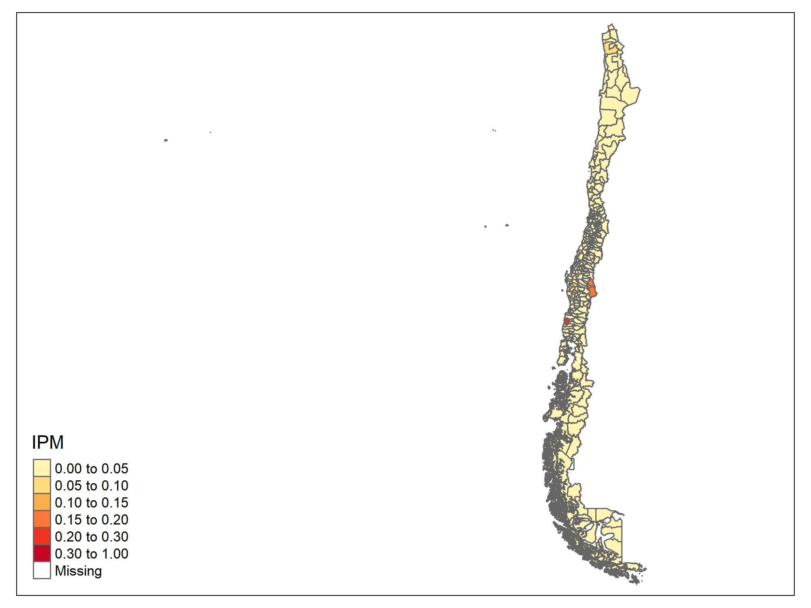
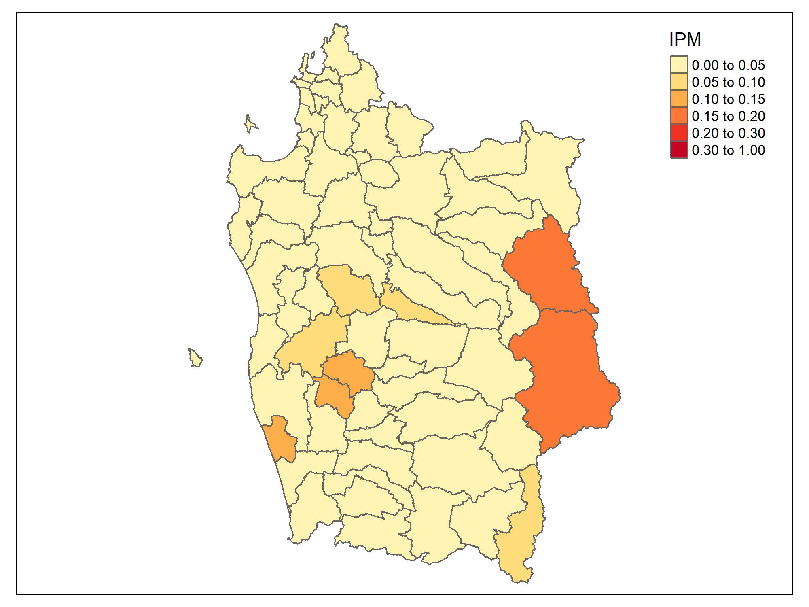
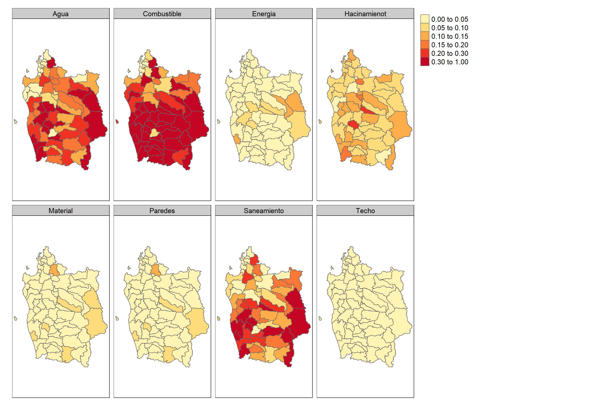

# Día 3 - Sesión 4- Estimación del Índice de Privación Multidimensional (IPM)


-   La pobreza es, y ha sido, uno de los temas principales en las agendas nacionales e internacionales de los países durante décadas. Un ejemplo reciente es el primer objetivo de la agenda **2030** para el Desarrollo Sostenible (ODS): __“Poner fin a la pobreza en todas sus formas en todo el mundo”__, así como su indicador 1.2.2 que mide __“la proporción de hombres, mujeres y niños de todas las edades que viven en pobreza en todas sus dimensiones según las definiciones nacionales”__

-   Tradicionalmente los organismos nacionales e internacionales exigen la medida de pobreza unidimensional basada en ingresos y/o gastos. 

-   La pobreza es un fenómeno complejo que debe ser analizado considerando un conjunto de factores y no solo el monetario. 

-   En está ocasión se aborda el problema multidimensional de la pobreza utilizando métodos de áreas pequeñas proporcionando una estimación del índice de privación multidimensional (IPM) en Colombia. 

## Índice de Privación Multidimensional (IPM)

-   El IPM propuesto por CEPAL es una herramienta comparable entre los países de la región, para estudiar los fenómenos de la pobreza considerando varios aspectos o dimensiones. **En ningún caso el IPM busca reemplazar los indicadores pobreza unidimensional o multidimensional que hayan definido los países u organismos internacionales**

-   El índice requiere la información para cada individuo $i = 1,\cdots,N_d$ en $d = 1, \cdots, D$ dominios, donde $N_d$ denota el tamaño de la población del dominio $d$. El índice para el dominio $d$ se calcula como:

    $$
    IPM_d = \frac{1}{N_d}\sum_{i=1}^{N_d}I\left(q_{di} > 0.4  \right).
    $$
    
    La función del índicador  $I\left( \cdot \right)$ es igual a 1 cuando la condición $q_{di} > 0.4$. 

-   $q_{di}$ es una cantidad ponderada de la siguiente forma: 

    $$
    q_{di} = \frac{1}{8}\sum_{k=1}^{8}y_{di}^{k}
    $$

    Donde: 
    a. $y_{di}^{1}$ = Privación en material de construcción de la vivienda
    
    b. $y_{di}^{2}$ = Hacinamiento en el hogar. 
    
    c. $y_{di}^{3}$ = Privación de acceso al agua potable. 
    
    d. $y_{di}^{4}$ = Privación en saneamiento.
    
    e. $y_{di}^{5}$ = Acceso al servicio energía eléctrica. 
    
    f. $y_{di}^{6}$ = Privación de acceso al combustible para cocinar.
    
    g. $y_{di}^{7}$ = Privación en material de los techo 
    
    h. $y_{di}^{8}$ = Privación el material de las paredes.  


    Note que, $y_{di}^{k}$ es igual a **1** si la persona tiene privación en la $k-ésima$ dimesión y **0** en el caso que de no tener la privación. 
    
    
## Definición del modelo 

En muchas aplicaciones, la variable de interés en áreas pequeñas puede ser binaria, esto es $y_{dj} = 0$ o $1$ que representa la ausencia (o no) de una característica específica. Para este caso, la estimación objetivo en cada dominio $d = 1,\cdots , D$ es la proporción $\theta_d =\frac{1}{N_d}\sum_{i=1}^{N_d}y_{di}$ de la población que tiene esta característica, siendo $\theta_{di}$ la probabilidad de que una determinada unidad $i$ en el dominio $d$ obtenga el valor $1$. Bajo este escenario, el $\theta_{di}$ con una función de enlace logit se define como: 

$$
logit(\theta_{di}) = \log \left(\frac{\theta_{di}}{1-\theta_{di}}\right) = \boldsymbol{x}_{di}^{T}\boldsymbol{\beta} + u_{d}
$$
con $i=1,\cdots,N_d$, $d=1,\cdots,D$, $\boldsymbol{\beta}$  un vector de parámetros de efecto fijo, y $u_d$ el efecto aleatorio especifico del área para el dominio $d$ con $u_d \sim N\left(0,\sigma^2_u \right)$.  $u_d$ son independiente y $y_{di}\mid u_d \sim Bernoulli(\theta_{di})$ con $E(y_{di}\mid u_d)=\theta_{di}$ y $Var(y_{di}\mid u_d)=\sigma_{di}^2=\theta_{di}(1-\theta_{di})$. Además,  $\boldsymbol{x}_{di}^T$ representa el vector $p\times 1$ de valores de $p$ variables auxiliares. Entonces, $\theta_{di}$ se puede escribir como 

$$
\theta_{di} = \frac{\exp(\boldsymbol{x}_{di}^T\boldsymbol{\beta} + u_{d})}{1+ \exp(\boldsymbol{x}_{di}^T\boldsymbol{\beta} + u_{d})}
$$
De está forma podemos definir distribuciones previas 

$$
\begin{eqnarray*}
\beta_k & \sim   & N(0, 10000)\\
\sigma^2_u &\sim & IG(0.0001,0.0001)
\end{eqnarray*}
$$
El modelo se debe estimar para cada una de las dimensiones. 
  
#### Obejtivo {-}


Estimar la proporción de personas que presentan la $k-$ésima carencia, es decir, 

$$ 
P_d = \frac{\sum_{U_d}q_{di}}{N_d}
$$

donde $q_{di}$ toma el valor de 1 cuando la $i-$ésima persona presenta Privación Multidimensional y el valor de 0 en caso contrario. 

Note que, 

$$
\begin{equation*}
\bar{Y}_d = P_d =  \frac{\sum_{s_d}q_{di} + \sum_{s^c_d}q_{di}}{N_d} 
\end{equation*}
$$

Ahora, el estimador de $P$ esta dado por: 

$$
\hat{P}_d = \frac{\sum_{s_d}q_{di} + \sum_{s^c_d}\hat{q}_{di}}{N_d}
$$

donde

$$
\hat{q}_{di} = \frac{1}{8}\sum_{k=1}^{8}\hat{y}_{di}^{k}
$$

$$\hat{y}_{di}^{k}=E_{\mathscr{M}}\left(y_{di}^{k}\mid\boldsymbol{x}_{d},\boldsymbol{\beta}\right)$$,

con $\mathscr{M}$  la medida de probabilidad inducida por el modelamiento. 
De esta forma se tiene que, 

$$
\hat{P}_d = \frac{\sum_{U_{d}}\hat{q}_{di}}{N_d}
$$


  
### Procesamiento del modelo en `R`. 
El proceso inicia con el cargue de las librerías. 


```r
library(patchwork)
library(lme4)
library(tidyverse)
library(rstan)
library(rstanarm)
library(magrittr)
```

Los datos de la encuesta y el censo han sido preparados previamente, la información sobre la cual realizaremos la predicción corresponde a Colombia en el 2019 


```r
encuesta_ipm <- readRDS("Recursos/Día3/Sesion4/Data/encuesta2017_nbi.Rds") 
statelevel_predictors_df <-
  readRDS("Recursos/Día3/Sesion4/Data/statelevel_predictors_df_dam2.rds") %>% 
   mutate_at(.vars = c("luces_nocturnas",
                      "cubrimiento_cultivo",
                      "cubrimiento_urbano",
                      "modificacion_humana",
                      "accesibilidad_hospitales",
                      "accesibilidad_hosp_caminado"),
            function(x) as.numeric(scale(x)))

byAgrega <- c("dam", "dam2", "area", "sexo", "etnia", 
              "anoest", "edad" )
```


```r
names_ipm <- grep(pattern = "nbi", names(encuesta_ipm),value = TRUE)

encuesta_df <- map(setNames(names_ipm,names_ipm),
    function(y){
  encuesta_ipm$temp <- encuesta_ipm[[y]]
  encuesta_ipm %>% 
  group_by_at(all_of(byAgrega)) %>%
  summarise(n = n(),
            yno = sum(temp),
            ysi = n - yno, .groups = "drop") %>% 
    inner_join(statelevel_predictors_df)
})
```

#### Privación en material de construcción de la vivienda {-} 

<table class="table table-striped lightable-classic" style="width: auto !important; margin-left: auto; margin-right: auto; font-family: Arial Narrow; width: auto !important; margin-left: auto; margin-right: auto;">
<caption>(\#tab:unnamed-chunk-4)nbi_matviv</caption>
 <thead>
  <tr>
   <th style="text-align:left;"> dam </th>
   <th style="text-align:left;"> dam2 </th>
   <th style="text-align:left;"> area </th>
   <th style="text-align:left;"> sexo </th>
   <th style="text-align:left;"> etnia </th>
   <th style="text-align:left;"> anoest </th>
   <th style="text-align:left;"> edad </th>
   <th style="text-align:right;"> n </th>
   <th style="text-align:right;"> yno </th>
   <th style="text-align:right;"> ysi </th>
   <th style="text-align:right;"> area0 </th>
   <th style="text-align:right;"> area1 </th>
   <th style="text-align:right;"> etnia2 </th>
   <th style="text-align:right;"> sexo2 </th>
   <th style="text-align:right;"> edad2 </th>
   <th style="text-align:right;"> edad3 </th>
   <th style="text-align:right;"> edad4 </th>
   <th style="text-align:right;"> edad5 </th>
   <th style="text-align:right;"> anoest2 </th>
   <th style="text-align:right;"> anoest3 </th>
   <th style="text-align:right;"> anoest4 </th>
   <th style="text-align:right;"> anoest99 </th>
   <th style="text-align:right;"> etnia1 </th>
   <th style="text-align:right;"> piso_tierra </th>
   <th style="text-align:right;"> material_paredes </th>
   <th style="text-align:right;"> material_techo </th>
   <th style="text-align:right;"> rezago_escolar </th>
   <th style="text-align:right;"> alfabeta </th>
   <th style="text-align:right;"> tasa_desocupacion </th>
   <th style="text-align:right;"> pollution_CO </th>
   <th style="text-align:right;"> vegetation_NDVI </th>
   <th style="text-align:right;"> Elevation </th>
   <th style="text-align:right;"> temperature_ECMWF </th>
   <th style="text-align:right;"> temperature_2metros </th>
   <th style="text-align:right;"> total_precipitation </th>
   <th style="text-align:right;"> precipitation </th>
   <th style="text-align:right;"> population_density </th>
   <th style="text-align:right;"> luces_nocturnas </th>
   <th style="text-align:right;"> cubrimiento_cultivo </th>
   <th style="text-align:right;"> cubrimiento_urbano </th>
   <th style="text-align:right;"> modificacion_humana </th>
   <th style="text-align:right;"> accesibilidad_hospitales </th>
   <th style="text-align:right;"> accesibilidad_hosp_caminado </th>
  </tr>
 </thead>
<tbody>
  <tr>
   <td style="text-align:left;"> 15 </td>
   <td style="text-align:left;"> 15101 </td>
   <td style="text-align:left;"> 1 </td>
   <td style="text-align:left;"> 2 </td>
   <td style="text-align:left;"> 3 </td>
   <td style="text-align:left;"> 3 </td>
   <td style="text-align:left;"> 4 </td>
   <td style="text-align:right;"> 466 </td>
   <td style="text-align:right;"> 19 </td>
   <td style="text-align:right;"> 447 </td>
   <td style="text-align:right;"> 0.0736 </td>
   <td style="text-align:right;"> 0.9264 </td>
   <td style="text-align:right;"> 0.0209 </td>
   <td style="text-align:right;"> 0.5058 </td>
   <td style="text-align:right;"> 0.2412 </td>
   <td style="text-align:right;"> 0.2091 </td>
   <td style="text-align:right;"> 0.2212 </td>
   <td style="text-align:right;"> 0.1086 </td>
   <td style="text-align:right;"> 0.1548 </td>
   <td style="text-align:right;"> 0.4840 </td>
   <td style="text-align:right;"> 0.2089 </td>
   <td style="text-align:right;"> 0.0325 </td>
   <td style="text-align:right;"> 0.3219 </td>
   <td style="text-align:right;"> 0.0183 </td>
   <td style="text-align:right;"> 0.2102 </td>
   <td style="text-align:right;"> 0.4930 </td>
   <td style="text-align:right;"> 0.3199 </td>
   <td style="text-align:right;"> 0.0469 </td>
   <td style="text-align:right;"> 0.0754 </td>
   <td style="text-align:right;"> 0.0218 </td>
   <td style="text-align:right;"> -1.7204 </td>
   <td style="text-align:right;"> 1.1194 </td>
   <td style="text-align:right;"> 1.5333 </td>
   <td style="text-align:right;"> 1.1730 </td>
   <td style="text-align:right;"> 0e+00 </td>
   <td style="text-align:right;"> 0.0145 </td>
   <td style="text-align:right;"> -0.3416 </td>
   <td style="text-align:right;"> -0.4784 </td>
   <td style="text-align:right;"> -0.9467 </td>
   <td style="text-align:right;"> -0.3646 </td>
   <td style="text-align:right;"> -0.7558 </td>
   <td style="text-align:right;"> 0.2438 </td>
   <td style="text-align:right;"> 0.0471 </td>
  </tr>
  <tr>
   <td style="text-align:left;"> 02 </td>
   <td style="text-align:left;"> 02101 </td>
   <td style="text-align:left;"> 1 </td>
   <td style="text-align:left;"> 1 </td>
   <td style="text-align:left;"> 3 </td>
   <td style="text-align:left;"> 3 </td>
   <td style="text-align:left;"> 2 </td>
   <td style="text-align:right;"> 431 </td>
   <td style="text-align:right;"> 5 </td>
   <td style="text-align:right;"> 426 </td>
   <td style="text-align:right;"> 0.0215 </td>
   <td style="text-align:right;"> 0.9785 </td>
   <td style="text-align:right;"> 0.0010 </td>
   <td style="text-align:right;"> 0.4975 </td>
   <td style="text-align:right;"> 0.2610 </td>
   <td style="text-align:right;"> 0.2324 </td>
   <td style="text-align:right;"> 0.2170 </td>
   <td style="text-align:right;"> 0.0789 </td>
   <td style="text-align:right;"> 0.1356 </td>
   <td style="text-align:right;"> 0.4654 </td>
   <td style="text-align:right;"> 0.2543 </td>
   <td style="text-align:right;"> 0.0326 </td>
   <td style="text-align:right;"> 0.0768 </td>
   <td style="text-align:right;"> 0.0085 </td>
   <td style="text-align:right;"> 0.1644 </td>
   <td style="text-align:right;"> 0.4710 </td>
   <td style="text-align:right;"> 0.3795 </td>
   <td style="text-align:right;"> 0.0312 </td>
   <td style="text-align:right;"> 0.0809 </td>
   <td style="text-align:right;"> 0.0174 </td>
   <td style="text-align:right;"> -1.7986 </td>
   <td style="text-align:right;"> 2.0859 </td>
   <td style="text-align:right;"> 0.8208 </td>
   <td style="text-align:right;"> 0.1203 </td>
   <td style="text-align:right;"> 0e+00 </td>
   <td style="text-align:right;"> 0.0081 </td>
   <td style="text-align:right;"> -0.3511 </td>
   <td style="text-align:right;"> -0.5137 </td>
   <td style="text-align:right;"> -0.9632 </td>
   <td style="text-align:right;"> -0.3875 </td>
   <td style="text-align:right;"> -1.0542 </td>
   <td style="text-align:right;"> 1.1580 </td>
   <td style="text-align:right;"> 0.2452 </td>
  </tr>
  <tr>
   <td style="text-align:left;"> 02 </td>
   <td style="text-align:left;"> 02101 </td>
   <td style="text-align:left;"> 1 </td>
   <td style="text-align:left;"> 2 </td>
   <td style="text-align:left;"> 3 </td>
   <td style="text-align:left;"> 3 </td>
   <td style="text-align:left;"> 4 </td>
   <td style="text-align:right;"> 429 </td>
   <td style="text-align:right;"> 3 </td>
   <td style="text-align:right;"> 426 </td>
   <td style="text-align:right;"> 0.0215 </td>
   <td style="text-align:right;"> 0.9785 </td>
   <td style="text-align:right;"> 0.0010 </td>
   <td style="text-align:right;"> 0.4975 </td>
   <td style="text-align:right;"> 0.2610 </td>
   <td style="text-align:right;"> 0.2324 </td>
   <td style="text-align:right;"> 0.2170 </td>
   <td style="text-align:right;"> 0.0789 </td>
   <td style="text-align:right;"> 0.1356 </td>
   <td style="text-align:right;"> 0.4654 </td>
   <td style="text-align:right;"> 0.2543 </td>
   <td style="text-align:right;"> 0.0326 </td>
   <td style="text-align:right;"> 0.0768 </td>
   <td style="text-align:right;"> 0.0085 </td>
   <td style="text-align:right;"> 0.1644 </td>
   <td style="text-align:right;"> 0.4710 </td>
   <td style="text-align:right;"> 0.3795 </td>
   <td style="text-align:right;"> 0.0312 </td>
   <td style="text-align:right;"> 0.0809 </td>
   <td style="text-align:right;"> 0.0174 </td>
   <td style="text-align:right;"> -1.7986 </td>
   <td style="text-align:right;"> 2.0859 </td>
   <td style="text-align:right;"> 0.8208 </td>
   <td style="text-align:right;"> 0.1203 </td>
   <td style="text-align:right;"> 0e+00 </td>
   <td style="text-align:right;"> 0.0081 </td>
   <td style="text-align:right;"> -0.3511 </td>
   <td style="text-align:right;"> -0.5137 </td>
   <td style="text-align:right;"> -0.9632 </td>
   <td style="text-align:right;"> -0.3875 </td>
   <td style="text-align:right;"> -1.0542 </td>
   <td style="text-align:right;"> 1.1580 </td>
   <td style="text-align:right;"> 0.2452 </td>
  </tr>
  <tr>
   <td style="text-align:left;"> 01 </td>
   <td style="text-align:left;"> 01101 </td>
   <td style="text-align:left;"> 1 </td>
   <td style="text-align:left;"> 2 </td>
   <td style="text-align:left;"> 3 </td>
   <td style="text-align:left;"> 3 </td>
   <td style="text-align:left;"> 4 </td>
   <td style="text-align:right;"> 413 </td>
   <td style="text-align:right;"> 6 </td>
   <td style="text-align:right;"> 407 </td>
   <td style="text-align:right;"> 0.0126 </td>
   <td style="text-align:right;"> 0.9874 </td>
   <td style="text-align:right;"> 0.0016 </td>
   <td style="text-align:right;"> 0.5044 </td>
   <td style="text-align:right;"> 0.2374 </td>
   <td style="text-align:right;"> 0.2338 </td>
   <td style="text-align:right;"> 0.2242 </td>
   <td style="text-align:right;"> 0.0926 </td>
   <td style="text-align:right;"> 0.1360 </td>
   <td style="text-align:right;"> 0.4547 </td>
   <td style="text-align:right;"> 0.2711 </td>
   <td style="text-align:right;"> 0.0245 </td>
   <td style="text-align:right;"> 0.1709 </td>
   <td style="text-align:right;"> 0.0051 </td>
   <td style="text-align:right;"> 0.2133 </td>
   <td style="text-align:right;"> 0.5059 </td>
   <td style="text-align:right;"> 0.3940 </td>
   <td style="text-align:right;"> 0.0285 </td>
   <td style="text-align:right;"> 0.0703 </td>
   <td style="text-align:right;"> 0.0229 </td>
   <td style="text-align:right;"> -1.7713 </td>
   <td style="text-align:right;"> -0.0492 </td>
   <td style="text-align:right;"> 2.0871 </td>
   <td style="text-align:right;"> 1.3892 </td>
   <td style="text-align:right;"> 0e+00 </td>
   <td style="text-align:right;"> 0.0057 </td>
   <td style="text-align:right;"> -0.3101 </td>
   <td style="text-align:right;"> -0.4713 </td>
   <td style="text-align:right;"> -0.9633 </td>
   <td style="text-align:right;"> -0.3591 </td>
   <td style="text-align:right;"> -0.6911 </td>
   <td style="text-align:right;"> 0.0238 </td>
   <td style="text-align:right;"> 0.0469 </td>
  </tr>
  <tr>
   <td style="text-align:left;"> 12 </td>
   <td style="text-align:left;"> 12101 </td>
   <td style="text-align:left;"> 1 </td>
   <td style="text-align:left;"> 2 </td>
   <td style="text-align:left;"> 3 </td>
   <td style="text-align:left;"> 3 </td>
   <td style="text-align:left;"> 4 </td>
   <td style="text-align:right;"> 396 </td>
   <td style="text-align:right;"> 2 </td>
   <td style="text-align:right;"> 394 </td>
   <td style="text-align:right;"> 0.0430 </td>
   <td style="text-align:right;"> 0.9570 </td>
   <td style="text-align:right;"> 0.0001 </td>
   <td style="text-align:right;"> 0.5020 </td>
   <td style="text-align:right;"> 0.2211 </td>
   <td style="text-align:right;"> 0.2227 </td>
   <td style="text-align:right;"> 0.2491 </td>
   <td style="text-align:right;"> 0.1188 </td>
   <td style="text-align:right;"> 0.1519 </td>
   <td style="text-align:right;"> 0.4775 </td>
   <td style="text-align:right;"> 0.2539 </td>
   <td style="text-align:right;"> 0.0193 </td>
   <td style="text-align:right;"> 0.2152 </td>
   <td style="text-align:right;"> 0.0005 </td>
   <td style="text-align:right;"> 0.2322 </td>
   <td style="text-align:right;"> 0.8677 </td>
   <td style="text-align:right;"> 0.3553 </td>
   <td style="text-align:right;"> 0.0396 </td>
   <td style="text-align:right;"> 0.0430 </td>
   <td style="text-align:right;"> 0.0174 </td>
   <td style="text-align:right;"> -0.4444 </td>
   <td style="text-align:right;"> -0.5563 </td>
   <td style="text-align:right;"> -2.1443 </td>
   <td style="text-align:right;"> -2.1356 </td>
   <td style="text-align:right;"> 3e-04 </td>
   <td style="text-align:right;"> 0.1720 </td>
   <td style="text-align:right;"> -0.3549 </td>
   <td style="text-align:right;"> -0.5483 </td>
   <td style="text-align:right;"> -0.9632 </td>
   <td style="text-align:right;"> -0.3873 </td>
   <td style="text-align:right;"> -1.1261 </td>
   <td style="text-align:right;"> 2.0673 </td>
   <td style="text-align:right;"> 0.7773 </td>
  </tr>
  <tr>
   <td style="text-align:left;"> 02 </td>
   <td style="text-align:left;"> 02101 </td>
   <td style="text-align:left;"> 1 </td>
   <td style="text-align:left;"> 2 </td>
   <td style="text-align:left;"> 3 </td>
   <td style="text-align:left;"> 3 </td>
   <td style="text-align:left;"> 2 </td>
   <td style="text-align:right;"> 387 </td>
   <td style="text-align:right;"> 4 </td>
   <td style="text-align:right;"> 383 </td>
   <td style="text-align:right;"> 0.0215 </td>
   <td style="text-align:right;"> 0.9785 </td>
   <td style="text-align:right;"> 0.0010 </td>
   <td style="text-align:right;"> 0.4975 </td>
   <td style="text-align:right;"> 0.2610 </td>
   <td style="text-align:right;"> 0.2324 </td>
   <td style="text-align:right;"> 0.2170 </td>
   <td style="text-align:right;"> 0.0789 </td>
   <td style="text-align:right;"> 0.1356 </td>
   <td style="text-align:right;"> 0.4654 </td>
   <td style="text-align:right;"> 0.2543 </td>
   <td style="text-align:right;"> 0.0326 </td>
   <td style="text-align:right;"> 0.0768 </td>
   <td style="text-align:right;"> 0.0085 </td>
   <td style="text-align:right;"> 0.1644 </td>
   <td style="text-align:right;"> 0.4710 </td>
   <td style="text-align:right;"> 0.3795 </td>
   <td style="text-align:right;"> 0.0312 </td>
   <td style="text-align:right;"> 0.0809 </td>
   <td style="text-align:right;"> 0.0174 </td>
   <td style="text-align:right;"> -1.7986 </td>
   <td style="text-align:right;"> 2.0859 </td>
   <td style="text-align:right;"> 0.8208 </td>
   <td style="text-align:right;"> 0.1203 </td>
   <td style="text-align:right;"> 0e+00 </td>
   <td style="text-align:right;"> 0.0081 </td>
   <td style="text-align:right;"> -0.3511 </td>
   <td style="text-align:right;"> -0.5137 </td>
   <td style="text-align:right;"> -0.9632 </td>
   <td style="text-align:right;"> -0.3875 </td>
   <td style="text-align:right;"> -1.0542 </td>
   <td style="text-align:right;"> 1.1580 </td>
   <td style="text-align:right;"> 0.2452 </td>
  </tr>
</tbody>
</table>

#### Hacinamiento {-}

<table class="table table-striped lightable-classic" style="width: auto !important; margin-left: auto; margin-right: auto; font-family: Arial Narrow; width: auto !important; margin-left: auto; margin-right: auto;">
 <thead>
  <tr>
   <th style="text-align:left;"> dam </th>
   <th style="text-align:left;"> dam2 </th>
   <th style="text-align:left;"> area </th>
   <th style="text-align:left;"> sexo </th>
   <th style="text-align:left;"> etnia </th>
   <th style="text-align:left;"> anoest </th>
   <th style="text-align:left;"> edad </th>
   <th style="text-align:right;"> n </th>
   <th style="text-align:right;"> yno </th>
   <th style="text-align:right;"> ysi </th>
   <th style="text-align:right;"> area0 </th>
   <th style="text-align:right;"> area1 </th>
   <th style="text-align:right;"> etnia2 </th>
   <th style="text-align:right;"> sexo2 </th>
   <th style="text-align:right;"> edad2 </th>
   <th style="text-align:right;"> edad3 </th>
   <th style="text-align:right;"> edad4 </th>
   <th style="text-align:right;"> edad5 </th>
   <th style="text-align:right;"> anoest2 </th>
   <th style="text-align:right;"> anoest3 </th>
   <th style="text-align:right;"> anoest4 </th>
   <th style="text-align:right;"> anoest99 </th>
   <th style="text-align:right;"> etnia1 </th>
   <th style="text-align:right;"> piso_tierra </th>
   <th style="text-align:right;"> material_paredes </th>
   <th style="text-align:right;"> material_techo </th>
   <th style="text-align:right;"> rezago_escolar </th>
   <th style="text-align:right;"> alfabeta </th>
   <th style="text-align:right;"> tasa_desocupacion </th>
   <th style="text-align:right;"> pollution_CO </th>
   <th style="text-align:right;"> vegetation_NDVI </th>
   <th style="text-align:right;"> Elevation </th>
   <th style="text-align:right;"> temperature_ECMWF </th>
   <th style="text-align:right;"> temperature_2metros </th>
   <th style="text-align:right;"> total_precipitation </th>
   <th style="text-align:right;"> precipitation </th>
   <th style="text-align:right;"> population_density </th>
   <th style="text-align:right;"> luces_nocturnas </th>
   <th style="text-align:right;"> cubrimiento_cultivo </th>
   <th style="text-align:right;"> cubrimiento_urbano </th>
   <th style="text-align:right;"> modificacion_humana </th>
   <th style="text-align:right;"> accesibilidad_hospitales </th>
   <th style="text-align:right;"> accesibilidad_hosp_caminado </th>
  </tr>
 </thead>
<tbody>
  <tr>
   <td style="text-align:left;"> 15 </td>
   <td style="text-align:left;"> 15101 </td>
   <td style="text-align:left;"> 1 </td>
   <td style="text-align:left;"> 2 </td>
   <td style="text-align:left;"> 3 </td>
   <td style="text-align:left;"> 3 </td>
   <td style="text-align:left;"> 4 </td>
   <td style="text-align:right;"> 466 </td>
   <td style="text-align:right;"> 47 </td>
   <td style="text-align:right;"> 419 </td>
   <td style="text-align:right;"> 0.0736 </td>
   <td style="text-align:right;"> 0.9264 </td>
   <td style="text-align:right;"> 0.0209 </td>
   <td style="text-align:right;"> 0.5058 </td>
   <td style="text-align:right;"> 0.2412 </td>
   <td style="text-align:right;"> 0.2091 </td>
   <td style="text-align:right;"> 0.2212 </td>
   <td style="text-align:right;"> 0.1086 </td>
   <td style="text-align:right;"> 0.1548 </td>
   <td style="text-align:right;"> 0.4840 </td>
   <td style="text-align:right;"> 0.2089 </td>
   <td style="text-align:right;"> 0.0325 </td>
   <td style="text-align:right;"> 0.3219 </td>
   <td style="text-align:right;"> 0.0183 </td>
   <td style="text-align:right;"> 0.2102 </td>
   <td style="text-align:right;"> 0.4930 </td>
   <td style="text-align:right;"> 0.3199 </td>
   <td style="text-align:right;"> 0.0469 </td>
   <td style="text-align:right;"> 0.0754 </td>
   <td style="text-align:right;"> 0.0218 </td>
   <td style="text-align:right;"> -1.7204 </td>
   <td style="text-align:right;"> 1.1194 </td>
   <td style="text-align:right;"> 1.5333 </td>
   <td style="text-align:right;"> 1.1730 </td>
   <td style="text-align:right;"> 0e+00 </td>
   <td style="text-align:right;"> 0.0145 </td>
   <td style="text-align:right;"> -0.3416 </td>
   <td style="text-align:right;"> -0.4784 </td>
   <td style="text-align:right;"> -0.9467 </td>
   <td style="text-align:right;"> -0.3646 </td>
   <td style="text-align:right;"> -0.7558 </td>
   <td style="text-align:right;"> 0.2438 </td>
   <td style="text-align:right;"> 0.0471 </td>
  </tr>
  <tr>
   <td style="text-align:left;"> 02 </td>
   <td style="text-align:left;"> 02101 </td>
   <td style="text-align:left;"> 1 </td>
   <td style="text-align:left;"> 1 </td>
   <td style="text-align:left;"> 3 </td>
   <td style="text-align:left;"> 3 </td>
   <td style="text-align:left;"> 2 </td>
   <td style="text-align:right;"> 431 </td>
   <td style="text-align:right;"> 64 </td>
   <td style="text-align:right;"> 367 </td>
   <td style="text-align:right;"> 0.0215 </td>
   <td style="text-align:right;"> 0.9785 </td>
   <td style="text-align:right;"> 0.0010 </td>
   <td style="text-align:right;"> 0.4975 </td>
   <td style="text-align:right;"> 0.2610 </td>
   <td style="text-align:right;"> 0.2324 </td>
   <td style="text-align:right;"> 0.2170 </td>
   <td style="text-align:right;"> 0.0789 </td>
   <td style="text-align:right;"> 0.1356 </td>
   <td style="text-align:right;"> 0.4654 </td>
   <td style="text-align:right;"> 0.2543 </td>
   <td style="text-align:right;"> 0.0326 </td>
   <td style="text-align:right;"> 0.0768 </td>
   <td style="text-align:right;"> 0.0085 </td>
   <td style="text-align:right;"> 0.1644 </td>
   <td style="text-align:right;"> 0.4710 </td>
   <td style="text-align:right;"> 0.3795 </td>
   <td style="text-align:right;"> 0.0312 </td>
   <td style="text-align:right;"> 0.0809 </td>
   <td style="text-align:right;"> 0.0174 </td>
   <td style="text-align:right;"> -1.7986 </td>
   <td style="text-align:right;"> 2.0859 </td>
   <td style="text-align:right;"> 0.8208 </td>
   <td style="text-align:right;"> 0.1203 </td>
   <td style="text-align:right;"> 0e+00 </td>
   <td style="text-align:right;"> 0.0081 </td>
   <td style="text-align:right;"> -0.3511 </td>
   <td style="text-align:right;"> -0.5137 </td>
   <td style="text-align:right;"> -0.9632 </td>
   <td style="text-align:right;"> -0.3875 </td>
   <td style="text-align:right;"> -1.0542 </td>
   <td style="text-align:right;"> 1.1580 </td>
   <td style="text-align:right;"> 0.2452 </td>
  </tr>
  <tr>
   <td style="text-align:left;"> 02 </td>
   <td style="text-align:left;"> 02101 </td>
   <td style="text-align:left;"> 1 </td>
   <td style="text-align:left;"> 2 </td>
   <td style="text-align:left;"> 3 </td>
   <td style="text-align:left;"> 3 </td>
   <td style="text-align:left;"> 4 </td>
   <td style="text-align:right;"> 429 </td>
   <td style="text-align:right;"> 41 </td>
   <td style="text-align:right;"> 388 </td>
   <td style="text-align:right;"> 0.0215 </td>
   <td style="text-align:right;"> 0.9785 </td>
   <td style="text-align:right;"> 0.0010 </td>
   <td style="text-align:right;"> 0.4975 </td>
   <td style="text-align:right;"> 0.2610 </td>
   <td style="text-align:right;"> 0.2324 </td>
   <td style="text-align:right;"> 0.2170 </td>
   <td style="text-align:right;"> 0.0789 </td>
   <td style="text-align:right;"> 0.1356 </td>
   <td style="text-align:right;"> 0.4654 </td>
   <td style="text-align:right;"> 0.2543 </td>
   <td style="text-align:right;"> 0.0326 </td>
   <td style="text-align:right;"> 0.0768 </td>
   <td style="text-align:right;"> 0.0085 </td>
   <td style="text-align:right;"> 0.1644 </td>
   <td style="text-align:right;"> 0.4710 </td>
   <td style="text-align:right;"> 0.3795 </td>
   <td style="text-align:right;"> 0.0312 </td>
   <td style="text-align:right;"> 0.0809 </td>
   <td style="text-align:right;"> 0.0174 </td>
   <td style="text-align:right;"> -1.7986 </td>
   <td style="text-align:right;"> 2.0859 </td>
   <td style="text-align:right;"> 0.8208 </td>
   <td style="text-align:right;"> 0.1203 </td>
   <td style="text-align:right;"> 0e+00 </td>
   <td style="text-align:right;"> 0.0081 </td>
   <td style="text-align:right;"> -0.3511 </td>
   <td style="text-align:right;"> -0.5137 </td>
   <td style="text-align:right;"> -0.9632 </td>
   <td style="text-align:right;"> -0.3875 </td>
   <td style="text-align:right;"> -1.0542 </td>
   <td style="text-align:right;"> 1.1580 </td>
   <td style="text-align:right;"> 0.2452 </td>
  </tr>
  <tr>
   <td style="text-align:left;"> 01 </td>
   <td style="text-align:left;"> 01101 </td>
   <td style="text-align:left;"> 1 </td>
   <td style="text-align:left;"> 2 </td>
   <td style="text-align:left;"> 3 </td>
   <td style="text-align:left;"> 3 </td>
   <td style="text-align:left;"> 4 </td>
   <td style="text-align:right;"> 413 </td>
   <td style="text-align:right;"> 66 </td>
   <td style="text-align:right;"> 347 </td>
   <td style="text-align:right;"> 0.0126 </td>
   <td style="text-align:right;"> 0.9874 </td>
   <td style="text-align:right;"> 0.0016 </td>
   <td style="text-align:right;"> 0.5044 </td>
   <td style="text-align:right;"> 0.2374 </td>
   <td style="text-align:right;"> 0.2338 </td>
   <td style="text-align:right;"> 0.2242 </td>
   <td style="text-align:right;"> 0.0926 </td>
   <td style="text-align:right;"> 0.1360 </td>
   <td style="text-align:right;"> 0.4547 </td>
   <td style="text-align:right;"> 0.2711 </td>
   <td style="text-align:right;"> 0.0245 </td>
   <td style="text-align:right;"> 0.1709 </td>
   <td style="text-align:right;"> 0.0051 </td>
   <td style="text-align:right;"> 0.2133 </td>
   <td style="text-align:right;"> 0.5059 </td>
   <td style="text-align:right;"> 0.3940 </td>
   <td style="text-align:right;"> 0.0285 </td>
   <td style="text-align:right;"> 0.0703 </td>
   <td style="text-align:right;"> 0.0229 </td>
   <td style="text-align:right;"> -1.7713 </td>
   <td style="text-align:right;"> -0.0492 </td>
   <td style="text-align:right;"> 2.0871 </td>
   <td style="text-align:right;"> 1.3892 </td>
   <td style="text-align:right;"> 0e+00 </td>
   <td style="text-align:right;"> 0.0057 </td>
   <td style="text-align:right;"> -0.3101 </td>
   <td style="text-align:right;"> -0.4713 </td>
   <td style="text-align:right;"> -0.9633 </td>
   <td style="text-align:right;"> -0.3591 </td>
   <td style="text-align:right;"> -0.6911 </td>
   <td style="text-align:right;"> 0.0238 </td>
   <td style="text-align:right;"> 0.0469 </td>
  </tr>
  <tr>
   <td style="text-align:left;"> 12 </td>
   <td style="text-align:left;"> 12101 </td>
   <td style="text-align:left;"> 1 </td>
   <td style="text-align:left;"> 2 </td>
   <td style="text-align:left;"> 3 </td>
   <td style="text-align:left;"> 3 </td>
   <td style="text-align:left;"> 4 </td>
   <td style="text-align:right;"> 396 </td>
   <td style="text-align:right;"> 29 </td>
   <td style="text-align:right;"> 367 </td>
   <td style="text-align:right;"> 0.0430 </td>
   <td style="text-align:right;"> 0.9570 </td>
   <td style="text-align:right;"> 0.0001 </td>
   <td style="text-align:right;"> 0.5020 </td>
   <td style="text-align:right;"> 0.2211 </td>
   <td style="text-align:right;"> 0.2227 </td>
   <td style="text-align:right;"> 0.2491 </td>
   <td style="text-align:right;"> 0.1188 </td>
   <td style="text-align:right;"> 0.1519 </td>
   <td style="text-align:right;"> 0.4775 </td>
   <td style="text-align:right;"> 0.2539 </td>
   <td style="text-align:right;"> 0.0193 </td>
   <td style="text-align:right;"> 0.2152 </td>
   <td style="text-align:right;"> 0.0005 </td>
   <td style="text-align:right;"> 0.2322 </td>
   <td style="text-align:right;"> 0.8677 </td>
   <td style="text-align:right;"> 0.3553 </td>
   <td style="text-align:right;"> 0.0396 </td>
   <td style="text-align:right;"> 0.0430 </td>
   <td style="text-align:right;"> 0.0174 </td>
   <td style="text-align:right;"> -0.4444 </td>
   <td style="text-align:right;"> -0.5563 </td>
   <td style="text-align:right;"> -2.1443 </td>
   <td style="text-align:right;"> -2.1356 </td>
   <td style="text-align:right;"> 3e-04 </td>
   <td style="text-align:right;"> 0.1720 </td>
   <td style="text-align:right;"> -0.3549 </td>
   <td style="text-align:right;"> -0.5483 </td>
   <td style="text-align:right;"> -0.9632 </td>
   <td style="text-align:right;"> -0.3873 </td>
   <td style="text-align:right;"> -1.1261 </td>
   <td style="text-align:right;"> 2.0673 </td>
   <td style="text-align:right;"> 0.7773 </td>
  </tr>
  <tr>
   <td style="text-align:left;"> 02 </td>
   <td style="text-align:left;"> 02101 </td>
   <td style="text-align:left;"> 1 </td>
   <td style="text-align:left;"> 2 </td>
   <td style="text-align:left;"> 3 </td>
   <td style="text-align:left;"> 3 </td>
   <td style="text-align:left;"> 2 </td>
   <td style="text-align:right;"> 387 </td>
   <td style="text-align:right;"> 78 </td>
   <td style="text-align:right;"> 309 </td>
   <td style="text-align:right;"> 0.0215 </td>
   <td style="text-align:right;"> 0.9785 </td>
   <td style="text-align:right;"> 0.0010 </td>
   <td style="text-align:right;"> 0.4975 </td>
   <td style="text-align:right;"> 0.2610 </td>
   <td style="text-align:right;"> 0.2324 </td>
   <td style="text-align:right;"> 0.2170 </td>
   <td style="text-align:right;"> 0.0789 </td>
   <td style="text-align:right;"> 0.1356 </td>
   <td style="text-align:right;"> 0.4654 </td>
   <td style="text-align:right;"> 0.2543 </td>
   <td style="text-align:right;"> 0.0326 </td>
   <td style="text-align:right;"> 0.0768 </td>
   <td style="text-align:right;"> 0.0085 </td>
   <td style="text-align:right;"> 0.1644 </td>
   <td style="text-align:right;"> 0.4710 </td>
   <td style="text-align:right;"> 0.3795 </td>
   <td style="text-align:right;"> 0.0312 </td>
   <td style="text-align:right;"> 0.0809 </td>
   <td style="text-align:right;"> 0.0174 </td>
   <td style="text-align:right;"> -1.7986 </td>
   <td style="text-align:right;"> 2.0859 </td>
   <td style="text-align:right;"> 0.8208 </td>
   <td style="text-align:right;"> 0.1203 </td>
   <td style="text-align:right;"> 0e+00 </td>
   <td style="text-align:right;"> 0.0081 </td>
   <td style="text-align:right;"> -0.3511 </td>
   <td style="text-align:right;"> -0.5137 </td>
   <td style="text-align:right;"> -0.9632 </td>
   <td style="text-align:right;"> -0.3875 </td>
   <td style="text-align:right;"> -1.0542 </td>
   <td style="text-align:right;"> 1.1580 </td>
   <td style="text-align:right;"> 0.2452 </td>
  </tr>
</tbody>
</table>

### Definiendo el modelo multinivel.

Para cada dimensión que compone el IPM se ajusta el siguiente modelo mostrado en el script. En este código se incluye el uso de la función `future_map` que permite procesar en paralelo cada modelo O puede compilar cada por separado.   


```r
library(furrr)
library(rstanarm)
plan(multisession, workers = 4)

fit <- future_map(encuesta_df, function(xdat){
stan_glmer(
  cbind(yno, ysi) ~ (1 | dam2) +
    (1 | dam) +
    (1|edad) +
    area +
    (1|anoest) +
    (1|etnia) +
    sexo + 
    tasa_desocupacion +
    luces_nocturnas +
    modificacion_humana,
  family = binomial(link = "logit"),
  data = xdat,
  cores = 7,
  chains = 4,
  iter = 300
)}, 
.progress = TRUE)

saveRDS(object = fit, "Recursos/Día3/Sesion4/Data/fits_IPM.rds")
```

Terminado la compilación de los modelos después de realizar validaciones sobre esto, pasamos hacer las predicciones en el censo. 

### Proceso de estimación y predicción

Los modelos fueron compilados de manera separada, por tanto, disponemos de un objeto `.rds` por cada dimensión del IPM 


```r
fit_agua <-
  readRDS(file = "Recursos/Día3/Sesion4/Data/fits_nbi_agua.rds")
fit_combustible <-
  readRDS(file = "Recursos/Día3/Sesion4/Data/fits_nbi_combus.rds")
fit_techo <-
  readRDS(file = "Recursos/Día3/Sesion4/Data/fits_nbi_techo.rds")
fit_energia <-
  readRDS(file = "Recursos/Día3/Sesion4/Data/fits_nbi_elect.rds")
fit_hacinamiento <-
  readRDS(file = "Recursos/Día3/Sesion4/Data/fits_nbi_hacina.rds")
fit_paredes <-
  readRDS(file = "Recursos/Día3/Sesion4/Data/fits_nbi_pared.rds")
fit_material <-
  readRDS(file = "Recursos/Día3/Sesion4/Data/fits_nbi_matviv.rds")
fit_saneamiento <-
  readRDS(file = "Recursos/Día3/Sesion4/Data/fits_nbi_saneamiento.rds")
```

Ahora, debemos leer la información del censo  y crear los **post-estrato **

```r
censo_ipm <- readRDS("Recursos/Día3/Sesion4/Data/censo_ipm.rds") 

poststrat_df <- censo_ipm %>%
  filter(!is.na(condact3))  %>%
  group_by_at(byAgrega) %>%
  summarise(n = sum(n), .groups = "drop") %>% 
  arrange(desc(n))
tba(head(poststrat_df))
```

<table class="table table-striped lightable-classic" style="width: auto !important; margin-left: auto; margin-right: auto; font-family: Arial Narrow; width: auto !important; margin-left: auto; margin-right: auto;">
 <thead>
  <tr>
   <th style="text-align:left;"> dam </th>
   <th style="text-align:left;"> dam2 </th>
   <th style="text-align:left;"> area </th>
   <th style="text-align:left;"> sexo </th>
   <th style="text-align:left;"> etnia </th>
   <th style="text-align:left;"> anoest </th>
   <th style="text-align:left;"> edad </th>
   <th style="text-align:right;"> n </th>
  </tr>
 </thead>
<tbody>
  <tr>
   <td style="text-align:left;"> 13 </td>
   <td style="text-align:left;"> 13201 </td>
   <td style="text-align:left;"> 1 </td>
   <td style="text-align:left;"> 2 </td>
   <td style="text-align:left;"> 3 </td>
   <td style="text-align:left;"> 3 </td>
   <td style="text-align:left;"> 4 </td>
   <td style="text-align:right;"> 46766 </td>
  </tr>
  <tr>
   <td style="text-align:left;"> 13 </td>
   <td style="text-align:left;"> 13119 </td>
   <td style="text-align:left;"> 1 </td>
   <td style="text-align:left;"> 2 </td>
   <td style="text-align:left;"> 3 </td>
   <td style="text-align:left;"> 3 </td>
   <td style="text-align:left;"> 4 </td>
   <td style="text-align:right;"> 45879 </td>
  </tr>
  <tr>
   <td style="text-align:left;"> 13 </td>
   <td style="text-align:left;"> 13101 </td>
   <td style="text-align:left;"> 1 </td>
   <td style="text-align:left;"> 1 </td>
   <td style="text-align:left;"> 3 </td>
   <td style="text-align:left;"> 4 </td>
   <td style="text-align:left;"> 3 </td>
   <td style="text-align:right;"> 40861 </td>
  </tr>
  <tr>
   <td style="text-align:left;"> 13 </td>
   <td style="text-align:left;"> 13201 </td>
   <td style="text-align:left;"> 1 </td>
   <td style="text-align:left;"> 1 </td>
   <td style="text-align:left;"> 3 </td>
   <td style="text-align:left;"> 3 </td>
   <td style="text-align:left;"> 4 </td>
   <td style="text-align:right;"> 39566 </td>
  </tr>
  <tr>
   <td style="text-align:left;"> 13 </td>
   <td style="text-align:left;"> 13201 </td>
   <td style="text-align:left;"> 1 </td>
   <td style="text-align:left;"> 1 </td>
   <td style="text-align:left;"> 3 </td>
   <td style="text-align:left;"> 3 </td>
   <td style="text-align:left;"> 2 </td>
   <td style="text-align:right;"> 38791 </td>
  </tr>
  <tr>
   <td style="text-align:left;"> 13 </td>
   <td style="text-align:left;"> 13119 </td>
   <td style="text-align:left;"> 1 </td>
   <td style="text-align:left;"> 1 </td>
   <td style="text-align:left;"> 3 </td>
   <td style="text-align:left;"> 3 </td>
   <td style="text-align:left;"> 4 </td>
   <td style="text-align:right;"> 36744 </td>
  </tr>
</tbody>
</table>

Para realizar la predicción en el censo debemos incluir la información auxiliar 


```r
poststrat_df <- inner_join(poststrat_df, statelevel_predictors_df)
dim(poststrat_df)
```

```
## [1] 47243    41
```


Para cada uno de los modelos anteriores debe tener las predicciones, para ejemplificar el proceso tomaremos el departamento de la Guajira de Colombia 

-   Privación de acceso al agua potable. 


```r
temp <- poststrat_df 
epred_mat_agua <- posterior_epred(
  fit_agua,
  newdata = temp,
  type = "response",
  allow.new.levels = TRUE
)
```

-   Privación de acceso al combustible para cocinar.


```r
epred_mat_combustible <-
  posterior_epred(
    fit_combustible,
    newdata = temp,
    type = "response",
    allow.new.levels = TRUE
  )
```

-   Privación en material de los techo.


```r
epred_mat_techo <-
  posterior_epred(
    fit_techo,
    newdata = temp,
    type = "response",
    allow.new.levels = TRUE
  )
```

-   Acceso al servicio energía eléctrica.


```r
epred_mat_energia <-
  posterior_epred(
    fit_energia,
    newdata = temp,
    type = "response",
    allow.new.levels = TRUE
  )
```

-    Hacinamiento en el hogar.


```r
epred_mat_hacinamiento <-
  posterior_epred(
    fit_hacinamiento,
    newdata = temp,
    type = "response",
    allow.new.levels = TRUE
  )
```

-   Privación el material de las paredes.


```r
epred_mat_paredes <-
  posterior_epred(
    fit_paredes,
    newdata = temp,
    type = "response",
    allow.new.levels = TRUE
  )
```

-   Privación en material de construcción de la vivienda


```r
epred_mat_material <-
  posterior_epred(
    fit_material,
    newdata = temp,
    type = "response",
    allow.new.levels = TRUE
  )
```

-   Privación en saneamiento.


```r
epred_mat_saneamiento <-
  posterior_epred(
    fit_saneamiento,
    newdata = temp,
    type = "response",
    allow.new.levels = TRUE
  )
```


Los resultados anteriores se deben procesarse en términos de carencia (1) y  no carencia (0) para la $k-esima$ dimensión . 

-    Privación de acceso al agua potable. 


```r
epred_mat_agua_dummy <-
  rbinom(n = nrow(epred_mat_agua) * ncol(epred_mat_agua) , 1,
         epred_mat_agua)

epred_mat_agua_dummy <- matrix(
  epred_mat_agua_dummy,
  nrow = nrow(epred_mat_agua),
  ncol = ncol(epred_mat_agua)
)
```

-   Privación de acceso al combustible para cocinar.


```r
epred_mat_combustible_dummy <-
  rbinom(n = nrow(epred_mat_combustible) * ncol(epred_mat_combustible) ,
         1,
         epred_mat_combustible)

epred_mat_combustible_dummy <- matrix(
  epred_mat_combustible_dummy,
  nrow = nrow(epred_mat_combustible),
  ncol = ncol(epred_mat_combustible)
)
```

-    Acceso al servicio energía eléctrica 


```r
epred_mat_energia_dummy <-
  rbinom(n = nrow(epred_mat_energia) * ncol(epred_mat_energia) ,
         1,
         epred_mat_energia)

epred_mat_energia_dummy <- matrix(
  epred_mat_energia_dummy,
  nrow = nrow(epred_mat_energia),
  ncol = ncol(epred_mat_energia)
)
```

-   Hacinamiento en el hogar.


```r
epred_mat_hacinamiento_dummy <-
  rbinom(
    n = nrow(epred_mat_hacinamiento) * ncol(epred_mat_hacinamiento) ,
    1,
    epred_mat_hacinamiento
  )

epred_mat_hacinamiento_dummy <-
  matrix(
    epred_mat_hacinamiento_dummy,
    nrow = nrow(epred_mat_hacinamiento),
    ncol = ncol(epred_mat_hacinamiento)
  )
```

-   Privación el material de las paredes.


```r
epred_mat_paredes_dummy <-
  rbinom(n = nrow(epred_mat_paredes) * ncol(epred_mat_paredes) ,
         1,
         epred_mat_paredes)

epred_mat_paredes_dummy <- matrix(
  epred_mat_paredes_dummy,
  nrow = nrow(epred_mat_paredes),
  ncol = ncol(epred_mat_paredes)
)
```

-   Privación en material de construcción de la vivienda 


```r
epred_mat_material_dummy <-
  rbinom(n = nrow(epred_mat_material) * ncol(epred_mat_material) ,
         1,
         epred_mat_material)

epred_mat_material_dummy <- matrix(
  epred_mat_material_dummy,
  nrow = nrow(epred_mat_material),
  ncol = ncol(epred_mat_material)
)
```

-   Privación en saneamiento. 


```r
epred_mat_saneamiento_dummy <-
  rbinom(n = nrow(epred_mat_saneamiento) * ncol(epred_mat_saneamiento) ,
         1,
         epred_mat_saneamiento)

epred_mat_saneamiento_dummy <- matrix(
  epred_mat_saneamiento_dummy,
  nrow = nrow(epred_mat_saneamiento),
  ncol = ncol(epred_mat_saneamiento)
)
```

-   Privación en material de los techo. 


```r
epred_mat_techo_dummy <-
  rbinom(n = nrow(epred_mat_techo) * ncol(epred_mat_techo) ,
         1,
         epred_mat_techo)

epred_mat_techo_dummy <- matrix(
  epred_mat_techo_dummy,
  nrow = nrow(epred_mat_techo),
  ncol = ncol(epred_mat_techo)
)
```


Con las variables dummy creadas es posible estimar el IPM 


```r
epred_mat_ipm <- (1/8) * (
  epred_mat_material_dummy +
    epred_mat_hacinamiento_dummy +
    epred_mat_agua_dummy +
    epred_mat_saneamiento_dummy +
    epred_mat_energia_dummy +
    epred_mat_paredes_dummy +
    epred_mat_combustible_dummy + 
    epred_mat_techo_dummy)
```

Ahora, debemos dicotomizar la variable nuevamente. 


```r
epred_mat_ipm[epred_mat_ipm <= 0.4] <- 0
epred_mat_ipm[epred_mat_ipm != 0] <- 1
```


Finalmente realizamos el calculo del IPM así: 

```r
mean(colSums(t(epred_mat_ipm)*poststrat_df$n)/sum(poststrat_df$n))
```

```
## [1] 0.01095818
```
También es posible utilizar la función `Aux_Agregado` para las estimaciones. 

Para obtener el resultado por municipio procedemos así: 

```r
source("Recursos/Día3/Sesion4/0Recursos/funciones_mrp.R")
mrp_estimate_dam2 <-
   Aux_Agregado(poststrat = temp,
                epredmat = epred_mat_ipm,
                byMap = "dam2")
tba(mrp_estimate_dam2 %>% head(10))
```

<table class="table table-striped lightable-classic" style="width: auto !important; margin-left: auto; margin-right: auto; font-family: Arial Narrow; width: auto !important; margin-left: auto; margin-right: auto;">
 <thead>
  <tr>
   <th style="text-align:left;"> dam2 </th>
   <th style="text-align:right;"> mrp_estimate </th>
   <th style="text-align:right;"> mrp_estimate_se </th>
  </tr>
 </thead>
<tbody>
  <tr>
   <td style="text-align:left;"> 01101 </td>
   <td style="text-align:right;"> 0.0002 </td>
   <td style="text-align:right;"> 0.0003 </td>
  </tr>
  <tr>
   <td style="text-align:left;"> 01107 </td>
   <td style="text-align:right;"> 0.0016 </td>
   <td style="text-align:right;"> 0.0022 </td>
  </tr>
  <tr>
   <td style="text-align:left;"> 01401 </td>
   <td style="text-align:right;"> 0.0336 </td>
   <td style="text-align:right;"> 0.0226 </td>
  </tr>
  <tr>
   <td style="text-align:left;"> 01402 </td>
   <td style="text-align:right;"> 0.0050 </td>
   <td style="text-align:right;"> 0.0150 </td>
  </tr>
  <tr>
   <td style="text-align:left;"> 01403 </td>
   <td style="text-align:right;"> 0.0404 </td>
   <td style="text-align:right;"> 0.0574 </td>
  </tr>
  <tr>
   <td style="text-align:left;"> 01404 </td>
   <td style="text-align:right;"> 0.0574 </td>
   <td style="text-align:right;"> 0.0344 </td>
  </tr>
  <tr>
   <td style="text-align:left;"> 01405 </td>
   <td style="text-align:right;"> 0.0080 </td>
   <td style="text-align:right;"> 0.0215 </td>
  </tr>
  <tr>
   <td style="text-align:left;"> 02101 </td>
   <td style="text-align:right;"> 0.0000 </td>
   <td style="text-align:right;"> 0.0000 </td>
  </tr>
  <tr>
   <td style="text-align:left;"> 02102 </td>
   <td style="text-align:right;"> 0.0000 </td>
   <td style="text-align:right;"> 0.0001 </td>
  </tr>
  <tr>
   <td style="text-align:left;"> 02103 </td>
   <td style="text-align:right;"> 0.0000 </td>
   <td style="text-align:right;"> 0.0001 </td>
  </tr>
</tbody>
</table>


El siguiente paso es realizar el mapa de los resultados 


```r
library(sp)
library(sf)
library(tmap)

ShapeSAE <- read_sf("Recursos/Día3/Sesion4/Shape/CHL_dam2.shp")  
```

Los resultados nacionales son mostrados en el mapa. 


```r
brks_ing <- c(0,0.05,0.1,0.15, 0.20 ,0.3, 1)
maps3 <- tm_shape(ShapeSAE %>%
                    left_join(mrp_estimate_dam2,  by = "dam2"))

Mapa_ing3 <-
  maps3 + tm_polygons(
    "mrp_estimate",
    breaks = brks_ing,
    title = "IPM",
    palette = "YlOrRd",
    colorNA = "white"
  ) 

tmap_save(
  Mapa_ing3,
  "Recursos/Día3/Sesion4/Data/CHL_IPM.jpeg",
  width = 2000,
  height = 1500,
  asp = 0
)

Mapa_ing3
```




Realizando un acercamiento de algunas regiones. 


```r
temp_shape <- ShapeSAE %>% filter(dam %in% c("08", "09"))

maps <- tm_shape(temp_shape %>%
                           left_join(mrp_estimate_dam2,  by = "dam2"))

tmap_options(check.and.fix = TRUE)
Mapa_ing <-
  maps + tm_polygons(
    "mrp_estimate",
    breaks = brks_ing,
    title = "IPM",
    palette = "YlOrRd",
    colorNA = "white"
  ) 

tmap_save(
  Mapa_ing,
  "Recursos/Día3/Sesion4/Data/CHL_region.jpeg",
  width = 2000,
  height = 1500,
  asp = 0
)

Mapa_ing
```




Los resultado para cada componente puede ser mapeado de forma similar. 

Para obtener el resultado por municipio procedemos así: 


<table class="table table-striped lightable-classic" style="width: auto !important; margin-left: auto; margin-right: auto; font-family: Arial Narrow; width: auto !important; margin-left: auto; margin-right: auto;">
 <thead>
  <tr>
   <th style="text-align:left;"> Indicador </th>
   <th style="text-align:left;"> dam2 </th>
   <th style="text-align:right;"> mrp_estimate </th>
  </tr>
 </thead>
<tbody>
  <tr>
   <td style="text-align:left;"> Material </td>
   <td style="text-align:left;"> 01101 </td>
   <td style="text-align:right;"> 0.0229 </td>
  </tr>
  <tr>
   <td style="text-align:left;"> Material </td>
   <td style="text-align:left;"> 01107 </td>
   <td style="text-align:right;"> 0.0890 </td>
  </tr>
  <tr>
   <td style="text-align:left;"> Material </td>
   <td style="text-align:left;"> 01401 </td>
   <td style="text-align:right;"> 0.0950 </td>
  </tr>
  <tr>
   <td style="text-align:left;"> Material </td>
   <td style="text-align:left;"> 01402 </td>
   <td style="text-align:right;"> 0.0641 </td>
  </tr>
  <tr>
   <td style="text-align:left;"> Material </td>
   <td style="text-align:left;"> 01403 </td>
   <td style="text-align:right;"> 0.1535 </td>
  </tr>
  <tr>
   <td style="text-align:left;"> Material </td>
   <td style="text-align:left;"> 01404 </td>
   <td style="text-align:right;"> 0.2145 </td>
  </tr>
  <tr>
   <td style="text-align:left;"> Material </td>
   <td style="text-align:left;"> 01405 </td>
   <td style="text-align:right;"> 0.1538 </td>
  </tr>
  <tr>
   <td style="text-align:left;"> Material </td>
   <td style="text-align:left;"> 02101 </td>
   <td style="text-align:right;"> 0.0090 </td>
  </tr>
  <tr>
   <td style="text-align:left;"> Material </td>
   <td style="text-align:left;"> 02102 </td>
   <td style="text-align:right;"> 0.0069 </td>
  </tr>
  <tr>
   <td style="text-align:left;"> Material </td>
   <td style="text-align:left;"> 02103 </td>
   <td style="text-align:right;"> 0.0210 </td>
  </tr>
</tbody>
</table>



