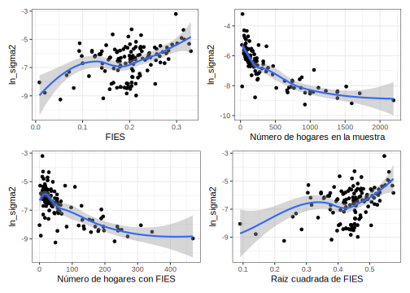
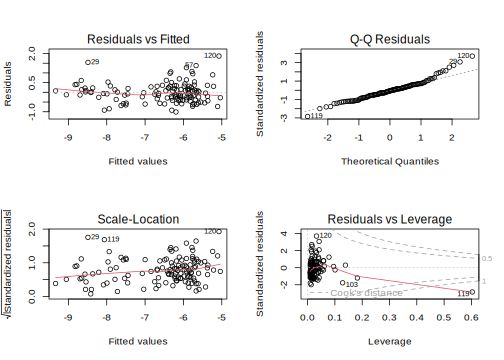
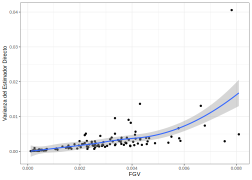
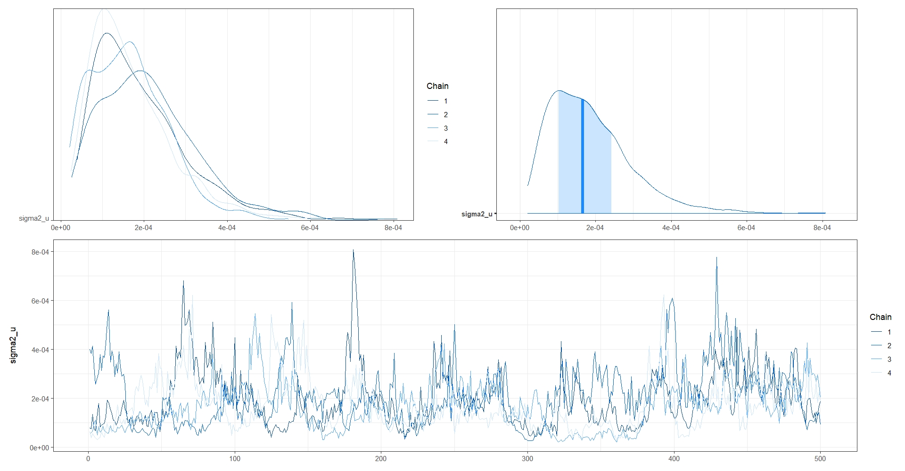
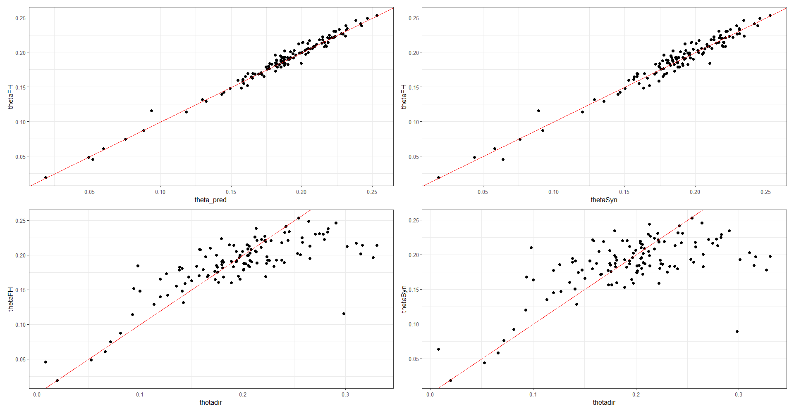
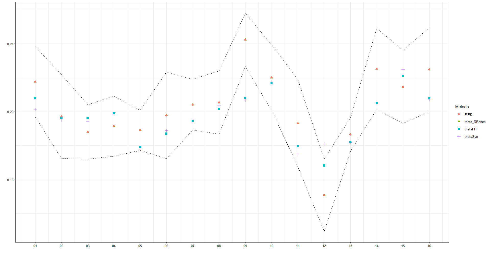

# Día 4 - Sesión 2- Modelo de área para inseguridad alimentaria


El índice FIES (Escala de Experiencia de Inseguridad Alimentaria) se define como un sistema de medición para la inseguridad alimentaria a nivel individual y del hogar. La FIES se basa en cuestionarios que preguntan sobre las experiencias de los individuos y hogares en relación con el acceso a alimentos seguros y nutritivos. Estos cuestionarios se utilizan para definir un modelo probabilístico que vincule la medida (desconocida) de la inseguridad alimentaria con las respuestas (observables) a los cuestionarios basados en la experiencia. El modelo más sencillo utilizado para esto es el modelo de Rasch.

Los indicadores definidos son los porcentajes de individuos de la población con edades a partir de 15 años que experimentan niveles de inseguridad alimentaria moderada o grave (IA moderada+grave) y grave (IA grave). Estos indicadores se calculan utilizando una escala numérica que va desde 0 hasta 40, donde 0 indica seguridad alimentaria total y 40 indica inseguridad alimentaria extrema. Los puntajes más altos en la escala indican una mayor gravedad de la inseguridad alimentaria.


## Modelo de Rash 

El modelo de Rasch es un modelo matemático utilizado para el análisis de datos en la medición de habilidades y características de los individuos. Este modelo es ampliamente utilizado en la educación, psicología, medicina y otras áreas de investigación.

El modelo de Rasch se basa en la teoría de respuesta al ítem, que establece que la probabilidad de que un individuo responda correctamente a un ítem en particular depende de la habilidad del individuo y de la dificultad del ítem. El modelo de Rasch supone que la habilidad de un individuo y la dificultad de un ítem se pueden medir en una misma escala de medida, y que esta escala es unidimensional y lineal.

La ecuación del modelo de Rasch es la siguiente:

$$
P_i(X_j=1) = \frac{\exp(a_i -b_j)}{1 + \exp(a_i -b_j)}
$$

donde $P_i(X_j=1)$ es la probabilidad de que el individuo $i$ responda correctamente al ítem $j$, $a_i$ es el nivel de habilidad del individuo $i$, $b_j$ es la dificultad del ítem $j$, y $X_j$ es una variable indicadora que toma el valor de 1 si el individuo $i$ responde correctamente al ítem $j$, y 0 en caso contrario.

El proceso de estimación de los parámetros del modelo de Rasch se lleva a cabo mediante un procedimiento de máxima verosimilitud. Este proceso permite estimar tanto los niveles de habilidad de los individuos como las dificultades de los ítems. En el caso de las encuestas complejas, se utilizan métodos de estimación de la verosimilitud basados en muestras complejas para ajustar los parámetros del modelo. Es importante tener en cuenta el diseño de muestreo y la ponderación de las observaciones al utilizar el modelo de Rasch en encuestas complejas.


## Fuentes de error en la estimación del FIES

1. Error de muestreo: Este error se produce debido a la variabilidad natural en los datos recopilados a partir de una muestra de la población. Cuanto mayor sea el tamaño de la muestra, menor será este error.

2. Error de medición: Este error se produce debido a la variabilidad en las respuestas proporcionadas por los encuestados. El modelo de Rasch utilizado para estimar la inseguridad alimentaria tiene en cuenta este error y proporciona estimaciones precisas.


Debido a que los errores de muestreo y medición se consideran independientes, estos se combinan para obtener el error estándar de la prevalencia mundial de la siguiente forma: 

$$
\sigma^{2}_{total} = (Error de Muestreo)^2 + (Error de Medición)^2
$$


## Modelo de área para la estimación del FIES

Sea $P_d$ la probabilidad de encontrar un hogar con inseguridad alimentaria  en el $d-$ésimo dominio de la población. Entonces, el estimador directo de $P_d$ se puede escribir como:  

$$
\hat{P}^{DIR}_{d} = P_d + e_d
$$

Ahora bien, $P_d$ se puede modelar de la siguiente manera,  

$$
P_d = \boldsymbol{x}^{T}_{d}\boldsymbol{\beta} + u_d
$$
Luego, reescribiendo $\hat{P}^{DIR}_{d}$ en términos de las dos ecuaciones anteriores tenemos:  

$$
\hat{P}^{DIR}_{d} = \boldsymbol{x}^{T}_{d}\boldsymbol{\beta} + u_d + e_d
$$

Ahora, es posible suponer que $\hat{P}^{DIR}_d \sim N(\boldsymbol{x}^{T}_{d}\boldsymbol \beta, \sigma_u^2 +\sigma_{e_d}^2)$, $\hat{P}^{DIR}_d \mid u_d \sim N(\boldsymbol{x}^{T}_{d}\boldsymbol \beta + u_d,\sigma_{e_d}^2)$ y $u_d \sim N(0, \sigma^2_u)$

Luego, se asumen distribuciones previas para $\boldsymbol{\beta}$ y $\sigma^2_u$

$$
\begin{eqnarray*}
\beta_p & \sim   & N(0, 10000)\\
\sigma^2_u &\sim & IG(0.0001, 0.0001)
\end{eqnarray*}
$$

por tanto, el estimador bayesiano para $P_d$ esta dado como $\tilde{P}_d = E\left(P_d\mid\hat{P}_d^{DIR}\right)$


## Procedimiento de estimación

Para iniciar con el proceso de estimación debemos ler la base de datos con la estimaciones directas y sus respectivas varianzas. 


```r
base_dir <- readRDS(file = "Recursos/Día4/Sesion2/Data/FIES_comuna.rds")
tba(head(base_dir))
```

<table class="table table-striped lightable-classic" style="width: auto !important; margin-left: auto; margin-right: auto; font-family: Arial Narrow; width: auto !important; margin-left: auto; margin-right: auto;">
 <thead>
  <tr>
   <th style="text-align:left;"> dam2 </th>
   <th style="text-align:right;"> n_upm </th>
   <th style="text-align:right;"> n_hogar </th>
   <th style="text-align:right;"> FIES </th>
   <th style="text-align:right;"> FIES_deff </th>
   <th style="text-align:right;"> se_m2 </th>
   <th style="text-align:right;"> se_s2 </th>
   <th style="text-align:right;"> var_hat </th>
  </tr>
 </thead>
<tbody>
  <tr>
   <td style="text-align:left;"> 01101 </td>
   <td style="text-align:right;"> 38 </td>
   <td style="text-align:right;"> 1709 </td>
   <td style="text-align:right;"> 0.2013 </td>
   <td style="text-align:right;"> 2.4752 </td>
   <td style="text-align:right;"> 0e+00 </td>
   <td style="text-align:right;"> 0.0002 </td>
   <td style="text-align:right;"> 0.0002 </td>
  </tr>
  <tr>
   <td style="text-align:left;"> 01107 </td>
   <td style="text-align:right;"> 16 </td>
   <td style="text-align:right;"> 768 </td>
   <td style="text-align:right;"> 0.2546 </td>
   <td style="text-align:right;"> 1.2430 </td>
   <td style="text-align:right;"> 1e-04 </td>
   <td style="text-align:right;"> 0.0002 </td>
   <td style="text-align:right;"> 0.0003 </td>
  </tr>
  <tr>
   <td style="text-align:left;"> 01401 </td>
   <td style="text-align:right;"> 2 </td>
   <td style="text-align:right;"> 62 </td>
   <td style="text-align:right;"> 0.2248 </td>
   <td style="text-align:right;"> 0.0323 </td>
   <td style="text-align:right;"> 4e-04 </td>
   <td style="text-align:right;"> 0.0001 </td>
   <td style="text-align:right;"> 0.0005 </td>
  </tr>
  <tr>
   <td style="text-align:left;"> 01402 </td>
   <td style="text-align:right;"> 2 </td>
   <td style="text-align:right;"> 25 </td>
   <td style="text-align:right;"> 0.0082 </td>
   <td style="text-align:right;"> 1.6012 </td>
   <td style="text-align:right;"> 2e-04 </td>
   <td style="text-align:right;"> 0.0001 </td>
   <td style="text-align:right;"> 0.0003 </td>
  </tr>
  <tr>
   <td style="text-align:left;"> 01404 </td>
   <td style="text-align:right;"> 2 </td>
   <td style="text-align:right;"> 23 </td>
   <td style="text-align:right;"> 0.2222 </td>
   <td style="text-align:right;"> 0.8933 </td>
   <td style="text-align:right;"> 2e-03 </td>
   <td style="text-align:right;"> 0.0051 </td>
   <td style="text-align:right;"> 0.0070 </td>
  </tr>
  <tr>
   <td style="text-align:left;"> 01405 </td>
   <td style="text-align:right;"> 3 </td>
   <td style="text-align:right;"> 64 </td>
   <td style="text-align:right;"> 0.1973 </td>
   <td style="text-align:right;"> 4.2808 </td>
   <td style="text-align:right;"> 9e-04 </td>
   <td style="text-align:right;"> 0.0073 </td>
   <td style="text-align:right;"> 0.0082 </td>
  </tr>
</tbody>
</table>

La base cuenta con las siguientes columnas: 

-   *dam2*: Corresponde al código asignado a la segunda división administrativa del país.

-   *n_upm*: Número de UPM seleccionadas en la comuna 

-   *n_hogar*: Número de hogares observados en la comuna.

-   *FIES*: Estimación puntual para la Escala de Experiencia de Inseguridad Alimentaria

-   *se_m2*: Cuadrado del error de muestral estimado. 

-   *se_s2*: Cuadrado del error de medición estimado.

-   *var_hat*: Suma del  cuadrado del error de muestra estimado y cuadrado del error de medición estimado.


### Función Generalizada de Varianza

El proceso inicia con la selección de los dominios que tiene 2 o más UPM y DEFF > 1. En el siguiente código se realiza la selección de los dominios y la transformación logarítmica de la varianza.  


```r
baseFGV <- base_dir %>% filter(n_upm >= 2 , FIES_deff >1) %>% 
   mutate(ln_sigma2 = log(var_hat))
```

la base resultante queda con 125. El siguiente bloque de código realiza los gráficos para explorar la relación entre `ln_sigma2` y diferentes variables independientes, como `FIES`, `n_hogar`, y la raíz cuadrada de la FIES. La elección de utilizar la función "loess" para suavizar las líneas en lugar de una línea recta puede ayudar a visualizar mejor las tendencias generales en los datos.


```r
theme_set(theme_bw())

# pobreza vs Ln_sigma2 #

p1 <- ggplot(baseFGV, aes(x = FIES, y = ln_sigma2)) +
  geom_point() +
  geom_smooth(method = "loess") +
  xlab("FIES")

# Tamaño de muestra vs Ln_sigma2 #

p2 <- ggplot(baseFGV, aes(x = n_hogar, y = ln_sigma2)) + 
  geom_point() +
  geom_smooth(method = "loess") + 
  xlab("Número de hogares en la muestra")

# Número de pobres vs Ln_sigma2 #

p3 <- ggplot(baseFGV, 
             aes(x = FIES * n_hogar, y = ln_sigma2)) + 
  geom_point() +
  geom_smooth(method = "loess") + 
  xlab("Número de hogares con FIES")

# Raiz_pobreza vs Ln_sigma2 #

p4 <- ggplot(baseFGV, 
             aes(x = sqrt(FIES), y = ln_sigma2)) + 
  geom_point() +
  geom_smooth(method = "loess") + 
  xlab("Raiz cuadrada de FIES")

library(patchwork)
(p1 | p2) / (p3 | p4)
```



#### Modelo para la varianza

El código ajusta un modelo de regresión lineal múltiple (utilizando la función `lm()`), donde `ln_sigma2` es la variable respuesta y las variables predictoras son `FIES`, `n_hogar`, y varias transformaciones de éstas. El objetivo de este modelo es estimar la función generalizada de varianza (FGV) para los dominios observados.


```r
library(gtsummary)
FGV1 <- lm(ln_sigma2 ~ n_hogar + 
             I(n_hogar^2) + I(sqrt(FIES)),
     data = baseFGV)

tbl_regression(FGV1,estimate_fun = function(x) round(x, 10)) %>% 
  add_glance_table(include = c(r.squared, adj.r.squared))
```

```{=html}
<div id="fpgqlqenpz" style="padding-left:0px;padding-right:0px;padding-top:10px;padding-bottom:10px;overflow-x:auto;overflow-y:auto;width:auto;height:auto;">
<style>html {
  font-family: -apple-system, BlinkMacSystemFont, 'Segoe UI', Roboto, Oxygen, Ubuntu, Cantarell, 'Helvetica Neue', 'Fira Sans', 'Droid Sans', Arial, sans-serif;
}

#fpgqlqenpz .gt_table {
  display: table;
  border-collapse: collapse;
  margin-left: auto;
  margin-right: auto;
  color: #333333;
  font-size: 16px;
  font-weight: normal;
  font-style: normal;
  background-color: #FFFFFF;
  width: auto;
  border-top-style: solid;
  border-top-width: 2px;
  border-top-color: #A8A8A8;
  border-right-style: none;
  border-right-width: 2px;
  border-right-color: #D3D3D3;
  border-bottom-style: solid;
  border-bottom-width: 2px;
  border-bottom-color: #A8A8A8;
  border-left-style: none;
  border-left-width: 2px;
  border-left-color: #D3D3D3;
}

#fpgqlqenpz .gt_heading {
  background-color: #FFFFFF;
  text-align: center;
  border-bottom-color: #FFFFFF;
  border-left-style: none;
  border-left-width: 1px;
  border-left-color: #D3D3D3;
  border-right-style: none;
  border-right-width: 1px;
  border-right-color: #D3D3D3;
}

#fpgqlqenpz .gt_caption {
  padding-top: 4px;
  padding-bottom: 4px;
}

#fpgqlqenpz .gt_title {
  color: #333333;
  font-size: 125%;
  font-weight: initial;
  padding-top: 4px;
  padding-bottom: 4px;
  padding-left: 5px;
  padding-right: 5px;
  border-bottom-color: #FFFFFF;
  border-bottom-width: 0;
}

#fpgqlqenpz .gt_subtitle {
  color: #333333;
  font-size: 85%;
  font-weight: initial;
  padding-top: 0;
  padding-bottom: 6px;
  padding-left: 5px;
  padding-right: 5px;
  border-top-color: #FFFFFF;
  border-top-width: 0;
}

#fpgqlqenpz .gt_bottom_border {
  border-bottom-style: solid;
  border-bottom-width: 2px;
  border-bottom-color: #D3D3D3;
}

#fpgqlqenpz .gt_col_headings {
  border-top-style: solid;
  border-top-width: 2px;
  border-top-color: #D3D3D3;
  border-bottom-style: solid;
  border-bottom-width: 2px;
  border-bottom-color: #D3D3D3;
  border-left-style: none;
  border-left-width: 1px;
  border-left-color: #D3D3D3;
  border-right-style: none;
  border-right-width: 1px;
  border-right-color: #D3D3D3;
}

#fpgqlqenpz .gt_col_heading {
  color: #333333;
  background-color: #FFFFFF;
  font-size: 100%;
  font-weight: normal;
  text-transform: inherit;
  border-left-style: none;
  border-left-width: 1px;
  border-left-color: #D3D3D3;
  border-right-style: none;
  border-right-width: 1px;
  border-right-color: #D3D3D3;
  vertical-align: bottom;
  padding-top: 5px;
  padding-bottom: 6px;
  padding-left: 5px;
  padding-right: 5px;
  overflow-x: hidden;
}

#fpgqlqenpz .gt_column_spanner_outer {
  color: #333333;
  background-color: #FFFFFF;
  font-size: 100%;
  font-weight: normal;
  text-transform: inherit;
  padding-top: 0;
  padding-bottom: 0;
  padding-left: 4px;
  padding-right: 4px;
}

#fpgqlqenpz .gt_column_spanner_outer:first-child {
  padding-left: 0;
}

#fpgqlqenpz .gt_column_spanner_outer:last-child {
  padding-right: 0;
}

#fpgqlqenpz .gt_column_spanner {
  border-bottom-style: solid;
  border-bottom-width: 2px;
  border-bottom-color: #D3D3D3;
  vertical-align: bottom;
  padding-top: 5px;
  padding-bottom: 5px;
  overflow-x: hidden;
  display: inline-block;
  width: 100%;
}

#fpgqlqenpz .gt_group_heading {
  padding-top: 8px;
  padding-bottom: 8px;
  padding-left: 5px;
  padding-right: 5px;
  color: #333333;
  background-color: #FFFFFF;
  font-size: 100%;
  font-weight: initial;
  text-transform: inherit;
  border-top-style: solid;
  border-top-width: 2px;
  border-top-color: #D3D3D3;
  border-bottom-style: solid;
  border-bottom-width: 2px;
  border-bottom-color: #D3D3D3;
  border-left-style: none;
  border-left-width: 1px;
  border-left-color: #D3D3D3;
  border-right-style: none;
  border-right-width: 1px;
  border-right-color: #D3D3D3;
  vertical-align: middle;
  text-align: left;
}

#fpgqlqenpz .gt_empty_group_heading {
  padding: 0.5px;
  color: #333333;
  background-color: #FFFFFF;
  font-size: 100%;
  font-weight: initial;
  border-top-style: solid;
  border-top-width: 2px;
  border-top-color: #D3D3D3;
  border-bottom-style: solid;
  border-bottom-width: 2px;
  border-bottom-color: #D3D3D3;
  vertical-align: middle;
}

#fpgqlqenpz .gt_from_md > :first-child {
  margin-top: 0;
}

#fpgqlqenpz .gt_from_md > :last-child {
  margin-bottom: 0;
}

#fpgqlqenpz .gt_row {
  padding-top: 8px;
  padding-bottom: 8px;
  padding-left: 5px;
  padding-right: 5px;
  margin: 10px;
  border-top-style: solid;
  border-top-width: 1px;
  border-top-color: #D3D3D3;
  border-left-style: none;
  border-left-width: 1px;
  border-left-color: #D3D3D3;
  border-right-style: none;
  border-right-width: 1px;
  border-right-color: #D3D3D3;
  vertical-align: middle;
  overflow-x: hidden;
}

#fpgqlqenpz .gt_stub {
  color: #333333;
  background-color: #FFFFFF;
  font-size: 100%;
  font-weight: initial;
  text-transform: inherit;
  border-right-style: solid;
  border-right-width: 2px;
  border-right-color: #D3D3D3;
  padding-left: 5px;
  padding-right: 5px;
}

#fpgqlqenpz .gt_stub_row_group {
  color: #333333;
  background-color: #FFFFFF;
  font-size: 100%;
  font-weight: initial;
  text-transform: inherit;
  border-right-style: solid;
  border-right-width: 2px;
  border-right-color: #D3D3D3;
  padding-left: 5px;
  padding-right: 5px;
  vertical-align: top;
}

#fpgqlqenpz .gt_row_group_first td {
  border-top-width: 2px;
}

#fpgqlqenpz .gt_summary_row {
  color: #333333;
  background-color: #FFFFFF;
  text-transform: inherit;
  padding-top: 8px;
  padding-bottom: 8px;
  padding-left: 5px;
  padding-right: 5px;
}

#fpgqlqenpz .gt_first_summary_row {
  border-top-style: solid;
  border-top-color: #D3D3D3;
}

#fpgqlqenpz .gt_first_summary_row.thick {
  border-top-width: 2px;
}

#fpgqlqenpz .gt_last_summary_row {
  padding-top: 8px;
  padding-bottom: 8px;
  padding-left: 5px;
  padding-right: 5px;
  border-bottom-style: solid;
  border-bottom-width: 2px;
  border-bottom-color: #D3D3D3;
}

#fpgqlqenpz .gt_grand_summary_row {
  color: #333333;
  background-color: #FFFFFF;
  text-transform: inherit;
  padding-top: 8px;
  padding-bottom: 8px;
  padding-left: 5px;
  padding-right: 5px;
}

#fpgqlqenpz .gt_first_grand_summary_row {
  padding-top: 8px;
  padding-bottom: 8px;
  padding-left: 5px;
  padding-right: 5px;
  border-top-style: double;
  border-top-width: 6px;
  border-top-color: #D3D3D3;
}

#fpgqlqenpz .gt_striped {
  background-color: rgba(128, 128, 128, 0.05);
}

#fpgqlqenpz .gt_table_body {
  border-top-style: solid;
  border-top-width: 2px;
  border-top-color: #D3D3D3;
  border-bottom-style: solid;
  border-bottom-width: 2px;
  border-bottom-color: #D3D3D3;
}

#fpgqlqenpz .gt_footnotes {
  color: #333333;
  background-color: #FFFFFF;
  border-bottom-style: none;
  border-bottom-width: 2px;
  border-bottom-color: #D3D3D3;
  border-left-style: none;
  border-left-width: 2px;
  border-left-color: #D3D3D3;
  border-right-style: none;
  border-right-width: 2px;
  border-right-color: #D3D3D3;
}

#fpgqlqenpz .gt_footnote {
  margin: 0px;
  font-size: 90%;
  padding-left: 4px;
  padding-right: 4px;
  padding-left: 5px;
  padding-right: 5px;
}

#fpgqlqenpz .gt_sourcenotes {
  color: #333333;
  background-color: #FFFFFF;
  border-bottom-style: none;
  border-bottom-width: 2px;
  border-bottom-color: #D3D3D3;
  border-left-style: none;
  border-left-width: 2px;
  border-left-color: #D3D3D3;
  border-right-style: none;
  border-right-width: 2px;
  border-right-color: #D3D3D3;
}

#fpgqlqenpz .gt_sourcenote {
  font-size: 90%;
  padding-top: 4px;
  padding-bottom: 4px;
  padding-left: 5px;
  padding-right: 5px;
}

#fpgqlqenpz .gt_left {
  text-align: left;
}

#fpgqlqenpz .gt_center {
  text-align: center;
}

#fpgqlqenpz .gt_right {
  text-align: right;
  font-variant-numeric: tabular-nums;
}

#fpgqlqenpz .gt_font_normal {
  font-weight: normal;
}

#fpgqlqenpz .gt_font_bold {
  font-weight: bold;
}

#fpgqlqenpz .gt_font_italic {
  font-style: italic;
}

#fpgqlqenpz .gt_super {
  font-size: 65%;
}

#fpgqlqenpz .gt_footnote_marks {
  font-style: italic;
  font-weight: normal;
  font-size: 75%;
  vertical-align: 0.4em;
}

#fpgqlqenpz .gt_asterisk {
  font-size: 100%;
  vertical-align: 0;
}

#fpgqlqenpz .gt_indent_1 {
  text-indent: 5px;
}

#fpgqlqenpz .gt_indent_2 {
  text-indent: 10px;
}

#fpgqlqenpz .gt_indent_3 {
  text-indent: 15px;
}

#fpgqlqenpz .gt_indent_4 {
  text-indent: 20px;
}

#fpgqlqenpz .gt_indent_5 {
  text-indent: 25px;
}
</style>
<table class="gt_table">
  
  <thead class="gt_col_headings">
    <tr>
      <th class="gt_col_heading gt_columns_bottom_border gt_left" rowspan="1" colspan="1" scope="col" id="&lt;strong&gt;Characteristic&lt;/strong&gt;"><strong>Characteristic</strong></th>
      <th class="gt_col_heading gt_columns_bottom_border gt_center" rowspan="1" colspan="1" scope="col" id="&lt;strong&gt;Beta&lt;/strong&gt;"><strong>Beta</strong></th>
      <th class="gt_col_heading gt_columns_bottom_border gt_center" rowspan="1" colspan="1" scope="col" id="&lt;strong&gt;95% CI&lt;/strong&gt;&lt;sup class=&quot;gt_footnote_marks&quot;&gt;1&lt;/sup&gt;"><strong>95% CI</strong><sup class="gt_footnote_marks">1</sup></th>
      <th class="gt_col_heading gt_columns_bottom_border gt_center" rowspan="1" colspan="1" scope="col" id="&lt;strong&gt;p-value&lt;/strong&gt;"><strong>p-value</strong></th>
    </tr>
  </thead>
  <tbody class="gt_table_body">
    <tr><td headers="label" class="gt_row gt_left">n_hogar</td>
<td headers="estimate" class="gt_row gt_center">-0.0041425883</td>
<td headers="ci" class="gt_row gt_center">-0.0047831346, -0.0035020419</td>
<td headers="p.value" class="gt_row gt_center"><0.001</td></tr>
    <tr><td headers="label" class="gt_row gt_left">I(n_hogar^2)</td>
<td headers="estimate" class="gt_row gt_center">1.3354e-06</td>
<td headers="ci" class="gt_row gt_center">9.394e-07, 1.7314e-06</td>
<td headers="p.value" class="gt_row gt_center"><0.001</td></tr>
    <tr><td headers="label" class="gt_row gt_left">I(sqrt(FIES))</td>
<td headers="estimate" class="gt_row gt_center">5.3541086305</td>
<td headers="ci" class="gt_row gt_center">4.1765258265, 6.5316914346</td>
<td headers="p.value" class="gt_row gt_center"><0.001</td></tr>
    <tr><td headers="label" class="gt_row gt_left" style="border-top-width: 2px; border-top-style: solid; border-top-color: #D3D3D3;">R²</td>
<td headers="estimate" class="gt_row gt_center" style="border-top-width: 2px; border-top-style: solid; border-top-color: #D3D3D3;">0.809</td>
<td headers="ci" class="gt_row gt_center" style="border-top-width: 2px; border-top-style: solid; border-top-color: #D3D3D3;"></td>
<td headers="p.value" class="gt_row gt_center" style="border-top-width: 2px; border-top-style: solid; border-top-color: #D3D3D3;"></td></tr>
    <tr><td headers="label" class="gt_row gt_left">Adjusted R²</td>
<td headers="estimate" class="gt_row gt_center">0.804</td>
<td headers="ci" class="gt_row gt_center"></td>
<td headers="p.value" class="gt_row gt_center"></td></tr>
  </tbody>
  
  <tfoot class="gt_footnotes">
    <tr>
      <td class="gt_footnote" colspan="4"><sup class="gt_footnote_marks">1</sup> CI = Confidence Interval</td>
    </tr>
  </tfoot>
</table>
</div>
```


Después de tener la estimación del modelo se debe obtener el  valor de la constante $\Delta$ para lo cual se usa el siguiente código. 


```r
delta.hat = sum(baseFGV$var_hat) / 
  sum(exp(fitted.values(FGV1)))
```

De donde se obtiene que $\Delta = 1.2490452$. Final es posible obtener la varianza suavizada  ejecutando el siguiente comando.  


```r
hat.sigma <- 
  data.frame(dam2 = baseFGV$dam2,
             hat_varFGV = delta.hat * exp(fitted.values(FGV1)))

baseFGV <- left_join(baseFGV, hat.sigma)
tba(head(baseFGV, 10))
```

<table class="table table-striped lightable-classic" style="width: auto !important; margin-left: auto; margin-right: auto; font-family: Arial Narrow; width: auto !important; margin-left: auto; margin-right: auto;">
 <thead>
  <tr>
   <th style="text-align:left;"> dam2 </th>
   <th style="text-align:right;"> n_upm </th>
   <th style="text-align:right;"> n_hogar </th>
   <th style="text-align:right;"> FIES </th>
   <th style="text-align:right;"> FIES_deff </th>
   <th style="text-align:right;"> se_m2 </th>
   <th style="text-align:right;"> se_s2 </th>
   <th style="text-align:right;"> var_hat </th>
   <th style="text-align:right;"> ln_sigma2 </th>
   <th style="text-align:right;"> hat_varFGV </th>
  </tr>
 </thead>
<tbody>
  <tr>
   <td style="text-align:left;"> 01101 </td>
   <td style="text-align:right;"> 38 </td>
   <td style="text-align:right;"> 1709 </td>
   <td style="text-align:right;"> 0.2013 </td>
   <td style="text-align:right;"> 2.4752 </td>
   <td style="text-align:right;"> 0e+00 </td>
   <td style="text-align:right;"> 0.0002 </td>
   <td style="text-align:right;"> 0.0002 </td>
   <td style="text-align:right;"> -8.5111 </td>
   <td style="text-align:right;"> 0.0002 </td>
  </tr>
  <tr>
   <td style="text-align:left;"> 01107 </td>
   <td style="text-align:right;"> 16 </td>
   <td style="text-align:right;"> 768 </td>
   <td style="text-align:right;"> 0.2546 </td>
   <td style="text-align:right;"> 1.2430 </td>
   <td style="text-align:right;"> 1e-04 </td>
   <td style="text-align:right;"> 0.0002 </td>
   <td style="text-align:right;"> 0.0003 </td>
   <td style="text-align:right;"> -8.1565 </td>
   <td style="text-align:right;"> 0.0006 </td>
  </tr>
  <tr>
   <td style="text-align:left;"> 01402 </td>
   <td style="text-align:right;"> 2 </td>
   <td style="text-align:right;"> 25 </td>
   <td style="text-align:right;"> 0.0082 </td>
   <td style="text-align:right;"> 1.6012 </td>
   <td style="text-align:right;"> 2e-04 </td>
   <td style="text-align:right;"> 0.0001 </td>
   <td style="text-align:right;"> 0.0003 </td>
   <td style="text-align:right;"> -8.0496 </td>
   <td style="text-align:right;"> 0.0007 </td>
  </tr>
  <tr>
   <td style="text-align:left;"> 01405 </td>
   <td style="text-align:right;"> 3 </td>
   <td style="text-align:right;"> 64 </td>
   <td style="text-align:right;"> 0.1973 </td>
   <td style="text-align:right;"> 4.2808 </td>
   <td style="text-align:right;"> 9e-04 </td>
   <td style="text-align:right;"> 0.0073 </td>
   <td style="text-align:right;"> 0.0082 </td>
   <td style="text-align:right;"> -4.8015 </td>
   <td style="text-align:right;"> 0.0040 </td>
  </tr>
  <tr>
   <td style="text-align:left;"> 02101 </td>
   <td style="text-align:right;"> 32 </td>
   <td style="text-align:right;"> 1516 </td>
   <td style="text-align:right;"> 0.2044 </td>
   <td style="text-align:right;"> 3.5517 </td>
   <td style="text-align:right;"> 0e+00 </td>
   <td style="text-align:right;"> 0.0003 </td>
   <td style="text-align:right;"> 0.0003 </td>
   <td style="text-align:right;"> -8.0535 </td>
   <td style="text-align:right;"> 0.0002 </td>
  </tr>
  <tr>
   <td style="text-align:left;"> 02104 </td>
   <td style="text-align:right;"> 3 </td>
   <td style="text-align:right;"> 67 </td>
   <td style="text-align:right;"> 0.1797 </td>
   <td style="text-align:right;"> 1.4460 </td>
   <td style="text-align:right;"> 6e-04 </td>
   <td style="text-align:right;"> 0.0025 </td>
   <td style="text-align:right;"> 0.0030 </td>
   <td style="text-align:right;"> -5.7958 </td>
   <td style="text-align:right;"> 0.0035 </td>
  </tr>
  <tr>
   <td style="text-align:left;"> 02201 </td>
   <td style="text-align:right;"> 13 </td>
   <td style="text-align:right;"> 514 </td>
   <td style="text-align:right;"> 0.1614 </td>
   <td style="text-align:right;"> 1.1455 </td>
   <td style="text-align:right;"> 1e-04 </td>
   <td style="text-align:right;"> 0.0002 </td>
   <td style="text-align:right;"> 0.0003 </td>
   <td style="text-align:right;"> -8.1499 </td>
   <td style="text-align:right;"> 0.0007 </td>
  </tr>
  <tr>
   <td style="text-align:left;"> 03101 </td>
   <td style="text-align:right;"> 31 </td>
   <td style="text-align:right;"> 1390 </td>
   <td style="text-align:right;"> 0.1938 </td>
   <td style="text-align:right;"> 1.4327 </td>
   <td style="text-align:right;"> 0e+00 </td>
   <td style="text-align:right;"> 0.0001 </td>
   <td style="text-align:right;"> 0.0001 </td>
   <td style="text-align:right;"> -8.8321 </td>
   <td style="text-align:right;"> 0.0002 </td>
  </tr>
  <tr>
   <td style="text-align:left;"> 04101 </td>
   <td style="text-align:right;"> 16 </td>
   <td style="text-align:right;"> 741 </td>
   <td style="text-align:right;"> 0.2054 </td>
   <td style="text-align:right;"> 2.5032 </td>
   <td style="text-align:right;"> 0e+00 </td>
   <td style="text-align:right;"> 0.0004 </td>
   <td style="text-align:right;"> 0.0005 </td>
   <td style="text-align:right;"> -7.6549 </td>
   <td style="text-align:right;"> 0.0005 </td>
  </tr>
  <tr>
   <td style="text-align:left;"> 04102 </td>
   <td style="text-align:right;"> 15 </td>
   <td style="text-align:right;"> 696 </td>
   <td style="text-align:right;"> 0.1938 </td>
   <td style="text-align:right;"> 1.4370 </td>
   <td style="text-align:right;"> 0e+00 </td>
   <td style="text-align:right;"> 0.0003 </td>
   <td style="text-align:right;"> 0.0003 </td>
   <td style="text-align:right;"> -8.1216 </td>
   <td style="text-align:right;"> 0.0005 </td>
  </tr>
</tbody>
</table>

 Validación del modelo para la FGV


```r
par(mfrow = c(2, 2))
plot(FGV1)
```




Comparación entre la varianza estimada versus la pronosticada por la FGV


```r
ggplot(baseFGV , 
       aes(y = var_hat, x = hat_varFGV)) + 
  geom_point() +
  geom_smooth(method = "loess") + 
    labs(x = "FGV", y = "VarDirEst") +
  ylab("Varianza del Estimador Directo")
```



Predicción de la varianza suavizada

El siguiente código realiza las siguientes operaciones:

  -   La variable `FIES_deff` se ajusta a 1 cuando es NaN.
  
  -   La variable `deff_FGV` se calcula a partir de otras dos variables `hat_varFGV` y `var_hat` Si `var_hat` es 0, entonces `deff_FGV` se ajusta a 1. En caso contrario, se divide `hat_varFGV` por `var_hat / FIES_deff` para obtener `deff_FGV.`

  -   La variable `deff_FGV` se regulariza utilizando el criterio MDS: si `deff_FGV` es menor que 1, se ajusta a 1.
  
  -   Finalmente, se calcula la variable `n_eff_FGV` dividiendo `n_hogares`  por `deff_FGV.`


```r
base_FH <- baseFGV  %>%
  mutate(
    FIES_deff = ifelse(is.nan(FIES_deff), 1,
                         FIES_deff),
    deff_FGV = ifelse(
      var_hat == 0 ,
      1,
      hat_varFGV / (var_hat / FIES_deff)
    ),
    # Criterio MDS para regularizar el DeffFGV
    deff_FGV = ifelse(deff_FGV < 1, 1, deff_FGV),
    n_eff_FGV = n_hogar / deff_FGV
  )

saveRDS(object = base_FH, "Recursos/Día4/Sesion2/Data/base_FH_FIES.rds")
```


#### Estimación del modelo de área 

Este código utiliza las librerías `tidyverse` y `magrittr` para procesamiento y analizar datos.


```r
library(tidyverse)
library(magrittr)

base_FH <- readRDS("Recursos/Día4/Sesion2/Data/base_FH_FIES.rds") %>% 
  dplyr::select(dam2, nd = n_hogar,  FIES, hat_var = hat_varFGV)
```

Lectura de las covariables, las cuales son obtenidas previamente. Dado la diferencia entre las escalas de las variables  es necesario hacer un ajuste a estas. 


```r
statelevel_predictors_df <- readRDS("Recursos/Día4/Sesion2/Data/statelevel_predictors_df_dam2.rds") %>% 
    mutate_at(.vars = c("luces_nocturnas",
                      "cubrimiento_cultivo",
                      "cubrimiento_urbano",
                      "modificacion_humana",
                      "accesibilidad_hospitales",
                      "accesibilidad_hosp_caminado"),
            function(x) as.numeric(scale(x)))
```

Ahora, se realiza una unión completa (`full_join`) entre el conjunto de datos `base_FH` y los predictores `statelevel_predictors_df` utilizando la variable `dam2` como clave de unión.


```r
base_FH <- full_join(base_FH, statelevel_predictors_df, by = "dam2" )
tba(base_FH[1:10,1:8])
```

<table class="table table-striped lightable-classic" style="width: auto !important; margin-left: auto; margin-right: auto; font-family: Arial Narrow; width: auto !important; margin-left: auto; margin-right: auto;">
 <thead>
  <tr>
   <th style="text-align:left;"> dam2 </th>
   <th style="text-align:right;"> nd </th>
   <th style="text-align:right;"> FIES </th>
   <th style="text-align:right;"> hat_var </th>
   <th style="text-align:right;"> area0 </th>
   <th style="text-align:right;"> area1 </th>
   <th style="text-align:right;"> etnia2 </th>
   <th style="text-align:right;"> sexo2 </th>
  </tr>
 </thead>
<tbody>
  <tr>
   <td style="text-align:left;"> 01101 </td>
   <td style="text-align:right;"> 1709 </td>
   <td style="text-align:right;"> 0.2013 </td>
   <td style="text-align:right;"> 0.0002 </td>
   <td style="text-align:right;"> 0.0126 </td>
   <td style="text-align:right;"> 0.9874 </td>
   <td style="text-align:right;"> 0.0016 </td>
   <td style="text-align:right;"> 0.5044 </td>
  </tr>
  <tr>
   <td style="text-align:left;"> 01107 </td>
   <td style="text-align:right;"> 768 </td>
   <td style="text-align:right;"> 0.2546 </td>
   <td style="text-align:right;"> 0.0006 </td>
   <td style="text-align:right;"> 0.0230 </td>
   <td style="text-align:right;"> 0.9770 </td>
   <td style="text-align:right;"> 0.0011 </td>
   <td style="text-align:right;"> 0.4998 </td>
  </tr>
  <tr>
   <td style="text-align:left;"> 01402 </td>
   <td style="text-align:right;"> 25 </td>
   <td style="text-align:right;"> 0.0082 </td>
   <td style="text-align:right;"> 0.0007 </td>
   <td style="text-align:right;"> 1.0000 </td>
   <td style="text-align:right;"> 0.0000 </td>
   <td style="text-align:right;"> 0.0000 </td>
   <td style="text-align:right;"> 0.4744 </td>
  </tr>
  <tr>
   <td style="text-align:left;"> 01405 </td>
   <td style="text-align:right;"> 64 </td>
   <td style="text-align:right;"> 0.1973 </td>
   <td style="text-align:right;"> 0.0040 </td>
   <td style="text-align:right;"> 0.5792 </td>
   <td style="text-align:right;"> 0.4208 </td>
   <td style="text-align:right;"> 0.0016 </td>
   <td style="text-align:right;"> 0.2954 </td>
  </tr>
  <tr>
   <td style="text-align:left;"> 02101 </td>
   <td style="text-align:right;"> 1516 </td>
   <td style="text-align:right;"> 0.2044 </td>
   <td style="text-align:right;"> 0.0002 </td>
   <td style="text-align:right;"> 0.0215 </td>
   <td style="text-align:right;"> 0.9785 </td>
   <td style="text-align:right;"> 0.0010 </td>
   <td style="text-align:right;"> 0.4975 </td>
  </tr>
  <tr>
   <td style="text-align:left;"> 02104 </td>
   <td style="text-align:right;"> 67 </td>
   <td style="text-align:right;"> 0.1797 </td>
   <td style="text-align:right;"> 0.0035 </td>
   <td style="text-align:right;"> 0.1648 </td>
   <td style="text-align:right;"> 0.8352 </td>
   <td style="text-align:right;"> 0.0002 </td>
   <td style="text-align:right;"> 0.4382 </td>
  </tr>
  <tr>
   <td style="text-align:left;"> 02201 </td>
   <td style="text-align:right;"> 514 </td>
   <td style="text-align:right;"> 0.1614 </td>
   <td style="text-align:right;"> 0.0007 </td>
   <td style="text-align:right;"> 0.0437 </td>
   <td style="text-align:right;"> 0.9563 </td>
   <td style="text-align:right;"> 0.0004 </td>
   <td style="text-align:right;"> 0.4808 </td>
  </tr>
  <tr>
   <td style="text-align:left;"> 03101 </td>
   <td style="text-align:right;"> 1390 </td>
   <td style="text-align:right;"> 0.1938 </td>
   <td style="text-align:right;"> 0.0002 </td>
   <td style="text-align:right;"> 0.0193 </td>
   <td style="text-align:right;"> 0.9807 </td>
   <td style="text-align:right;"> 0.0006 </td>
   <td style="text-align:right;"> 0.5022 </td>
  </tr>
  <tr>
   <td style="text-align:left;"> 04101 </td>
   <td style="text-align:right;"> 741 </td>
   <td style="text-align:right;"> 0.2054 </td>
   <td style="text-align:right;"> 0.0005 </td>
   <td style="text-align:right;"> 0.0923 </td>
   <td style="text-align:right;"> 0.9077 </td>
   <td style="text-align:right;"> 0.0004 </td>
   <td style="text-align:right;"> 0.5212 </td>
  </tr>
  <tr>
   <td style="text-align:left;"> 04102 </td>
   <td style="text-align:right;"> 696 </td>
   <td style="text-align:right;"> 0.1938 </td>
   <td style="text-align:right;"> 0.0005 </td>
   <td style="text-align:right;"> 0.0579 </td>
   <td style="text-align:right;"> 0.9421 </td>
   <td style="text-align:right;"> 0.0003 </td>
   <td style="text-align:right;"> 0.5175 </td>
  </tr>
</tbody>
</table>

```r
# View(base_FH)
```


  1.    Dividir la base de datos en dominios observados y no observados.
    
  Dominios observados.
    

```r
data_dir <- base_FH %>% filter(!is.na(FIES))
```

  Dominios NO observados.
    

```r
data_syn <-
  base_FH %>% anti_join(data_dir %>% select(dam2))
tba(data_syn[1:10,1:8])
```

<table class="table table-striped lightable-classic" style="width: auto !important; margin-left: auto; margin-right: auto; font-family: Arial Narrow; width: auto !important; margin-left: auto; margin-right: auto;">
 <thead>
  <tr>
   <th style="text-align:left;"> dam2 </th>
   <th style="text-align:right;"> nd </th>
   <th style="text-align:right;"> FIES </th>
   <th style="text-align:right;"> hat_var </th>
   <th style="text-align:right;"> area0 </th>
   <th style="text-align:right;"> area1 </th>
   <th style="text-align:right;"> etnia2 </th>
   <th style="text-align:right;"> sexo2 </th>
  </tr>
 </thead>
<tbody>
  <tr>
   <td style="text-align:left;"> 01401 </td>
   <td style="text-align:right;"> NA </td>
   <td style="text-align:right;"> NA </td>
   <td style="text-align:right;"> NA </td>
   <td style="text-align:right;"> 0.3575 </td>
   <td style="text-align:right;"> 0.6425 </td>
   <td style="text-align:right;"> 0.0004 </td>
   <td style="text-align:right;"> 0.4280 </td>
  </tr>
  <tr>
   <td style="text-align:left;"> 01403 </td>
   <td style="text-align:right;"> NA </td>
   <td style="text-align:right;"> NA </td>
   <td style="text-align:right;"> NA </td>
   <td style="text-align:right;"> 1.0000 </td>
   <td style="text-align:right;"> 0.0000 </td>
   <td style="text-align:right;"> 0.0006 </td>
   <td style="text-align:right;"> 0.4242 </td>
  </tr>
  <tr>
   <td style="text-align:left;"> 01404 </td>
   <td style="text-align:right;"> NA </td>
   <td style="text-align:right;"> NA </td>
   <td style="text-align:right;"> NA </td>
   <td style="text-align:right;"> 0.5938 </td>
   <td style="text-align:right;"> 0.4062 </td>
   <td style="text-align:right;"> 0.0011 </td>
   <td style="text-align:right;"> 0.4502 </td>
  </tr>
  <tr>
   <td style="text-align:left;"> 02102 </td>
   <td style="text-align:right;"> NA </td>
   <td style="text-align:right;"> NA </td>
   <td style="text-align:right;"> NA </td>
   <td style="text-align:right;"> 0.0381 </td>
   <td style="text-align:right;"> 0.9619 </td>
   <td style="text-align:right;"> 0.0008 </td>
   <td style="text-align:right;"> 0.4034 </td>
  </tr>
  <tr>
   <td style="text-align:left;"> 02103 </td>
   <td style="text-align:right;"> NA </td>
   <td style="text-align:right;"> NA </td>
   <td style="text-align:right;"> NA </td>
   <td style="text-align:right;"> 1.0000 </td>
   <td style="text-align:right;"> 0.0000 </td>
   <td style="text-align:right;"> 0.0014 </td>
   <td style="text-align:right;"> 0.1496 </td>
  </tr>
  <tr>
   <td style="text-align:left;"> 02202 </td>
   <td style="text-align:right;"> NA </td>
   <td style="text-align:right;"> NA </td>
   <td style="text-align:right;"> NA </td>
   <td style="text-align:right;"> 1.0000 </td>
   <td style="text-align:right;"> 0.0000 </td>
   <td style="text-align:right;"> 0.0000 </td>
   <td style="text-align:right;"> 0.3551 </td>
  </tr>
  <tr>
   <td style="text-align:left;"> 02203 </td>
   <td style="text-align:right;"> NA </td>
   <td style="text-align:right;"> NA </td>
   <td style="text-align:right;"> NA </td>
   <td style="text-align:right;"> 0.4976 </td>
   <td style="text-align:right;"> 0.5024 </td>
   <td style="text-align:right;"> 0.0010 </td>
   <td style="text-align:right;"> 0.4397 </td>
  </tr>
  <tr>
   <td style="text-align:left;"> 02301 </td>
   <td style="text-align:right;"> NA </td>
   <td style="text-align:right;"> NA </td>
   <td style="text-align:right;"> NA </td>
   <td style="text-align:right;"> 0.0220 </td>
   <td style="text-align:right;"> 0.9780 </td>
   <td style="text-align:right;"> 0.0004 </td>
   <td style="text-align:right;"> 0.5044 </td>
  </tr>
  <tr>
   <td style="text-align:left;"> 02302 </td>
   <td style="text-align:right;"> NA </td>
   <td style="text-align:right;"> NA </td>
   <td style="text-align:right;"> NA </td>
   <td style="text-align:right;"> 0.2373 </td>
   <td style="text-align:right;"> 0.7627 </td>
   <td style="text-align:right;"> 0.0023 </td>
   <td style="text-align:right;"> 0.3663 </td>
  </tr>
  <tr>
   <td style="text-align:left;"> 03102 </td>
   <td style="text-align:right;"> NA </td>
   <td style="text-align:right;"> NA </td>
   <td style="text-align:right;"> NA </td>
   <td style="text-align:right;"> 0.1068 </td>
   <td style="text-align:right;"> 0.8932 </td>
   <td style="text-align:right;"> 0.0000 </td>
   <td style="text-align:right;"> 0.4851 </td>
  </tr>
</tbody>
</table>

  2.    Definir matriz de efectos fijos.
  
  Define un modelo lineal utilizando la función `formula()`, que incluye varias variables predictoras, como la edad, la etnia, la tasa de desocupación, entre otras.

  

```r
formula_mod  <- formula(~ sexo2 + 
                         anoest2 +
                         anoest3 +
                         anoest4 + 
                         edad2 +
                         edad3  +
                         edad4  +
                         edad5 +
                         etnia1 +
                         etnia2 +
                         tasa_desocupacion +
                         luces_nocturnas +
                         cubrimiento_urbano +
                         pollution_CO + 
                         vegetation_NDVI +
                         Elevation +
                         precipitation +
                         population_density +
                         cubrimiento_cultivo +
                         alfabeta)
## Dominios observados
Xdat <- model.matrix(formula_mod, data = data_dir)

## Dominios no observados
Xs <- model.matrix(formula_mod, data = data_syn)
```

3.    Creando lista de parámetros para `STAN`


```r
sample_data <- list(
  N1 = nrow(Xdat),   # Observados.
  N2 = nrow(Xs),   # NO Observados.
  p  = ncol(Xdat),       # Número de regresores.
  X  = as.matrix(Xdat),  # Covariables Observados.
  Xs = as.matrix(Xs),    # Covariables NO Observados
  y  = as.numeric(data_dir$FIES), # Estimación directa
  sigma_e = sqrt(data_dir$hat_var)   # Error de estimación
)
```

 4. Compilando el modelo en `STAN`.
En este código se utiliza la librería `rstan` para ajustar un modelo bayesiano utilizando el archivo `17FH_normal.stan` que contiene el modelo escrito en el lenguaje de modelado probabilístico Stan.


El resultado del ajuste del modelo es almacenado en `model_FH_normal`, que contiene una muestra de la distribución posterior del modelo, la cual puede ser utilizada para realizar inferencias sobre los parámetros del modelo y las predicciones. En general, este código es útil para ajustar modelos bayesianos utilizando Stan y realizar inferencias posteriores.


```r
library(rstan)
fit_FH_normal <- "Recursos/Día4/Sesion2/Data/modelosStan/17FH_normal.stan"
options(mc.cores = parallel::detectCores())
model_FH_normal <- stan(
  file = fit_FH_normal,  
  data = sample_data,   
  verbose = FALSE,
  warmup = 500,         
  iter = 1000,            
  cores = 4              
)
saveRDS(object = model_FH_normal,
        file = "Recursos/Día4/Sesion2/Data/model_FH_normal.rds")
```

Leer el modelo 

```r
model_FH_normal<- readRDS("Recursos/Día2/Sesion2/Data/model_FH_normal.rds")
```

### Resultados del modelo para los dominios observados. 

En este código, se cargan las librerías `bayesplot`, `posterior` y `patchwork`, que se utilizan para realizar gráficos y visualizaciones de los resultados del modelo.

A continuación, se utiliza la función `as.array()` y `as_draws_matrix()` para extraer las muestras de la distribución posterior del parámetro `theta` del modelo, y se seleccionan aleatoriamente 100 filas de estas muestras utilizando la función `sample()`, lo que resulta en la matriz `y_pred2.`

Finalmente, se utiliza la función `ppc_dens_overlay()` de `bayesplot` para graficar una comparación entre la distribución empírica de la variable observada FIES en los datos y las distribuciones predictivas posteriores simuladas para la misma variable (`y_pred2`). La función `ppc_dens_overlay()` produce un gráfico de densidad para ambas distribuciones, lo que permite visualizar cómo se comparan.


```r
library(bayesplot)
library(posterior)
library(patchwork)
y_pred_B <- as.array(model_FH_normal, pars = "theta") %>% 
  as_draws_matrix()
rowsrandom <- sample(nrow(y_pred_B), 100)
y_pred2 <- y_pred_B[rowsrandom, ]
ppc_dens_overlay(y = as.numeric(data_dir$FIES), y_pred2)
```


Análisis gráfico de la convergencia de las cadenas de $\sigma^2_u$. 


```r
posterior_sigma2_u <- as.array(model_FH_normal, pars = "sigma2_u")
(mcmc_dens_chains(posterior_sigma2_u) +
    mcmc_areas(posterior_sigma2_u) ) / 
  mcmc_trace(posterior_sigma2_u)
```




Como método de validación se comparan las diferentes elementos de la estimación del modelo de FH obtenidos en `STAN`


```r
theta <-   summary(model_FH_normal,pars =  "theta")$summary %>%
  data.frame()
thetaSyn <-   summary(model_FH_normal,pars =  "thetaSyn")$summary %>%
  data.frame()
theta_FH <-   summary(model_FH_normal,pars =  "thetaFH")$summary %>%
  data.frame()

data_dir %<>% mutate(
            thetadir = FIES,
            theta_pred = theta$mean,
            thetaSyn = thetaSyn$mean,
            thetaFH = theta_FH$mean,
            theta_pred_EE = theta$sd,
            Cv_theta_pred = theta_pred_EE/theta_pred
            ) 
# Estimación predicción del modelo vs ecuación ponderada de FH 
p11 <- ggplot(data_dir, aes(x = theta_pred, y = thetaFH)) +
  geom_point() + 
  geom_abline(slope = 1,intercept = 0, colour = "red") +
  theme_bw(10) 

# Estimación con la ecuación ponderada de FH Vs estimación sintética
p12 <- ggplot(data_dir, aes(x = thetaSyn, y = thetaFH)) +
  geom_point() + 
  geom_abline(slope = 1,intercept = 0, colour = "red") +
  theme_bw(10) 

# Estimación con la ecuación ponderada de FH Vs estimación directa

p21 <- ggplot(data_dir, aes(x = thetadir, y = thetaFH)) +
  geom_point() + 
  geom_abline(slope = 1,intercept = 0, colour = "red") +
  theme_bw(10) 

# Estimación directa Vs estimación sintética

p22 <- ggplot(data_dir, aes(x = thetadir, y = thetaSyn)) +
  geom_point() + 
  geom_abline(slope = 1,intercept = 0, colour = "red") +
  theme_bw(10) 

(p11+p12)/(p21+p22)
```




Estimación del FH de la pobreza en los dominios NO observados. 


```r
theta_syn_pred <- summary(model_FH_normal,pars =  "y_pred")$summary %>%
  data.frame()

data_syn <- data_syn %>% 
  mutate(
    theta_pred = theta_syn_pred$mean,
    thetaSyn = theta_pred,
    thetaFH = theta_pred,
    theta_pred_EE = theta_syn_pred$sd,
    Cv_theta_pred = theta_pred_EE/theta_pred)

tba(data_syn %>% slice(1:10) %>%
      select(dam2:hat_var,theta_pred:Cv_theta_pred))
```

<table class="table table-striped lightable-classic" style="width: auto !important; margin-left: auto; margin-right: auto; font-family: Arial Narrow; width: auto !important; margin-left: auto; margin-right: auto;">
 <thead>
  <tr>
   <th style="text-align:left;"> dam2 </th>
   <th style="text-align:right;"> nd </th>
   <th style="text-align:right;"> FIES </th>
   <th style="text-align:right;"> hat_var </th>
   <th style="text-align:right;"> theta_pred </th>
   <th style="text-align:right;"> thetaSyn </th>
   <th style="text-align:right;"> thetaFH </th>
   <th style="text-align:right;"> theta_pred_EE </th>
   <th style="text-align:right;"> Cv_theta_pred </th>
  </tr>
 </thead>
<tbody>
  <tr>
   <td style="text-align:left;"> 01401 </td>
   <td style="text-align:right;"> NA </td>
   <td style="text-align:right;"> NA </td>
   <td style="text-align:right;"> NA </td>
   <td style="text-align:right;"> 0.2458 </td>
   <td style="text-align:right;"> 0.2458 </td>
   <td style="text-align:right;"> 0.2458 </td>
   <td style="text-align:right;"> 0.0280 </td>
   <td style="text-align:right;"> 0.1139 </td>
  </tr>
  <tr>
   <td style="text-align:left;"> 01403 </td>
   <td style="text-align:right;"> NA </td>
   <td style="text-align:right;"> NA </td>
   <td style="text-align:right;"> NA </td>
   <td style="text-align:right;"> 0.0908 </td>
   <td style="text-align:right;"> 0.0908 </td>
   <td style="text-align:right;"> 0.0908 </td>
   <td style="text-align:right;"> 0.0391 </td>
   <td style="text-align:right;"> 0.4299 </td>
  </tr>
  <tr>
   <td style="text-align:left;"> 01404 </td>
   <td style="text-align:right;"> NA </td>
   <td style="text-align:right;"> NA </td>
   <td style="text-align:right;"> NA </td>
   <td style="text-align:right;"> 0.1502 </td>
   <td style="text-align:right;"> 0.1502 </td>
   <td style="text-align:right;"> 0.1502 </td>
   <td style="text-align:right;"> 0.0275 </td>
   <td style="text-align:right;"> 0.1829 </td>
  </tr>
  <tr>
   <td style="text-align:left;"> 02102 </td>
   <td style="text-align:right;"> NA </td>
   <td style="text-align:right;"> NA </td>
   <td style="text-align:right;"> NA </td>
   <td style="text-align:right;"> 0.2339 </td>
   <td style="text-align:right;"> 0.2339 </td>
   <td style="text-align:right;"> 0.2339 </td>
   <td style="text-align:right;"> 0.0332 </td>
   <td style="text-align:right;"> 0.1418 </td>
  </tr>
  <tr>
   <td style="text-align:left;"> 02103 </td>
   <td style="text-align:right;"> NA </td>
   <td style="text-align:right;"> NA </td>
   <td style="text-align:right;"> NA </td>
   <td style="text-align:right;"> 0.1664 </td>
   <td style="text-align:right;"> 0.1664 </td>
   <td style="text-align:right;"> 0.1664 </td>
   <td style="text-align:right;"> 0.0920 </td>
   <td style="text-align:right;"> 0.5529 </td>
  </tr>
  <tr>
   <td style="text-align:left;"> 02202 </td>
   <td style="text-align:right;"> NA </td>
   <td style="text-align:right;"> NA </td>
   <td style="text-align:right;"> NA </td>
   <td style="text-align:right;"> 0.1156 </td>
   <td style="text-align:right;"> 0.1156 </td>
   <td style="text-align:right;"> 0.1156 </td>
   <td style="text-align:right;"> 0.0360 </td>
   <td style="text-align:right;"> 0.3114 </td>
  </tr>
  <tr>
   <td style="text-align:left;"> 02203 </td>
   <td style="text-align:right;"> NA </td>
   <td style="text-align:right;"> NA </td>
   <td style="text-align:right;"> NA </td>
   <td style="text-align:right;"> 0.1262 </td>
   <td style="text-align:right;"> 0.1262 </td>
   <td style="text-align:right;"> 0.1262 </td>
   <td style="text-align:right;"> 0.0310 </td>
   <td style="text-align:right;"> 0.2458 </td>
  </tr>
  <tr>
   <td style="text-align:left;"> 02301 </td>
   <td style="text-align:right;"> NA </td>
   <td style="text-align:right;"> NA </td>
   <td style="text-align:right;"> NA </td>
   <td style="text-align:right;"> 0.2609 </td>
   <td style="text-align:right;"> 0.2609 </td>
   <td style="text-align:right;"> 0.2609 </td>
   <td style="text-align:right;"> 0.0275 </td>
   <td style="text-align:right;"> 0.1054 </td>
  </tr>
  <tr>
   <td style="text-align:left;"> 02302 </td>
   <td style="text-align:right;"> NA </td>
   <td style="text-align:right;"> NA </td>
   <td style="text-align:right;"> NA </td>
   <td style="text-align:right;"> 0.1821 </td>
   <td style="text-align:right;"> 0.1821 </td>
   <td style="text-align:right;"> 0.1821 </td>
   <td style="text-align:right;"> 0.0422 </td>
   <td style="text-align:right;"> 0.2316 </td>
  </tr>
  <tr>
   <td style="text-align:left;"> 03102 </td>
   <td style="text-align:right;"> NA </td>
   <td style="text-align:right;"> NA </td>
   <td style="text-align:right;"> NA </td>
   <td style="text-align:right;"> 0.1930 </td>
   <td style="text-align:right;"> 0.1930 </td>
   <td style="text-align:right;"> 0.1930 </td>
   <td style="text-align:right;"> 0.0241 </td>
   <td style="text-align:right;"> 0.1251 </td>
  </tr>
</tbody>
</table>


consolidando las bases de estimaciones para dominios observados y NO observados. 


```r
estimacionesPre <- bind_rows(data_dir, data_syn) %>% 
  select(dam2, theta_pred) %>% 
  mutate(dam = substr(dam2,1,2))
```


## Proceso de Benchmark 

1. Del censo extraer el total de personas por DAM2 


```r
total_hh <- readRDS(file = "Recursos/Día4/Sesion2/Data/Total_Hogares.rds")

N_hh <- total_hh %>% group_by(dam = str_sub(dam2,1,2)) %>%  
            mutate(dam_hh = sum(NN_Hogar) ) 

tba(N_hh %>% data.frame() %>% slice(1:10))
```

<table class="table table-striped lightable-classic" style="width: auto !important; margin-left: auto; margin-right: auto; font-family: Arial Narrow; width: auto !important; margin-left: auto; margin-right: auto;">
 <thead>
  <tr>
   <th style="text-align:left;"> dam2 </th>
   <th style="text-align:right;"> NN_Hogar </th>
   <th style="text-align:left;"> dam </th>
   <th style="text-align:right;"> dam_hh </th>
  </tr>
 </thead>
<tbody>
  <tr>
   <td style="text-align:left;"> 01101 </td>
   <td style="text-align:right;"> 60226 </td>
   <td style="text-align:left;"> 01 </td>
   <td style="text-align:right;"> 97693 </td>
  </tr>
  <tr>
   <td style="text-align:left;"> 01107 </td>
   <td style="text-align:right;"> 29699 </td>
   <td style="text-align:left;"> 01 </td>
   <td style="text-align:right;"> 97693 </td>
  </tr>
  <tr>
   <td style="text-align:left;"> 01401 </td>
   <td style="text-align:right;"> 4188 </td>
   <td style="text-align:left;"> 01 </td>
   <td style="text-align:right;"> 97693 </td>
  </tr>
  <tr>
   <td style="text-align:left;"> 01402 </td>
   <td style="text-align:right;"> 484 </td>
   <td style="text-align:left;"> 01 </td>
   <td style="text-align:right;"> 97693 </td>
  </tr>
  <tr>
   <td style="text-align:left;"> 01403 </td>
   <td style="text-align:right;"> 488 </td>
   <td style="text-align:left;"> 01 </td>
   <td style="text-align:right;"> 97693 </td>
  </tr>
  <tr>
   <td style="text-align:left;"> 01404 </td>
   <td style="text-align:right;"> 965 </td>
   <td style="text-align:left;"> 01 </td>
   <td style="text-align:right;"> 97693 </td>
  </tr>
  <tr>
   <td style="text-align:left;"> 01405 </td>
   <td style="text-align:right;"> 1643 </td>
   <td style="text-align:left;"> 01 </td>
   <td style="text-align:right;"> 97693 </td>
  </tr>
  <tr>
   <td style="text-align:left;"> 02101 </td>
   <td style="text-align:right;"> 105863 </td>
   <td style="text-align:left;"> 02 </td>
   <td style="text-align:right;"> 174314 </td>
  </tr>
  <tr>
   <td style="text-align:left;"> 02102 </td>
   <td style="text-align:right;"> 3430 </td>
   <td style="text-align:left;"> 02 </td>
   <td style="text-align:right;"> 174314 </td>
  </tr>
  <tr>
   <td style="text-align:left;"> 02103 </td>
   <td style="text-align:right;"> 358 </td>
   <td style="text-align:left;"> 02 </td>
   <td style="text-align:right;"> 174314 </td>
  </tr>
</tbody>
</table>

2. Obtener las estimaciones directa por DAM o el nivel de agregación en el cual la encuesta es representativa. 


```r
directoDam <- readRDS("Recursos/Día4/Sesion2/Data/FIES_region.rds") %>% 
  dplyr::select( dam, FIES)
tba(directoDam)  
```

<table class="table table-striped lightable-classic" style="width: auto !important; margin-left: auto; margin-right: auto; font-family: Arial Narrow; width: auto !important; margin-left: auto; margin-right: auto;">
 <thead>
  <tr>
   <th style="text-align:left;"> dam </th>
   <th style="text-align:right;"> FIES </th>
  </tr>
 </thead>
<tbody>
  <tr>
   <td style="text-align:left;"> 01 </td>
   <td style="text-align:right;"> 0.2175 </td>
  </tr>
  <tr>
   <td style="text-align:left;"> 02 </td>
   <td style="text-align:right;"> 0.1971 </td>
  </tr>
  <tr>
   <td style="text-align:left;"> 03 </td>
   <td style="text-align:right;"> 0.1880 </td>
  </tr>
  <tr>
   <td style="text-align:left;"> 04 </td>
   <td style="text-align:right;"> 0.1914 </td>
  </tr>
  <tr>
   <td style="text-align:left;"> 05 </td>
   <td style="text-align:right;"> 0.1891 </td>
  </tr>
  <tr>
   <td style="text-align:left;"> 06 </td>
   <td style="text-align:right;"> 0.1978 </td>
  </tr>
  <tr>
   <td style="text-align:left;"> 07 </td>
   <td style="text-align:right;"> 0.2041 </td>
  </tr>
  <tr>
   <td style="text-align:left;"> 08 </td>
   <td style="text-align:right;"> 0.2053 </td>
  </tr>
  <tr>
   <td style="text-align:left;"> 09 </td>
   <td style="text-align:right;"> 0.2423 </td>
  </tr>
  <tr>
   <td style="text-align:left;"> 10 </td>
   <td style="text-align:right;"> 0.2200 </td>
  </tr>
  <tr>
   <td style="text-align:left;"> 11 </td>
   <td style="text-align:right;"> 0.1931 </td>
  </tr>
  <tr>
   <td style="text-align:left;"> 12 </td>
   <td style="text-align:right;"> 0.1508 </td>
  </tr>
  <tr>
   <td style="text-align:left;"> 13 </td>
   <td style="text-align:right;"> 0.1866 </td>
  </tr>
  <tr>
   <td style="text-align:left;"> 14 </td>
   <td style="text-align:right;"> 0.2252 </td>
  </tr>
  <tr>
   <td style="text-align:left;"> 15 </td>
   <td style="text-align:right;"> 0.2146 </td>
  </tr>
  <tr>
   <td style="text-align:left;"> 16 </td>
   <td style="text-align:right;"> 0.2248 </td>
  </tr>
</tbody>
</table>


3. Realizar el consolidando información obtenida en *1* y *2*.  


```r
temp <- estimacionesPre %>%
  inner_join(N_hh ) %>% 
  inner_join(directoDam )

tba(temp %>% slice(1:10))
```

<table class="table table-striped lightable-classic" style="width: auto !important; margin-left: auto; margin-right: auto; font-family: Arial Narrow; width: auto !important; margin-left: auto; margin-right: auto;">
 <thead>
  <tr>
   <th style="text-align:left;"> dam2 </th>
   <th style="text-align:right;"> theta_pred </th>
   <th style="text-align:left;"> dam </th>
   <th style="text-align:right;"> NN_Hogar </th>
   <th style="text-align:right;"> dam_hh </th>
   <th style="text-align:right;"> FIES </th>
  </tr>
 </thead>
<tbody>
  <tr>
   <td style="text-align:left;"> 01101 </td>
   <td style="text-align:right;"> 0.1871 </td>
   <td style="text-align:left;"> 01 </td>
   <td style="text-align:right;"> 60226 </td>
   <td style="text-align:right;"> 97693 </td>
   <td style="text-align:right;"> 0.2175 </td>
  </tr>
  <tr>
   <td style="text-align:left;"> 01107 </td>
   <td style="text-align:right;"> 0.2531 </td>
   <td style="text-align:left;"> 01 </td>
   <td style="text-align:right;"> 29699 </td>
   <td style="text-align:right;"> 97693 </td>
   <td style="text-align:right;"> 0.2175 </td>
  </tr>
  <tr>
   <td style="text-align:left;"> 01402 </td>
   <td style="text-align:right;"> 0.0523 </td>
   <td style="text-align:left;"> 01 </td>
   <td style="text-align:right;"> 484 </td>
   <td style="text-align:right;"> 97693 </td>
   <td style="text-align:right;"> 0.2175 </td>
  </tr>
  <tr>
   <td style="text-align:left;"> 01405 </td>
   <td style="text-align:right;"> 0.1602 </td>
   <td style="text-align:left;"> 01 </td>
   <td style="text-align:right;"> 1643 </td>
   <td style="text-align:right;"> 97693 </td>
   <td style="text-align:right;"> 0.2175 </td>
  </tr>
  <tr>
   <td style="text-align:left;"> 02101 </td>
   <td style="text-align:right;"> 0.1987 </td>
   <td style="text-align:left;"> 02 </td>
   <td style="text-align:right;"> 105863 </td>
   <td style="text-align:right;"> 174314 </td>
   <td style="text-align:right;"> 0.1971 </td>
  </tr>
  <tr>
   <td style="text-align:left;"> 02104 </td>
   <td style="text-align:right;"> 0.1869 </td>
   <td style="text-align:left;"> 02 </td>
   <td style="text-align:right;"> 3627 </td>
   <td style="text-align:right;"> 174314 </td>
   <td style="text-align:right;"> 0.1971 </td>
  </tr>
  <tr>
   <td style="text-align:left;"> 02201 </td>
   <td style="text-align:right;"> 0.1826 </td>
   <td style="text-align:left;"> 02 </td>
   <td style="text-align:right;"> 48481 </td>
   <td style="text-align:right;"> 174314 </td>
   <td style="text-align:right;"> 0.1971 </td>
  </tr>
  <tr>
   <td style="text-align:left;"> 03101 </td>
   <td style="text-align:right;"> 0.1902 </td>
   <td style="text-align:left;"> 03 </td>
   <td style="text-align:right;"> 46895 </td>
   <td style="text-align:right;"> 88706 </td>
   <td style="text-align:right;"> 0.1880 </td>
  </tr>
  <tr>
   <td style="text-align:left;"> 04101 </td>
   <td style="text-align:right;"> 0.1985 </td>
   <td style="text-align:left;"> 04 </td>
   <td style="text-align:right;"> 69431 </td>
   <td style="text-align:right;"> 240317 </td>
   <td style="text-align:right;"> 0.1914 </td>
  </tr>
  <tr>
   <td style="text-align:left;"> 04102 </td>
   <td style="text-align:right;"> 0.2075 </td>
   <td style="text-align:left;"> 04 </td>
   <td style="text-align:right;"> 69195 </td>
   <td style="text-align:right;"> 240317 </td>
   <td style="text-align:right;"> 0.1914 </td>
  </tr>
</tbody>
</table>

4. Con la información organizada realizar el calculo de los pesos para el Benchmark


```r
R_dam2 <- temp %>% group_by(dam) %>% 
  summarise(
  R_dam_RB = unique(FIES) / sum((NN_Hogar  / dam_hh) * theta_pred)
) %>%
  left_join(directoDam, by = "dam")

tba(R_dam2 %>% arrange(desc(R_dam_RB)))
```

<table class="table table-striped lightable-classic" style="width: auto !important; margin-left: auto; margin-right: auto; font-family: Arial Narrow; width: auto !important; margin-left: auto; margin-right: auto;">
 <thead>
  <tr>
   <th style="text-align:left;"> dam </th>
   <th style="text-align:right;"> R_dam_RB </th>
   <th style="text-align:right;"> FIES </th>
  </tr>
 </thead>
<tbody>
  <tr>
   <td style="text-align:left;"> 09 </td>
   <td style="text-align:right;"> 1.1648 </td>
   <td style="text-align:right;"> 0.2423 </td>
  </tr>
  <tr>
   <td style="text-align:left;"> 14 </td>
   <td style="text-align:right;"> 1.0983 </td>
   <td style="text-align:right;"> 0.2252 </td>
  </tr>
  <tr>
   <td style="text-align:left;"> 16 </td>
   <td style="text-align:right;"> 1.0817 </td>
   <td style="text-align:right;"> 0.2248 </td>
  </tr>
  <tr>
   <td style="text-align:left;"> 11 </td>
   <td style="text-align:right;"> 1.0746 </td>
   <td style="text-align:right;"> 0.1931 </td>
  </tr>
  <tr>
   <td style="text-align:left;"> 06 </td>
   <td style="text-align:right;"> 1.0577 </td>
   <td style="text-align:right;"> 0.1978 </td>
  </tr>
  <tr>
   <td style="text-align:left;"> 05 </td>
   <td style="text-align:right;"> 1.0551 </td>
   <td style="text-align:right;"> 0.1891 </td>
  </tr>
  <tr>
   <td style="text-align:left;"> 07 </td>
   <td style="text-align:right;"> 1.0491 </td>
   <td style="text-align:right;"> 0.2041 </td>
  </tr>
  <tr>
   <td style="text-align:left;"> 01 </td>
   <td style="text-align:right;"> 1.0471 </td>
   <td style="text-align:right;"> 0.2175 </td>
  </tr>
  <tr>
   <td style="text-align:left;"> 13 </td>
   <td style="text-align:right;"> 1.0254 </td>
   <td style="text-align:right;"> 0.1866 </td>
  </tr>
  <tr>
   <td style="text-align:left;"> 08 </td>
   <td style="text-align:right;"> 1.0182 </td>
   <td style="text-align:right;"> 0.2053 </td>
  </tr>
  <tr>
   <td style="text-align:left;"> 10 </td>
   <td style="text-align:right;"> 1.0155 </td>
   <td style="text-align:right;"> 0.2200 </td>
  </tr>
  <tr>
   <td style="text-align:left;"> 02 </td>
   <td style="text-align:right;"> 1.0055 </td>
   <td style="text-align:right;"> 0.1971 </td>
  </tr>
  <tr>
   <td style="text-align:left;"> 15 </td>
   <td style="text-align:right;"> 0.9703 </td>
   <td style="text-align:right;"> 0.2146 </td>
  </tr>
  <tr>
   <td style="text-align:left;"> 04 </td>
   <td style="text-align:right;"> 0.9619 </td>
   <td style="text-align:right;"> 0.1914 </td>
  </tr>
  <tr>
   <td style="text-align:left;"> 03 </td>
   <td style="text-align:right;"> 0.9589 </td>
   <td style="text-align:right;"> 0.1880 </td>
  </tr>
  <tr>
   <td style="text-align:left;"> 12 </td>
   <td style="text-align:right;"> 0.8964 </td>
   <td style="text-align:right;"> 0.1508 </td>
  </tr>
</tbody>
</table>
calculando los pesos para cada dominio.


```r
pesos <- temp %>% 
  mutate(W_i = NN_Hogar / dam_hh) %>% 
  select(dam2, W_i)
tba(pesos %>% slice(1:10))
```

<table class="table table-striped lightable-classic" style="width: auto !important; margin-left: auto; margin-right: auto; font-family: Arial Narrow; width: auto !important; margin-left: auto; margin-right: auto;">
 <thead>
  <tr>
   <th style="text-align:left;"> dam2 </th>
   <th style="text-align:right;"> W_i </th>
  </tr>
 </thead>
<tbody>
  <tr>
   <td style="text-align:left;"> 01101 </td>
   <td style="text-align:right;"> 0.6165 </td>
  </tr>
  <tr>
   <td style="text-align:left;"> 01107 </td>
   <td style="text-align:right;"> 0.3040 </td>
  </tr>
  <tr>
   <td style="text-align:left;"> 01402 </td>
   <td style="text-align:right;"> 0.0050 </td>
  </tr>
  <tr>
   <td style="text-align:left;"> 01405 </td>
   <td style="text-align:right;"> 0.0168 </td>
  </tr>
  <tr>
   <td style="text-align:left;"> 02101 </td>
   <td style="text-align:right;"> 0.6073 </td>
  </tr>
  <tr>
   <td style="text-align:left;"> 02104 </td>
   <td style="text-align:right;"> 0.0208 </td>
  </tr>
  <tr>
   <td style="text-align:left;"> 02201 </td>
   <td style="text-align:right;"> 0.2781 </td>
  </tr>
  <tr>
   <td style="text-align:left;"> 03101 </td>
   <td style="text-align:right;"> 0.5287 </td>
  </tr>
  <tr>
   <td style="text-align:left;"> 04101 </td>
   <td style="text-align:right;"> 0.2889 </td>
  </tr>
  <tr>
   <td style="text-align:left;"> 04102 </td>
   <td style="text-align:right;"> 0.2879 </td>
  </tr>
</tbody>
</table>


5. Realizar la estimación FH  Benchmark 


```r
estimacionesBench <- estimacionesPre %>%
  left_join(R_dam2, by = c("dam")) %>%
  mutate(theta_pred_RBench = R_dam_RB * theta_pred) %>%
  left_join(pesos) %>% 
  select(dam, dam2, W_i, theta_pred, theta_pred_RBench)  

  tba(estimacionesBench %>% slice(1:10))
```

<table class="table table-striped lightable-classic" style="width: auto !important; margin-left: auto; margin-right: auto; font-family: Arial Narrow; width: auto !important; margin-left: auto; margin-right: auto;">
 <thead>
  <tr>
   <th style="text-align:left;"> dam </th>
   <th style="text-align:left;"> dam2 </th>
   <th style="text-align:right;"> W_i </th>
   <th style="text-align:right;"> theta_pred </th>
   <th style="text-align:right;"> theta_pred_RBench </th>
  </tr>
 </thead>
<tbody>
  <tr>
   <td style="text-align:left;"> 01 </td>
   <td style="text-align:left;"> 01101 </td>
   <td style="text-align:right;"> 0.6165 </td>
   <td style="text-align:right;"> 0.1871 </td>
   <td style="text-align:right;"> 0.1960 </td>
  </tr>
  <tr>
   <td style="text-align:left;"> 01 </td>
   <td style="text-align:left;"> 01107 </td>
   <td style="text-align:right;"> 0.3040 </td>
   <td style="text-align:right;"> 0.2531 </td>
   <td style="text-align:right;"> 0.2651 </td>
  </tr>
  <tr>
   <td style="text-align:left;"> 01 </td>
   <td style="text-align:left;"> 01402 </td>
   <td style="text-align:right;"> 0.0050 </td>
   <td style="text-align:right;"> 0.0523 </td>
   <td style="text-align:right;"> 0.0547 </td>
  </tr>
  <tr>
   <td style="text-align:left;"> 01 </td>
   <td style="text-align:left;"> 01405 </td>
   <td style="text-align:right;"> 0.0168 </td>
   <td style="text-align:right;"> 0.1602 </td>
   <td style="text-align:right;"> 0.1677 </td>
  </tr>
  <tr>
   <td style="text-align:left;"> 02 </td>
   <td style="text-align:left;"> 02101 </td>
   <td style="text-align:right;"> 0.6073 </td>
   <td style="text-align:right;"> 0.1987 </td>
   <td style="text-align:right;"> 0.1998 </td>
  </tr>
  <tr>
   <td style="text-align:left;"> 02 </td>
   <td style="text-align:left;"> 02104 </td>
   <td style="text-align:right;"> 0.0208 </td>
   <td style="text-align:right;"> 0.1869 </td>
   <td style="text-align:right;"> 0.1879 </td>
  </tr>
  <tr>
   <td style="text-align:left;"> 02 </td>
   <td style="text-align:left;"> 02201 </td>
   <td style="text-align:right;"> 0.2781 </td>
   <td style="text-align:right;"> 0.1826 </td>
   <td style="text-align:right;"> 0.1836 </td>
  </tr>
  <tr>
   <td style="text-align:left;"> 03 </td>
   <td style="text-align:left;"> 03101 </td>
   <td style="text-align:right;"> 0.5287 </td>
   <td style="text-align:right;"> 0.1902 </td>
   <td style="text-align:right;"> 0.1824 </td>
  </tr>
  <tr>
   <td style="text-align:left;"> 04 </td>
   <td style="text-align:left;"> 04101 </td>
   <td style="text-align:right;"> 0.2889 </td>
   <td style="text-align:right;"> 0.1985 </td>
   <td style="text-align:right;"> 0.1909 </td>
  </tr>
  <tr>
   <td style="text-align:left;"> 04 </td>
   <td style="text-align:left;"> 04102 </td>
   <td style="text-align:right;"> 0.2879 </td>
   <td style="text-align:right;"> 0.2075 </td>
   <td style="text-align:right;"> 0.1996 </td>
  </tr>
</tbody>
</table>

6. Validación: Estimación FH con Benchmark


```r
estimacionesBench %>% group_by(dam) %>%
  summarise(theta_reg_RB = sum(W_i * theta_pred_RBench)) %>%
  left_join(directoDam, by = "dam") %>% 
  tba()
```

<table class="table table-striped lightable-classic" style="width: auto !important; margin-left: auto; margin-right: auto; font-family: Arial Narrow; width: auto !important; margin-left: auto; margin-right: auto;">
 <thead>
  <tr>
   <th style="text-align:left;"> dam </th>
   <th style="text-align:right;"> theta_reg_RB </th>
   <th style="text-align:right;"> FIES </th>
  </tr>
 </thead>
<tbody>
  <tr>
   <td style="text-align:left;"> 01 </td>
   <td style="text-align:right;"> 0.2175 </td>
   <td style="text-align:right;"> 0.2175 </td>
  </tr>
  <tr>
   <td style="text-align:left;"> 02 </td>
   <td style="text-align:right;"> 0.1971 </td>
   <td style="text-align:right;"> 0.1971 </td>
  </tr>
  <tr>
   <td style="text-align:left;"> 03 </td>
   <td style="text-align:right;"> 0.1880 </td>
   <td style="text-align:right;"> 0.1880 </td>
  </tr>
  <tr>
   <td style="text-align:left;"> 04 </td>
   <td style="text-align:right;"> 0.1914 </td>
   <td style="text-align:right;"> 0.1914 </td>
  </tr>
  <tr>
   <td style="text-align:left;"> 05 </td>
   <td style="text-align:right;"> 0.1891 </td>
   <td style="text-align:right;"> 0.1891 </td>
  </tr>
  <tr>
   <td style="text-align:left;"> 06 </td>
   <td style="text-align:right;"> 0.1978 </td>
   <td style="text-align:right;"> 0.1978 </td>
  </tr>
  <tr>
   <td style="text-align:left;"> 07 </td>
   <td style="text-align:right;"> 0.2041 </td>
   <td style="text-align:right;"> 0.2041 </td>
  </tr>
  <tr>
   <td style="text-align:left;"> 08 </td>
   <td style="text-align:right;"> 0.2053 </td>
   <td style="text-align:right;"> 0.2053 </td>
  </tr>
  <tr>
   <td style="text-align:left;"> 09 </td>
   <td style="text-align:right;"> 0.2423 </td>
   <td style="text-align:right;"> 0.2423 </td>
  </tr>
  <tr>
   <td style="text-align:left;"> 10 </td>
   <td style="text-align:right;"> 0.2200 </td>
   <td style="text-align:right;"> 0.2200 </td>
  </tr>
  <tr>
   <td style="text-align:left;"> 11 </td>
   <td style="text-align:right;"> 0.1931 </td>
   <td style="text-align:right;"> 0.1931 </td>
  </tr>
  <tr>
   <td style="text-align:left;"> 12 </td>
   <td style="text-align:right;"> 0.1508 </td>
   <td style="text-align:right;"> 0.1508 </td>
  </tr>
  <tr>
   <td style="text-align:left;"> 13 </td>
   <td style="text-align:right;"> 0.1866 </td>
   <td style="text-align:right;"> 0.1866 </td>
  </tr>
  <tr>
   <td style="text-align:left;"> 14 </td>
   <td style="text-align:right;"> 0.2252 </td>
   <td style="text-align:right;"> 0.2252 </td>
  </tr>
  <tr>
   <td style="text-align:left;"> 15 </td>
   <td style="text-align:right;"> 0.2146 </td>
   <td style="text-align:right;"> 0.2146 </td>
  </tr>
  <tr>
   <td style="text-align:left;"> 16 </td>
   <td style="text-align:right;"> 0.2248 </td>
   <td style="text-align:right;"> 0.2248 </td>
  </tr>
</tbody>
</table>

## Validación de los resultados. 

La visualización resultante del siguiente código muestra puntos de diferentes formas y colores para representar los diferentes métodos de estimación, y dos líneas punteadas que representan los intervalos de confianza superior e inferior para los valores observados en la variable `theta_dir`.


```r
IC_dir <- readRDS("Recursos/Día4/Sesion2/Data/FIES_region.rds") %>%
  dplyr::select(dam, FIES, var_hat) %>%
  transmute(dam,
            Ls = FIES + 1.96 * sqrt(var_hat),
            Li = FIES - 1.96 * sqrt(var_hat))

temp <- estimacionesBench %>% left_join(
bind_rows(
data_dir %>% select(dam2, thetaSyn, thetaFH),
data_syn %>% select(dam2, thetaSyn, thetaFH))) %>% 
group_by(dam) %>% 
summarise(thetaSyn = sum(W_i * thetaSyn),
          thetaFH = sum(W_i * theta_pred),
          theta_RBench = sum(W_i * theta_pred_RBench)
          ) %>%   
left_join(directoDam, by = "dam")  %>% 
mutate(id = 1:n())

temp %<>% gather(key = "Metodo",value = "Estimacion",
                -id, -dam)
temp <- inner_join(temp,IC_dir)

ggplot(data = temp, aes(x = id, y = Estimacion, shape = Metodo)) +
  geom_point(aes(color = Metodo), size = 2) +
   geom_line(aes(y = Li), linetype  = 2) +
   geom_line(aes(y = Ls),  linetype  = 2) +
  theme_bw(10) + 
  scale_x_continuous(breaks = temp$id,
    labels =  temp$dam) +
  labs(y = "", x = "")
```




## Mapa de FIES


```r
library(sp)
library(sf)
library(tmap)

estimacionesBench %<>% left_join(
bind_rows(
data_dir %>% select(dam2, theta_pred_EE , Cv_theta_pred),
data_syn %>% select(dam2, theta_pred_EE , Cv_theta_pred)))

## Leer Shapefile del país
ShapeSAE <- read_sf("Recursos/Día2/Sesion2/Shape/CHL_dam2.shp")


mapa <- tm_shape(ShapeSAE %>%
                   left_join(estimacionesBench,  by = "dam2"))

brks_lp <- c(0,0.05, 0.1, 0.2, 0.35)
tmap_options(check.and.fix = TRUE)
Mapa_lp <-
  mapa + tm_polygons(
    c("theta_pred_RBench"),
    breaks = brks_lp,
    title = "Inseguridad Alimentaria",
    palette = "Blues",
    colorNA = "white"
  ) + tm_layout(asp = 1.5)

Mapa_lp
```


