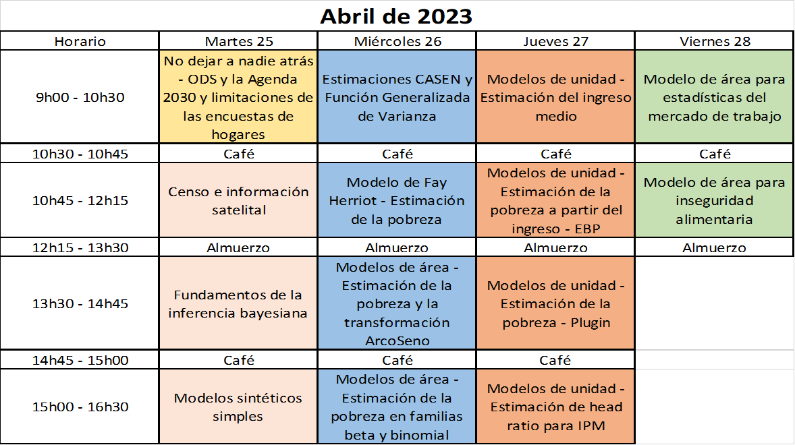

--- 
title: "Desagregación de datos en encuestas de hogares: metodologías bayesianas para modelos de estimación en áreas pequeñas"
author: "Andrés Gutiérrez^[Experto Regional en Estadísticas Sociales - Comisión Económica para América Latina y el Caribe (CEPAL) -  andres.gutierrez@cepal.org], Stalyn Guerrero^[Consultor - Comisión Económica para América Latina y el Caribe (CEPAL), guerrerostalyn@gmail.com]"
date: "`r Sys.Date()`"
documentclass: book
# bibliography: [CEPAL.bib]
biblio-style: apalike
link-citations: yes
colorlinks: yes
lot: yes
lof: yes
fontsize: 12pt
geometry: margin = 3cm
header-includes: \usepackage[spanish, spanishkw, onelanguage, linesnumbered]{algorithm2e}
github-repo: psirusteam/HHS-Handbook
description: "Taller de instalación de capacidades en SAE."
knit: "bookdown::render_book"
lang: es
linkcolor: blue
output:
  pdf_document:
    toc: true
    toc_depth: 3
    keep_tex: true
    latex_engine: xelatex
  gitbook:
    df_print: kable
    css: "style.css"
---


```{r setup, include=FALSE}
knitr::opts_chunk$set(warning = FALSE, 
                      message = FALSE,
                      cache = TRUE)

library("dplyr")
library("tidyverse")
library("readstata13") 
library("survey")
library("srvyr")
library("ggplot2")
library("TeachingSampling")
library("samplesize4surveys")
library(convey)
library(rstan)
library(printr)
library(knitr)
rstan_options (javascript = FALSE)
library(thematic)
library(ggplot2) 
theme_set(theme_bw())
thematic_on(
  bg = "white", fg = "black", accent = "red",
  font = font_spec("Oxanium", scale = 1.25)
)
```


# Agenda {-}
```{r, echo=FALSE, out.height="500px",out.width="700px",fig.align='center'}

```


## Material del curso {-}


- En el siguiente enlace encontrará material bibliográfico complementario (Libros, presentaciones, casos de estudio y manuales de instalación) [Descargar](https://github.com/psirusteam/2023CHLsae/tree/main/Recursos/Docs)

-   En el siguiente enlace encontrará las rutinas de R desarrolladas para el taller.
[Descargar](https://github.com/psirusteam/2023CHLsae/tree/main/Recursos)

# Día 1 - Sesión 1- No dejar a nadie atrás - ODS y la Agenda 2030 

[Ver presentación](https://github.com/psirusteam/2023CHLsae/blob/main/Recursos/D%C3%ADa1/Sesion1/SAE-0%2C-SDGs-and-Surveys.pdf)

